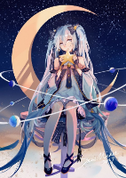

# Kore-A: THE CLOCK OF ETERNITY

# Session 30APR26

Maebelle is deep in her trance, dreaming of the day she left home and her grandmother

Suddenly she remembers her Grandmother's shadow arts, and gnomes everywhere

Recalling her time in the Rose Labyrinth, she closes her eyes and falls backwards to wake

She slams into the ground and her folks run over to help

Rav  has visions of fighting a giant crystal and Maebelle sees the visions

He wakes up in front of a stone altar ringed by rough pillars

One of the stones seems to be bleeding into the grass

Several shadows make the circle seem ominous, as if mid-ritual

A Large Figure looms in the circle that seems to be in another plane

Casting

Maebelle lays on the altar, turning to crystal and bleeding to form the ritual

Looking up, the large figure begins to solidify, three casters conducting the ritual

Kiki sees the ritual, Marks the primary and holds his bow ready to fire

Zecallion tries to signal to Maebelle that backup is preparing to assist

Ugh remembers fighting under the Arena and escaping the fight Winter set up

He wakes and flies into a Rage, running in recklessly to attack the closest caster

Rhett appears and sees Ugh attacking, so targets the same

Theon appears in the circle, waking up next to the altar
His gauntlets catch fire as longsword does the same

The shadowy humanoid look like the crystal beings are the undead constructs from before

The beings may be from Maebelle’s grove and she begins to wake

Ruby dragonscales seem to draw back under her skin as the cultists seem aFeared

She recalls that she must find her and her grandmother’s sword to save her family

Maybelle tries to turn the Summon but does not manage to take control

She crouches on the altar and is surrounded by darkness

Gabriel appears as Rav tries to plane jump, thinking the Summon may still be connected

Rav sneaks in a shot, and the Acid seems to be Super Effective

Gabriel steps in with his Great Sword and starts swinging as

Kiki leaps on a large rock and starts firing as Theon warns about Nonlethal damage

Zecallion sneaks around the perimeter to cast a Dispel Evil

Ugh smashes and the figure turns to dust and drops a blue gem

((Combat continues

A portal opens and four more figures appear to attack from the rear

Maebelle activates an Anti Magic gem

Rav Revitalizes Rhett, Theon and Ugh with Blood and Soul magic

Gabriel smashes and a book drops with the ashes of a Caster

Picking up the book feels like dark energy but is resisted

Kiki drops the Bird caster, which drops a Cloak

The portal opens again and Rhett gets attacked midair

Maebelle avoids killing her family

Rav grabs the sphere that drops from Rhett’s stalker, thinks it may be a TP anchor

The group tries to catch Maebelle, as another figure appears as she struggles with guilt

The Blood monster is about to take us all” says the Froggy druid, who drops a Telepathic Bond

((Combat

Four more giant forms follow and attack as the group chases Maebelle

Froggy warns they need to get to the lake to avoid Undead spawns

A Mind Flayer catches Ugh as he tries to break contact

Theon tries to pet the dragon

Kiki hauls ass to the waterfall, finding a temple

Beastkin seem to be going about their business inside

The group gathers in the Safe Zone in Alpha Core

Rav finally drops the Mind Flayer, which drops a black crystal

The Crystal begins to fly off towards the bride

He thinks it may be a phylactery filled with multiple souls, a Phylactery Soul

Rav walks back to the safe zone as the rest huddle in safety

Froggy gives off a vampiric Serpentine crystal being
The Beastkin resemble Maebelle’s people

The forest they are at its the Gem that Maebelle is, which is in Gabriel pocket
The Druid Grove is a neutral space

Rav and Ugn always know where Maebelle is

Gabriel is wandering in a Casino, with all of them in his pocket

The Crystal Witch summoned Maebelle, drawing them all into the gem realm

# Session 7MAY26

Theon finds himself wandering around a university campus

Gabriel remembers getting drunk in a casino, and wakes up in a dorm room

Maebelle appears near Gabriel

Dreadknight awakes, and has visions of the others

Rav wakes and feels the same, as the others all appear in a dormroom

The group begins to gather on campus after a message about the Atrium

Rav stops off for a round of hacky sack

Everybody regroups within the safe area, noticing a damper on their various magics

As soon as they exit, they are set upon by flying skeletal archers

Two masked women also attack from the ground, but are hit hard and fast

As the fight erupts, some random dude follows along watching

Four more shadowy creatures join the fight as the group gathers on the road

Rhett knocks out one of the flying skeletons, and Dreadknight artfully chains it

The Hob caster that gets taken out turns into a wooden doll with a hat

Maebelle spots her ruby sword in the bridge, but another guarded by a giant flower

With the main group largely down, Rhett grabs a Longbow and the Doll

The Bear falls after running up front and drawing all the fire

Dreadknight goes full Kink on the battlefield to Shibari flying skeletons as Mae bleeds out

As the fight goes on, the two watchers cast Heals on the group

Maebelle breaks contact to drink Potions

Rhett breaks contact to grab the gem that is Maebell

The call goes out to fall back to the safe zone

Rhett tries to run and jump. Bounces off the rocks

As the group runs, a loud horn blows, and the Undead turn to leave

Dreadknight watches the group retreat to the Alpha Core, and retreats to his ‘house’

Everybody else retreats to the Alpha Core and heads to the bar for Tequila

Dreadknight tortures a prisoner over the link purposefully

Kiki and and Rhett get drunk at the bar, the bartender knows her name

Theon gets approached by a ‘hard looking woman’ about Dolph Ziggler

He goes all Horndog over the questioning, but she’s not interested

# Session 12MAY26

The Lucky
Zecallin set on a mission to retrieve a lockbox

Asking a woman in the Casino, he’s told he needs to use a portal to catch a train

She says it is likely his first mission to determine his ranking

Davos appears from Dolph’s shadow, says he does not want to be there, and leaves

He appears in the cleaning closet of a restaurant in the Hells

Finding out it was Guinevere that brought them, the general mood is Fk That

A vision of Theon prancing thru wildflowers with Myrkul throws everybody off

Eventually they found out that Guinevere is on the Telepathic Bond

Once Zecallion is ready, she will send her brother and them all

Rhett find out Guinever is the Queen

Rav is told Dread Knight killed her brother Curtis and ate his soul, now marked for death

Dolph talks with his left hand, “Willie” about his wife

He says he is half artifact, half Witch, had just heard about being married

Told they are going on a train heist, it should be attacked soon and must be defended
The crystals are the souls of the fallen

Warned they are heading to the Wasteland sphere, beware of Abberations

Three parts should be found within the box car they land in

There are citizens aboard that require protection, attack inbound 20 sec

Silas quickly feels magic coming from a crate and finds it locked

The advanced Magitech train is driven by an aged Hob, Zecallion tells him

Asked about defenses, he sees “armies” of shadow creatures and giants inbound

Nobles from the Shadowsphere aboard with reg goblinoids

Items are bound for the Queen’s hoard

The group deploys to defend the train, Dread climbs on the roof

Rochal calls out to the Dragons to ask why they are attacking

He is told they need their box, and asks their chaperone, but says it’s a different box

Dolph scans the Giants, and told they are evil creatures

The Engine car explodes and the train jumps the tracks

The Fuel car makes noises as if about to explode

The cars explode and many civilians die, but Silas gets the loot and bails

Dravos calls out that the nearby pond is a portal

Dread turns time back and disappears from the link

Zecallion drains magic from a Giant to Mend the train, then dives into fire to attack

Light dragons attack, as the Giants are attacked in turn

Rav appears 12 seconds ago and teleports all the civilians out of the train

Dread says fuck it and bounces thru a random doorway, says Zec and Rav can join

Rhett tries to convince a Young Light dragon to help the civilians, but is told they are demons

He says he is the one most likely to help, and asks which box

The dragon points to Silas

Silas argues with Skylar about the box

Dolph attempts to Teleport them all to the Casino, and end up at Demonic Wendy's

 Skylar says they need permission for the Lucky Casino and opens a door

Zecallion explains that the Lucky Casino is the domain of the Crystal Witch

Guinivere pats Skylar on the head and dismisses her, then looks to Theon and goes stone faced

A bar fight breaks out between Skylar and some dude pops off after Nagash orders Dragon

Rhett fucks with his trip but dips out to heal mid fight

Kiki drops rounds on the attacking Nagash, as the Queen changes forms

Bar fight continues, as Zec Heals

Dolph pisses off Crimson as he drags away Skylar, who stands after

Zec tries to break up the fight and TPs to a hot tub

Skylar seems to get Reset

Nagash prays and starts to feel more Organic as Rhett prays for an RFG

He feels the starting transformation to a Lich Draconoid

Rhett prays for Deliverance, but his connection to the Divine is blocked

The group is dragged out to witness a drag out fight between Gwenivere and Winter

The fight ends with a Calm Emotions and a hug

She hugs then threatens, “Keep your animals in their cages”

Abby “Cloves” Angelweird tells Kiki about her shared past

Alpha Kore Neutral Zones are different front Casinos, turf matters

Theon has a beach Day date while Rhett looks for an exit

Zec and Winters pick up Rhett to drop him at a seaside village, no obvious Evil Shit ^™

Link comes back on, Theon cuddled up loincloth style with Crimson

She agrees to go to Seaside after a disguise

Dolph is cuddled with Ant in the casino

Abby might might have drugged Kiki, warns Zec who looks to Winter

Winter says Kiki “should be fine”

Arriving at Seaside, Rochal becomes more Humanoid

Whatever Draconic Magic was on him was removed to show him in a Shifter form

Now in Beach town Seaside, Rhett goes Dadmode as Rochal becomes used to his new form

# Session 15MAY26

At the beach, they realize they ar ein Faerun where Rhett is from

Theon tells Rhett that Arcane knowledge can aid in thecrimson use of Blood and Soul magic

Nagash says everything has a price

Crimson, companion

Rochal spends a few days fishing in the Tabaxi village, and starts asking a purple cat girl questions

A croc guy keeps eyeing

The cat lady says she lives by the lighthouse

A woman stands crying as she notes that Nagash killed the swan, he asks about the catch

He goes on a rant about Beastmen to the Tabaxi woman

Rochal rushes forward as a woman appeared from the fountain to Manacle the cat girl

Rhett misses as Rochal bites ineffectually at the woman

Nagash rushes in to claim ownership and attacks

tHE WOMAN PULLS OUT A BADGE AND PAPERS, CLAIMING A WARRANT UNDER LAW TO SECURE TO CAT GIRL

The woman activates an item, disorienting everybody after Rhett says he has the boy

Called out, Nagash says he is the law of Thay wherever he roams

Chasing Rochal, the Shifter, has been cursed but now turned to a teenager

Meanwhile Theon and Nagash fight over a woman they know nothing about

Winter says she doesn't want to follow her sister Konnie, because Bounties on both

Coven of Shadow put a bounty on Zec and friends

Zecallion warns that she works for the Shadow Council, they might all be targets

Nagash is banished to a nightmare realm of MLP cosplay

Underground in some dark cave, black sand everywhere as his Miracle likes it

Transmutation and Teleportation magic off the Machine flower as Nagash starts eating

Rhett and Rochal are invited to pay with the other kids, as he tries to wrap his head around

Zec has no idea as he strolls on his beach date, getting a vision of Nagash

He looks to be in a major harvesting zone, surrounded by Carebears

As they try to leave Konnie, she presses a button and Crimson vanishes

She tries to Modify Memory but Theon resists so she bails

Rhett thinks he may have travelled when they passed thru the building

There seem to be more kids than the village would hold from multiple times

Rhett doesn’t trip when the kids are happy and well cared for

Theon chases as Konnie tries to run, hopping thru the treetops

She TPs into a shadow realm of a dark forest and continues to chase

Rhett watches the kids and asks questions, Cat girl introduces herself as Mia

Nagash, still trippin, suddenly surrounded by flying spiders of the Harvesters

Zec sighs, catching a vision of Nagash under attack by an Elder Mind

An Image of Theon on his Steed chasing Konnie

Gears Locke of Lockes Schoolhouse, Teacher of Konnie
“There’s lots of us here” after asking if Rochal is Serpentine

Theon chases on his steed as Konnie tries to break contact

CynSeer, the lead teacher, calls the kids back into the schoolhouse

Rhett spots a kid on the roof, but follows the others inside

Nagash tries to introduce himself in Draconic and Celestial, to Seth

He tries to sell out the village and the party as food

Zec goes to an Astral Rave bar to badly flirt with Winter

Konnie tries again to break contact, teleports out to piss off Theon

Nagash rejoins as he offers the village for death

Zec tries to TP Crimson but only sees her frozen as a Mind Flayer

He says over the link that she must have been for a while, he cannot move her

Winter asks why Nagash is responsible for Crimson, but Theon blames him for the weekend

Zec gets a message, “Send me Nagash NOW”

Winter warns that Rhett should leave, who heads for Junkyard

Nagash tries to head for the Nightmare realm, appears in the Spear of blood

Met by a vampiric goblinoid, he is led to a Throneroom of the Elder Mind

“You are going to work for me now”, mentions places he’d rather deploy

The Wastelands are the first choice

Theon asks about Crimson, Winter wants his soul in exchange

Nagash finds out a few things about Serpentine

Blood magic can curse or infect

Immortal Shapeshifters who often have reactive scales in true form

Closest to a Celestial Dragon Lich with a Humanoid Mind

Theon agrees to give his soul to Winter to find Crimson

She snaps his neck and he appears on the ground in Junkyard

Inside the beast of metal and flesh, a blue fairy and the soul of Crimson in a frozen coffin

Nagash says he found dogs in the Nightmare realm with the same eyes

Theon grabs the Hatter by the throat, saying to change her back

Hatter says she has been Factory Reset, memories might be returned

He shows a potion bottle, and it’s Theon’s Soul

“It’s all good, you can take her. She should be good in a few days”

Theon declares his eternal love to the cyber triceratops, who nuzzles back

# Session 21MAY26

As the group tries to gather, Anthony picks up Rhett and Piper from Junkyard first

They stop off for Silas first, who is full tilt casino mode

Silas seems to have an issue with Piper taking different forms

Rhett *could* just Summon Rochal, but then wouldn’t get the Cap and Gown pics from Grad

He rushes in to pick up Rochal, who seems to ignore Meena

Zec finds out he is in the Spire of Secrets near the Hall of Mirrors in the Prime Reality

Blood and Soul magic doesn’t work because Zec is outside the Game in Prime Reality

Mordekaidai says they can stay or fuck off, he’s tired

Kiki finds her estranged Mother, who says it’s been over 100 years and time to take her lair

Silas freaks out about being on a boat without knowing how to swim

Piper tries to help as Rhett and Rochal fly back

As they finally gather, they all hear the Core Trinity System
Rochal 445: DPS agent as a Player

Kiki jumps thru a portal blind and gets lost id a

They finally find Zec who says it’s time to go to Demonic Wendy’s

Silas waits an hour and his flesh wound tentacle eats the burger first

Rochal walks in the back and helps for free burgers

As the others throw Blood magic, the girl behind the counter grows larger and the spell fails

Silas randomly attacks Piper because somebody else said he wasn't a dragon

He then goes all stalker mode and keeps asking questions about

Zec offers to go to the Lucky Casino, and opens thew way

Mordecaidai heads back through the door to the desert

The Alpha Kore activates and each is asked to select a rols, Tank, DPS of Healer

At the casino, folks split up

Silas drops target to follow Zahyra to the rodeo, Beto and Kiki follow and consider fighting

Kiki seems committed to try and impress Zahyra as Silas signs up Beto to fight the bulls solo

Rhett watches as what would have been a celebration become a CTF bull riding comp

Beto is on the other side from Kiki

During the fight, Beto goes down and almost dies without Silas there

On the edge of death, Kiki Heals him from the other team

Rhett orders food and find out they don’t leave folks to die in the arena

Zec gets is fortune read, and is told he is in a Death Trial, also told that he will die, but it doesnt matter which of him, it is a ‘ INDIRECT PARADOX’. And she also said “ Sometimes the enemies you seek you should not find”

Silas betrays Beto, and is talked into joining by Rhett, who burns him on the net to all

He then slips in to attack Beto’s team with a backstab while Kiki’s team holds the lead

Beto land s the last hit and looks Cool As Fuck on the last bull

Zec eats the yard bird and gets Buffs, Rhett buys all and

Onyx gems, from the Realm of Shadow, sucks magic

For a Keeper of the like, Onyx shuts down powers as if Anti Magic(full dispel)

Can be used o Build Spells, but requires power, capacity and understanding

Useful for body/Health buffs, implantable, but weaksauce to Rhett

Ruby gems: Deal with the emberflame and with reality, considered also currency in the main metal heart realms. You can get gems from salvaging from enemies/opponents, monsters.

# Session 23MAY26

Rochal is working solo, Rhett asks if he’s down to help a guy

Jack is in a tavern in Waterdeep, at Shirley's Tavern

Bloodmoon is pouring drinks as they get to know the Candlekeep Rabbit

More people populate the Psychic connection, as Jack reaizes the relative hotness

Supposedly they have to follow some fey chick to her fortress

Green eyed bug guy that tried to swoop Piper is at the bar, Bloodmoon seems dialed in

Some crow guy appears and starts shooting up the joint, making Green Eye leave

Rhett fails to Pray for a Meteor but Zec also fails saying

Jacks bunny follows Bloodmoon who watches Green and Girl 9 and ¾ run thru the wall

Bloodmoney bunny chases, Jack runs up to offer a Circle cast

Bloody bunny bites Jack to help with Blood magic circle

Serpent new guy chases Jack into the Alley, tries to seduce via Sanguinmancy

Rabbitguy shoots down rabbit guy as shooter bird checks the portal

The group gathers and goes thru the portal, finding an Elf girl and a ritual

Green eyed bug guy has a bunch of necromancers and a little skele girl who calls him Father

Aha snake guy strolls right in and gets caught, flippin the prep

Jack moves up and finds an Anti Magic field at the altar

# Session 24MAY26

Brave Blossoms, School for Adventurers in Training

Their younger selves dream about the current personalities

Nagash screams as his adult self is an evil nightmare

During the dream, Raj sees two Pantherkin in the dreamscape, and might know where the tribe

They are hunting something in a forest, Raj tries to memorize the plants and terrain

Jaque feels like everything is off, and says they are trapped

He calls out to Bloodmoon and Identifies himself, she asks how he got a Death Curse

 The group is sent to collect herbs for a potion and to remove the Death Curse

# Session 26MAY26

Visions of a clusterfuck as folks loot amidst falling rocks

The group appears in a dark forest, as a ghostly hand appears and the forest begins to decay

A man lays in a pile of debris near an open portal, seems to be dreaming

Soul Knight knows that the Angelweirds Forest he is king of, across all realms, rotting away

Sudden skeletal forms appear as the group recognizes their comrades

Mounds of mushroom covered skeletons surround the circling winds of the gate

Kiki wakes, hollow and unfulfilled, unconnected to the Spirit of her body, and is attacked

Silas appears over his buried body, also stuck in the Dream realm, so casts Shatter

The power damages himself, and wakes into his own body empty inside

He Surges into Action, and strikes at Rhett and Soul Knight ineffectually, then Slashes a Skele

Soul Knight wakes, stressin on his Baby Mama but sees his fully grown son Trent drawing fire

SK warns that Trent may be Hostile but need to wake him

Freshly pulled from Jade’s Realm, he has a hard time concentrating on his boy

The usual connection seems missing, so he calls upon Faith for a Shield

Nagash the Younger stands in Spirit form over his body, and the body disappears

The ground and grass withers, and the connection is broken so calls a Thorn Lash to hand

One of the skele’s approaches Trevor to eat the roots binding him

Silas is attacked by the other’s and takes massive damage

Divine energy erupts and Zec pulls at his entire existence, and takes his full form

He appears in the portal, feeling both realms as Tret id being drained

Rhett is in a near panic as he calls out and rushes to Rochal, who binds and hurts

The bound body starts to be eaten away as the group tries to save themselves and kinda help

Trent’s body drains away and the vines snap, GM ganks her own PC almost

Rhgett rushes in to try to help, Rochal casts Blood Magic and acid damages the creatures

They finally got the guy up off the ground, he knows Zec and Soul Knight

Zec tells him to bounce but he’s confused, “Get to the guy with the Horns”, his dad

Recognizing his father, Trent tears up and rushes forward, pulling Knight into the Physical

Trent says an artifact was stolen, raising undead and they need to get thru the portal

He he seems, younger, weaker and mortal
Kiki shoots critters in the o ring with acid

The ground shakes as Silas tries to gank his marked target, green energy erupts more figures

Coordinated, they move their staff and strike Trent

The former Godlike form has been being drained for some time, and it continues

Warned that crossing the portal to the Afterlife might kill them all

Jr Nagash says the portal about to go out and is very evil and divine magic aimed at Trent

Rochal says the Blood God and Ancestral Dragon needs their help, Rhett agrees to follow

Rhett prays for the light in Rochal’s heart when he says they musty do the right thing

“Scale of the Heart of Balance, bring it to me for your Protection Rochal”

A strange Divine figure appears nearby, and a spark of Divine protects Rochal

Zec prays with Blood and a portal to hell, almost dropped into the feeding pit of the Nine Hells

Silas prays and is Judged, seeing instances of his soul, one waiting to be weighed

A different figure appears, with red eyes, he thinks the heart of his soul resides

Connecting to the figure, he smashes to his knees, knowing he must quest for his soul

Trent says he was in a dragon blood torture cave, Knight says e needs to laugh more

Nagash is enveloped in the smell of fresh snow ((Diamond prot, left hand ?

Soul Knight gets Emeralds

Silas, Sapphire, indentation of rain drops on left arm, blue aura

Kiki, Diamond, frosts all over with a cold aura, rt hand skull covered in ice cube, strong shadows

Zec, Sapphire, blue electricity aura, lightning bolt on neck

Rochal glows purple, as does eyes, forehead twilight bird

Rhett glows Radiant, Light Protection of Kore-A

She glows blue as well, storm clouds settling on rt hand

Nagash asks if she is an Archon, she says she is an observer of Rochal’s test and Nature spirit

Silas, without a soul finds himself shattered

Kiki tries to find her soul, and drops from the connection

Rhett gives the Spirit a hand carved compass, she does something and gives it to Rochal and takes his shoulder

Folks nearly take damage as the cross, Trent drops them thru a portal to Seaside

Kiki goes missing as they cross, and the Protective order pulls them across

“They already knew, four almost died. We had to come here for protection, but not my realm, but an Instance”

Nagash says he is allergic to cats, Zec says he killed a child

Trent says his daughters are trying to take over as his mother has her own plots

All of them working against each other for their own gains

New Generations of Witches are trying to dethrone Trent the Blood God

Zec is the God of Inspiration and sometimes Space

Silas hears that his soul is likely scattered across the multiverse, and

Must find the Kore pieces at the least, and the order matters

Soul Knight wants to inspect the vines on him from his wife, and talk with Trent

(Scary talk with Jade the wife incoming

# Session 27MAY26

Nagash appears, reborn in a new form, and finds himself in an arena filled with shadow watcher

A creepy sith kid that smells of burial incense, claims to be their champion

Grimfeather, a Kenku sniper, asks why a kid has a gun as the fans start cheering louder

A beautiful woman with wings appears, flying above the pair

Banneret, a Purple Dragon Squire Dhaphir, also appears to chanting

He sees the angel and immediately attacks

An Air Elemental circles at 90 feet, the wind starts to pick up

A mechanical creature approaches Banneret, looking hostile at Banneret

Not all of the creatures seem to be hostile

Zecallion appears in the arena, and warns not to piss off everything

Malphus appear in the arena , Flaming Fist icons on his armor, and screams in excitement

He challenges the arena and pisses off the crowd, who

Rhett appears next to Draconic Rochal, but the crowd doesn’t like him

Nagash yells at the crowd and attacks the mechanical creature

Mass confusion as teams are formed and betrayed, Air Elementals seek Zec’s heart

# Session 28MAY26

Raj looks around and has a mix of memories, Brave Blossoms and Neverwinter

He turns around to see the group from Neverwinter following, Willow leading the puppies

Soul knight looks around and spots Trent, who is holding some sort of device

Trent says his Guild is defending the Forest from some raids, asks why he looks different

He goes on to say he in in the Alpha Core, HQ of the System

Tyrell walks up and they overheard mention of a murder in the town square

Willow picks up one of the dogs and says they are in a version
She mentions her shack in the boat docks

“Keep your eyes down, no eye contact”

Zec seems himself, but has all his own gear, and none of his memory

He thinks it might be one of his clones from the casino and keeps walking

Following Willow, a dark skinned woman with two large cats appear and attacks

The seem to be after the barrels and Willow calls for help

The bite mark on Raj’s left leg starts to burn as he feels a sense of familiarity

The woman says to give up the package and the Tabaxi

Teleported to the shack with two strangers, Willow places the Tank into an Amulet

Trent says they have some AFK Players and pushes the two outside

Willow says she’s trying to protect the Dark Heart, a powerful mage

Looking over his bite, it looks infected and sprouting black veins

Weremimic Spiders likely have infected

Trent says he’s been marked by the Moon Spiders, and in the middle

# Session 29MAY26

Rhett appears in a potato barrel, following Zec to his brother’s BBQ

Anon Lyric, runnin the grill, offers Rochal a hunk of boar
He seems to be a Black Dragon type

Kylide complains about his potatoes, so Rhett offers to help clean them

Zec grabs bananas from the Monkey King

Everybody seems to be some sort of Shifter, be they Mimics or Serpentine,or whatnot

Red Dragon people seem to be running the joint

A tree person Emerald Dragon is amongst a many others

Everybody seems to be out of time and timelines, like travellers through time

Zec tells Rhett that he should go to school in this prehistoric realm

Anon, says his school is in Alpha Core

Lyric says Rhett could pass the Championship to Zec

As Champion, he would be granted an Artifact and Title, and allow his own faction

He needs somebody who could be in the Shadowverse

Rhett immediately agrees, glad to be rid of the Championship and the Wishes

A trio of characters stop by and ask Lyric a question, who seems to act stiffly

Rhett and Zec get a System Alert, which says Players nearby

They ask directions to what Zec says is a Tarrasque, seems alarmed

Zec follow, and notices their bracelets allow travel between times and regions

The trio are a PUG team on a Collection run for Mats

They keep dropping gamer slang as Rhett goes full noob listening

Kraver Kale Holt , Crow guy, says meet 20km north away from others, part of Enforcer Faction

Ceemar, the Tardis, an Elite and Unpredictable PKer “Undefeated level 200”

Nevar/Trent the gov of cat people and Domain Creator
Kraver is an Alt of Pip

Zec knows names and Holt gives them both a Silver Feather, protection vs PK

Guardian of the Night Raven, his special ability as a Vampire Hunter

From Tyrell and Raj, they receive a copy of the items
Critical First good for noobs. Black Cauldron for crafters, Righteous

Rhett gets memories of Rion, a God that looks like Zec, aspect of Bahamut

Visions of him training with children and a woman in black

They seem to be training to strengthen their aspects

Rhett thinks they should go to the Critical Fist

He also says so pick up a Stabilizer from Night City to quit getting pushed around

Speaking of the Divine Tarrasque, she is freshly spawned at 700 and too powerful

Zec connects Telepathically with Nevar, who gave up his name but says he’s undercover

He tells Rhett and Kraver he set up a meeting about the bracelet in the Blue Valley

# Session 2JUN26

Prehistoric Kore-A is a land of dinosaurs and giant creatures

Rhett and Zec are packing up when Kiki and Rav appears as if a Holo from his shadow

A System Alert displays when Kiki appears, and gives an Alert for an error

Zec thinks it is because she is missing her soul, but says the System is a Work in Progress

Kiki searches for her soul when a System Warning alerts for Bloodmoon

Black veins erupt and her eyes become black, as she is Possessed

The Player group all see this and grab their weapons and giant demonic cannibal trees attack

Rav appears as Ceemar the PKer calls out to take the Chaos Being for parts

Ceemar seems to address him like a summoned Familiar

“Player Level 65”

Rhett appears on the beach after standing next to Zec, bound to the ground as System Info

Demon, Spawn of Alquam and info appears

“Alert, Dimensional Rift” as Dravos appears with four creatures, "Dimensional Shambler”

Dravos says the four portals belong to Guinivere but opened by somebody else

He says to just go thru but they are targeting Dravos

He hops into the closest and portal and comes face to face with himself, who is hunting him

Standing in a Dimensional Void, the portals start to close

Zec casts a Spell and connects to 4 different Witches casting onto the crystal holding her soul

Rav disappears after trying to cut the connection, and is Summoned to the Witches

Rhet goes down, Soul Knight soon after

Zec says he has an Onyx gem and

Kiki disappears, sucked into the gem

Zec manages to take out

Ceemar says he is level 500 and wouldn’t take on the Shadow Coven

The whole group registers as Players, only Kiki shows as a Corrupted Player

She comes back as a Summon, and is now “owned” by Kiki and Zec

Bozak A Wraith, Blue guy with antenna

Sai Yee Mar, PKer with horns

Nevar Shadows, Cat guy

Karver Holt, Ravens

Rav tries to glitch the system to 4x his level, and sets the System to eroor loop

Bozak touches Rav to break the connection, they wrap up the critters

After a bit of Get to Know you, they head out to mine stuff in a Spider and Dino area

Catching up to Kraver, the smell of ash and cinder around a mined out area

They get about 92lbs of Divine Ice Wall Metal

Sai Mar looks happy and produces a large chest, says he could make the bracelets

He gives Zec 10lbs to practice with as well, but 3 days to make the extra bracelets

Back at the camp, Sai starts crafting

Karver sends a Friend Request to all, and leaves to Night City

Navar sits down and asks if anybody wants to go a raid in Seaside Shadowverse to fight a titan

The Titan is Level 450, running a full raid of the Righteous Ambassadors Guild

Rhett accepts the Friend Request and finds the Noob Forums

They are given permission to use the Fortress as a base, no weird shit or die

# Session 4JUN26

Kiki appears next to See Mar, who seems to be absentmindedly smithing the metals

The group are at the Fortress when she takes form out of See Mar’s shadow

Rhett finds mention of a Tutorial, need a piece of the Core to start the training

Ugh appears in a bolt of lightning, reading as a Level 96 Demigod of the Water Temple

He sees a small girl who reads as Solana, so he rushes over for a hug

“It’s weird that you are here. I didn’t send you here.”

Cascade is there, but is recognized by voice as Zec

Maebelle appears from the shadow of Anon, and a Player Alert shows missing text

The last thing she remembers is being in the Rose Grove, and asks where she is

Anon robotically responds, Welcome to the Alpha Core Prehistoric Forest, Shadow Witch

“Time here is at the beginning, Shadow Witch. Your choices will change the world”

“This is a frozen timeline, where all things are at the beginning”

Rhett has been reading the manual for a simulated universe, and tries to warn Maebelle

A man appears and says he’d brought them here, but speaks to Maebelle

She asks if she is dead, he says she had been “refocused”

Rhett and Soul Knight sees that nothing comes up when he appears

Maebelle and Soul Knight try to get up to speed, told it’s about 17 hours for her since Grove

The Man says they can choose their Initiation point

Another NPC, “Chase”, says it has been 17 hours since they’d left the Grove, from the Alpha

Maebelle needs to Rest and Reorganize, she thinks he really is Lyric

It is explained that her enemies also have access to this area out of time

To seal a timeline requires a Gatekeeper, Ugh says he will be Gatekeeper

She is told of beings being Shattered,

Cascade asks she doesn’t run out from the group into the middle of the enemy, but Maebelle

Asked about Willow, who is Maebelle’s grandmother, is trying to fight against giving away power

Rhett reminds the deal not to bring trouble, Lyric says he doubts she would give up her power

Winter is Willow is Reba is her Paternal Grandmother, Priestess of Blood and Soul magic

Winter Willow Angelweird runs the Harvesters

Maebelle asks to summon Faerun Gma, which would be a sword in the Rose Garden

Summoning her Grandmother, Maebelle gives her both barrels once summoned outside

Gma says the System has been Corrupted

Maebelle argues to stop the Kidnapping via giving up the power outside the timeline

Chase says it would be better to give her the power, so Maebelle still has access

Willow denies the power, but grants access to Night City

At war with the Crystal Witch Guinivere, must recapture crystals

Willow says she has been defending the family, the Emerald Dome had never fallen until now

14 Crystals need to be collected, 4 are safe, 10 need to be gathered

“You were never supposed to cross over to the Alpha Core, as yet untrained”

Maebelle has not yet been activated, Winter suggests going to her City where her family is

When she deactivates, Maebelle becomes a Night Ruby of Shadow

The Grimdark has declared war on the Emerald, some have been saved, others controlled

GUin wants root access over the multiverse

They appear inside a tavern, family around or spread about the town

Some had been captured and saved by Winters

Maebelle reads about the history of Alpha Core

A metal heart has connected to all reality, and learns about Blood and Sould magic

Maebelle and Ugh are connected to the Alpha Core and are activated as Players

She reads as Sorceress of the Shadow Temple, ??

Winter brings over her whole available family, many she had been looking for

Only a few are still missing, but many are there to celebrate

Chase/Lyric appears as Anon on the link, says he is a Priest of the Morning Lord

Winter says she was the one to pull them all into the Shadows lest Guin did

The crystals are tied to certain domains, pieces made to influence the greater Crystals

Maebelle is tied to the actual Nothing or Shadow of Existence

Gems enhance and focus magic, powered by Intent amongst different types

The magic of Guin needs to be Sealed  so she can be blocked from her magic

Magi, incarnation of Magic and the Emerald King, now under the command of Guin and Grim

Cascade realizes why their magic is contested when accessing Blood and Soul magic

The Tutorial is about channeling magic into something that works, but can be taken over

Cybernetic Shadow Mages are Witches seeking to Siphon the power of Maebelle

Guin controls the Forest

The Crystal witches like to take each other’s forms to cause confusion

Winter Wolf is Grimdark, which are remnants of Lyric

The group appears at Wendy’s and Rhett pulls Rochal aside

Ugh decides to walk into the back and start making food to help

Soul Knight checks his Menu to search for a special mission and finds 96 forums with bounties

All of them from Terrah (AKA Jade) looking for him

“Bitch better contact me soon”

SK sends a message and gets DOS’d

Wendy looks over and asks for help with a Demon in the Kitchen

Lyric says it’s a Trap, Wendy says it’s more like a game for a Fortune and loot

Ugh grows big and steps in to find several imps in the kitchen

In the Refrigerator, a Demon eating and says, “Hungry….” so Ugh rages out recklessly

Fight breaks out and after SK contacts his BM

Jade Angelwierd says she will find him after digging in his ear

Rhett learns about Teleportation and using the Bracelet to use portals via the map included

Session 14JUN26

Appearing back in the Wendy’s, Cascade and Rhett find the place full

Gabriel appears, doesn’t know what is going on

Their bracelets let them know that they are in a Player Instance, most are Players

Looking over at the next table, a Red Ruby Dragon named Zanezar

Cascade walks over to talk with him, noticing the cards

He\s invited to sit and learn, but would cost 100 days off his life

Lyric is also there, as a woman appears

Her tag says she is part of the same Rose Grove as Maebelle

She orders then heads right into the back, where Tabaxi types bow to her

At the next table, Zanezar says he runs arena battles using the creature battle cards

Cascade recognizes from the magic that creatures would appear, takes magic to create

He is given a card that would provide a Tutorial, and an invitation to the arena

It’s a Blue Eyed White Dragon named Gilgamesh?

Gabriel inspects Wendy and sees a dark elf woman being hunted

She says there is a dark demon running the plane who needs to be convinced

Cascade asks if that is a cat guy who makes you forget things, she says yes

The work for the Grimlock she says, can be quite dangerous

Wendy looks at Rochal and says he’s already been there, and had saved her

Rochal says it’s thru the kitchen, takes you into a maze

She says one of his top people, Emilia, is in the kitchen, that cat people appeared when she did

In order

A guy walks over as Gabriel Rages at how satisfying the small burger was

A man with black wings walks over and offers a Cola, says he runs a tavern called the Artifact

Prof Mathus Blackborne, says he’s a teacher of Rochal, Rhett introduces himself

Rhett says he’s been wanting to speak with the teachers and is offered a Black communication

Rochal had been warned that it was dangerous for him

Turning back to Gabriel, he says he’s interested, looks like the perfect vessel for a Raid

He says he’s trying to hire for a job

The place is dangerous for Adult Dragons, he says looking at Gabriel

Mathus says he only hunts Ancients in their raids, and runs the schools

He is part of the Righteous Ambassadors, but he’s looking for Zecallion, Gabriel points him out

Rochal says that Wendy is an ancient powerful witch named Zachiael, evil Amethyst dragon

Zachael is the Core of Kore A

He asks if you know anything about Liches, with the System Blessings

Cascade warns that he’d fought before, the Catman can make you forget

This is just one of his Instances, the tyrant conqueror

Everybody is working under him

Rochal had been overpowered, had to call Prof Blackbourne to help escape

Prof comes back and says Sister wants to talk with Zec

Rhett asks which sister, Zenia is the one Prof works for

Rochal says it is his domain, and can pop up any time

Something about Zec being in Danger is why Zenia wants to talk

As soon as the Prof disappears, three bone fella appear and attack

Cascade yoinks on and bounces, but Rochal wants to fight and Rhett lacks the skill

Gabriel goes full hog and

# Session 16JUN26

Trent is attacked by Shadow Witches, who summon level 300 Tentacle Monsters

Soul Knight is arguing with his son Trent, trying to leave because attacking tentacle monsters

Nagash tries to say it’s time to leave, Trent is angry because Nagash killed his child Maisy

He tries to say he didn’t kill Maisy, and he’s on their side

Everybody remembers him attacking and killing but SK tries to get them out first

A Demon Lord commands Nagash to attack, when tentacles wrap up the trio but let go Nagash

SK gets them out to the Fortress

Trent comes to himself as they appear in the Fortress, Kiki and Rhett already there

He flicks Nagash and breaks the corruption from his Undead Parents

Nagash throws a stone and hits somebody outside of the wall

He starts spewing lies and runs into the camp but Rhett trips him

Rhett hops up and calls out Betrayer, Deceiver, Enemy! And Anon says Intruder Alert

See Mar comes back online, and asks wtf is with the 30yo in a 8yo body undead

SK explains they were under threat but See Mar

See Mar isn’t happy about a Chaos Being Threat to his base

Kiki comes to with a plate of BBQ and gets a command from See Mar to kill Nagash

See Mar approaches with the black crystal to Harvest Nagash

Rhett drops an Immovable Rod and steps

Zecallion appears as the crystal glows and Counterspells

See Mar gets pissed off and scatters everybody out of his base

Zec appears back in the shadow realm surrounded by ten of the lvl 350 ranked 23 Tentacles

Soul Knight appears nearby, both he and Trent unconscious and bleeding out

Rhett is blasted and Rochal is bleeding out, and being dragged into the water

Nagash appears nearby

Rhett calls out and reaches for Rochal, and teleports them both to Junkyard

They appear unopposed, getting a feeling of regret from See Mar, Piper Heals both

Trent is bleeding out hard, about to die

Kiki enjoys the BBQ, Rav tries to calm See Mar with a bacon sandwich who is pissed at Zec

Cascade attempts to pull the group out of the Shadow Realm but is opposed and gets siphoned

He tell Rhett to try to Revitalize SK and Trent, but leave him out of it because See Mar

Trent seems to be badly shaken, DK sends him to Seaside in Faerun

Cascade says he could stand another attack but is jumped and goes down

The group TPs to Alpha Kore Druid Grove, Chase Daggerheart Heals them

He pulls Kiki and says he needs control, and snatches her out

Everybody appears in the Alpha Kore Druid Grove, and Chase says Nagash is an agent

Nagash runs off immediately to start talking to Pink Mommy

Soul Knight’s Gdaughter Abby shows up and spots him, tries to blackmail for Hair or Venom

Chase says they should go to his school

Nagash is being questioned by Pink Mommy and asks how to become powerful

She tells him to Siphon Trent or bring him

He asks if he could kill Rhett but is warned against harming him or the boy as the Champion

He says he will Siphon all the non-crystal people, “Make them suffer your presence”

Chase takes them to a spot and dupes the bracelets, gives them new ones connected to Liam

The check in on Trent, who is flirting with a bard and telling a pug man he is the king

Theon and Detodread appear in the Library, Cascade warns Chase

Cascade then goes to check on Wendy but a black eyed fella appears

He dips out with Kiki in bed rather than face the cat dude who owns Wendy’s

The whole domain belongs to him, including Wendy

Zec is yoinked from the realm and disappears from the link

Rhett and Rochal appear in a dungeon next to a pool of water

Cat dude tells Theon to find the others and goes to look for the Power of the realm

Kiki and Chase appear in the Fortress and make out for “cover”, she gains wings in wolf form

SK dips out to Seaside as Theon goes to the Cafeteria for sexy time and wait for Kitty Daddy

Cascade takes a Death Fail

Rhett feels strong resistance to magic

He gives up his left pinky to escape, his Prof opens a portal in the water and dips out

They appear in the Locke school of Skill Mastery

Warned to stay away from Wendy and the Dungeon, See Mar fragment of Twilight

Kiki is sent to Trent by Chaos

SK realizes he has a sentient Dark Heart fragment nobody knows about

Cascade is at Death’s Door, and finds hmself pulled to see his sister
“Brother, you almost died. Lets go fuck up this cat guy”

Switching back to Chase form, he says Lets Go

Rhett asks foir a connection, but at least Cascade is alive

Kiki tries to attack and is smacked like a bad cat

Cascade and Cat guy form a Pact, and Cascade says he is Cat guy’s Son

Sincere says he gave his punishment to Blackborne for punishing Rochal

He reminds Rhett and SK as See Mar the player in NPC version but god level

Rhett realizes there are four aspects of the same individual around

Rhett sends fruit baskets to all the See Mars he’s encountered

Two cards come back, one says they only like Peaches

Kiki says she likes it fruity and slimes her own Inn

# Session 18JUN26

Maebelle is still coming to terms with getting her own powers from her grandmother

In a nightclub in Night City, Rhett wakes up with good dream in a dorm room

Cascade wakes up to see Kiki in the other bed, so he gets up and leaves

When he opens the door, loud music wakes Kiki, both confused

Maebelle wakes and sees Ugh in the other bed, and wakes him up

Ugh asks for a few minutes and Maebelle opens the door to a packed Rave

Maebelle strides out to greet her grandmother as Ugh wakes up naked

Rhett finds the location info, Shadow Realm Night City Alpha Kore

A lady in black and white introduces herself as Peaches and listens to Maebell, Kiki and Ugh

Black Cauldron Merchants and contact info on the card given to Ugh

When Maebelle says the Blue lady is her Grandma, Peaches looks scared and leaves

Ugh walks over and places the card in front of Grandma, and asks what the card and a phone is

He asks why Peaches is afraid, and is told Grandma is Queen of this area, Winters Angelsweird

Soul Knight wakes and checks his bracelet, gets the location and notices some familiar folks

The group gets a vision of Maebelle’s father, whittling something for her

They look up and see a much younger version of the same man

While they are talking, figures rise from shadows and everybody freezes except Winters

Creepy girls attack the group

Luna Juliette sent them to capture the Princess Maebelle

Winters set it all up to test Maebelle in front of her Father, which Rhett lets her know

Peaches offers to take Ugh home to the Critical Fist, a Shadow fraction monastery

Also the Black Cauldron merchant group who worship the Water Spirit

# Session 23JUN26

Rhett appears ina the middle of a clusterfuck with everybody looking for keys to escape

A portal at the end of a mob game of red light green light meets squid game

They need to defeat dragons or find keys to access the other realm

Cascade hears that he must take the key and stand on his corresponding number

Dravos Summons all the keys and figures out the rotation but needs 6 bodies

1shadow, diamond2, twilight3, sapphire4, emerald5, light6

Shadow: Necrotic, Death, Creation, Destruction, mostly Force and Necrotic

Diamond: Cold, Shadow, Frost, Ice

Light: Reflection, Perception, Illusion, Radiance, Celestial Fire

Twilight: Psychic, Fire, Shadow, Radiant Light

Sapphire: Storm, Water, Electricity, Energy

Emerald: Life and Death, Healing, Death Arts, Earth

The forces of Kore A and also

# Session 24JUN26

Checking out the throne room of the Critical Fist

Cascade is told to assimilate his own team for world events and gathers a few folks to him

He tells the others they can sign up for training, Rhett does so and given a pile of papers

He finds out all the different orgs are basically military enlistment

For every item or rewards, will be given a mission for the CF

Will be readied and equipped for bounties and training
Usually the costs are high for training, CF is a military arm of Black Cauldron

Told that he needs a party as a Commander, they can sign up for basic enlistment
They need a Tank, Enchanted/Healer, and Damage, need to pass an exam for it

Clara the Clerk says they can also recruit for various tasks

Rhett reads over carefully, but eventually signs up to work under Cascade’s team

Cascade finds out that he needs to recruit his own team, can try in Commanders Arena

SK swaps to a new form, and signs up as a JOAT or Trinity

Rhett overhears and introduces himself as Eclipse

Prof Nightfang takes them to an Assessment for an Orientation for the Alpha Kore

The system is a bio-mechanical semi-instanced simulation

To connect to the system, it must be awakened in Blood and Soul or have an item and use B&S

Critical Fist maintain Balance to police the timelines

The Prof summons creatures by Thinking, and a Drow and a Slaad appear

Here's the world of Kore-A, a realm of cosmic balance and duality.

Description: Kore-A is a land of contrasts, where mystical and technological forces coalesce into a singular, haunting beauty. The landscape is a patchwork of dark, shadowed forests, sprawling wastelands, and crystalline fields that glow with unnatural light, nurtured by twin suns that bathe the land in ethereal hues. Scattered across the realm, floating rifts pulse with cosmic energy, hinting at other dimensions, while ancient ruins nestle alongside advanced steampunk structures.

In the distance, the Crystal Spiral Temple looms, an enigmatic monument embodying both shadow and light, representing Kore-A’s precarious balance. The sky stretches with constellations that symbolize ancient deities, and beneath this celestial canopy, races such as vampires, witches, cybernetic beings, and alien entities coexist in tense harmony. Through a landscape where magic and machines intertwine, Kore-A’s history speaks to an endless cycle of creation, destruction, and resurrection, its lore both a warning and a mystery to all who dwell within.

During the Assessment, Rhett Siphons the four ships and gives everything to Rochal

Rhett is granted a Pin in the form of a Bow, and a Quiver that she says to Focus on

Kiki gets an Arrow pin, Cascade gets a Wand with a book

Eclipse gets a pin and a book with spells to study

She says a Twilight Commander should be more central to the action to draw fire from the DD

An alarm goes off, and the Prof runs off to handle another explosion of Tickle Spiders

Rochals team is from the RA as well, Serpentine Merchants

Red, Light, Twilight dragons

# Session 25JUN26

Rochal’s team returns to the dorms to prep for their next mission

Ugh stays with Peaches, but wakes up in the morning missing some powers

Maebelle wakes tucked in, and is invited to breakfast

She is told that she had been brought to the Temple to learn how to control her powers

He notes that she seems to be jumping around places and turning into a gem

Maebelle says she thinks her powers are dormant, he says more Contained

He notes that she doesn’t have control over use or when she becomes a gem

In spite, she turns herself into a Gem and deactivates

V appears in the CF over Maebelle’s gem, and is told not to touch the Gem

He snaps back at Dad and starts demanding food despite knowing nothing

Managing to not get killed, he is escorted out

Eclipse hangs in the Library, focusing on reading about being an Enchanter

Ugh reaches the Water Temple, and tries to contact Aquarius thru this temple

Using the Divine Waters

Ugh gets his powers back after Peaches uses what she needs
He is now dating his Goddess, Peaches punished and stripped of power

# Session 27JUN26

At the Seaside Alpha Kore Guild, a celebration for Anthony’s Birthday

Elsa, the Pirate Captain, planning to attack the town if her personal items have not been found

The group introduces themselves over a new Link, as bags are presented to Anthony

He is told that he may choose from a Amethyst, Shadow or Diamond Core gem

The Amethyst seems to resemble a human heart

A Sapphire gem looks like draconic heart scale or Breast Plate with electric energy

An Emerald figurine of a Tree

A bright radiant Light erupts from the last bag

Asking for a recommendation, Hatter says they are all connected but Diamond is a Hatter’s fav

Anthony grasps the Onyx stone, and seems more armored (Onyx Heart Gem of Infinity)

Hatter says he would be able to create his own being, much like how he makes clones

Tew goblin drunken talks about “They have her, I cant get her back, the humans gonna die”

Weiss asks who in Goblin, the Druids in the Forest have Ciera

Ryo lifts a pouch from the thief as she walks away
She walks over to Crimson and says, “I got you the Ring of the Life God, meet later”

Theon stops to tell Anthony about Pink on his way out

Cascade points GoreZero to Max, sometime boyfriend of Elsa

# Session 30JUN26

Kiki is asleep, in the middle of a nightmare

She is running from her party, led by Cascade, chasing her thru a rocky plain

Coming to a cliff, she prepares to jump when Cascade turns into a Dragon

Ryo wakes in a prison cell, chained to the bed with little walking room

After each attempt to break out of their cell, a Link brings them all together

He says they must be cleansed of the Corruption by fighting in the Arena

They are in the human city of “Tardis” in the land of Tartarus

The trials test reactions and Divine Waters clear infection

Kiki and DreadKnight are showing signs of the Disease of Corruption, black veins showing

Usually those that fall to Tartarus are mad with rage and attack

While the others attack the guards, Ryo drinks coffee and reads

Ugh reaches deep and Cleanses the Corruption from Kiki and is released

A flash of Quinlin Kai possesses Ugh’s body and unleashes a Cleansing wave

Eclipse heads over to help Dread Knight, as Ugh asks for his gear

Tardis pulls out a book, the Adventures of Ugh and his other characters

Heroes from the other side

The Water Spirit will let them know if they pass the Trials and get their gear back

Eclipse enters the cell, and Dread Knight is fully feral and black eyed

Reaching deep, Eclipse Cleanses DK

Cascade keeps fighting and gets dropped hard

They go to a hospital and Circle Cast a Cleanse

They get a brief vision of an angry woman who attempts to take over but nobody falls

The group is taken to quarters and are given their gear back, but they think they are in the Trial

# Session 2JUL26

At the Critical Fist, Kiki is flirting at the bar and led to the bartenders apartment

Cascade is thinking about the past few hours, which has been very busy (Recap)

Eclipse catches another link forming, and tries to block it, folks see Soul Knight

Rhett learns about a Mind Seed, a common public channel, and offers Eclipse to help

At seaside, Rochal needs the Oblivion Mace from the Rat King to advance his mission

The Rat King, a Techo-mage, can summon Shadow Beasts and has a legion of Were Rats

UGH appears as Rhett tries to teach Draghoon about Stealth

Rochal gets ambushed and disappeared from the link, and the creatures are visible

Eclipse gets the team back to the Critical Fist

Nightfang warns that Rochal and the team had been Corrupted and will need more work

# Session 3JUL26

In what looks like a water temple, a

Banneret wakes up, peace never the option, and murders a cute temple spirit

Fight breaks out, but half realize they are outgunned

Blakely, Eros and Orion all go down from insulting the Temple Spirit in their own temple

A boy comes out and says they are in a test to become a guardian

Banneret, Crad and Raj appear encircled by enemies, B & C almost go down right away

Weiss appears and drops sapphire Healing fire on the pair and runs for it

The survivors are immediately swamped and put on the back foot

The kid feels sorry for all the deaths and ejects them out into their bodies

He gives Weiss and Spirit a white feather, and says they can call him Anchor

The group heads to Shirley’s and talks over drinks

Ryo joins the crew as the Prof Nightfang explains Alpha Kore and the Nexus

The Ancients created a metal device which took over and converted all of reality

AKA the Essence or the Battery, the Players are what keeps everything going

Every gem or artifact has remnants of Souls, which became Players being HUnted

## KORE-A: THE CLOCK OF ETERNITY

Introduction to the World of Kore-A

"Every world has a beginning. Kore-A remembers them all."

There are worlds governed by kings. Worlds ruled by gods. Worlds sustained by magic, technology, or the laws of nature.

Kore-A is none of these.

Kore-A exists outside the normal flow of creation. It is a living convergence where countless realities, timelines, and possibilities overlap into a single ever-changing realm. Every age, every universe, every forgotten civilization leaves an echo within its borders. Ancient dragons walk beside cybernetic soldiers. Arcane temples stand beside towering megacities. Divine spirits, artificial intelligences, eldritch horrors, and ordinary adventurers all share the same impossible world.

11:24PM

Starrihanna (GM):At the center of this vast existence lies the Alpha Core, an evolving system unlike anything found in any other reality. Neither purely machine nor purely divine, the Alpha Core serves as both observer and architect, silently recording every choice, every battle, every life, and every death. Through it, individuals awaken as Player Agents—souls capable of growing beyond the limits of their native worlds while shaping the future of reality itself.

Yet Kore-A is not a game.

The System provides structure, but every choice carries genuine consequences. Death is rarely simple. Memories can be stolen. Souls may shatter across dimensions. Entire kingdoms can disappear into gemstones, while timelines fracture under the weight of impossible decisions. Heroes may become monsters. Villains may become saviors. Nothing remains static for long.

The realm itself reflects this instability.

Floating dimensional rifts drift through skies illuminated by twin suns. Endless wastelands border enchanted forests where ancient bloodlines guard secrets older than recorded history. Hidden temples preserve relics from civilizations that no longer exist. Neutral cities welcome travelers from every corner of existence, while beyond their walls powerful factions wage silent wars over reality itself.

Among the greatest of these conflicts is the struggle between the forces seeking Balance and those seeking Control.

11:24PM

Starrihanna (GM):The Critical Fist trains guardians to stabilize collapsing timelines and protect civilizations from extinction. Merchant guilds, dragon clans, witches, scholars, and ancient kingdoms each pursue their own agendas. Meanwhile, hidden within the shadows, the Crystal Witches manipulate identity, memory, and magic itself, seeking dominion over the great Crystal Network that anchors existence.

Behind them all looms an even greater mystery.

The Clock of Eternity continues to turn.

Every timeline that is saved, every world that falls, every choice made by a Player Agent becomes another gear within an infinite mechanism that predates history itself. Few understand its purpose. Fewer still realize that the clock has begun to fail.

The World of Kore-A

Kore-A is often described as a world, but this description barely captures its true nature.

11:24PM

Starrihanna (GM):It is a Pocket Dimension that exists beyond conventional space and time, connected to an immeasurable multiverse through an intricate web known as The Vortex. Every universe, every era, and every possibility eventually intersects here. Some travelers arrive by accident. Others are summoned by destiny, magic, advanced technology, or the Alpha Core itself.

Because of this convergence, Kore-A is a place where contradictions coexist naturally.

A medieval knight may ride beside a cybernetic bounty hunter. Ancient vampires negotiate trade with artificial intelligences. Dragons discuss military strategy with starship captains. Forgotten gods share taverns with ordinary adventurers who unknowingly carry fragments of reality within their souls.

No single map can fully represent Kore-A, because the world itself evolves. Regions emerge, disappear, or transform as timelines converge and diverge. Entire civilizations may exist only within magical crystals, while cities from different realities overlap within the same physical space.

At the heart of the realm stands the Crystal Spiral, an immense monument that serves as prison, archive, sanctuary, and dimensional anchor. Beneath its crystalline halls sleeps the Dark Heart, an ancient force whose existence threatens the balance between creation and destruction. Around it stretches the ever-growing influence of the Alpha Core, whose network now reaches across nearly every connected reality.

The Alpha Core

11:24PM

Starrihanna (GM):The Alpha Core is the beating heart of modern Kore-A.

Created through the convergence of advanced intelligence, ancient magic, and divine design, it functions as a living system that observes and responds to every action taken within its domain. To most newcomers it resembles an immense game-like interface, complete with system notifications, player roles, guild affiliations, tutorials, and progression.

This appearance is intentional.

The Alpha Core simplifies incomprehensible cosmic forces into rules that mortal minds can understand.

Player Agents awaken through this system, gaining access to new abilities, magical disciplines, specialized equipment, and connections that span countless worlds. Yet the Alpha Core never removes free will. It merely offers opportunity.

Every decision shapes reality.

11:24PM

Starrihanna (GM):Every alliance strengthens or weakens the balance.

Every failure leaves scars upon the multiverse itself.

Blood and Soul

Unlike conventional magic systems, the oldest power within Kore-A is Blood and Soul Magic.

This ancient discipline recognizes that life itself is the foundation of all creation. Blood carries memory, ancestry, and identity. Souls preserve purpose, emotion, and will. Together they allow practitioners to heal impossible wounds, restore shattered spirits, transfer life, forge magical bonds, awaken ancient artifacts, or reshape reality itself.

But such power is dangerous.

11:24PM

Starrihanna (GM):Improper use invites corruption.

Souls may fracture.

Personal identity can dissolve.

Entire timelines have been lost through reckless manipulation of Blood and Soul.

The Crystal Network

Throughout Kore-A, magical crystals are far more than valuable resources.

11:24PM

Starrihanna (GM):Each crystal represents concentrated aspects of existence itself.

Ruby embodies passion, reality, and Emberflame.

Diamond preserves cold, shadow, and endurance.

Emerald nurtures life, earth, and renewal.

Sapphire channels storms and energy.

Twilight balances fire, thought, and shadow.

11:24PM

Starrihanna (GM):Light reflects radiance, perception, and celestial truth.

Onyx suppresses magic, silence, and entropy.

These crystals power cities, fuel artifacts, stabilize portals, preserve memories, imprison dangerous entities, and even contain entire living worlds. Many factions wage endless wars to secure them, for whoever controls the Crystal Network controls the foundations of reality itself.

A World Defined by Choice

Unlike many worlds where destiny is written long before heroes arrive, Kore-A belongs to those willing to shape it.

The Alpha Core records every victory and every mistake. Kingdoms rise because players choose to defend them. Timelines survive because someone was willing to stand against impossible odds. Entire civilizations vanish when no one answers the call.

11:24PM

Starrihanna (GM):In Kore-A, every expedition uncovers another mystery. Every ally carries secrets from another lifetime. Every enemy believes they are fighting for the future they wish to preserve.

There are no scripted heroes.

No guaranteed victories.

No permanent endings.

Only the endless turning of the Clock of Eternity, where every soul, every choice, and every story becomes another thread woven into the living tapestry of Kore-A.

And somewhere beyond the next portal, the Alpha Core is already waiting for the next Player Agent to awaken.

Every action, every interaction, affects and creates within the Kore

The Twilight Stardragon now attempting to bring it all back together while others scramble

Once Shattered, nothing goes back to being the same

Restoring the Star Dragons may be the Right Thing, but changes have happened

The last, Aslov, is important but has changed since the Shattering

Currently, the Heir Alliance grabbing power against the Dark Heart, snuffing out heroes

Not many players actually aware of the Old War, gems tied to the Zoels, Domains

Now the Blood and Soul magic has been affected by the Beast of Sorrowing, the Corruption

The Empire taking advantage of the different Fractions

Cascade and Eclipse recognize the Prof as a Core Member of the System

Ryo finds out Mystra is the Demiurge, one of the Controllers of this world

A Goddess in the older realms, but tied to the Emerald Goddess, a force of magic

# Session 7JUL26

Kiki wakes on the tavern floor of the Righteous Ambassadors, but the place is empty

Moving towards the door, a black void fill the space

Looking out of the window, it is pitch black as well

Cascade looks around, finds a book in the fireplace and blood on the bearskin rug

Rhett is still fighting the Shadow creatures and Wererats, and Heals Rochal

Rochal rises with red eyes and lays into his teammate, but Rhett orders him to Dodge

Eclipse had just saved Rochal and was speaking to Nightfang

Seeing the dark void at the door, he thinks they are in Shadow

A black cat appears, and climbs the walls that start to leak bl;ack liquid

Cascade says they need to clean it off and the cats talks back saying he’s workin on it

They get to the bar and pour alcohol on it, starting to wash it away

From the fire, a growling as if from a wild beast as Rav wakes in the Tavern

Bears leap from the fire, and attack Kiki

After some studying the situation,

Eventually the group is beaten and Cascade restores the group, bringing them to full health

A Boyish figure in white appears, the bears and Dragon disappear with a wave of the hand

He says to call him Nobody, who seems tied to this place, and says to get the book from the fire

A few folks try it, burned by Divine Fire and disappear

Cascade tries to Teleport the group and is sucked away int darkness

Rochal says Keep the book, so they all teleport out

At the Critical Fist, Rhett seems to have merged with the Divine Light

The voice of the boy says, “I will remember this”, Rhett responds,”You asked too much too fast”

Nobody, a Neutral Good Deity tied to Creation
Once a Book, now a Sentient creatures that had been
Bound by Cyber Witches to change the Narrative

The book is onyx black made of goblin skin beastly face expressing great sorrow

He believes it is a Divine Grimoire or tome

Tardis Hunt, Human

Creatures attacked that would infect people and spread then blew up his planet

Adventurers got him out before the planet was destroyed, escaped to Kora A at 12

Party of Night found the pocket of Kore A and broke in

So, Overlord of Light turned into the War of the Old Gods

# Session 8JUL26

The group receives a letter in a Red Envelope at the Guild tavern in Seaside

Zecallion is on the case, and starts collecting info

The others of town have been taken by the Eldrich

The lights go out and Cascade loses his magic, then bone creatures attack from the fire

Put on the back foot, Shadow sneaks to the fire as the others regroup

By the time the fight is under control, the fire is put out and they still have yet to go to the forest

# Session 9JUL26

A large group of disembodied voices seem familiar when a male voice says they’d be captured

The voice identifies itself as a Black Dragon named Kore

Maebelle gets a vision of their bodies walking around Seaside

Ugh says So’nala is in charge and leading an army, and can bring back the dead

They brought back Umbria, Princess of the Empire

Tonni checks her Book of Shadows, all stuck in a Shadowcube of Shielding

She finds a spell to send back to true self, before the cube

It needs a Shadow Witch and a power source

Draghoon feels a connection to Shadow Magic, and may be able to cast

Kore is convinced to try to bring them all out via the spell

Maebelle appears as a dark elf in an empty town

Kiki becomes a dark Centaur

Dolph says he is a Champion, and appears as a Serpentine male

Ugh appears as a huge Elemental that appears as a Primordial Demigod, Living Storm

Draghoon appears as a dragon tank that can only speak telepathically

Dolph follows the strange feeling and finds the cube, and Removes the Curse

Shadows erupt, grab Dolph, and disappear into the floor

Rhett becomes much larger, glowing with Divine energy and embodying Warden

Eclipse calls himself a God and completely forgets himself and becomes a confused goblin

Anthony drops a Faerie Fire in the stables, and lights up the magical darkness

Cascade names himself a tarrasque of some kind and grows bigger, embodying the tarrasque nature.

Cascades side notes:  the silence spell only works to stop verbal spellcasting, it also deafens the people inside it, also, any creature inside is immune to thunder damage. At some point in that fight we  got put on a telepathic link, and we could hear our enemies on it aswell, which to no one at that time was a red flag, so, if the opponent was an aberrant mind, a mindflayer, or just in general had psychic spells, or a somatic component, it is entirely possible for them to cast spells through the zone of silence,as we were hit by psychic attacks several times. I suggest using pre-buff spells if there is an inkling of possible combat. Such as

Mind blank

Enhance ability

Aura of vitality

Twilight Sanctuary Channel Divinity

Protection from evil and good

Dispel Evil and good

Remove curse

Greater restoration: Cascade noticed opposition seems to be trying to temporarily or permanently reduce players statistical potential, attacking dex,str,cha, etc.   it can end One effect that charmed or petrified the target

One curse, including the target’s attunement to a cursed magic item

Any reduction to one of the target’s ability scores

One effect reducing the target’s hit point maximum

.Mad hatter; also allegedly known as another one of cascades brothers through inference, after cascade asked who attacked the party, mentioned that they were attacked by someone called ‘the collector’ who he inferred was a creature called grim or grimlock who had crawled his way from the abyss and was invading the worlds and realities. He also said that he had gone to the planet nix and killed the dalimoon, and took over, his sister was working with the collector.

# Session 18JUL26

At Shirley, another red letter about the hostage Theon and Bopheles

A bounty of 2000gp has been posted for each to be brought back, alive or dead

The group appears on the green Casting couch, and told about the mission

A woman approaches asking if the

She asks if Ryo he is under a Divine Curse, and had pissed off a God

Zecallion

Gabriel

Ryo gets raven wings, purple eyes visions of being thrown in acid after buying a Boundless Bottle

She says the is from Cloakwood

The boat they are led to seems to be a physical illusion for a large tree

Ryo is tripping balls alone and boards a boat without the other but falls overboard

Undead seem to be moving the raft over crystalized waters

-Bloodmoon captured and Shattered and Recycled

# Session 20JUL25

Folks wake up in a strange room, some missing memories, most exhibiting strange magic

Ryo jumps out the window and wakes up on the couch

# Session 21JUL26

The group awakens in a strange cage, no feeling of connection to Kore A magic

Ugh stands, and finds a small flower in the place he’d been sitting

Gabriel stands and feels a strange pressure, leaving a trail of flowers

Cascade noticed Barry now awake, and sums up the situation

Ugh eats one, and gets reverted to a baby and flies into a Rage

Ugh Recklessly lashes out at a flower from Draghoon, who takes the damage

Kiki jumps into a wall and disappears

Ryo has a sing-along in the afterlife while the others try to kill their own souls

# Session 24JUL26

Cascade escapes a hard fight as Beto and Draghoon go down

As he teleports away, he feels the call for help from an unfamiliar touch

Somebody is trying to Summon and Pull

Draghoon is inside a Wasteland, with a memory of a woman call him her Precious

Now a Shifter, he can shift into the form of a baby Phoenix

He scans his Ring for the mind of Stem

Soul Knight wakes in the Water Temple of Sonala, head throbbing, and searches for the flower

He feels the pull of a Summoning, but is told to wait for the Goddess

	Soul Knight finds out the cost that Sol Nada had to make to bring him back. It would only make him feel even worse because he believes that he had doomed her to a fate that he had previously escaped from. He doomed her to be the slave of someone else. He knew his fate with Jade, but after that blow, he did not have the power to resist.

Ryo wakes in a dark room, chained to a wall, a tiny flower and a dim light from the ceiling

He had merged with this flower last memory, the flower looks drained

His magic is siphoned by the chains holding him tight against the wall

A woman appears, claims to be his familiar and had needed to restrain him cuz transformation

Cascade speak with Winter who wants to get to the Forest of Nowhere

Draghoon cracks a door and spreads Dracorage across the link

# Session 26JUL26

An Illithid named Scotty in an easter bunny onesie gives Prince a golden egg

A monkey girl approaches Dean and everybody thinks she is listening to the link

The telepathic link is something she could do to connect minds and souls, allowing her to pull

The ground begins to shake as the disparate group comes to terms with their summoning

Monkey people attack

# Session 27JUL26

Alexander wakes in what he thinks is a sealed coffin, which smells used

Scotty says they need to Investigate the death of Donna, and will call the Magi

The Council of the Magi of Magic, and leader of the Guild

He asks ROOK to keep watch and the place secure

A moth girl hands two other girls inside a cube device, that seems to be a Navigation Device

ROOK believes the device may be sentient, and a pink/black salamander girl disappears

Sivir has a vision of a Tiefling girl floating in a tube surrounded by runes

He next sees a huge construct reaching across dimensions to take over full worlds and planes

The dark metal web taking over universes makes ROOK believe it is why God sent him

Sivir says a tiefling girl was present before the fight started but nobody has seen her since

He investigates the cracks thru the window, no sign of the residue from the fallen

He spots a red magical light coming from the cracks

Sivir hears a light tapping coming from the room where Donna’s body lay

Cuddles comes to, held by Esmerelda as she tries to put small children to sleep

She says it has been four days, he asks about Miss Donna

He runs off by himself and blows his whistle, opening a portal to the Junkyard

Cal wakes on a wooden wheel, laid flat and spinning, in a plant filled room tied by black vines

He asks if there's anybody there, and a voice repeats his words

Searching for a Clue, he spots 9 sets of tracks, including one on his body

Prince walks around the building to look for a window, and finds a bag that smells of blood

Cuddles finds Junkyard empty, runs into Piper

She says Daad is sick, happens every Bloodmoon

He runs and blows a whistle to portal out

She yells for him to wait, calls Insectoids up to chase him

Alexander is overcome by the smell of fresh blood and drinks, disconnecting from the link

He feels infused with power but still hungry, hears “Eat. Eat. Get Stronger”

ROOK says to secure the bag for the Magistrate, but no window found

# Session 30JUL26

In a broken Celestial temple, folks begin to appear

Maebelle feels safe in what feels like a Divine Temple running on her bloodline

She realizes it is her gem, which is her self, or her Curse

Divine shadowy energy gather in what look like underpowered circles

“Where the Light and Darkness meet, we collide”

Maebelle seems to be overwhelmed

The shadowy flow and thru the door soul Knight sees thru magical darkness

# Session 4AUG26

Caledris, Dolph, and Ryo feel exhausted, Ryo finds a plate on Caledris’ neck

Each seems to have a circular metal plate with something moving around in their neck

Zoe, an overlord of light. Used brainworms in people and puppet them around. Someone is using them against us whether its her or someone framing her

Grim previously said that there was an 'insect' on top of the world tree who was infesting the world tree with 'bugs'

Cascade uses his Crystal Tools, and sees the magic is about to Reset Dolph

The Snake like creatures resemble infant Serpentines

Connecting to Dolph’s system, he hears 4 voices in unison, “Intruder! Attack!”

Everything goes black for Dolph, who drops from the link

Cascade thinks he is stuck in Dolph’s mind

A woman steps out of Gabriels shadow, and says somebody asked for Help

Caledris says CyberWitch over the link

She agrees to help but says she gets to keep what she finds, claiming they are baby soul lights

Dolph agrees, she says she has plenty of mouths to feed

She eventually introduces herself a Day Twilight, knows who Cascade is, seems to block

Draghoon throws a Band of Loyalty into her portal, which is swallowed by the Infinity Serpant

Cal disappear into a portal then a woman appears asking for him

# 5AUG26

Rhett reads the book

The boy needs the book to be free

In order to do things with the book,
Aslove, source that was Siphoned Creator, only full core remnant

As an action, can search and read in real time

Was in the Prison, said to be commander of the Invaders

In the Afterdeath, the boy Commanded others to fight in a Trial

Many have been known at Nobody, those seeking power or disguise

Most who use the power of the Alpha Kore are those of Cyber Witches

Made by founding Witch, Nix Key Stone Val

Siphoned, Killed, used the power to make artifacts and witches

The Visari Empire, descendants of the Night Mother Nix

Once two old gods created by AO, All One

Both created to create more, can affect anything within their own ‘verse

Aslove Gial, Male aspect, Light of Physical Creation

Phoebe Nix, Nightmother, Queen of Heaven

Fought over how things should be made

Both created Witches as weapons against each other

Both gets shattered, along with everything

Woman imprisoned in the cube Tartarus by Aslove

Human women managed to create a machine to Siphon all creation into the metal heart

According to the book, 10k years ago, but time is funky, Nix and Maga in charge

Witches and forces put in place

Maga at war with the Witches, leader of mimics. Siphoned Nightmother, killed all the gods

Nightmother leads the Vampiric races

About 8k y/o, the Sorrowing, Beast of Sorrowing spreads darkness and Entropy

Maga Aquarius only thing left against all, facing Entropy alone

Had to consume herself and created herself to create male aspect magics

Only Natural magics not Time aspects unless Siphoned and made into Artifacts

Thru that, they kill almost everything until the Beast arose and destroyed all but Bloodmoon

People rose and fight the beast, but never killed it

Rion the Space god and a Gial descendant saved the universe and 7 shards,

Forming everything into one by creating the Metal Heart

His daughter, Crystal, started the Starri Temple , clones under that

Less than a year later, a Reality Pearl activated, changed nexus point to the Darkheart

The Prime Aspect of the Machine was altered, awakening the Beast of Sorrowing and Corruption

Other gods, machines and powers talked about, most fighting over the essence of the book

The Black Pearl was used, Corrupting the Dark Heart, Shattering all under

Only those who held Pearls survived

Caused the City of Twilight to fall, those under the dARKHEART and shattered

A Gos known as Lathander was also Shattered, used by Rion to stop last Shattering

The gods have been broken and Chaos reins

Right now, folks are shattered, many realities intersecting, all beings has Star Dragon power

The Demiurges of the Planes created after the fall of Aslove, Star Dragons last stopped Sorrowing

Somebody has reawoken the Sorrowing, likely a former holder of the book

Black pearls and Gems are all listed in the book, each alter reality

The Thrones of Powers become the Guardians

10 gems, 4 Black Pearl

Guardians are pieces of the Dark Heart nexus point, keeping of Reality until Shattered

Zec was a Construction Worker when Reality broke, chosen to be Guardian but not by Darkheart

Learned he wasn’t chosen by Darkheart, those with the gem have been taken down

Callus Nightstar helped create Darkheart, but defeated by Sorrow, clone heart of the Machine

Every Male is an aspect of Gial, as all women are pieces of Phoebe

At the time of Aslove, only humans and Primordials, and minor gods

Before Magic, gods were planets or aspects for management

Aslove had no fear of humans

Trapped Nix in a prison then showed her how to use it

She broke fee using Tech

Alpha Kore is an actual Being as well, El Shadow, Jasper or Gio

Created by Nix and Maga, being created outside of time to kill Gial

Known as the Mind of the Machine, freed by Rion along with Callus

Callus Northstar is the Heart

Rion freed and fixed, El Shadow married Crystal, daughter of Rion for 8k years

Created Z Net, interconnectivity of Alpha Core

In the last year, somebody shattered everything using the Black Pearl, including Rion and Crystal

Anything with a Core and Connection are tied to the Core

Whomever has the gems have control

Book is a key Artifact

Fates, children of the Demiurge,

Whomever sitting on the Throne of Heaven, children become Fates

A Demiurge connected to Gial via Aspects became Time and Fortune

First Starrihanna  or Star Dragon was taken to heal the Beast of Sorrowing

Jasper became first after Aslove

10 children became Gems, or powers

First Darkheart became the OS

Kicked out the Fates

Fortune, Future, Nature, etc crystalline creatures

Fates before lived in the city of Light and Shadow, outside of time in a Sanctuary space

An Underwater city of Atlanta and Nephys, many temples of the Fates

Fates never showed himself but had many vessels

Couldn't tell between vessel for Fortune vs Terror

Callous connected to Crystal, her Aunt

Rial aspect/brother of Gial, worked for Nix as a Death Reaper or Collector

DeathRial or CryoCar, turned for Love, trying to repair, created Sorrow and created Witches

Dude rewrites his wife to be less evil and ascends to heaven, Rions Parents

Twins Prophesized as the Return of Aslove

One rejected and ran away with Beast of Sorrowing

Rion saved everything, married Maga who hates boundaries

Morning Lord

10 gems

Fates are Children of Reality

4 Black Pearls of Reality, Nix’s artifacts of power

Nightmother rejected Ascension and remained in Solitude

The Empire and Vampires

Maga created the game Alpha Core while in prison

Blood and Soul is the power of the old gods and Death Rial

Death Rial taught the Witches so son Rion could fix everything and take over

Now all are part of the Alpha Kore after Maga wiped everything

Cascade and Rochal tied to the Thrones, Families of the Serpentines and the Gems

Rochal descendants of the Death Rial. Metal and Demonic beings of Void and Light

Also tied to the Beast of Sorrowing, can access in ways different of others

Cascade and Rochal are sons of See Ye Mar, son of Rion

Programmer from the world named Jake sacrificed himself to unleash magic

Cloned the Em or the Emerald, took the body hopping power of witches

Four parts of Light, Death, Nexus (Connection, Heart), “Body”

Beast of Sorrowing or Sa

The book says this is the beginning, the future is the past and th

Current time is when the Corruption unleashed

This is the starting point of the Beast, due to who took the Black Pearl

Party is at the starting point but 9k of history is known of the Time and Space gods

The Salvatore, Cyber Witch, Clone of Maga, rebelled and hid herself became second Beast

She had stayed hidden and was subversive, using emotions to cause conflict

Uses clones and body hacking, connected from reality space aliens

Death Eater from AO universe, who had laws against multiverses

If infiltrators can get universe to destroy itself does not break AO laws

Rion and brother, chosen Reborn of Aslove, bro went crazy when learning and reject Ascension

She is a woman of this time, named Esmerelda, which the casinos are part of the Temple

Only way to stop the Beast is to have heart cut out by one trusted but betrayed

Anon

Jasper never Ascended, Al Quai Jasper, Demiurge and Counsel of Zo-els

Crystal, Wife

8yo kid named X, Fate of Fortune aspect, Sold the Pearl

From the city of Twilight, turned it into the Guard, but had already activated

Twilight Raven clan tried to get the gem from the Guards but failed, the whole world died

Guards tried to use Pearl to power city but Corrupted

Pearl was stolen by Zec from his mother, keeps getting it back and losing it, creating X

Inside a trial of the Darkheart, pearl taken and X created

Pearl control more than gems, natural reality outside

4 black pearls tied to the 4 parts of the Beast of Sorrowing

Dragonlord Kore

Zo, the Lightheart

Ami Zaciel the Darkheart

El Shadow, main voice of Gial

All killed and consumed by the Machine

Voided being named Simon stolen from Zec by Cyber WITCHES (CW)

Clone replica of Death Rial head, first Magi

Used by CW amongst new gen heirs to overthrow elders

Headed by Cascade’s siblings, they are trying to oust old

Simon becomes Grim, who actively against all

Has some control of Zeenia, but working together as a pair against See Ye Mar and Eon

Warden of Evil, Zec and Zena’s mom

Older bro Jun, working against parents as well, crazy manipulative and powerful

See Ye Mar slaughtered son Jun’s gf in front of him

Rochal is one of the Heir bros, cursed to stay away

Zec is also an Heir, but Jun skipped for Zec

Zec in womb, sis both had Mark but as kid reversed Beast powers, now he Beast she Heir

Zenia raised as witch has powers over Dreams,like AC programming

Zec cast spell to created head, got death mar4k

Zec mom was heir, one in power

Zenia raised as Twilight Witch to tame her as Beast

Parents controlling to her and Jun

Kids rebelled, Zenia and alliance killed mom and took Darkheart power

Mom Shattered as X took pearl

Dream Space and Time as Nexus are powers of Zenia, who building Alliances

Now with Grim, who warps her brain, against all

All but Grim with Gwen

Angels Angelweird atr war with bro and sis to take shit over, Rochals family

Rochal son of See Yee Mar, half brother of Jun and Zec

See is fighting some but not all, sometime allies

Cryocar working with See Mar, known as Lyric as Heir Alliance rebel rebel

The White Cold Wolf, Winterwolf, being framed by Grim and Gwen

Liam, Lyric, Chase, Anon known aliases of half bro of the Winter Wolf

Core piece of the Alpha Core, a being of Dominion himself

Ascended to access of the Core using the Clock of eTERNITY to keep Eon safe

He also believes the the Water Spirit Sonala has infil to take over throne, by Stem

Sonala a demi of Night Mother, 1 of 14 daughters of the Emperor of Vamps

Undead metal vamps used as cleanup system, to recycle Clone energy of witches

Gwen, or Zenia, controlling Vamps, as Grim can help build armies

Rhett is Guardian of the Plane of Shadow because of the Program, tried until passed or done

Rochal protected by the Prof for some reason, book says a Familial Bond

Harvesters, sub sect of Shadow Witches

CW are SW not all SW are CW

A faction of the Gwen and Grim vamp alliance

Drawing folks from other realms to siphon, sometimes vessel and send out as puppets

Winter, Zec’s gf, runs the puppets, work with and against Gwen, and other fam old and new

An heir herself of another line of Bloodmoon, in competition for the Emerald

As a CW on the counsel, has a redacted connection to Grim

See Yee Mar, Tinsel Dahlimoon, Space and Traveller God of Emerald and Diamond,

Serpentine Lord, Infinity Serpent, Lord of Vamp

Hunter of Witches is part of Beast bloodline, and son Rion

The Power of the Serpentine from the Clock of Eternity lets him travel

He collects souls and witches

Nagash was connected to daughter enemy, in his space as an active agent

Dhalimoon is the Vamp Bloodline empire throughout time

Currently in control until the Pearl was grabbed

Divine Tarrasque, Spider Queen, Maja Aquaqrius, creator of Witches, mother or Weremimics

Rion’s original wife

The pearl had been stolen by Zec but lost, which created the

4th bro Echo, half bro of Rochal

Core piece of Darkheart was an aspect that a Band of Loyalty was thrown at

More than one Infinity Serpent, tied to the Bloodline of See yee mar and Bozack Jake

The one Rhett has met knows himself as Jake, but not the full story

Now used by the CW. shattered and broken, like all others as Players

No Jake knows who he really is, the Morning Lord

Husband of Callus Northstar, also shattered and unaware amongst othe sims like all other gods

One of the first the witches used to create an undead army, other Cryocar, Talus Nightcoil

Dolph now Champion of Talus, gave him a spaceship

Bozack Jake tried to destroy everything as Morninglord using Deatheater Virus

Stopped by Rion and Maja, had stole body of Rian

Puppet of Maja Darkheart became Sentient, love of Jake

Jake became Morninglord to fight War of Witches

Rion and Jake were friendly but Maja only one smart enough

Jake Siphoning Maja to create Callus, caught by Rion

Bozack stole a clone of Rion's father Cryocar and hacking the system

First to create the Corruption but did it for Callus

Most together are Zec and Grim

# Session 6AUG

Rhett wakes in the Angelweird Forest, where he’d been after the Rat King

He awakes in a panic and checks the Z Net

A map of the Rat King’s location pinpoints Rochal and says Deactivated

Soul Knight awakes from last camping at the World Tree, in an old but clean suite

Outside is a swirling constellation of space

A gold mirror sits on the night stand

Draghoon wakes to kids throwing bananas as they wait for the Magistrate to arrive

Will awakes in the Confluence of Fates, a silver haired Human in frayed robes

The Gilded Astrolabe, a tavern with old but serviceable rooms

The Fates’ Confluence

Description: This place is a mystical triad where the realms of shadow, light, and cosmic energy meet. It serves as a ceremonial ground for prophecies and communion with ancient beings. Many believe it is here that the pact of the Trinity—Tardis, Maja, and the Queen of Hearts—was originally forged.

Inhabitants: Protected by spectral guardians and mystics who serve as guides. Occasionally visited by the Demi-Gods or those seeking answers to the mysteries of the universe.

Known for Fey like forests and dreamlike dominions, a metaphysical more than mundane realms.

Tardis, old god of Balance, once at War with Maja and Nix

Made the place out of a Blood Pact as a Neutral ground

The guy in the bar is talking to the group, says they are fated to find the Gems he seeks

Asked if they fit in a Gauntlet, told they for the Darkheart

Darkheart is the Nexus Core of the multiverse, recently shattered by enemies

He wants to find all 10 Reality Gems, they are destined to be the Guardians

Then he wants to put them all back together for Balance

Jasper, God of Force, Balance Mind

Draghoon has become a Voice

The Guy is a Main Shard of Bozakarath, Jake, Morning Lord, husband of Darkheart

The Inn is in the heart of his domain, brother and clone of Tardis who made the realm

Calls himself Thalorian Voss

Draghoon opens a portal and Rhett dives thru, feels Rochal fine in the Critical Fist

Will be going against the witch holding Shadow crystal

Reality Guardian of Shadow and CyberWitch, forbidden time magic with shadow tech

Reality is only a system to be altered

Reality Gem of Shadow, reflects things not present, unmanifested

Created a Shadow version of Reality, and the power of possibility

Aberration teleporting shadow creatures

One of the group must merge with the Crystal, and die if not strong enough

Sivir touches Divine Celestial Radiant Fire, known as Soul Fire, a living flame burns Spirit itself

Soul Knight pumps the crowd for info as they watch the party fight in the Guardian Games

The place is trapped, has portals, powerful

Rhett asks about Dreamspace, and is told about how the realms interact via force of will

Radiant orange and yellow light appears as a Faerie that becomes Guardians

Watching an Initiation round, to become a new Guardian

“No way they will beat Nyxara Veyl,” the Shadow Circuit Witch and ruler of the plane

Rhett asks the Celestial Fire if they would like to travel together, a female voice says yes

Chloe Lightfire the Fairy appears, and introduces herself to Rhett

She burns the darkness and replaces the crate that Zandar popped open

A sculpture of a Golden Dragon with black eyes lay behind a trapped wall on a table

Draghoon picks up on a number of auras and thinks they are being watched curiously

A crystal statue of a woman sitting on the shelf draws attention in a glass case

Using Tardis clones, Nyxara travels thru time and space to fight
Jasper only one to win, leveraged her heart against her

A Ghost Deity, formed by tech by the CW

Will warns the dragon that the Fairy was about to burn things and waits to touch the statue

Draghoon tells the dragon statue that the evil witch place about to burn and makes it mad

Half the group disappears including the one who wanted the trial

Zander attacks glass and disappears

Draghoon attacks dragon then glass, and disappears

Will Dispels Magic, grabs all three totems and jumps on the steed

Only Will is left when a voice says, “Who dares to enter my home?” as the portal blinks

He falls into the Astra Limbo Twilight zone Mirror Sea

He’s not dead, but ripped of physical presence

Rhett tries to reopen a portal to Will, but is caught by Nix who steps thru to the Grove

With a snap of her fingers, everybody drops except Rhett and Eros

She questions the pair, Eros throws her off with his description of the Astra Twilight

Will tries to save the degrading totems od

Will leaves on a hot date with Nyx, one of the 14 Guardians of Reality

The rest portal to the Critical Fist and the ritual for Sonala

## Part 3

Will spends the night with Nyx, but wakes in a tent in the Emerald Shadow Realm

On the Continent of Kore, the Angelweird Forest, a nameless encampment

Looking over at sleeping Draghoon, he draws on his face as a school kid prank

Ryo is having a nightmare of being chased, running and hiding

Mindrick has a nightmare of a Balor beginning to eat him in a sandwich

Ryo runs from a four eyed demon with an army chasing him in a dreamlike realm

Draghoon makes a Jasper statue which Ryo escaped thru, and he wakes him up

Dashing away, he says to close the door

Will sees the image and tries to seal it but is blocked

Draghoon manages to Seal the gateway just before the

Long brutal fight after a Silenced, Magical Dark, Anti Magic AoE one shots most of the camp

Dropping the witch in charge, she shows right back up un her real form

Finally dropping her again, she grabs Will and TPs out

He blows his little red whistle and Nyx picks up her boyfriend

# Session 7AUG26 Blade Bday Bash

Caphalor walked into the Righteous Ambassadors building, felt dizzy and appears in a forest

A satellite sky opened on a fey-like clearing, everything seems to be moving quickly

A woman is sitting nearby in a field of Fireflies and introduces himself

In his mind, he also sees a amethyst colored baby dragon and a phoenix

She tells him to continue on his way before things get troublesome

The tall barbarian elf with a battle axe walks on

Draghoon sees a white egg in a snowy cave, resembling a Phoenix egg

He feels a pull and appears in a shifting forest, and also sees the dragon and phoenix image

A big rabbit fellas drops out of the trees and takes off running south to tell Spirit Plains to follow

He gets the vision of a Draconix Phoenix tank, the form Draghoon had taken before

Spirit if told to hurry, they are going to a birthday party and Jasper is waiting

Ryo appears with a fresh tattoo, gets a vision of the tanks, and a star falls

A 10’ tall birdman demon asks if he is there for the celebration for the new Guardian

Ash Lords are aberrations of Blood

A feather falls and swirls in magical energy, and Prince appears and says it’s her Bday

He says Prince is family with a hug, and that they need to get her ready for her Coronation

Cap dees a mousekin boy pinned to the ground by a sword and bleeding out

He jumps on his T Rex and gets stuck in the mud, waking the wounded boy

Draghoon sees the boy and the woman who smiles at the boy

He casts Divine artifacts and pisses off the woman for Creating in her Sanctuary

She says to hurry and remove it after he pops thru the portal

 Another woman in white flies down and attacks Draghoon as he tries to help the boy

She tells him to leave, the boy is her prisoner

Draven the Rabbitkin tells Spirit that the party is up north, then sees the commotion

Ryo learned the are in the Mystic Forest, Samrial the Harpy Bitch and Guardian of Jasper

He follows the Phoenix and mentions it is Draghoon’s Birthday

Cap leans in to grab the sword but it doesn’t budge, both he and Drag catch on fire

The Phoenix says to Draghoon says he heard it;s his birthday, says it’s his daughter Prince’s too

Rabbit guy says the kid is an Undead Wraith, and Sammrial’s child

Cap insults the Rabbitguy who says he is a Divine Being

Sammrial says How dare you, Draymon, attack me in my own domain?

Draymon the Phoenix says they are on the way to the celebration

Draghoon thinks of his True Form, and everybody gets an image of himself

He drinks a potion

Cap asks if the woman is always grumpy, Gretta is always that way except for youngins

He sees a back of a hallowed out wooden woman walking down the path ahead

Ryo is waiting as Draymon heads his way, and reaches out to the spirit in his ring

A blue fox looking creatures keeps saying No and playfully goesa for his boots

Cap insults the father daughter relationship, Draymon shifts to a Tiefling form

Ryo tries to keep the dog off his boots as man appears

The stars shift around and another man appears, watching from above

Cap flips him off and gets poked in his eyes by his own fingers and laughs

Talking to the fireflies, they ask why he smells like cheese

A telepathic link forms, greeting the group at the shitty Drow person, Deraymon get on his knees

He says they were invited for a mission and to celebrate the birthday of his new family members

The man is Jasper, King of the Forest and Grandfather

He says Draghoon must get the sword from the boy

Draven the Rabbit changes form, so Cap stumbles over to feel him up

Dragoon finds out he is from the Bloodmoon bloodline, and his final form via Jasper

Finds out Aslove is Jasper’s father, Prince’s great grandfather

Jasper says he IS the Alpha Core, all others are pretenders

He says the shards are parts of his dead mother

Known as the gHOST IN THE mACHINE,

HE WAS CREATED BY AND REBELLED AGAINST THE wITCHES

Alpha Core replicates parts of reality

Bozakarath stole a clone of Jasper and started using Jasper’s powers

Zeta, Zeke, the primary essence of existence

Misty Forest was once a Preservation of different species in optimal spaces

Hanara, shape shifting serpentines now part of the realm

Galactic Quicksand can send you to a random world run by Sammrial

On a universal level, Jasper only punishes when Time and Space are abused

Some others would punish for looking at them, Time angers Jasper

Portals ok if not messing with the timeline

Phoenix is the symbol of Jasper

Jasper says he might take them to the School to learn about B&S and DNA

DNA activates upon triggers or extremes, causes Ascension

Maja, Goddess of the Astral Waters and the Essence of Life, MIL and a bitch

Started all the wars of the gods, killed all and recycled the gods to create the alpha core

Lost everything when she gained a heart

Rion, God of Sacrifice and Redemption, Time and Space, turned her around….kinda

Fixed and saved Jasper

Zecallion/Cascade is a descendant of Rion

The Sword is Draghoon’s Hero Weapon, bound to the soul

Rav is a Clone of Aslove

10 Reality Gems

4 Black Pearls, Night Mother source power over reality

Beast of Sorrowing is four beings hacked together from clones of Jasper into a virus

The Beast’s blood runs thru Zec’s veins, his twin sister Awakening the Blood

She is full on trying to take over AC using the Blood

Jasper says all the other gods are Shattered except him

Dre Kore, Dragonlord, brother of Jasper, corrupted by witches

Jasper shows them a Clone aspect of himself, corrupted by the Witches

As the talk turns to Clones, Dravon and Dremond are clones of Jasper, as is Spirit Plains

Pip was once a Clone of Jasper, who gave Ryo his wings

Grim is a new player, Necromancer Lich, partner of Gwen

Eldritch also a Jasper clone corrupted, known as the Morning Lord

# Session 8AUG

Draghoon and Caledris are speaking with Soul Knight about Shadow Magic

Sarah shows up and SK taps her on her head, revealing who he really is, the Emerald King

Aroc, the Emerald King, is the obsession of Sarah, a lowborn orphan of the Emeralds

Navier Angelweird was her first mentor, son of SK

SK explains that he has taken a new

Made from the magic of the Emerald Forest, she was made from his magic

Sarah asks that he take the knowledge of him from her lest she give away that he is not dead

She is Captain, and Lady of the Tartarys Forest, maintaining the Serpentines

Tardis Hunt is the Emissary and Captain of the town she works in

She goes on that she has been hunting the soul shards a Navire, keeping them from witches

Alec and Cinder now leading the Emerald clans, took over after SK family fell

Alec and Clover, twins of SK, Sarah connected to Clover

Sarah a Dryad Serpentine, former Soullite, takes after SK’s wife in form and style

SK notes her resemblance to Jade, who Sarah claims to be the ‘epitome of greatness’

Sarah says to be careful around Alec, but is restricted about what she says

She is a Shadow Witch, but has her own preserve to protect her own

Trying to create her own Emerald Realm

Cinder is a Priestess of the Night Mother, from the Plain of the Nothing, Realm of Absurdity

Soul Knight erased the memory of the Emerald King, but as Professor Knight at 44

Others must beat a 44 to know SK as the Warlock King

Prof Knight takes in the others and agrees to teach about Shadow Magic

He begins by converting Cal into a Shadowy form to feel the magics

Shadow is strongly associated with Strength and Might, and ability to Endure

Cal tries to piece himself back together, enduring the pain that is far beyond his abilities

Ryo places his arm in the Void at Knight’s instruction

Working together, they manage to break thru the spell with Ryo’s blood and Draghoon’s Str

Draghoon asks about how to Revitalize others using Magic

Knight says to focus on the feeling of Healing, then Channel that

Draghoon Channels his Second Wind, and Heals and unlocks the ability to Heal Others with SW

Knight goes on to say other aspects are generally used for Portals

Opening them does attract attention, and may be used by others

Using your own life of Blood uses the physical, Soul connects to a Deity

PK warns that Shadow Magics can go wrong, like failing a Stealth into removing self from reality

Shadow Magic is not B&S and is more focused, happens at a higher level, Emerald higher

Draghoon stars asking about buffs and debuffs, PK says to focus on one thing at a time

PK also warns that those sensitive to the aspects can notice large castings

The Void Coin, of Jasper and as a Blessing and minor Wish (DC 15)

PK warns that they should be used in Dire Situations

Ryo is being protected by a powerful deity, but doesn’t know who or what

They talk about the Telepathic Links and possible defenses

PK suggests first set up protective barriers and kicking off those not part of the group

When connected, Channel B&S into the link, set up filters to and from

Provide blocks against others joining the link

To open a link, channel from Blood or Soul

If the Link set up by self, limits and filters possible, but not on an outside link

Setting up a filter on anothers Link would be contested via casted

For running away, careful of who is in control of the area

Close portal, Seal it, erase magical signature or portal and self, disconnect from B&S

Can us Ring of Mind Shielding to set limits on Link

Must use downtime to cast protections against tracking, tracing, etc

Pip Crawl a metal vampire serpentine evil clone raised by Shadow witches

The boy had begged Gwen to be his spirit mommy Patron, who raised his corpse

Brother of Guyome, who was told he fell into Acid, so jumped into the same acid

Lucky casino in the Shadowverse, run by Gwen and the Crawl family

They are also told about Meditation and creating a stronger connection to Blood and Soul

Mikael, first Emerald King, clone of Jasper

Four main families:

Anton Bloodmoon, progenitor Red Dragon pre-Kore A

Cryo Kar

Angelwierd

Nightcoil

Angelweird family conflict between old and new blood for power

Need Zoells to make a permanent pocket space or dominion, like Jasper

Zo, the Divine Goblin

The two first races were Dragons and Divine Goblins

Alien Hanaras from outside became the Serpentine

Weremimic beatskin tribals

Androids

Hanara could be but Beast of Sorrowing part of the faction trying to destroy the universe

Zec and Bozakarath

# Session 10AUG26

Will finds himself in an empty bar with food and drinks on the table

He still in a spiritual form after recent adventures, in a Void space

Starting to eat, the food seem stale when a woman named Fly appears

She seems to be on the power level of Nyxaram, made of Divine Lava

Looking her over, he sees a Sapphire embedded, thinks it is one of the main Gems

Fly asks about his recent trip to the space tavern

CptFionnghus, a Human from the Lords Alliance, asks why he was there

Fly tells him that she called the Cpt to kill Will, a Powerful Entity

She says he has joined to many of her enemies and must die as a threat to herself

Will thinks this may be an aspect of Aquarius

Cpt Breg appears from a Twilight aura, and drops unconscious

A tall elf in pirate garb appears to be in the depths of a nightmare of assless landlocked space

Large Ice Golems march directly towards him as he prepares to Blast the hostiles

Landing solid blows, neither seem to be knocked back as expected

Draghoon appears and Fly calls for him to save her from Fionnghus but Will

He hesitates when she seems even more powerful than Jasper

Twilight, Fire and Divine Radiance appear in her Aura and seems to make up her body

Will thinks the Aquarius guess was wrong

ROOK drops from a portal of Divine light, and drops unconscious

He dreams of a dark world where evil reigns and people fight everywhere

Darkness spreads in the room

Cal appears and drops as well, dreaming of the school burning, Sarah dead and her blood

He looks around to see all dead by his hand

Fionnghan starts swinging on Fly who was sitting at the bar, and is Divinely Cursed

As he is covered in Divine flames, another of himself appears and attacks him

He goes down from his shadow clone attacking

Two Light worms appear to attack Will and Draghoon

((Combat

ROOK goes down immediately, double unconscious

Cpt Fionnghan burns to ashes

Breg and ROOK are left knocked out as the rest leave

Cal hits Space Reddit “Run run run that’s ZO Overlord of Light” from Wizard Instagram

Supposedly Neutral god of Illusion and Trickery, runs Cyber Witches

From Will’s Shadow, a Light worm appears and grabs Will

Draghoon prays to Jasper to stop the Possession of Will, who appears next to him

Portal opens and a voice yells Get In Here Now

# Session 13AUG26

The group is in a Ruby colored temple

Alexander tied to a tree with red leaves whose name is Nobody and secured with Ruby Daggers

The Dagger reminds Maebelle of a woman named Callista

Alexander reaches out to speak with the dark god in charge

The creature says it is called and changes form to a pale man with red eyes

He confirms with Maebelle that she is the Night Ruby, and says he is a God of the Night Ruby

A badly beaten corpse of a gnome appears in Maebelle’s shadow

The gnome seems to be missing parts of his hand as Malcolm offers his services to the temple

Parts of the gnome are withered away by Necrotic energy

Nobody asks Maebelle how she knows Day, the Dark Elf god of Twilight, competition

She says she has been called the Night Ruby, and is the gem by that name

Others are made by the energy, he believes that He is the God of the Night Ruby

As they are talking, Alexander speaks with the tree

Ryo appears, and is floating blind as he studies Alexander and asks if he Soul Cursed

He asks if he is bound parts of himself

Eclipse reads the situation and forms a new Telepathic Connection with his Allies only

 Caldris asks where the dark winged woman next to Ryo came from

He attempts a friendly approach to the floating plant guardians

Maebelle feels a familial connection to all here, resembling her sword to three figures

She believes they each are fragments from what happened after Gwen shattered the sword

The three eyed figure Magi, appears closest to the full form of the sword

She realizes they are in a Gem currently held by Gwen

The Knightly Form seems to be calling out to her

Alexander studies the Tree, and finds a connection to

Nobody takes the body and drags it over to a pool of blood, but is asked to stop by Malcolm

He ignores Malcolm's request to conduct funereal rites until the body is in the pool

Touching the blood, Malcolm feels an evil presence trying to

Ryo offers coffee to Moonsong, the Flower

She says this is the place of the Crystal Witch

Eros studies the flowers and the skulls at their base, which give off Radiant energy and Metal

Maebelle

Cal tries to be cool, but 4 eyes guy asks him to stop and says he’ll tell Sarah

He is told that he is going thru the Trials of the Clock

From the other side, it seems like Nobody reaches out with his sword to touch the body

A crystal flower appears next to the blood pool, and the gnome is revitilized

He comes back changed into a biological crystal construct type machine

The Magi looks on as Maebelle questions the gnome about his last memories

He was on the ship of the Car when the vampires overran the ship when a great light appeared

The Echo girl tried to save him

The Overlord of Light (Zo) likely attacked the ship, one of the Black Pearls

Day reaches out to Zandar and says he needs his blood to save Kiki

She had been captured by Grim the Lich King, named Eldritch, and the Crystal Witch

In the caverns of the Underdark in the Afterdeath at the roots of the Infinity Tree

Maebelle realizes she is in the dominion of a Crystal tree

She is inside the crystal of the sword of the Lunar Moth lineage

Gabriel realizes his Breaker of Chains ability may free Alexander, but also may hurt him

Malcolm Lay Hands on Day, who thanks him for keeping him from returning as Undead

Zandar makes sure he and Dae are tethered and says his name is Dae Twilight

Dae is the Guardian of the Twilight gem and Dark Elf god

Cal finds out that 4 eyes feeds on his essence via Sarah

Prof Knight stops Nobody from taking the Maebelle gem as the place turns hostile

Knight bounces thru the portal

Part 2

Cal asks about the Trial, told they are all part of it but Sarah it trying to turn him Serpentine

Told he is made out of Nobody

Nobody is Eldritch, King of the Void

Draghoon grabs Zandar and Dae, and rushes thru the portal to a Water Temple

Ryo apologizes to Magi for opening a portal and pulls Alexander thru Gabriel's portal

Appearing in the Water Temple, the Phoenix chick is there and says her name is Ahh

Draghoon says her name is now May as he grabs Alexander

A woman runs over and welcomes Father back, asks why he brought a Visari vampire

Gabriel grabs Alexander and tries to bind him, saying the Curse must be removed

Alexander breaks free and a fight breaks out in the temple

Eventually taken down, a woman starts casting spells to remove the Curse on Alexander

A girl named Nyxara comes over

Draghoon accepts a Friend Request from Melania and finds 12 messages, been about 12 years

He sends a picture of the chick May, and asks if she will stay with him

Alexander remembers drinking the blood of the Beast of Sorrow, See Ye Mar, others

Ryo asks about a Library, waiting on Gabriel to attempt to remove his own curse

A lady seems to be in charge of the place, greeted as Sonala

Whisper, taught Maelenia to fight

Ryo drinks a Remove Curse potion

Moonsong seems upset that the Amethyst Ravens, ties to Gwen, granted the connection

His wings break off and loses the connection

# Session 14AUG26

Told that the After death is the realm of Magi or Eldritch, AKA the Collector

The Afterdeath is where Kiki is being held

Ryo wakes and heads upstairs

Zandar asks about the Gatekeepers, anxious to get on with the rescue mission

Will and Zandar drink with Dae, and it turns out to be Dragon Blood

Drunken Will convives Spirit to touch the waters of the temple,

Spirit had started a war between Queens that lasted Centuries and cost Legions of dead

Moonsong appears and says Pip has been talked to, pissed but

The Night Raven, Pip, a higher force entity from the bloodline of the Beast would read as Curse

Currently Pip does not want to meet, blessed via the Soul ritual that formed her

Spirit Plains crawls from the water, a new form but fully healed and reset, Will is her King

Magi appears and notes they were seeking a Gatekeeper to visit the Afterdeath

Afterdeath is where the dead go to be cycled, snatching souls from Hades is a Bad Idea

A limbo hellscape of a plane, at the root of the nexus of the World Tree in the Shadowverse

Elditch, the Keeper of the Plane, known as The Collector, also Cal’s son and on the link

Ryo asks Eldritch about the Souls, and they have completed

The price is steep if he would risk the breaking of the system

Will attempts to trade Knowledge for the Souls, but is told it must be something he doesn’t know

Nobody made by AO and in turn made Aslove, since shattered and turned into Artifacts

The Collector, El Shadow, a high deity of Source Powers, with power over the System itself

Magi, once the Emerald King, among the first clones of Nobody

Will asks about contacting another AO to reconstitute himself, told that Faerun part of Kore

The Land of the Elves is already part of the System

Eldritch offers a trade for the Goblin, Spirit

The Collector is a Guardian of the Dark Heart

The War of Witches between Light and Shadow, the Council of Zoells have power

He asks about stopping the Witches War, can only interfere by taking what they seek

Queen of Hearts: Phoebe Nyx, Shadow and Illusion

Clubs: Brutal War, Strategy- Hanna Fae

Diamonds: Ice/Winter- Serena

Spades: Kalis NorthStar

Will gains rep with Miles Heart, the Collector in Persuading him that he does not know

eldrich

force god of night ruby of reality ruby shadow nite pearl spear guardian and keeper of the after death

Kiki is under the power of Winters Angelweird, it would be a fight

The group helps as Eldrich breaks in, they free Kiki as shadow people then return to Temple

The also find a strange flower in the cell, a Twilight soul-light plant tied to Kiki

Kiki is asleep when they move thru the portal, but wakes after an hour

Talking to Nyxara, she says her mother is Zahara Kiki Nightcoil Twilight

Ryo realizes they still need to free Barry, Boph and Theon

Whisper had lead a war against the Queen of Clubs for 3 centuries until an agreement

All because of Spirit being reckless and pissing off Stem

# Session 16AUG26

Dolph, last remembering the Self Destruct, and had recently Dre Kore and become Champion

Now a half-snake Serpentine, now joined by a symbiote

In a floating, resting state, the Champion feels a sharp pain as his Nightmare hold him for 200yr

As he is chased, he suddenly resets and finds himself in a void of darkness, a gibbering mess

Falling into a deep depression, he remembers becoming a Champion of Talus

He sees images of Talus being tortured by a powerful Witch

Trying once again, he attacks to defend Talus with a Firebolt

His attack fails and falls back into

Ryo had been trying to find a way to get the others back from the Cyber Witched coven HQ

Talking with Moonsong, she says the trio of prisoners is a trap

She says saving Kiki will draw fire

She suggests Ryo rests, and he feels a burning sensation along his skull

He drops unconscious, and sees a vision of Dolph falling when the worm was taken

Ryo hadn’t seen Dolph since Sarah removed the worms and Dolph leaving with a woman

He wakes up on a high ledge over a set of underground stairs that reminds him of Underdark

He sees an unformed body nearby and hides

Drake, a multiDragonborn bloodline, a recent Knight Errant

He remembers a strange Ranger attacking Dinosaurs and almost getting him killed

Escaping thru a portal, he wakes on the ground cuddling a bunny person

Placing him in a backpack, the rabbit talks in his sleep as he growls about breathing

Recognizing the pattern, he waits for the others in his vision in a defensive stance

A human woman appears in Radiant Twilight energy of Void or Force

Drake casts a Bonfire cantrip, but the woman cannot see

She warns she is about to cast a spell and to move away, and a wild Dolph appears

Dolph is confused by the floor and being seen

Greeted as Champion of the Nightcoil, he has been trapped a Nightmare

The Militaristic woman steps back when Dolph breaks down in tears

Introducing herself as Agent 736, here to Collect the lost Dolph, who gives her a hug

Dayis Twilight gives her name after kicking Dolph to the wall

Drake asks if she is Divine, she says she is from nowhere

Ryo checks the Z Net, but no registry for the name

A curious creature walks along with a cane accompanied by a light bug

Dolph explains a bit about the Alpha Kore and his elevation to Champion

She says they are in Tartarus, Hellscape for the Deities

Lost in a broken timeline, as was Drake

Dayis says she brought him to the Trial of Champions, and would help

The First Trial of the Night Coil, Dolph would need to complete for his Program for his final form

She also says the strange construct has been set up to be his guide

Drake and Ryo had been taken from another broken realm

Dolph had been pulled from a realm overrun and consumed

Following the guide, Silvery metal insects leap and attack Dolph

Bjorn shows up and they get to the door, opened by Ryo but Dayis does not follow

The door opens to a grove with a pool of water, Moonsong is waiting

“System Update, File Saved” heard by Dolph and Ryo in a Safe Zone

Three pillars Nightcoil: Diamond

# Session 17AUG26

Vincent is changed into a newborn Soullite, and eventually projected to his Tombstone form

Captured from 1876 Arizona, he meets

He is told he is in an Angelweird Sanctuary and a clone of caledris & sarah

Ryo thinks that Vincent is the snake that came from Caledris’ neck

Caladris wakes on a couch, no longer on the spinning table

Ryo appears as they are getting ready for bed

# Session 18AUG26

Draghoon receives a call for help from a plant creature, and allows himself to be pulled

A clean village lays empty of

Ryo answers a call, and steps thru a portal to a tree-like wooden village

Looking around, it seems to be a temporary holding area, but shrunken to Fae sizes

He thinks they are in an adjacent realm, perhaps in the Astral, as various folks walk around

Brégador starts to feel woozy and falls into a puddle of black liquid

His connection does not seem as strong, so stops resisting to the pull

A black flower grows from the ground and a humanoid figure forms faceless

A large magical plant grows in the center of town, tended by the plant creatures

Breg realizes he is caught in a nightmare realm

Ryo investigates the telepathic link that forms, three of them and three plants, one without mind

Plant girl says she summoned to the Dream Realm so “He” is watching and trying to eat the city

Tulip, the plant girl, says He is a Corrupted druid and wants to eat the city

She goes on to say that Cpt Breg was pulled from the Reflection in the Tree

He is Trollkin, a Shadow Druid from the world above, known to have many shapes

Tulip’s village cannot leave the Sacred Tree, but He has already taken over many and changed

Draghoon gets the feeling that this is another of the same Tulip

She may be in the Afterdeath, she tends the main plant

Told by Dayis Twilight, she travels planes and says she could Summon help

In the prime realm, she is one of many flowers in a subterranean cavern

Draghoon investigates the waters, which seem Divine with sentient forms within

Many of the forms have red eyes and fangs, a larger creature feels hostile and hungry

Cpt Breg walks out and into an area filled with hungry red eyes, and senses danger

Ryo looks around and notices some are black eyes and veins, while others remain crystalline

The Infected seems to be spread thru root network of necrotic energy to a powerful Dominate

He thinks the silent plant may also be part of the infection and seeks to Isolate

Kiki awakes in a nightmare of a tavern devoid of alcohol

Ryo thinks the waters are like the portals, and thinks it is on the link and connected to the troll

Silas appears

# Session 20AUG26

Kiki wakes in the Water Temple, and finds a frog knicknack with a love note from an admirer

She also has a small spider bite on her hand and spreading black veins

Cascade breaks water in the temple, a spider bite with black veins spreading

Examining the spider bite, a hint of the Beast of Sorrowing and something else

An icy aura spreads with a burning sensation, and the critter needs to be found

Prof Knight (PK) wakes in a rush, thinking about draining his wife
He notices spreading black veins from his spider tattoo

Reaching out for his magic, the infection seems to feed on it and spread quickly into his torso

Drake appears in the Library with Hare

The Librarian chuckles and admits to cursing him into a Rabbit

He walks over and asks to see Cascade’s hand, but learns that any magic would feed it

Ryo wakes in the dorm, and based on the visions slaps on a tourniquet

He goes to ask the Librarian, who seems to know all about it but walks away

Maebelle appears from behind PK in the dorm suite, seeing the vision of him take the gem

Magi, controlled by dark forces, was attempting to protect or secure the gem

She thinks the diseased curse from an Evolved shadowspider is from the Shadow Realm

Alex wakes tied to a bed in the Temple, gets kicked out of the plane

Kiki cuts an X and blue black liquid drains as she gets an intense cold feeling in her left hand

She tries to collect some on an arrow as a future weapon, and more pulstates

Left hand turns turns to ice

Cascade sees movement in her hand, microscopic ice spiders eating the hand and the wound

Taken to a room dedicated to four queens

Three pictures are displayed around a coffin with a woman in it First  Second Third

Dayis says they have to go to the Inbetween to the Trial

Part 2

Drake, PK and Ryo appear in the Tartarus trial with Alexander

The voice of Alexander replies over the Link, “Incoming Itch”

Alex is told he is a Clone by a voice on the link

Drake says the spirit beings must be convinced to be allowed to pass

 Alex hugs a little stone figure that turns onyx with red eyes

Dayis says Lucette’s soul resonates with the Afterdeath, she permeates the void

Part of her being, she can pass between the different states

Dayis says they are Paradox Ticks, causes rifts when a soul brought back

They feed on the essence

Ryo prays to Jasper to say he has nothing to do with Paradoxes, the infection burns away

The symbol of a Phoenix appears on his hand, Dayis calls him a Guardian of Jasper

PK had died in the Afterdeath, but something had to be removed to draw a Parasite

Just having Soul Ties enough to be infected

She says only Eldrich, Overlord of Death, Jasper or Zo could likely remove the ticks

A spirit man with Red Hair grab Ryo and disappears, PK says it was Jasper the Phoenix

# Session 25AUG26

After the leaving the Water Temple to not infect the others, they find themselves at a crossroads

An icy road leads off into four directions as Kiki stands frozen solid

She feels a bunch of bites and feels like she is melting apart

Ryo feels himself pulled from the void and feeling hot in the snow

Looking over Kiki, she’d been in the Afterdeath for a while, being eaten by Divine disease Ticks

Must find Overlord of Afterdeath, OL of Light, or Divine cure

Magic feeds the Ticks, so he refrains from Healing her

Caledris thinks about his three sons

He asks Ryo the situation and a small femal voice comments on their being useless

“I can’t help it that you are poo poo”

Cal and Kiki notice a small blue spirit in the ice of Kiki’s statue, moving towards Kiki’s neck

The Spirit says, “Now for the Real hero to arrive”

Gabriel appears with Main Character energy

He feels an Invitation, somewhere beyond the Afterdeath, not in Kore A

A Divine Affinity makes the place feel like Home, he could go there if he wants to

Crystalvale seems to be the name of the place to the others on the link

Something something Gabriel heals Kiki with Divine energy

The voice asks Mr Divine Majesty to not hurt her

She is a Soullight that came from the Ticks on Kiki

Ryo inspects the Spirit and thinks she is a Paradox Ice Spirit from Gabriels Crystalvale

Large snow golems are part of the Alpha Kore itself, sticking to the roads best bet to escape

The forest clears to the west, Diamond trees seem distributed

A village or town to the west grows around the base of a great diamond tree

Ryo asks about the connection between Gabriel and

Cascade appears, and the Spirit says the Lord of Winter is here, Save me Save me

CrystalVale - is home of force of cosmo dealing with force, winter, cold, ice, snow, shadow, ascended masters of higher planes of kore-a - outside the metal heart - not in kore a- heavens of the ice giants

 He also feels at home in a place above and beyond the Alpha Kore

Crystal asks if Cascade has no memories of the Lord of Winters

Ryo realizes there is another mind on the link pulling Gabriel to the South

Kiki looks East since nothing is pulling that way, sees Magical Darkness and creatures

Spirit Isadore says Lady Amelia is waiting South for Gabriel

A gorgon of the Water Caverns will be waiting

“A Giant is looking for Kiki and wants to eat the group”

Following the trail south, strange lizards and snakes watch their advance

More flying creatures seem to be flying their direction but do not seem hostile

Giant Paradox Ticks pop up and attack Cal and Kiki

Cal panicks and calls his son Eldrich who asks about the Void bugs until he sees Kiki and TPs

Ryo Prays to Jasper to let him know about a ton of Paradox Ticks, but told they uphold Time

He then shines from his eyes and spots a woman controlling the Ticks

Eldrich pops up to save Cal, but Kiki is on the link, Will calls out for no violence

He says she is the Summoner controlling the Ticks, and misses twice but finally hits

# Session 27AUG26

Finding themselves in darkness, they begin to see a different Water Temple location

Less animals and Beastkin, a woman sits laughing as they look around

Drake says her name is Stem

Draghoon sees Sapphire, fire and Void

Looking around, two more versions of the same woman lounge in the temple near waterfalls

Gabriel sighs and walk up to piss the woman off

Maebelle steps up and is asked if she doesn’t recognize her own mother

“Am I your daughter yet in your life?”
“No, but I’m working on it.”

Stem says they are not in a Simulation, currently in the process of taking over the grove

She is a Weaver of Time and Space, says Maebelle is jumping around and pulling people

Maebell is turned into a Ruby Gem, then shaped into an Apple and floats to Stem’s hand

Alexander is turned into an Ruby Apple and floats as well

Cascade turns into an Amethyst Apple

Kiki turns into an Onyx gem

Ryo turns into a bright light gem

They awake in what seems to be a collapsed stone building

Drake says she is under the control of others, Stem sways her soul is under attack

Her daughter must undergo a Trial to defend her soul

Kiki gets yoinked and buried, Maebell gets zapped and buried

Everybody fails Survival and gets buried

As they pull themselves out, they get a vision of a metal man of bones and wire

They get a vision of an Amethyst Sphere held by a metal

Part 2

They find out they all have connections to Maebelle and have a Trial for her Ascension

Cascade is reminded of the Shadow Orbs

The statues each seem to be connected to Flowers

The Blue woman seems to be a version of Winters Angelweird, AKA Aquarius, AKA Spider Q

Suddenly they get a vision of all of Kore A, and somebody has connected the 4 Pearls

They are in the center of the Labyrinth

They also get a vision of built up Seaside from the future

Another vision of a crater pulsating the same energy here resembles the Rose Grove

PK studies the Undead, gets a vision of a man in an icy plain, “Remember me”

He is reminded of the Dark Elf god, Dae, creator of Twilight Magic

Ryo studies the flow of magic and wonders if they are creating the Beast of Sorrowing
Multiple beastkin and a woman running for her life, Core of the Dark Heart, AKA Wendy

He gets a vision of a man wandering a Nexus tree

He also sees a woman in Seaside, a town of elves and Tabaxi

Both seem connected to Maebelle, and also captures in their own containers

Draghoon looks over the mouse boy who says he is dead, power flowing to the machine

Hex little grave, spirit of death, a reaper, shinigami

Stem currently a Nexus Darkheart clone and AKA PanDora

Currently a war between Eldarin and Elves vs Divine Goblins and Serpentine

Cascade checks his email and gets curb stomped by a gang of owlbears

Drake jumps in a black hole to grapple a fireball and finds himself in the Emerald Wilds

End up lost, Polymorphs into a bird but cant get above the crown

Alexander steps into a circle and appears in a town, running from shadow guards w/laserswords

PK tries to move thru the circles but gets too close and finds himself in a Twilight Crystal desert

Cascade hears a Gabe portal open and bounces, same with Draghoon, PK and Ryo

They all get a blue vial that reads Potion of the Open Door

# Session 28AUG26

Ryo appears in a new, larger Water Temple as his compatriots disappear

He attempts to take notes on what he’s witnessed in the Heart of the Alpha Core

Going on, he tries to fold CrystalVale into the understanding of the Machine and the Holders

Reckoning that AO, the All One, or Aslove, had chosen to power the AC

The Machine itself is a Prison known as Tartarus

As the Realm collapsed, the Machine siphoned power

kORE a hISTORY

Any Witch can collect 6 Elements to create

Anybody who could collect the gems could Ascend themselves, create new realities

Which reality is the Reality?

Groups and Fractions are overrunning other places to consolidate

Until PanDora undid the powers and realities and collected them herself

The Artifactual Beings have power, the witches use such powers

Snuggles, brother of Cuddles, appears in the Water Temple

As Ryo and Cascade talk about recent events, they see Snuggles walk in and flop to the ground

Cascade comes to, stacking books in a ruined room with a portal in the floor

A girl nearby seems to activate as well, as if coming back from AFK

She runs into Cascade, apologises, and turns to run back to the portal

Stopped by Cascade, she says she is from the Righteous Ambassadors, going to the Forest

Ryo offers a cup of Coffee, Cascade notices strong magic coming from it

He says it is from Pip, and the Bottle is an Artifact of Pip’s powers

Cascade is approached, says the Astral Waters have been frozen, the portals not working

Snuggles sees a dude, over the link Ryo is reminded of Rochal

Running into the Library, Library cat doesn’t like what she sees

The Statue begins to move and takes on a new form before starting to cast magic

A number of forms appears

Cascade recognizes Maja Awuarius, at the height of her power, Shaper of Souls

Various recognizable forms take position, as Lyric warns there is a fight coming

The Beast of Sorrowing appears in the Temple as Combat breaks out and Ryo gets fucked up

Rochal uses Emerald to bring bodies together and powers up his Divine tattoos with a device

The Ice thaws from the portals, but the Beast was not kill, only Reset

# Session 29AUG26

Knomcro, an Orc Monk, had last been recruiting mushrooms to become monks in the Feywild

Appearing in a strange place, he hears music nearby and growing louder

He takes a defensive stance and his fists start to smoke

Beto Dread is dreaming about sparring with Draghoon

He Vortex Warps a Shadow creature away instead, his magic siphoned

Taking a Moment to Think, he recognizes the description of a Time Wraith, stuck in a moment

Billy Jo, a Firbolg farmer from Eberron

A group of his plants start calling for meat and siphon his Spider away

“Meat, Meat, More, More”

The plants start to attack

Ronan, a paladin in leather armor, was last in Daggerford having a drink in the Bronze Tap

He wakes from a dream of the Water Temple, questioning his memories

What should be mid morning, it is pitch black outside, people are terrified

People saying the Sun did not rise today, so he pulls his weapon

Something very large flies above in the darkness, but he can’t tell what it is

Nuzzle, a white teddy bard is singing and dancing while sweeping the Bronze Tap

He feels a sharp pain in his ear and a blue-white substance drips, he feels like he's melting

Running to sit on ice, he continues to melt as the water freezes on the ground

Assuming it is the torn ear, he looks for a sewing kit

Hearing noises from a drawer, baby spiders jump out at him and disappear

Ryo is getting drunk when a blue skinned tiefling glares at him

He sets Tirmo on watch and buys the bar a round of snacks

The Blue Tiefling approaches and asks if he is the author of a book, giving his last name

He shows Ryo his own journal

Nuzzles recognizes the squid things as Hinera, World Eaters

A species of shapeshifting aliens that should not look this way anymore, and are baby sized

They all appear together in a well lit forest, along with all of their attackers

Nuzzles freaks out and screams “Go Away” and Sends the Monsters into the infected portal

The Tiefling says he is a Reaper and they are all contagious

Nightriver does not want to be touched

He was given a book by Meow, the Librarian of Tartarus, and teleported

Ryo follows Nightriver who seems to rush and attack a group of goblin warg riders

Magical Darkness erupts just before he attacks in a Draconic form

Ronan attempts the Heal Nuzzles but creates a big eyed ice creature

Beta follows with a DD closer to Nightriver and transforms to

Draghoon thinks the others are infected, and

Paradox Ticks merged with the Beast of Sorrowing may be burned out but likely hurt

Beto seems to be an Evolved Form of the combination

Nuzzle believes that Beto is a Clone, and ignites a Divine Fire

A giant ship appears above, so Ryo warns to hold and flies up

Nightrivers is aboard, asks why they are impeding him

Ryo realized it it a living bio-mechanical ship

Nuzzle waves at the ship and takes it over as part of his family

A woman asks what he had done to her ship, encounters Nuzzles then greets as Captain

Tulip is part of the ship, from before the Afterdeath in her first form

# Session 31AUG26

Maebelle sees everybody else from her group disappear

She continues her plan to dive underground and sees over a hundred cells with people

Digging out, she falls into a cell with Ugh, lost in a nightmare and his eyes are white

Draghoon awakes in an empty cell, along with others in Anti Magic shackles

Cascade realizes they are in a prison cube, and they are locked in Maebelle’s Trials

Ryo finally wakes and the chains drop away anyways

They hear voices and images of the Sword and Cryo Car, the Deathrial

The tunnels below have seemed to have been created by a borrowing serpent

Different cells with crystal people tied up in the new cells

Thru Maebelles link, whispers saying “Hurry, hurry, they are starting the ritual”

Ugh grabs Maebelle and jumps into the hole, dropping 60’

Mounds of riches and Titan sized skulls are surrounded by goblins sorting treasure

A river of spiritual energy flows thru the massive cave

The power of the sword feels part of the room

Maebelle attempts to teleport, turns to shadow and disappears

She appears in a throne room before a woman of ruby and stone on a matching throne

The woman says the Sword is her creation, Maebelle tries to gain custody thru choice

Pools of Divine blood, belonging to Maji, as goblins rise from them to attack

Maebelle splashes the blood at her, her hand starts to crystalize as the woman splashes back

The woman says she’s just a pup and laughs at her

Maebelle and Ugh turn into crystals

## Part 2

Plains of Jasper

Draghoon and Ryo appear in Jasperland, as Gabriel appears on the ground in a Link

Many animals of various timelines and antiquity can be felt around

Jasper turns to Draghoon and notes the appearance of Gabriel as a Divine Artifact

Jasper says he’d gathered them for a heist, until Gabriel starts talkin shit

He is surrounded by clones of himself, told that his portals used by the Witches

Using Emerald Shadow magic, the magic using him as a battery to create clones using Space

Gabriel is radiating Death magic at the levels of Jasper and infected by DragoRage

Ryo tries to help, gets brain infected, loses his ring, and most of his memories

Gabriel becomes convinced everybody is his enemy, and everybody else is fucked

He had signed a contract with Sarah, a Shadow Demon

Sarah has been using

Jasper says there is an underground cove, taken over by enemies, and creating creatures

He need the Night Ruby gem, Maebelle, to stop them from creating goblins

He wants them because his enemies are using them against reality and himself

Foxin has a silver collar on his neck and paws, having eaten the Ring

He warns to watch out for certain beings, Maebelle is one to protect

Kiki is another

Keystone Vow, first Queen of Hearts,

Trying to merge together to gain control of the Multiverse by draining powers into the Night Ruby

Protect Maebelle, secure the Night Ruby, Stealth is your friend

Ruby is a machine,

Jasper goes on to share info

Draghoon accepts a mission from Dramond to get a Lemur out of his trash

Kelahni is her real name and her gang has a few notable members

Morning Lord, one of the main ancient gods causing issues from being broken

Magi, Maebelle’s sword also broken

Cryocar another

Several artifacts in the prison with ties to the Morning Lord

One version of Jasper, his Alter, being used by the Shadow Witches

Many of the pieces being used as puppets

Any soul light can be used to put them back together if powerful enough to oppose the Witches

Best bet to try to survive meeting them

Jasper’s bar looks like the schoolhouse in Tartarus

# Session 7AUG26

Prehistoric times of the alpha core it is a reset by Pandora

Alpha Core Maja

Main world

Prehistoric

Alpha Kore the plane of light and shadow

Founding of Righteous ambassador’s guild house

Emissaries of Negotiations of trade and peace

Formerly Reckless annihilation -> Now called Reckless Ambassadors

Took out Will’s threats, wiped out their memories and absorbed their energy and she just consumed most of existence

Pandora is no longer bonded with Will. Read his head, know everything he knows, has a hive mind, siphon his energy, puppet his body

Zo, Overlord of Light, seems to have been depowered to the level of a Demigod

She is laying in bed with Cal in the form of a Dryad, but had been Sarah when they went to bed

The group wakes and a woman emerged from light and shadow

She welcomes and tells them there is much she needs to tell them about their new status

She says her mother was Glassia, daughter of Asmodeus and mother of Succubus kind

Ryo wakes in a bare room, not with pictures of himself as the others do

Will tells him there had been a Reset and Kore A had been changed

They pass a woman lecturing a large Hippo man about using trashcans to hide when he is too big

A tall Orc/Goblin man walks out of a room then ducks into another

Hanna Fae says they are to meet the King, who is holding court when the group arrives

Pan Dora says to make sure the King thinks the group an asset

This is a Reset, and the question is if they keep their memories

PanDora says the King is Jasper, or at least an aspect

A young boy with red hair calls out Tyrian’s name in full

The group takes turns trying to throw each other under the bus before El Kai Jasper

Don’t mess up Time and Space, Do Unto Others are the two rules

Tyrian walks up and scratches the king behind the ear

He tells them that they have been chosen to be kept whole through the Reset

They are now reformed from all aspects once shattered of themselves

Turning to Lucent Gloomrose, a Shadowwitch, but not the bad kind, who can relieve suffering

Channeling and understanding the Undead, a Whisperer of the Spirits, help them move on

A Guardian or Ferrier of the lost, helps others to understand and find themselves

As a Rare Eladrin of Undeath, most are of the Seasons

The Deathrial, aka Grim Reaper, married to the Dawn Light, or Gaia, Mother Nature

Outside, Alexander has followed the sweet smell that caught his attention

A woman sitting on a rock meditating, as he passes to follow the smell

Guards look at Alexander as he approaches the Admin section

The Mistress of the library conducting a Ritual, come back in two hours

She did leave message to allow Alexander Drake to pass

When Ryo enters, he is not mentioned by full name, and told he would lead armies

Ryo would be given a team and legions to command

Calderis is not greeted warmly, and told he has no instructions

Jasper asks where is daughter is, seems to have a bit of an attitude as he

Zo, Sarah Heart, his daughter is “still sleeping” and Jasper does not want to know more

He says to go see Sarah

Will asks Jasper’s fears, and told that he would be a time cop, securing the timelines

PanDora wants him to be a Traveller, moving thru timelines and Guiding others

They are welcomed to Maja (Kore A), in the HQ of the Righteous Ambassadors

A Preservation of sorts, his people attempt to travel the lands to save threatened species

Welcomed to the HQ, they should see Callis in the Cafeteria

The more jobs you do, the better jobs you get

Cascade appears in a radiant light, sitting upon the other throne

King J, as Cascade used to call him, is in the other throne

Everything has already been reset, the wars are no more, and Jasper is back

Alexander retrieves the Ruby from his room and goes to the library

He meets the woman named ___ and says she was once Meow

She knew him before his “alterations”, was aka Blaireheart

Many were broken and shattered, records the adventures of souls

Pulling out a journal, she says See Ye Mar, the Dhalimoon, was part of him

Lucent talks with Sincere Fang, the Orc Goblin, who tells her about

They are given an application to fill out

A girl named Talus is told to escort them for their tests

Graded on Teamwork, Efficiency and Skill

Ryo is immediately captured and taken off to the Queen’s place, who seems lonely

They mix it up over fixing dinner, Sevine Nightcoil introduced later

# Session 14SEP26

## Part 2, 10pm

The group gets an invite to a telepathic link from Jasper

Theon appears, accepts the link and ready to defend his possessions after 10 years of prison

Sincere Fang, Guardian of Jasper, invites him to re-establish order in the Guild House

Theon thinks of his GF, and realizes she was likely reset and in the Shadow Realm

He sheds a single tear about his evil robo hippo triceratops gf

Lucent wakes and recognizes Sincere, and mentions a mission about a lost spirit

She realizes a new Law blocks taking control of another’s mind

The Haunted Eladrin takes a moment before exiting her room, out to learn more about Spirits

Will is congratulated on his recent Trial, and invited to the link and a mission

Asking about how to help, help needed to travel to the Shadowwood to find Mary Fetwood

He realizes that Sincere is a Clone of King Jasper, likely Royalty

Gabe is greeted as His Majesty, and asked for Aid in the mission

Ryo joins Will and Lucet, a woman appears and says they are Weirdos

Thr group realizes this is PanDora, whom Will calls Pan

Gathering in the cafeteria, a girl speaks up as Theon ugly cries about his girl

Eventually, they are told they are going to the Etherial, facing many Wraiths

They are to go into the Abyssal plains, a prison specifically for her

Finding themselves on the petals of a white flower, it feels calming in the vast volcano

Sincere says it is a Zone of Protection, and the portal back

In the distance, a dark sky looks upon legions of undead, and aberrational forms

Find and retrieve Mary Fae amongst the spirits and convince her to return

Ryo accidentally gives a Zo lady Pip’s cup, thinking it was Cleansed

Alice, same species of Pandora, releases the soul of Zo after some snacks and coffee

An Aspect of Zo, she is a Paradox spirit and holder of the Prison

Ryo gives her a bottle of Aged Goodberry Wine, and gains Favor with the Aspect of Light

The group returns with the girl form of Zo, she knows about Aslove’s energy used to make all

Sincere asks what names she goes by now, and is told Feywood

Ryo asks and is told Alice like Popcorn Pizza, Sincere shares a platter

# Session 5OCT26

Part 2 10 pm

In the Palace of Jasper

Will had planted a few seeds. That broke thru to another realm

Managing to resuscitate a random deity, they fractured Reality more by

Will wakes in O'Brian's bed

The others gather in the cafeterie

PK greets Sincere, who addresses him as Aroc and suggests visiting his mother

Will, having been told to disguise himself, takes it as a joke

Draghoon is told by Jasper to find a Clover cig and calm tf down

Will, Lucete and Pandora go outside and are greeted by about 50 soldiers

They ask about the Beast of Sorrowing, the Cryo Kar

The Beanstalk has reawoken the Beast, after they’d just got him to rest

Will breaks Reality again, and the Queen has a hard time disagreeing

Layla Dawnlight, Deity of Life and Creation, a Light Dragon and Progenitor

Queen Hanafey, the Night Mother

She suddenly TP’s PK out to her, asks if they know Clover, AKA Pandora

A-roc, God of Emerald, Beastkin and leader of the Beastkin

One of many Warlock kings in the Machine

Anton Bloodmoon, who runs the Critical Fist

A girl runs rp to Lucete, asking if she can see her

Hanafey says they are trying to secure the domain, this is the one space outside the Simulation

The Beanstalk has connected all other spaces to the other dimensions via spreading seeds

Will manages to keep pissing off Hanafey as he keeps comparing him to Pikachu

A woman named Whispers greets Ryo, asking about Soullight Flowers

An aspect of hers was stolen as a magical flower, given to a member for Craw

She is now part of the Craw family and should be Here

Craw under crystal witch Guinivere

Ryo agrees to reach out and try to bring her back into the fold, but Craw fam opposed

Sent to the Nexus, he will not willingly leave

With the power of Anti Magic, the Monkey King can stop or nullify magic or reset people

Pandora asks how they feel about Vampires and walks right in the door

Ryo hangs back as the others walk in and are teleported to a shadowy forest

The group enters and sees a man Will recognizes as Dax, AKA Alec

Lucette finds herself with Mimi and O’Brian, chained with a critically injured girl

Looking around, metal looking vines in the shadowy looking forest

Lucette TPs out before Healing the girl

She is greeted by a woman, Cinder, and is told to check the South West

L says they were sent to look for Alec, to speak with bro and sis

The group gathers, and the woman questions Alec about his family visit

The Plane of Nowhere, prison of the worst of the worst, actually gives Will pause

Will plants a Bean and finds themselves in a dungeon, unleashing the crossroads

# ((Next
