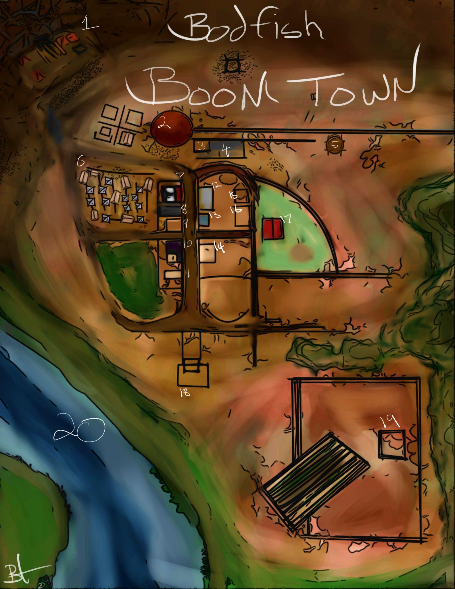

Bodfish Boom Town

1. The ole' silver mine.

2. The roundhouse. (It turns the train around)

3. Telegraph office.

4. End of the line, Vanderbuilt rail station.

5. That there water tower.

6. Paupers n coppers shanty town.

7. Pall and Knells Savings and Loan.

8. Hammond's General Store

9. Oakley's Barber Dentist and Surgeon.

10.The Painted Lady Bar and Gambling hall

11. A burnt down jail.

12. Pony Express catalog and show room.

13. Dapper Dan's Pomade and Elixer.

14. 3 Kobold's duster shop.

15. Prospector Snark.

16. Also just a building...

17. Epona Stables.

18. Chapel of the Calico.

19. Bodfish Ranch.

20. The Saint Gabriel River.

Break Down By Time:Link

4.End of the line, Vanderbuilt rail station.
This is the player’s entrance into the town.

19. Bodfish Ranch
Ranchers can sell cattle at half value to

Bodfish General Store

Prices in Copper

Misc goods:

Crate of wildly unstable TNT	2000 cp

	A Crate of wildly unstable TNT is perfectly safe until opened. Once the player has made the choice to open the crate it is no longer perfectly safe.

There are 5 uses of TNT per crate. If, while carrying TNT, the player rolls a d20 for any reason other than a skill check, the player must then also roll a d4. On a 1, the TNT immediately detonates.

Tools:

Leatherworker's Tools		50

Carpenter's Tools		50

Smith's Tools			50

Climber's Kit			50

Tinker's Tools			50

Jeweler's Tools		50

Armor:

Light:

Second Hand Duster		300

(AC 12)

Studded Leather Duster	450

(AC 13)

Homebrew Clubs:

Clubs:

Black Jack 			5

1d4 bludgeoning

(Club/light)

Tatankan knotted rope	5

1d4 bludgeoning

(Club/ light/finesse)

Instruments:These instruments replace all standard instruments. You may not have standard Wotc instruments.

(instruments)		30

Finger harp

Harmonica

Fiddle

Musical Saw.

Cigar box guitar.

Cowbell

Blown jug (Like, just a regular jug)

Spoons (Like normal spoons, but better?)

Washboard

Washtub bass

More cowbell		60

(Cures fever.)

Farrier/ Blacksmith

Metal Weapons

Knives:

Boot knife			10

1d4 piercing

(Dagger, finesse, light, thrown range 20/60)

Driftwood log.

(Great Club)

Bowie

(short sword)

Throwing Hatchet		15

1d6 Slashing

(Handaxe,light, thrown range 20/60

Barn:

Animals

Mule	 			100

Draft horse			150

Draft Horse with pack saddle	200

Camel				500

Gear:

Saddle				100

Saddle bags			50

Blinders			150

Allows mounts in combat

Padded Barding		150

11+dex mod (max 2)

Hide Barding

12+dex mod			300

Findable loot
