**<u>12:29, August 21 1632</u>**

Leaf stands in front of the forge, out of breath but confident. Holy symbol clutched in her hand she watches as the last of the Wendigo retreat back into the woods, thanking Mello that she at least has experience fighting them off. *Protect tomorrow* she repeats to herself. She closes her eyes, trying to focus on where she is, and not where Rock and the others are. She wrote on the bulletin board that she trusts them and has faith that they will succeed, but that doesn’t take away the fear of losing them. She takes another deep breath before her ears prick up at the sound of barking. Her eyes open wide and she looks up to the sky expectantly.

An image of Rush draws near, his barking seems more excited than usual. The silhouette of Rockman isn't seen riding him like always. He seems to be flying towards her alone. However, as he begins to land it quickly becomes apparent that there is indeed someone riding on Rush. The moment Rush lands a goblin about the same size as Leaf jumps down clad in the same armor Rockman was wearing, the same weapons adorn his back and sides. The goblin wipes his forehead and laughs, patting Rush on his head. "Wow Rush! I never knew that's what flying felt like… does the wind always feel like that?" Rush replies with happy barks as he licks the goblin’s face and wags his tail. Rush is the first to turn to Leaf and trot over to her.

Leaf doesn’t pay much attention to Rush, her eyes glued to the goblin. “Rock?” she says in disbelief. The confusion only lasts a moment, before it’s replaced by pure joy and excitement. Leaf rushes towards him, arms out. “Rock!” she squeals as she quickly runs to him and hugs him.

The goblin welcomes her with open arms and a cheerful overexaggerated smile. Tears begin to swell up in his eyes as his weapons hit the ground. "LEAF!" The moment she reaches him he wraps his arms around her almost losing control over his emotions. Rush barks happily running around them.

Leaf hugs him tightly, laughing and smiling widely. She wouldn’t let go if not for the desire to look at his face. His goblin face! It’s been years since she's seen anyone that looks like her. Still close, Leaf puts her hand on his cheek and smiles, looking him over. “How?” she asks, still smiling as tears come to her own eyes.

Rockman looks her over happily. He holds up a single ring, his reward. "It's over Leaf! They beat the hunger and restored the gods!" He pauses a moment thinking back. "Solomon was a traitor, he tried to steal the god's power. The town knew better and defeated him as well." He clasps the ring in his hand. "I, I didn't join in his defeat." His face begins to calm down as he looks down. "I tried to forgive him, to offer him a chance. Ultimately I did nothing in the end against him. I wanted to give him a chance." He then takes the ring and places it in her hand, wrapping his own hands around hers. "I'm not sure how I got the ring, but I wished to be a goblin like you Leaf! A goblin like my wife!" He smiles widely.

Leaf looks down at their hands and smiles. “Rock, you did everything just right!” she looks at his face again. His new big eyes and ears. They’re still Rock’s, and still hers. Leaf starts bouncing with joy before finally kissing him, full on the mouth.

Rockman kisses her back, the sensation of his first kiss finally creeping through his mind. He smiles as his feelings overwhelm him. He wraps his arms around her and spins around happily. "Oh! And nobody died! Everyone made it back!" He sets her down and a new feeling to him emerges as his stomach growls. He holds his stomach confused "What was that?"

Leaf laughs. “That’s your stomach silly. You’ll get to eat now! And sleep and dream! Oh and-” she takes his hand and pulls him over to a tree, putting her other hand against the bark. “Climb trees and roll around in the grass!” she’s bubbling with excitement. It looks like she could list things forever.

Rockman doesn't resist her direction. He happily tags along with her eager to learn all these new things he never thought of as a warforged. The night sky above lights the platform with the moon's light. The cold air hits his skin as he shivers slightly for the first time. He grabs a blanket and wraps himself up "I n-never knew, t-this is cold?... Y-yes?" He moves closer to Leaf, wrapping her in the same blanket. He can feel her warmth for the first time.

Leaf smiles as he wraps her up and laughs a bit, "Yep! This is cold. It's not my favorite but you'll learn to get used to it, especially with nice blankets around." She looks up to the night sky thoughtfully. "Actually, I think my favorite is… here, I've got an idea." She gently unwraps the both of them from the blanket and holds both of Rock's hands in hers, before sitting in the grass and placing their hands on the grass so he can feel that too. "Look up but close your eyes. Oh and deep breaths. I like the smell too." One of her hands leaves Rock's to hold her holy symbol. *Hey Mello, think you could help me with this?*

Rockman is unsure of which smell she is talking about, the cool night air carries many scents. Some fresh, some foul. Some sweet and savory smells that makes him slightly drool, an involuntary reaction. A moment passes and a smell begins to rise up, it quickly becomes recognized as the smell Leaf had mentioned. He takes deeper breaths as it grows stronger. His head tilted up as he had been requested, his eyes closed… this new smell was quickly becoming his favorite.

The symbol in Leaf's hand glows in the night air. There's a soft breeze before Rock feels water hit his face, hears raindrops against the grass and tree behind him. It's cold at first, before a second sensation is added. Leaf moves her hand from her symbol, the light pulling from it into the palm of her hand. The orb of golden light radiates warm sunlight as it floats between them. The rain and sunlight mix with the dirt to create the pleasant smell of a summer afternoon rainshower. Leaf takes a deep breath and smiles. "Better than cold?"

Rockman smiles, the warm water trickling down his face. He opens his eyes and immediately starts freaking out slightly as water flies at him. It takes him a moment to adjust to the sensation but accepts it soon after. He hugs her tightly in the rain, small tears accompany the water sliding down his face going seemingly unnoticed. "Thank you Leaf, thank you for everything." Rush plays in the mud nearby.

Leaf smiles as the last of the rain trickles down. "Of course Rock, always." She hugs him and notices that he doesn't have to kneel down this time. She beams, not wanting to let go, just enjoying the night sun Mello gave them.

Rockman opens his eyes while he holds her, not letting go. As her spells fade and the light begins to dim, he sees through the light like some kind of window. The red haired girl smiles at him and waves as it fades away. He closes his eyes and holds Leaf tightly. "Thank you Mello."

Leaf nods. "So many things I never imagined I'd have. I've got an amazing husband, and a best friend goddess." She gives his hand a small squeeze. "And I just want you to know that I loved you as a warforged too, even without the mask. But-" she squeals despite herself. "I'm just so happy!!"

Rockman looks onto her with the biggest smile he's ever had. "To our new lives together?" A tear of joy races down his cheek.

She puts a hand on his cheek and wipes away his tear, despite having a few of her own. "Together." She replies in goblin.

He grabs her hand and holds it to his cheek. As he smiles at her, speaking in goblin "Forever!". He kisses her, now happier than ever.

**<u>August 22 1632</u>**

Leaf opens her eyes to the soft late morning sun. Tomorrow… it came! And better yet, she wakes next to her handsome, loving, newly goblin husband. She smiles, now being able to feel his chest rise and fall beside her’s. His soft snoring. Goblin noses are prone to do that.

Last night had been difficult to say the least. First off, neither of them could sleep after everything that happened, but Rockman especially had a hard time. Sleeping was no longer as simple as flipping a switch, and Leaf found herself trying to explain things she’d never given much thought to.

“No, you won’t be able to hear or see anything while you sleep... You’ve got to close your eyes and just relax. It’ll come on it’s own.” Leaf said softly to Rock as she wrapped the two of them up in blankets. She’d never really noticed these differences before. His sentry’s rest had become a part of their routine, and Leaf could tell the idea of not being able to protect her though the night scared Rock.

Even Rush looked worried as he paced around the pair of them, pausing occasionally to sniff the air. Thumper hoped between his legs and into their own set of blankets before looking to him, nose switching. Treble snored menacingly in the branches above, seldom seen but knowingly there. Rush finally curled up before Thumper hopped up onto the edge of the platform, ears up and alert. Rush had had a long day, so Thumper decided he’ll take the first watch to protect the family.

They finally fell asleep wrapped in each other's arms. While usually Rockman would be the last to “fall asleep”, Leaf took it upon herself to gently rub Rock’s back until she could feel his breathing slow into the rhythm of sleep.

Leaf doesn’t remember it all that well, but Rockman’s first dream was unfortunately an unpleasant one. *Grotesque images of the inside of the beast, his friends thrown across the sky, plumating just out of reach. A flash of Solomon’s face right before-*

Rock shot up in a cold sweat, breathing heavy, heart pounding. His new goblin eyes flashed around in the darkness, panicked before finally settling on his wife. Leaf rolled over and put her arm around him, sleepily pulling him back towards her.

“You alright?” she asks, still half asleep.

“Yes my love, we’re together, so everything will always be alright” Rock lay back down and closed his eyes as Leaf had instructed. Sleep soon came to greet him again, this time bringing him the sensation of soft grass beneath his feet as he and Leaf ran through a meadow, hand in hand, accompanied by a young woman with wild red hair.

----

Later that evening, after everyone had had their fair share of rest and relaxation, the town of New Roanoke filled with music and the smell of Goose and Ozgur’s beloved cooking. Town Square is lit up with softly glowing lights as people sing and dance merrily, happy to put the struggles of yesterday far behind them. Leaf walks to town hand in hand with Rockman and her eyes fill with light, ears straight up in excitement. “The town looks so pretty!” she says in amazement.

Rockman's nose twitches, the scent of the food filling his senses. "W-whats.. That… " his head tilts to the side while looking at Leaf. "Smell?" His eyes widen "I CAN SMELL!!!" He shouts excitedly.

Leaf smiles and laughs. She loves being able to show him new things. She takes in a deep breath, noting the smell of freshly cooked meat and veggies. “This is kind of what the party at Ozgur’s smelled like. I think he’s outdone himself this time though!” She leads him to a long table full of food cooked by all the talented members of the island. Leaf hands Rock a plate. “Dig in! Just uh, don’t eat too fast or you’ll make yourself sick.” she quickly adds.

Rockman breathes deep through his nose, taking in all the smells on the plate. He seems to be in his own little world. The other party goers seem to be enjoying the party, Rockman can't tell at this point. In this current moment, there is just him, Leaf, and food. He takes a small bite, then another. And another. He looks to Leaf happily nodding his head.

Leaf takes her own plate, but mostly watches Rock. “Good right?” she smiles at his joy. “Eventually you might have a favorite food. Mines probably strawberries. But,” she takes another bite of her food, “the food here is really good. That might change.”

Rockman burps loudly then looks to Leaf. "Oh no! I'm losing air!" He exclaims as he covers his mouth.

Leaf bursts out laughing. A few of the people around look over and chuckle too. “So uh,” she says between laughs, “your body just kind of does that. It’s alright!” she can’t stop laughing now.

After finishing his plate of food he looks around and sees everyone lifting glass cylinders up to their mouth and a liquid flows into their mouth. He smiles at Leaf and walks off to get one for each of them. He returns and hands one to her. He smiles widely before chugging the whole glass, he immediately starts choking.

“Ah!” Leaf immediately drops her drink to help him. Her eyes widen as she smells the alcohol from the drink. “Ok so this is one of those human things I never did a whole lot of… the drink will probably make you feel kind of funny for a bit.” She puts a hand on his back to steady him, trying to remain calm, not really sure what to expect from him with this.

Rockman's cheeks blush and his eyes look lazy and he starts hiccuping. "Hey Leaf… -hic- I, I think -hic- I lost too -hic- much air!" He begins swaying slightly.

“No Rock, you’re fine. Just uh, be careful. Drinks like that make people do funny things.” Leaf puts her arm around his shoulder to help him balance. She looks a bit overwhelmed, but smiles reassuringly.

Rockman smiles at her. His vision begins to blur slightly and his toes begin to tap and the music finally reach his ears. He shakes his head looking in all directions warmly. "Why… am I moving my foot? I'm not doing it myself?"

Leaf looks from his tapping foot over to the rest of the party as the music swells and people begin dancing. She looks on nervously for a second before turning her attention back to Rock. “That’s dancing. It’s a thing you can do to music I guess? Like a way to express yourself? People say it's fun but I can’t say I’ve really done it before…” Leaf looks sad for a moment, recalling the last time someone had offered to dance with her. All the way back on the sub. Rah… Leaf shakes her head. “I know this body is still kind of new to you, and with the drink it’s probably kind of hard but, um, do you want to dance…?” Leaf asks, embarrassed.

Rockman grabs her hand quickly. He smiles at her pulling her to her feet. He grabs her other hand and starts stumbling around happily.

Leaf takes hold of his hands with a smile. Finally the music starts to drown out the sounds of everyone else there. Just her and Rock being silly. She giggles and tries spinning, but instead bumps into the stumbling Rock and quickly grabs his hands to stop him from falling. “Sorry!” she laughs.

Rockman laughs with her. "You know, you never have to apologize to me." He smiles at her and kisses her. He spins her around a bit more before bursting out into laughter as he begins to get slightly dizzier.

Leaf leans into the kiss and smiles as they spin. Small flowers bloom at their feet as Leaf laughs along with him. “I know I can always count on you Rock. You really are the best husband anyone could ask for.” she says beaming as the world spins around them.

The party continues as the two wander off not paying attention. Time seems to escape them as they run rampant through the town. While everyone is enjoying the party, they take enjoyment in setting up small pranks that seemingly go unnoticed. For the next couple of days, the town finds flowers and leaves in random places. The kitchen sink. Shoes. Placed above doorways so they fall when opened. Happy laughter and giggling can easily be heard behind trees or in bushes. Over time they get braver about their pranks, but their love can only grow stronger.

**<u>Some time later...</u>**

Throughout the years Leaf and Rockman begin their family. The first born set in the most panic to the couple, as neither had never expected to start a family. The panic on Rockman's face was clear to everyone around leading up to his son's birth. It took just over a day, almost an entire day before a name had been given. Leaf had looked to Rockman several times trying to comfort him, she holds her son in her arms. Rockman kept spouting out what he thought might be good names… to which he quickly redacted. As he stood at a window looking out to the city before him, his bag in the corner began to twitch. Rockman didn't notice it, but Leaf did. A smile crept up on her face as she saw the small mechanical hummingbird fly out from his pack and zoom around the room, the hummingbird emitted its light the brightest when encircling her and the baby. "Ebuc" she exclaimed. Rockman turned towards her almost instantly, smiling. "Why not Ebuc?" She asked, looking towards Rockman. Rockman clenched his fist, looking down to the symbol on his hand. "Yeah! Why not?" He replied smiling at her.

A year and a half later Leaf had given birth again. The panic was not so serious at this time though. Rockman, growing used to being a father, had gained a sense of pride instead of panic. When his daughter was born his grin changed to a smile rivaling the one he gives Leaf everytime she "I love you". On the first day they both prayed for the courage and the wisdom to name her. Shortly after finishing their prayer, while Ebuc was holding and tending to his daughter as Leaf wanted to go outside and sit under her tree. The breeze was warm this sunny summer day, the wind was calm, and the sounds of the forest echoed through the land. As leaf sat with her feet in a pond, Ebuc explored the area as best as he could. Rockman gazed at them through the window. In a nearby pond a koi fish swam continuously in a circle. Rockman smiled at the memories of Leaf and Mello. He turned his head to his daughter and smiled, slowly rocking her. "Alright then, lets go see mom ok?" He exits the building and walks up to Leaf, rocking the baby in his arms. "Leaf! Lets go home." He says enthusiastically. "Don't you think it's time we all introduced little Mello here to her home?" Leaf turns her head quickly, almost bouncing with energy. The couple happily walk side by side, Rockman carrying baby Mello, and Ebuc hold' s his mom's hand.

"How about… from now on we let the gods above name our tribe?" Rockman asks, as they turn the final bend and continue on. Leaf holds on to his arm, grasping tightly as they approach the lookout front door. Leaf nods in agreement before entering.

----

Time passes over the years, 4 more goblins are born before Leaf convinces Rockman to go on a trip with her, the honeymoon they never took, and not the average honeymoon either. Three months they were gone, Lilia agreed to watch the children while they were away. Every day Rockman prayed for Lilia, that she would have the strength to handle Leaf and Rock's children.

The voyage on the swift boat didn't seem like it took as long as he had planned. Rockman hurries to help his wife off the boat, making sure to watch her carefully, protecting her as they make their way off the boat. He whistles loudly before a beam of light shines down. Rush flies down and lands beside them. Rock helps her up onto him and smiles up to her. "Lead the way my love!"

Leaf smiles and puts a hand on her baby bump, only just starting to show. She looks across the busy London docks from atop Rush before quickly pointing to something. “There!” she says excitedly. Rush trots up to the main road before stopping beside a small berry bush growing off to the side. It’s fruit is immediately recognizable as sandiberries. “I planted this lil guy when I first got here. Second day I think? I never thought I’d have a chance to see him all grown up.” she smiles down at the bush fondly.

Rockman walks up to the Bush and a tear streaks down his cheek as he smiles. He sniffs and looks back up to her after grabbing a few berries for the road. "So, how far is this place?"

“Not too far. They’ve probably moved around a bit but just off the main roads are usually the best places for raids. I think if we walk for a bit they’ll probably find us.” Leaf looks a bit worried before adding, “Especially with your shiny armor.” teasingly.

Rockman chuckles, "hehe, that may be… but I wonder what their reaction of Rush would be?" He reminds her that as a goblin, they are the size of Rush's head.

Leaf smiles and pets Rush fondly before leading the pair out of the city onto the dirt roads, stopping occasionally to point things out- mostly trees, though there is one other building Leaf recognizes. A small school house, almost a hut, worn down and faded. “That's where I learned Common and Elvish. I didn’t go in though, I just listened from the window.” Leaf adds thoughtfully. A bit farther down the road at an empty intersection she looks around. “Not far from here, I heard about Melora for the first time from a nice tree.” she smiles as the memories begin to come back. After a while, the main road wanders off and splits in two. Leaf, Rock and Rush take the smaller of the two. Leaf eyes the bushes and trees knowingly, but stays quiet. The silence is broken by the twang of a bow and an arrow hits the ground close to Rock’s feet. There’s a sharp cry before a party of five goblins leap out of the brush. Leaf doesn’t look all that surprised.

Rockman casts sanctuary on Leaf before stepping forward. The Divine energy coursing through his body. His eyes faintly glow as he concentrates on the spell he cast. He holds his pike in a stance not used too often. A stance that seems to demand respect on the field. Rush's head hangs low and starts to growl.

The goblins all gasp at Rock’s glowing eyes. One even drops their weapon before hurriedly picking it up and looking nervously to a goblin dressed in leather armor. Another keeps his eyes on Rush, noting he is much bigger than any wolves he's ever seen. “The shiney goblin has booyahg!” one says in disbelief. Leaf sits on Rush and looks the party over, a curious look on her face, before landing on the one in armor. The hunting leader looks very shocked, her large ears out to the side. This isn’t what she expected to find. Leaf nods knowingly. “My names Leaf. You gave that name to me because I hid in the bushes during raids. You left me the night we upset the goblin hunter. But I’ve grown a lot since then! Both my husband and I have been given booyahg to help people. I’d be more than happy to show you all.” Leaf shows them her holy symbol, which glows and fills the space with warm sunlight. The goblins all look to it wide eyed but still cautious.

Rockman lowers his guard looking back and forth between Leaf and the hunting party. He walks over to rush and rests his hand on his neck, calming him down. Rush’s tail begins to wag. He keeps the spell up, still untrusting of the unknown, but he does seem to warm up slightly.

Leaf smiles and looks to the goblin eying Rush. “He’s very loyal, and much more friendly than the wolves!” she says smiling. She looks back over to the one who dropped his spear. “And I think I remember you! You used to be a gatherer, right? We built traps together and picked berries! You must be pretty strong if they let you change castes. How are things?” Leaf smiles to the group and they look taken aback by her understanding of their tribe. They all look to each other hesitantly before the leader speaks up. “Things are going… not well. You say you are a booyahg castor yes? Our leader… he is old and sick and has no kin to take his place. The Lashers are starting to get impatient and acting out. They act like he’s already gone…” the goblin shakes her head. Leaf looks to Rock, worried.

Rockman looks up to her smiling. “We can take care of this together yes?”

Leaf nods slowly. “We can help the tribe leader with his sickness… but that might just upset the Lashers. They’re probably looking forward to taking his place. If…” Leaf pauses, thinking things over. “My husband Rock and I are from the New World, a place where we’re able to live happily with our family and other races. We don’t have Lashers or Pariahs. Everyone is able to have what they need and don’t have to fight for things. We’re all very loyal to each other and keep things safe. If you don’t want to live in the town, there’s lots of open space to live. They welcomed me with open arms, I’m sure they would for you too!” Leaf beams to the group. “If things are falling apart in the tribe, others might be worried like you. Do you think you and others would want to come?”

Rockman Stands proudly beside his wife. He looks on to the group and smiles warmly. “The more of you that join, the more fun we can have there.” He pulls out his familiar and tosses it up into the air. The glowing hummingbird spins around Rock, Leaf, and Rush.

The goblins all look at the glowing hummingbird, jaws dropped in awe. One goblin in particular looks excited. Leaf smiles, “We can camp out close to your camp. Anyone who wants to come with us to the New World can come find us, that way the leaders don’t get angry with you. Oh and take these!” Leaf hands them a pile of sandiberries. “Plant these, don’t eat them all. They’ll heal you, maybe even help the leader get better.” The goblins take the berries and look them over curiously. One eats one and smiles at the taste. “And you don’t have to fight to get things like this?” they ask enthusiastically.

Rockman shakes his head no. “We all help each other freely. We all take care of each other. We have many parties, feasts, and friends! There are forests to hunt in if you wish, there are many peoples to interact with. You can train in almost any way there!” he looks down to his symbol on the back of his hand. “Your whole life can change in this place… almost to anything you want if you prove yourself worthy.”

“Worthy?” one asks, ears to the side. “All you have to do is be kind, and they’ll be kind in turn.” Leaf adds thoughtfully. “I’ve been with them for many years now, but even in my first weeks getting to the island, they trusted me with this.” Leaf gestures to the chisel hanging from her side. “I’ve had the wonderful opportunity to help and grow with them. I even added a Mason tennant in goblin!” she smiles despite knowing they don’t yet know what that means. The goblins all look to each other, mumbling under their breath. The leader nods. “We will quietly pass this along to the others. Whispers travel quickly, but we’ll see how many are willing to leave to this ‘New World’”

Later that night, as Rock and Leaf find a quiet place to sleep for the night, they hear rustling in a nearby bush. Out comes a single wide eyed, sheepish goblin. Leaf smiles and welcomes them warmly, and they sit for a bit talking. As the night continues, a few more come to sit around their campfire, peacefully eating berries and listening to the stories Rock and Leaf tell of Roanoke. By the end of the night, nearly thirty nervous but excited looking goblins accompany Leaf, Rock and Rush to the docks in London. It’s quite the sight to behold, as they hurriedly try to explain to the ship’s crew why they brought so many back. It takes some work, but everyone eventually settles in for the journey home. Along the way, Leaf does her best to explain things that might help them get along, but constantly reassures them that there is a place for them in the New World, just like there was for her.

When the boat arrives near the island. Rush takes his time transporting all the goblins 2 by 2 back up to the island. The goblins have a rough time settling in at first, but they all ease into their new life in their own way.

**<u>\[Refer to the namesake chapter in Web and Yoxl's epilogue for the final part!\]</u>**

**<u>Roanoke Epilogue</u>**

*(the epilogue for the epilogue…)*

Rockman leads a long and happy life with his wife. They raise a family and help resolve any issues on the island. Rockman takes it upon himself to be the one to carry out the final burial of his friends, and decides to bury all that he can when their time comes in the oasis. He spends his days erecting and carving statues of all the Roanokian Heroes. One by one over the years each statue is built over the tombs dug out by his tribe. The oasis would remain otherwise untouched by the tribe, leaving it to be as promised to the chinnokin. Statues of all of their companions line its surroundings in honor of those that defeated the hunger.

In his tribe's home at Leaf's Lookout, statues of Melora are seen all around. Koi fish ponds give serene places to rest at, to retreat to. All of the companions he has made are always welcome with open arms, greeted by the king and queen of the tribe, Leaf and Rockman. Among the statues of Melora, there will be shrines dedicated to the Raven Queen and Web.

Rockman will continue his services as a knight when called upon, never backing down a chance to help others in need. He will guide his and Leaf's tribe to be followers of Mello, but never forcing the choice upon them. He wears a crown grown by Leaf, and the cape left for him by his brother Cato. He and Leaf would regularly visit the rest of the town as they live, always offering aid. The goblin tribe quickly adopts the duty to protect the island and all of its inhabitants.

Years pass, the statues are built, and Rockman and Leaf's life continues on. His friends fade from existence, yet he always feels happy to tell his tribe the stories of the Roanokian Heroes. Years continue to pass as he watches generation after generation fade away, his long lifespan taking its toll on his now heavy heart. And yet, every day he sees his wife, his childlike attitude revives. Upon the realization that his life is beginning to deteriorate, he uses the last wish of his ring to wish that he and his wife be made celestial guardians of their best friend Mello, the goddess Melora.

**<u>The In-Between Tribe and Inscriber Leaf</u>**

Leaf has had interesting experiences with both tribal life and "modern" society. She loves Roanoke with all her heart, but also recognizes that through no fault of its denizens, not everyone feels comfortable with their way of life. She remembers how overwhelmed she was when Roanoke first began, and her talk with Skitter on the beach. Her confusion and frustration as everyone got to work building a society she wasn’t familiar with.

So, almost by accident, Leaf and Rockman begin a tribe on the outskirts of town. It started with their family at the tree. As the family grew, more and more people were welcomed in with open arms, including goblins from her old tribe. People of all races and reasons make their version of a home around the tree. Ponds, burrows, huts. They are welcomed in the town, and many join and find a family in Roanoke. Some move on to their own paths, others prefer the “in between” society and isolation, and this tribe is where they call home.

As more join the tribe, Leaf begins taking notes on each of the island’s native tribes, excited to learn about their different cultures and customs. As the piles of papers grow, she begins logging them in the Mason library. That along with her work with the chisel grants her the Masionic title of *Incriber Leaf*, though truth be told, she doesn’t use the title often. The only place she uses the title is in her writings, where she signs each personally as Inscriber Leaf. Her writings grow to join the texts in the Mason library, though Leaf doesn’t consider them to be academic in nature. She simply strives to show appreciation and foster understanding for the different people she’s come to know and become friends with. Each “essay” is written as you’d expect from Leaf. Very enthusiastically, commenting on how great she thinks certain traditions are often. She writes a foreword in goblin explaining how she wished someone had tried doing this for her own tribe, and how honored and excited she is to do this for others. She adds many footnotes to explain things specifically with the goblins from the Old World in mind, though she’s sure others will find them useful too.

*Many, many years later, after both Rock and Leaf have moved on from this plane, a small blue box can be found resting on the inside of Leaf’s Lookout, left over from a time long past. Should anyone curious take a look inside they find several carefully folded pieces of paper surrounded by handfuls of still blooming flowers.*

*The paper closest to the top is folded separately, and written with slightly different paper and ink. The handwriting is unmistakably Leaf's cursive, somehow making the Goblin language look elegant.*

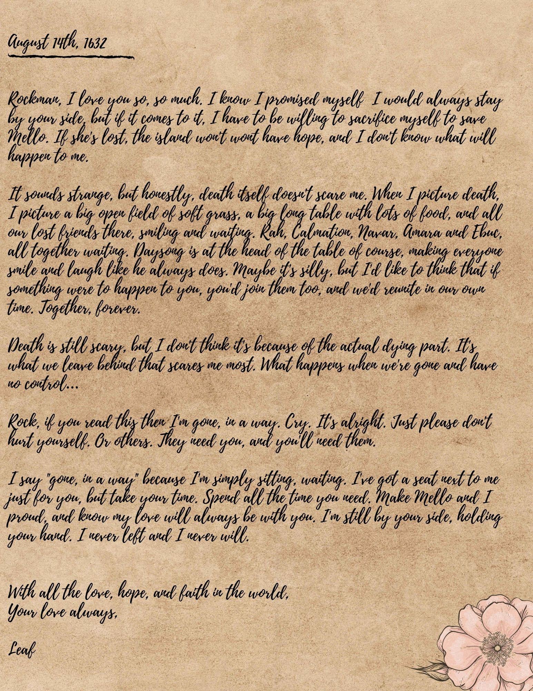

*Next is a set of several papers all folded together, though you can tell by the creases that she referred to these documents often. Some are worn thin from being in her pocket. A few show signs of water damage and smudging.*

*The first page is a journal entry, this time written in Common.*

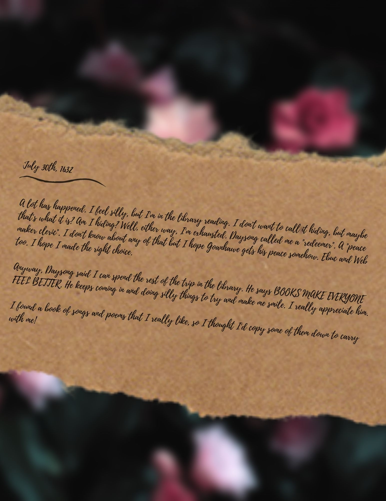

*What follows is a collection of songs, all doodled on and annotated by Leaf. The last paper looks newer, though even it has been worn down by time. Given the nature of the documents, you gather that had something happened to her, these were the things she would have wanted people to carry with them in her place. With the fresh smell of flowers still on the papers, it’s clear these were never needed. Should you, weary traveler, need a small goblin’s advice, take these papers and carry them with you on whatever adventure calls your name.*

*Leaf will be there cheering you on!*

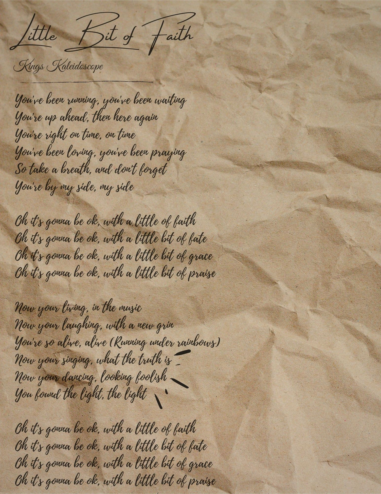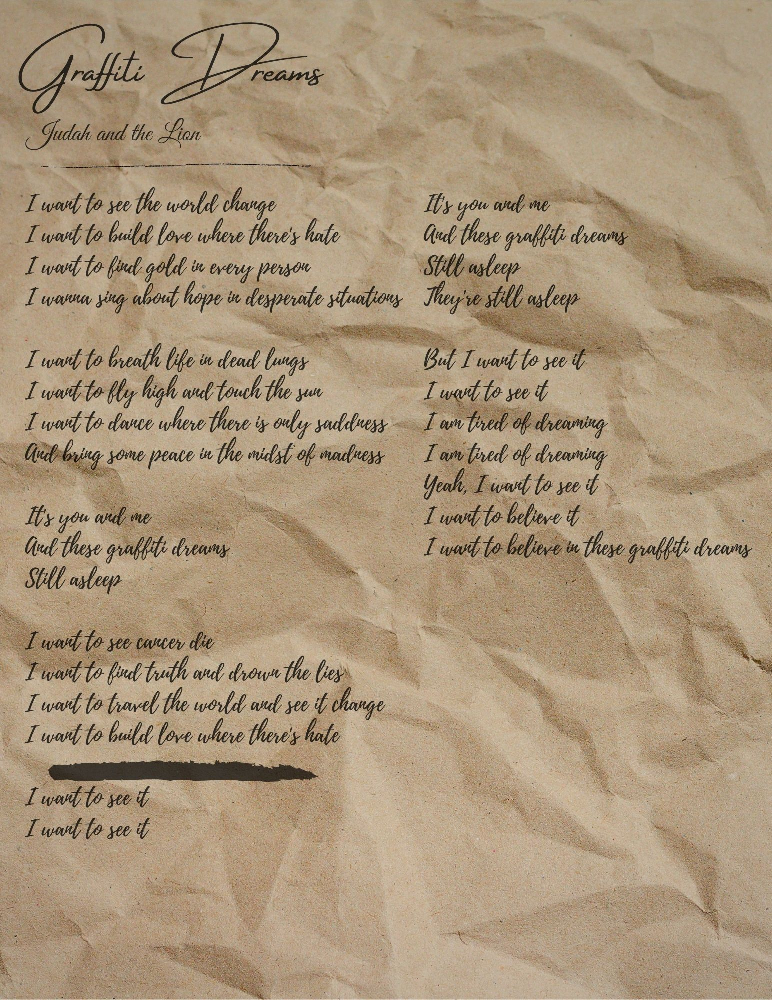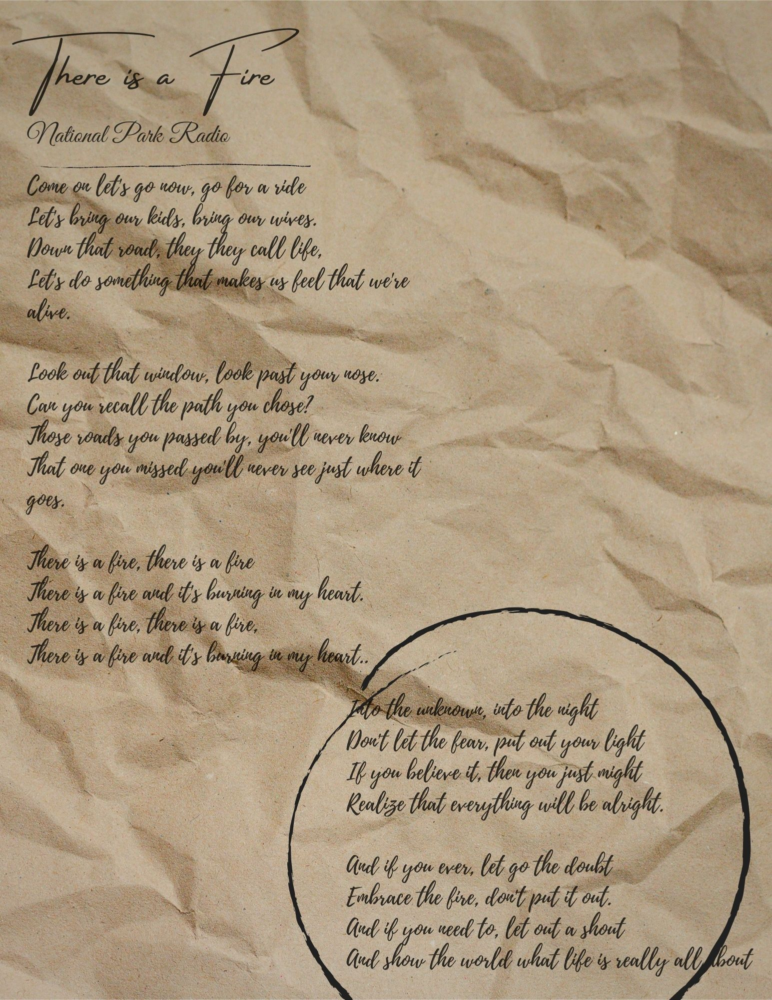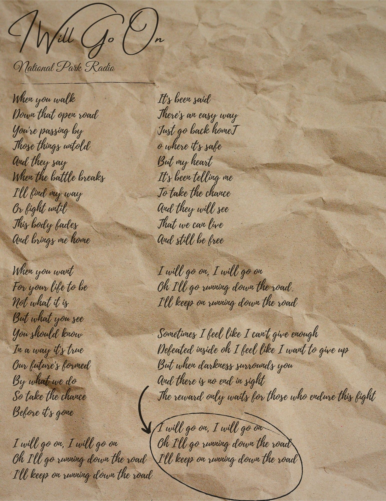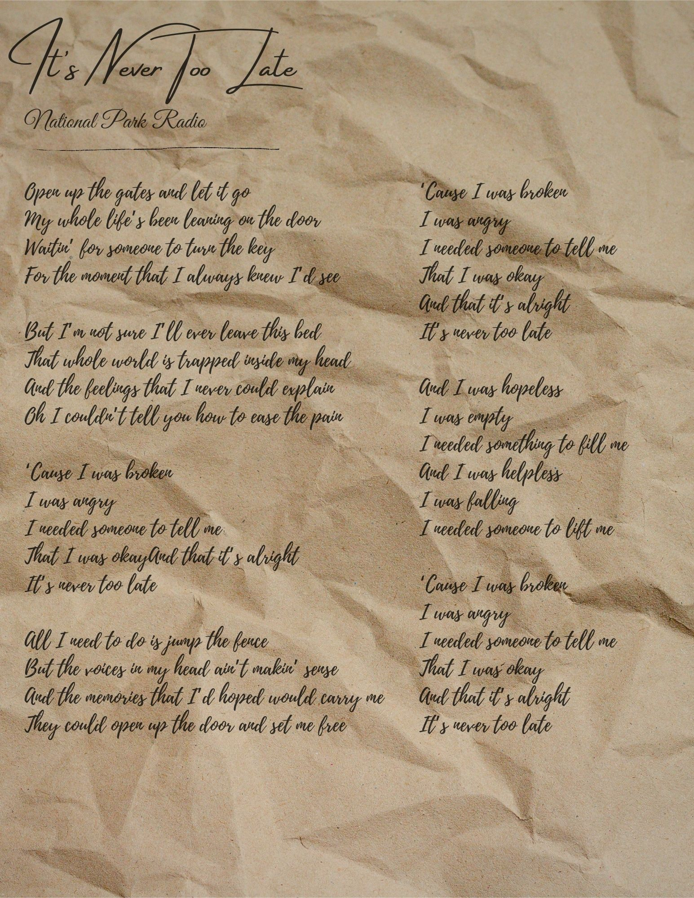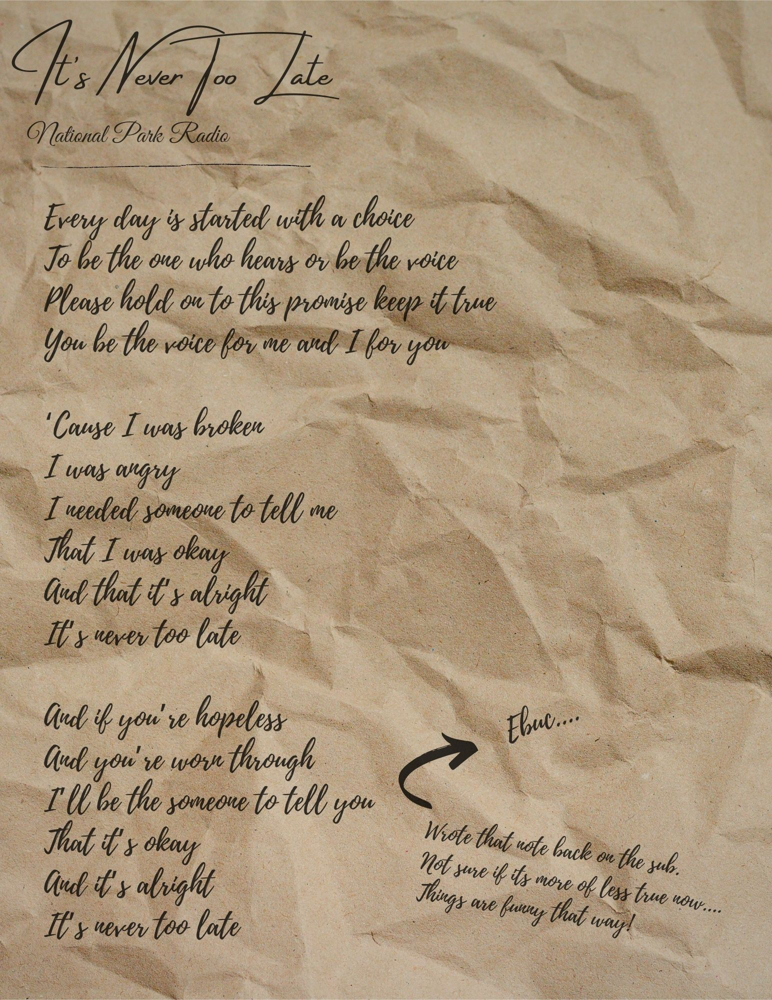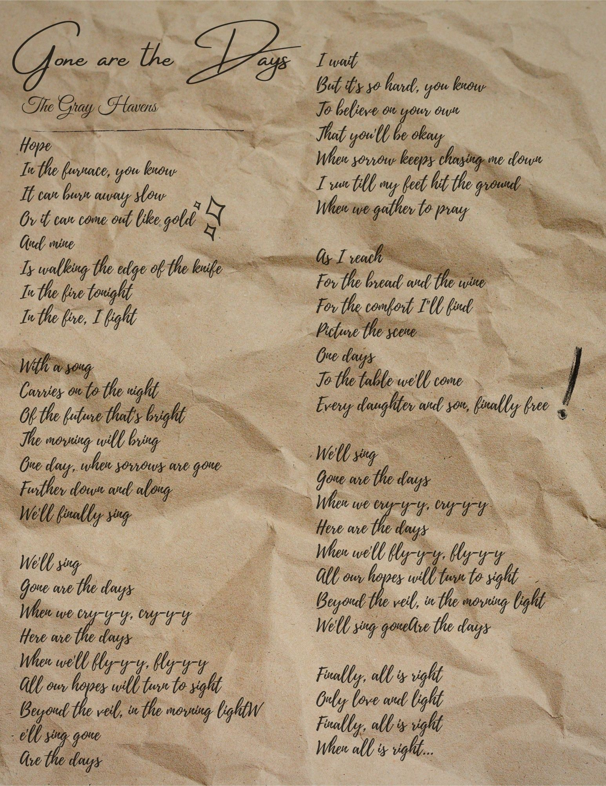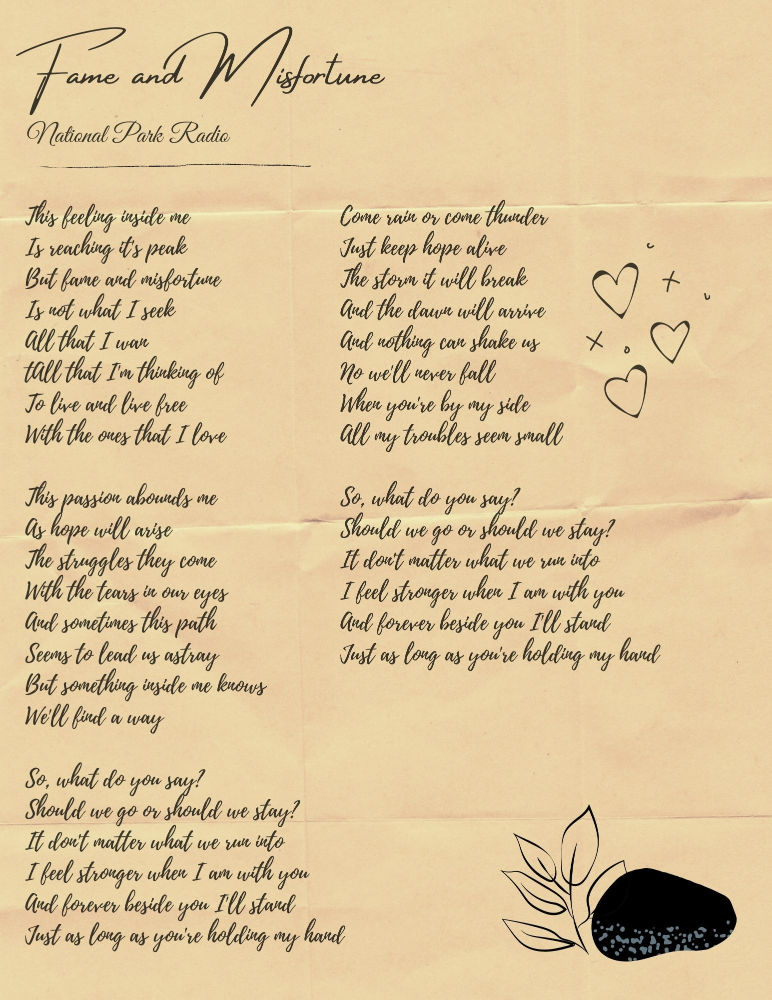

**<u>Note from player numero uno</u>**

Hey guys! We've known each other for five weeks but most of you don't even know my real name, which is wild to think about. Honestly, if I remain "Leaf" in your head I am 100% fine with that, even honored in a way. Completely by accident, Leaf came to represent something I strive to be. While she was off fighting the Hunger and believing in her friends and goddesses, I was off in the real world fighting Covid and college. Even though I'm the one who wrote her lines, there are definitely things in there I learned along with and even through her. She's faithful to a fault, which is something I struggle with constantly. Even almost a week after the end of the game, I can easily picture her encouraging me to take a leap of faith, go talk to new people and try new things. "Off to the New World!"

Leaf was first designed from a place of isolation and loneliness. Deep in the covid blues, with school ending so abruptly I'd lost a big part of my support system. Many of my friends had to take any and all hours of work to help support their families, so even connecting online was a struggle.

So when I heard about Roanoke through the DDB discord server, I created a silly little goblin who just wanted some friends. Leaf was never really meant to be a serious character. I thought a good aligned goblin might turn some heads, and a goblin being called by a god seemed like a fun hook. Things got more complex when I considered what it would take for a goblin who knows nothing outside of her little woods to go to the New World. She doesn't care about money or exploration. All she knows is things will be different than they are now… and nice trees. That kind of step has to take faith. A faith that trusts enough to not ask questions, to just *go*. So "childlike faith" became Leaf's central theme. Why did she walk through the London gates to go to Roanoke? Because she had a feeling.

But if nothing had happened to Leaf, that above statement would be meaningless. That's what I mean when I say I am so proud of the story we told together! Roanoke is a place where a cursed Castor bagel can lead to lines like this, made in week one...

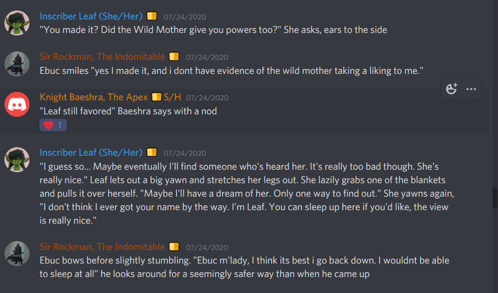

…that come full circle in week four, completely by accident! Not only is it a great story, but we told it together. Not only did Leaf come out of it with a family, but I'd like to think I did as well. Can't wait for next year, it's gonna be great.

Sincerely,

-Mod Grace

**<u>Note from the player 2</u>**

Heya everyone, Ebuc/Threebee U.C./Rockman here. I would just like to first say that it has been an extreme pleasure playing with you all. Ebuc was made as an escape. My life this year has devastated me with the passing of both my grandmother and my uncle and I found myself in a rough place. On a whim I saw a post on a Facebook group by BFDM. The thought of so many people playing D&D looked like the perfect escape. Little did I know that the bonds I experienced would have such an impact on me personally. Although I was still coping with the losses, the story had begun. Ebuc was meant to reflect who i wanted to be, someone magnificent in what he does. Someone i never saw myself as. But the more i played the more I began to realize how much of myself was brought out. Events happened and character changes were made, but no matter what character I played it soon became apparent that I had somehow found the community that I needed to ease my own suffering. You all healed a part of me that was broken and hurt. You all helped give me the courage I needed. I will forever be in debt to season 3.

Sincerely,

-Mod Xibur
