**Roanoke DM’s Guide.**

**Welcome to the Cascadia Gamers Alliance “Guide to Player Engagement Through Discord.”**

By the time you are done reading this guide, you should be able to:  
-Recognize the advantages to building a remote play environment.

-Understand the dynamics of time keeping and role play focused etiquette.  
-Understand how to build a Discord server that meets your needs  
  
Remote Play Environment (we will refer to this as RPE) refers to an augmented theater of the mind that includes a real time role play opportunity using any chat application. A correctly built RPE should include the following:  
-A persistent environment where players can role play without DM oversight.  
-A posted DM schedule OR a quick and easy way to let players know when the DM is available. (We recommend having the players join a Facebook group or creating a texting group from whatever texting application you are already using.)  
  
Life is busy. In-person games, whether designed around terrain and minis, a service like roll 20 or purely theater of the mind, can at times be difficult to coordinate between busy schedules. In the Cascadia Gamers Alliance, we have a "real life comes first" view of our hobby. But just because real life happening, that doesn't mean that the passion for our hobby needs to be put on pause and as we have discovered, it is remarkably easy to facilitate away from table gameplay.  
  
Many DMs share the goal of having an RP heavy campaign. A player thinking in terms of "how would my character act in this situation" is a strong indicator that the player is having fun and is a good metric for the success of the game. Creating an environment for player characters to have interaction moderated and influenced by the DM on the fly, when not at the table, is a delight. Having players who are thinking about the story, building nuance, and a layer of richness, that would otherwise be impossible to create at the table, is absolutely worth any DMs time.  
  
Additionally, giving players the time to think about their words, to craft their responses and make their intentions known while not competing for the attention of a DM can lead to complex stories that can inform and give agency to characters concerning their stories arcs.  
  
These are the reasons why you should consider this tool. Now let's talk about how.  
  
Our recommended method requires access to two basic technologies: Facebook and Discord. There are many ways to bridge the gap if you happen to have users who are not Facebook friendly. Choosing not to use Facebook happens for legitimate reasons all the time, and we will cover some suggested ways on how to get around it. Discord or another chat service such as skype or Facebook messenger is possible, but not recommended as highly.  
  
Facebook and Discord have both personal computer and mobile device access, producing an ideal environment for making your RPE very accessible and easy to use. Even players who've never used either, typically pick up how to use both in under an hour.  
  
On using Facebook to govern your game:  
Most Facebook users are aware that Facebook has a function called Facebook Groups  
  
If you aren't familiar with how to use Facebook Groups, here is the basic concept: By accessing Facebook with either your personal computer or mobile device, you can create a new group. Once you name it, and add your members, you can begin adding tools. Documents, art, player made character bios and maps are just the beginning of the things that can be shared in this way.

When players don't use facebook co-ordinating can be a little bit challenging. But, texting groups, skype chat, email and dropbox can all be leveraged to pass along the same information to others. The best practice in this case is to get into a routine between the DM and all of the players.

On using Discord to create and interact within your RPE: If you aren't familiar with Discord, it is a free chat application. Discord was originally conceived as a text and chat application for coordinating in multiplayer video games. Adaptation to an RPE is easy and the app itself is very resource light (meaning it works very well without slowing down your hardware).

After all participants are gathered together, a DM can begin to set expectations. This works best if the expectations are both said in person and posted online. Here are the ones that we found work best:  
  
1. Time keeping.  
The most important step in using Discord between sessions, is defining the timeline: What we mean by “timeline” is: The amount of in-game time that will be covered within the RPE. It could be, what your party does during an 8-hour long rest or a few days traveling/between missions, or months at sea.  
To enact this, simply define the time at the end of the last session (some examples could be: "you are taking a long rest, its 6 PM" or “we will be covering the length of your journey to chult during this week on Discord). In the example of a long rest, to prevent players from attempting to capitalize beyond the intended scope of interaction, we suggest that the DM restricts extra exploration or enforces that leaving the inn, cave, shelter or other chosen physical boundary removes the benefits of having a long rest.  
Another example is letting the players shop during sessions. This can take care of the awkward shopping trips to spend the massive amounts of gold players sometimes amass without spending precious time at the table trying to produce the contents of a town's store on the fly.  
A DM can also utilize this time to easily have one on one interactions with players without having to step away from the table for privacy. It can even be a highlight for the other players to read about the stories being crafted away from the ears of their characters like reading a play your co-players are writing to help build tension. Or give players a spotlight on something that has caught their interest.  
In addition to setting the overall game time, it is sometimes necessary for the DM to convey how much time actions or conversations take. It can be as simple as all conversations take 15 minutes and any action that happens will take an hour. OR the DM can tailor the time spent to each interaction.

For instance, from a recent interaction in one our games, the DM made the following statement to make time keeping clear:

\*For time keeping purposes we are at 5 pm. Torax has been missing for hours. And now upon A'ren's return, Cora is also missing. The next hour in the cave belongs to Timmond, A'ren, Calder and Marlow. Pm me to set up if anyone needs anything. Just as a reminder, no combat in discord please. Additionally for story reasons I need you back at camp by 8 pm)\*

Equally, a time limit to make a crucial decision could be made. Or players who ended a session in separate places can be put back on the rails to reunite with the group.  
  
2. The use of an emoji as a pause function.  
As was said before, an RPE allows player characters to develop in amazing ways, but for that development to happen, players must be heard! One of the biggest complaints about Discord is that there are times when it seems like participants are talking over one another. Despite intent there are times when people can find themselves stepping on others toes. While it is possible to see when others are typing, the more verbose players, and those with the best typing skills can sometimes seem as though they are upstaging others.In the Cascadia Gamers Alliance, we understand that everyone has the same basic drive to be heard, and we feel strongly that players being heard in 5e ought to be treated as a something very rarely cut short. And never cut short without purpose. We solved for this by initiating and enforcing a simple technique we call “the pause emoji.” The best practice here is to pick an emoji that isn't a common reaction. Whenever a player has a significant amount of exposition (or is naturally a slower typist) they would simply insert the agreed upon emoji letting the other players and DM know they are working on what to say. The time taken to express a character's thoughts and actions is worth the wait. Within Discord that emoji line of text can then be edited by the player to what he/she actually wants to say in that space. Additionally, the power to go back and edit your text removes the need to add lines to the chat that are simple spelling and grammar errors.  
As etiquette, it is a good idea to respect a player using the pause function, but it is not mandatory, leaving room for excitable characters and people enacting a flurry of emotions. However, the DM using the pause function should be treated as sacred. Especially if it's for time keeping or continuity reasons.  
  
3. (Discord specific) The use of rooms.  
  
The function of being able to make a large number of chat rooms and designate them as separate locations is one of the most powerful and enjoyable functions that Discord offers. The ability for characters to meet and have private conversations that they wouldn't normally have in front of others lead to more depth than normal. As for privacy etiquette, we would recommend that an in-chat announcement be made, either as a DM instruction or as a player request. This allows players not involved in the conversation to still enjoy the RP while keeping their characters out of the loop OR asking for DM permission to roll for overhearing certain conversations.

What we are now going to do is give you a brief overview of the concepts and functions of discord that are important to your RPE.

Upon downloading and logging in, you start with your own server that will have one text and one voice channel. Channels can be added and organized into locations including locked rooms. Players can be renamed once they join with a server specific nickname. Both channels and players can be assigned specific rules. A channels rules supersedes the rules given to players in general. For instance: its is possible to set a text channel to “read only” so that no one but the DM can write in it. Which is a perfect way to post chat rules or send out reminders.

The way to set it up so that the DM can do things that the players can’t is called “rolls”.

If you are setting up the server, establishing who can do what is important. Who can make new rooms, who can kick or ban other people, who can embed links or add files, and many other things. The best practice here is to design a roll called Player with the following permissions enabled:

For text:

- Display role members separately

- Allow anyone to @mention them

- Change their own nickname

- Read text channels and see voice channels

- Send messages

- Embed links

- Attach files

- Read message history

- And add reaction.

For voice

- Connect

- Speak

- Use voice actively.

For the DM, an administrative role including all of the privileges should be added.

This includes several powers that can have more drastic effects. For instance: the ability to rename the server or the other participants. Also it has the ability to invite others, kick, ban or mute people. And the ability to see and read private rooms or change room permissions.

One of the other big advantages of using Discord is that other users have done a lot of work in order to make Discord more flexible in its abilities by creating Bots that can be added to your server.These bots are free, useful, and help keep gameplay fair. The bot we have been using is called RPbot,(found here at [<u>https://bots.discord.pw/bots/204777316621090816</u>](https://bots.discord.pw/bots/204777316621090816)).

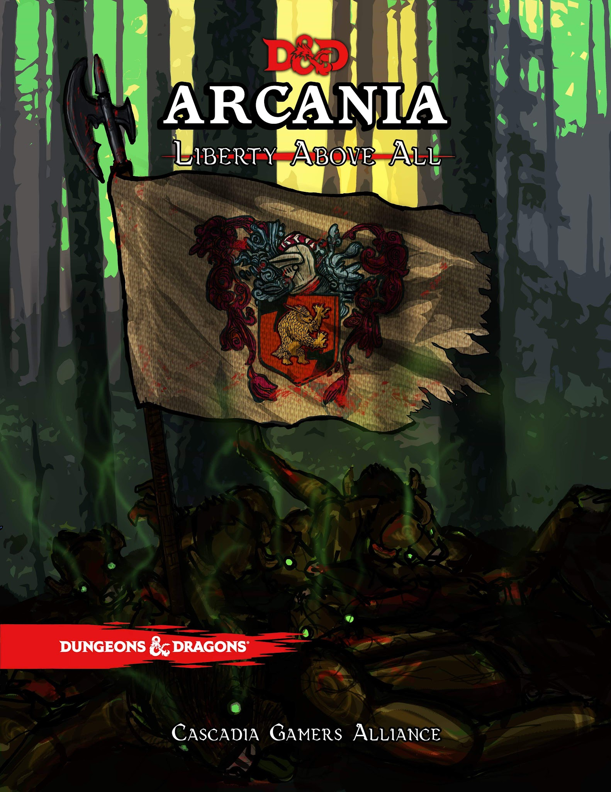

**Welcome to Roanoke season 2.**

This document is designed to equip a dungeon master to lead a group of players through a module.

**Roanoke Module:**

Chapter 1: Overview and Broad Strokes

Chapter 2: The arrival

Chapter 3: Week one voice sessions

Chapter 4: Thing get creepy

Chapter 5: Week two voices sessions

Chapter 6: The Arrival of Elloden

Chapter 7: Week three voice sessions

Appendices:

> Appendix A: Daily life
>
> Appendix B: NPCs
>
> Appendix C: Bestiary
>
> Appendix D: Hidden Objectives
>
> Appendix E: The Map
>
> tinker

Prelude: The backstory to Arcania.

The story of Arcania is the story of the Tinker. A Tinker is a magical creature formed out of the living soul of an existing person by the Arcanian Dream. A tinker is mischievous, powerful, and has the key to the hidden mysteries which are central to this amazing New World. The original Tinker was and is a Dwarf by the name of Hiram Abiff. Hiram was and is the last of the Brunelocks, a long forgotten dwarven subrace known in Common as “sand dwarves”. The pinnacle of their society was an order of hermits and wise men, each of whom were master masons and stone carvers. Each seeking the truth and meaning of the world by carving wonders of stone work in solitude. Some would carve vast cities over hundreds of years, never to be inhabited by others. Some would carve words of power and experiment with their dominion over the earth. But Hiram sought to perfect the capstone. The capstone is the first stone laid in any foundation. He sought the truth that lay within the first moment of construction… of true masonic creation. And in his studies he learned a power so great he cut out his own tongue lest he speak it to any other.

Over the years, the foundation of his wisdom carried him through ages and empires, seeking to trade and influence those he interacted with subtly.

His merchant voyages ranged far and wide trading with those in who he saw a spark that could be kindled into greatness.

A part of his realization, which I share with you now, is that the world and its magic have been split and torn asunder. The old world remains as it always has been, a land under the dominion of the Gods. The wellspring of divine magic runs freely here. But arcane magic? The ability to use powers of oneself, be it your own intellect, your own wisdom, or your own charm? That has its true roots far to the west. Further even than the Moonshale islands.

This land is governed by mystical creatures called wardens. Wardens are tied both to the region they serve, and to an aspect the Arcanian Dream.

Our back story concerns the Lady of Liberty, the Warden called Columbia. The lady of Liberty and her blind daughter, Justitia. Justitia was born on a small island off of the Virginia coast. An island named Roanoke. You see, there are no forces greater than any other in magic. Great positives create great negatives. And for as great as the Wardens of Arcania and their kind are, so too are the Great and Terrible Siberex.

The Siberex are creatures that warp twist and change anyone or anything in its presence before consuming them. They hunger for more power, but are impotent to do anything but make dim and twisted copies of the things that they feed upon. But to be in the presence of a divine being. One whose divine magic would be powerless against its raw arcane hunger, that it might twist it into a thing able to be consumed by a mighty enough Siberex. This is it's utmost desire.

Therefor, to prevent the Siberex from consuming the Gods and then the world, The Lady of Liberty Columbia chose to go against her nature, and deny the Siberex the liberty to consume. In doing so she also denied the Gods liberty to travel to Arcania, and in that moment at the Hanging Tree of Roanoke island, the Daughter of Liberty, the blind child was born the lesser warden Justitia. A being who is forever to he reincarnated amongst the native tribes who inhabit the island.

Which brings us back to the tinker. The tinker seeks, as all who are wise seek, to reunite the divine with the arcane, in a way that gives liberty to the people in both lands.

The goals then, of both the villians and the heroes of the story are largely the same. To reunite the divine and the arcane. The masons who seek to build a world worthy of that possibility, and a dark few illuminati who seek to bring the world under the Siberex that all might be changed into its illuminated form before being consumed and joining with their masters forever.

**Chapter1: Overview and broad strokes**

Introduction:

Arcania is a new continent far to the west of the Old World. The Old World has entered a period of colonialism similar to the 1700’s in our history. Arcania is to America in this paradigm as Faerun is to Europe. Additionally a new country has been added (Called Elloden) to be considered to be an analogue of Spain. The main countries of origin follow that same colonial period. For our purposes, with Elloden being considered spain, Cormyr is considered to England, Netheril is France and Impiltur as Holland.

**Old World Politics:**

The colony of Roanoke is a colony of Cormyr. The player characters are all prisoners or citizens of Cormyr. A majority of the Arcanian continent was claimed by the explorers Rustdust and Pearl for the country of Elloden.

Roanoke itself is based on an island in North Carolina.

**Local races:**

Four native nations are local to the island.

**The Jackalopes**.

Ostar, High priestess of the Lagowarren (an underground village to the north east of Roanoke Island) takes daily walks in the high grass fields that the Jackalopes tend to prefer. The top of her head stands a mere 3 feet from the ground, with her pink and grey ears rising another foot up when she stands them up. Most jackalopes wear their ears down when calm, but they can be quite animated when they are feeling strongly about something.

--The Naturalist JG Fitzsimmons

Somewhat Unreliable:

The diminutive and short lived creatures thrive in woods and typically have very large families. While many are lost to the brutal nature of Arcania, a successful family (especially those that excel in the use of magic, or the roguish arts) can sometimes have families whose members number in the hundreds.

With a life span that rarely passes 35 they tend to live in the moment and are not always careful planners, instead relying on their instincts and abilities instead of wisdom.

A plague of good cheer:

Jackalopes have integrated with colonies much quicker than the other native races. They understand the idea of trade, and are always seeking short term advantages. They have found that being entertaining and commedic can be a way to endear them to the newcomers to their shores, but a careful eye will notice that a Jackalope always has an angle to work. Its common to find them in taverns acting as fools or as street performers. It is also common to find your pockets a lot lighter than you intended if you happen to spend too much time with one.

Cute and cunning.

It may be that their non-threatening appearance has opened doors for the Jackalope that other races may not notice, or perhaps more easily forgive their natural avarice.

Jackalope Names**:**

Speyfoot, Thwentwick, Spurshin, Floofin, Hopburr, Sootlyn, Boopwent, Whifour, Harkness.

Jackalope Traits**:**

Your Jackalope has a number of traits in common with all other Jackalope.

Ability Score increase

Your Dexterity increases by two

Your Charisma increases by one

Age

Jackalope rapidly age compared to other races, reaching adulthood at the age of 7 and generally lives no more than 40 years.

Alignment

Most Jackalope lean toward a neutral alignment. Although they have a propensity for avarice and self preservation, they are usually very outgoing and talkative. It can, at times be very difficult to get to know most Jackalopes, as they tend to answer most questions with a question of their own.

Size

> Your size is small. Jackalope average a height of about 3 foot. Jackalope have ears with vestigial muscles that can lay flat, or stand up and can swivel, and powerful oversized feet. With their oversized feet extended and their ears up, they can usually extend themselves by standing on their toes have a toe-to-ear-tip height of 5 foot.

Speed.

Jackalopes are amongst the quickest of creatures with a speed of 40.

Be Nimble. Be Quick.

> You can move through the space of any creature that is a size larger than yours.

Burst of Healing

As a bonus, you can draw power from your warren to spend one of your Hit Dice and revitalize yourself or a creature you touch. Roll the die, add your Charisma modifier, and the creature regains a number of hit points equal to the total. Once you use this trait, you can’t use it again until you finish a short or long rest.

Laughing at death

If your hitpoint counter falls to 0 you can use a hit die to revive yourself. Using this feat removes one of your death save attempts, however.

Flurry of Fur

Beginning at level 5, when you damage a creature with an attack or a spell and the creature's size is larger than yours, you can invoke the innate connection you possess to the New World to move through the ground. You gain the ability to use an extra amount of movement equal to your level. Your movement moves you through solid ground after your attack. This movement is instantaneous and does not provoke an attack of opportunity. Once you use this trait, you can't use it again until you finish a short or long rest.

Language

You speak read and write common as well as Woodland Arcanian.

**The Tatankan.**

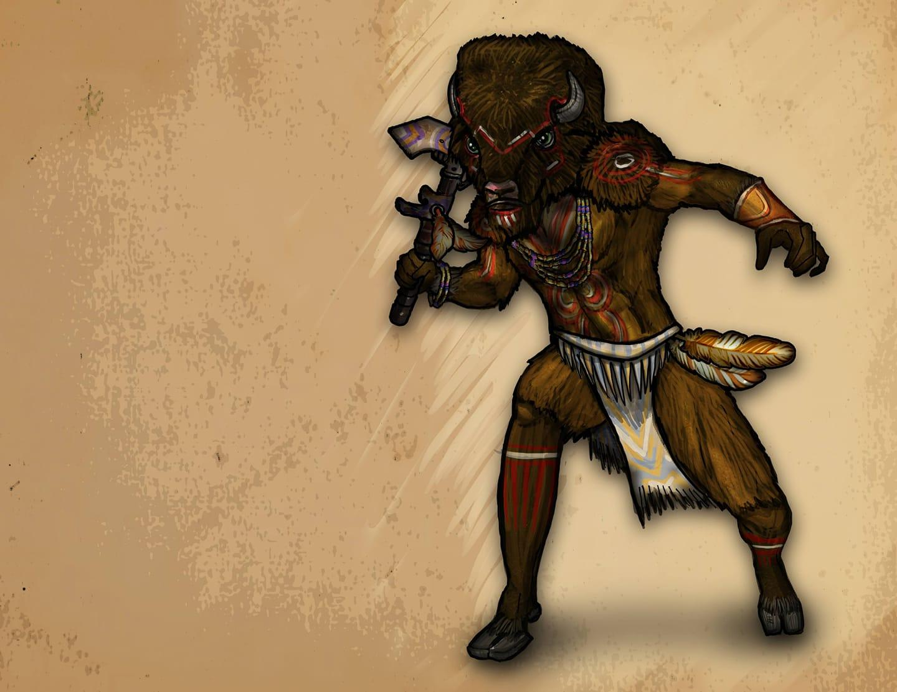

The Majesty of the Tatankan cannot be understated. Whether you meet one up close, or see the great heard from miles away, these Plainsmen are likely to leave a lasting impression. Their cities have no names that they have assigned to them. Any local designation is made by outsiders and referring to the city as any name other than “the Pen” is considered uncultured and borish.

Tatankan Race Details.

The herd is the core of life amongst the Tatankan. Rarely alone, the Tatankan people are very conscious of customs and decorum. Within your herd it is considered impolite to move faster than the slowest member, so as not to reveal who might be weak or sick or likely to be picked off by the enemies that threaten. The Tatankan are often misinterpreted as being dull or dim witted because they are brought up to move slowly, to be cautious and watchful. They are ever vigilant and care deeply about whatever causes they devote themselves to.

Possibly the best natural gamblers in existence.

It is a cultural attitude to keep quiet about both advantage and weakness. Their presence is menacing to their enemies and a relief to their allies. It is only a fool who would sit down at a card table to play against a group of Tatankan.

A flame ignited.

Sorcery is considered sacred amongst the Tatankan. Those who find it within themselves to be clever or powerful spellcasters without studying books or invoking a pact with a god or demon, or drawing your power from the balance of nature, sorcerers are considered automatically to be shaman, regardless of race. The Great and Fiery Buffalo Tatanka was said to once have been a sorcerer who could change his shape, and it is customary to make an offering of milk and wheat to any sorcerer you may encounter.

Tatankan Traits:

You have several traits in common with all other Tatankan.

Ability Score Increase

Your Strength score increases by 1, and your Constitution score increases by 2.

Age

While a large portion of their adolescent life is often devoted to a nomadic lifestyle, none of the members of a juvenile herd are considered adults until all of the members are mature enough to graduate into adulthood together. Typically this happens between the ages of 40 and 60, with Tatankans often living until they are 220. A mature Tatankan may leave her pen but many choose to stay with the members of their Juvenile herd. Departing from the herd is considered to be an extreme life style. Departing early from a Juvenile herd is considered to be obscene.

Alignment

Despite their penchant for gambling, Tatankan believe in the law of the herd. Though it is not a written law, and can change from region to region, it is very rare to find a Tatankan who is not Lawful Good.

Size

Tatankan are between 6 and 8 feet tall and weigh between 300 and 400 pounds with 1 to 2 foot horns if any. Your size is Medium.

Speed

Your speed is 15ft. However if 2 or more of your party members are dashing in the same direction you may take 60 feet of movement as a dash. Additionally if any of your party members become prone, restrained, grappled or incapacitated, you may charge upto 60 feet inorder to make a gore attack with your horns.

Enhanced smell

You can find any party member within 30 feet despite visual restrictions.

Powerful Build

You count as one size larger when determining your carrying capacity and the weight you can push, drag, or lift.

Slothlike Reputation

Due to their massive build and slow movement, the reputation of the Tatankan gain them a +2 to deception and +2 to perception.

Gore

A Tatankan can make an attack with his horns, causing 1d8 piercing damage plus his Strength modifier. If the target is a creature of the same size or smaller, it must succeed on a DC 12 + your Strength modifier Strength saving throw or be 5 feet away and knocked prone.

Language

You can speak Common write and read common. You can speak Tatankan. You can tie tatankan story knots and interpret them correctly.

**The Chinookin.**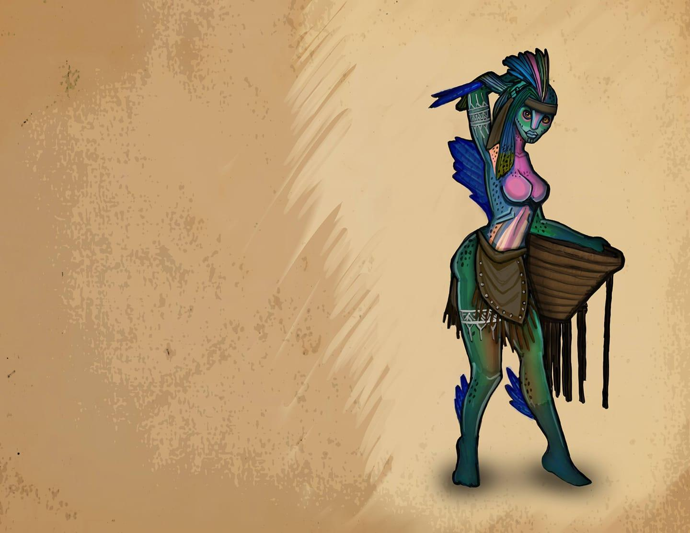

The salmon folk. This costal society is easily the most advanced of the native races. Most of their society is dedicated to preserving life from an evil eel like creature that waits beneath the waves to consume us all.

Chinnokin Race Details

After the storm subsided, our ship was run aground on a sandbar. As we waited for the tide to lift us, strange creatures could be seen playing in clear water below. Some of the men befriended them, and soon we were trading trinkets and food. They called themselves Chinnokin. They were friendly enough, but they seemed to assume everything we owned was fair game for trade. Only time will tell the true nature of these strange people, but I count it a good omen that we met them when we did.

— Admiral Timmond

Chinnokin are a race of aquatic creatures who travel the oceans in small tribes or alone.

Sleek and Playful

With their fishy features and scaly skin, these creatures are more at home in water than on land. They are slightly shorter than humans on average, ranging from well under 5 feet tall to just over 6 feet. They seem to grow larger as they age. They are fairly slim, weighing only 100 to 145 pounds. Males and females are about the same height and weight.

Chinnokin range in color from dark green to bright red, and many have a combination of both colors. Some have a shimmering silver or rainbow colored stripe running down their side.

Tribal Living

Most Chinnokin live out in the open ocean. But some tribes choose to live closer to the shallow waters near shore and trade with land dwellers. Seafaring vessels happen upon tribes of Chinnokin from time to time. They are usually friendly and eager to trade their treasures of the deep for novelty items, but some tribes have been known to be hostile to sailors.

Running of the Chinnokin

Chinnokin are seldom seen on land, but occasionally their curiosity gets the better of them, and they may take up residence in coastal cities. The main exception to ocean dwelling is when a Chinnokin has reached a point in their life cycle when they are ready to mate, somewhere around 50 years old. It is said they travel far inland to the streams and pools of their birth. Somehow, large numbers of them arrive at the same time, as if driven by a subconscious urging. Once the time is right, the females will congregate together in a large group. The males will be just upstream. A great battle will ensue for the males. They will fight savagely with each other and most will die. A small group will emerge victorious and join the females in a mating ritual that lasts for less than a day. The bodies of those fallen help to feed the new hatchlings. The adults move on and leave the young to fend for themselves as they swim downstream to the sea. These young are nearly indistinguishable from fish, and do not gain sentience, or assume humanoid form for many years. Eventually, they too will return to their spawning grounds to perform the ritual again. Males who have participated in more than one mating ritual are rare and highly regarded among their people.

Chinnokin Names

About 5 years after reaching the sea, Chinnokin children begin transforming into their adult form. They gradually increase in intelligence and seek out others of their kind. The tribe that accepts them will give them a name. They will also take on the name of their tribe as their family name.

Subrace

There are two main types of Chinnokin. Off the east coast of Arcania the most well known Chinnokin live. These have the most interaction with the other races. A lesser known, and more wild subrace of Chinnokin live off the western coast of Arcania and in the vast ocean beyond. These Chinnokin are less intelligent and more hostile, and little is known about them. One key difference is that these mate only once in their life and then die shortly after.

Chinnokin Traits

Your Chinnokin character is an adaptable race at home in freshwater, salt water, and even ventures onto land on occasion.

Water Shaper

A child of the sea, you can call on the magic of elemental water. You know the cantrip shape water. Starting at 3rd level, you can cast wall of water with it, and starting at 5th level, you can also cast tidal wave with it. Once you cast one of these two spells with this trait, you can't do so again until you finish a long rest. Charisma is your spellcasting ability for these spells.

Ability Score Increase

Your Dexterity score increases by 2.

Your Constitution score increases by 1.

Age

Chinnokin live to be around 200 years old, but many die far sooner from dangers in the sea, or on their quest to mate.

Alignment

Chinnokin ply the open oceans and love their freedom. They are content living a carefree life. Then understand well that each moment may be their last, and thus are often chaotically good aligned.

Size

Chinnokin range from under 5 to over 6 feet tall and have slender builds. Your size is Medium.

Speed

Your base walking speed is 30 feet, and your swim speed is 30 feet.

Darkvision

Accustomed to the darkness of the deep sea, you have superior vision in dark and dim conditions. You can see in dim light within 60 feet of you as if it were bright light, and in darkness as if it were dim light. You can’t discern color in darkness, only shades of gray.

Soak

Chinnokin prefer to sleep submerged in water. When you take a long rest in water, you regain an extra hit die. In addition, you recover two levels of exhaustion instead of one. If you take a long rest out of water, gain one level of exhaustion up to the 4th level. You can not progress further due to this feature.

Languages

You can speak, read, and write Coastal Arcanian.

**The Urucokra.**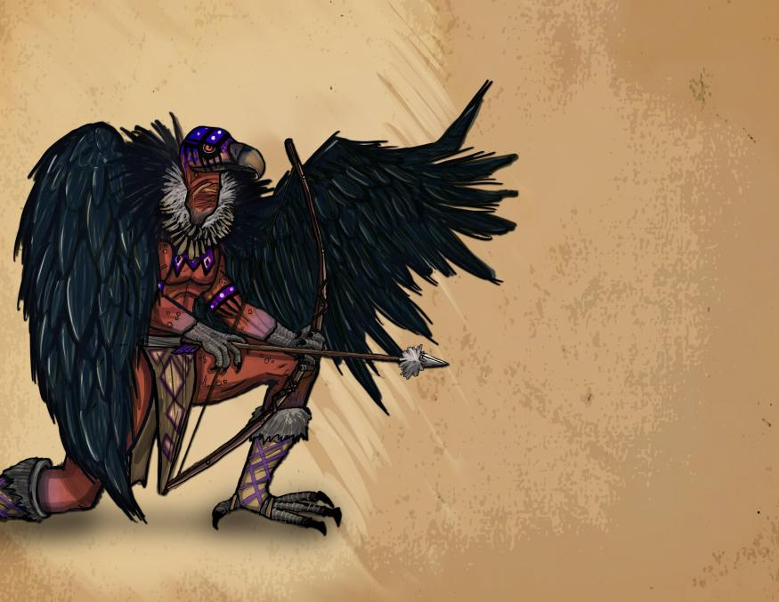

Named for the Aarakocra that they resemble, they do not actually share an ancestry however. They are the hidden nation who most inhabits this region of Arcania known to themselves as the Ghost Nation. They are charged by the warden Harbor Yaga to remove death from the land. Which they do by consuming any who die in a ritual meal.

Religion:

The Gods of Faerun have no authority within the bounds of Arcania. Divine magic will still work, but direct answers will come from one of the four wardens of magic.

The basic tenets of the wardens are described in what will someday become an amendment to the Arcanian Constitution: When the Constitution’s Framers wrote, that “no person shall be...deprived of life, liberty, or property, without due process of law,” they were acknowledging that sometimes a person can be deprived of these rights, even though they are part of what it means to be a person. Columbia represents the right to not be deprived of life. Cascadia represents the right not to be deprived of liberty. Oro represents the right not to be deprived of property. And Harbor Yaga is the due process of law.

The Wardens: Columbia, Cascadia, Oro and Harbor Yaga.

Columbia’s domain is the North East. Physically she is closest to the island of Roanoke. Her’s is the strongest connection to this module. She represents the right that people have to fight for their life despite overwhelming odds. She abhors those who horde power to themselves, especially the power to oppress others. Her symbol is the lady of justice. She appears blindfolded and holding scales.

Columbia is the Warden of Liberty, and therefore hates slavery in all forms. She prefers for people not to keep animals to be beasts of burden, and often provides places for wanderers to find provisions for themselves.

**Chapter 2**

**The Arrival, Week one**:

This section will detail character creation and give an introduction to players on how to play for their first week before the first voice session.

Major changes:

(The previous restrictions of clerics and paladins has been removed for this season).

(No long rests will be permitted until governor is picked, wall finished by sailors when they depart).

**Prologue RP. This is available during the week before play opens:**

A discord chat will be available one week before the official start of the game.

Boat NPCS: Capitan Amaya Greyskies, First Mate Baba O’Riley, The Cook Edith “Mac” McGinty

Crewmate Cricklin, Crewmate Stumpknuckle, and the three Goblins: Grumblebutt, Corkscrew, and Thesis.

Day 1. New players establish and describe themselves.

The wind smells of salt and the wind is brisk and constant against your face. The time to depart has come. Slaves and indentured servants are loading your supplies as you turn your tickets over to Captain Greyskies.Captain Amaya Greyskies is a very stern Sea Elf. She is dressed to the nines in formal captain garb including q jacket decorated with military medals, tall boots over crisply pleated pants and a tricorn hat. She has pale blue eyes and silver hair. She hides her left ear which has been cut in the manner of the slaves of chult.

Welcome aboard the ship the HMS Falmouth:

She is 120 feet long, bow to stern. The Falmouth is an average sized vessel and not very remarkable. Capable of carrying 300 tons of cargo, and manned by a capable and seasoned crew she ought to have been an idle choice for this voyage.The ship is old, but has been well maintained. Her home moorage is a small port city in Impiltur. She has been hired by the nation of Cormyr to ferry a group of citizens, indentured servants, and transported criminals to start a new life in the new world. It's been a long voyage, much longer than expected. At sea these past 3 months, food has begun to run scarce. Mutiny is beginning to brew amongst the crew.

Day 2. Captain Amaya Greyskies and her cook Edith “Mac” McGinty get into a conflict that begins to raise tensions.

After a long day of sailing, there's nothing the men like more than some food, some drink and song. The final bell has been rung for the day, and the crew is at their leisure time. Quite unexpectedly there is shouting coming from the Captain's Quarters. The doors to her office get thrown open from the inside. The First Mate, a sturdy firbolg named Baba O’Riley drags a crewmember (a halfling named Cricklin) out of the office and onto deck.

“For the crime of harboring stowaways, the Captain has ordered that ye be flogged. For the Crime of Lying about it, Ye be sentenced to losing your tongue so that filthy lies ne’er again pass thy lips” Bellows First Mate O’Riley. The First Mate throws Cricklin against the mast. He begins forcing Cricklin’s jaw open. Slowly, and with a face so stern it could have been carved of stone, Captain Greyskies descends the stairs to the main deck. She is holding tongs and a knife.

“This crewman has been found guilty of hiding 3 stowaways amongst our animal cargo. And he did not confess until magically compelled to do so.” Said Capitan Greyskies to no one in particular as the whole crew watched, unable to look away from the savage justice about to be enacted.

“Please miss. Please cap’n they are only a couple of Goblins. Its good luck to have some clever beasties aboard. They are good rat catcher. Every ship needs a good rat catcher.”

“Boy” Said the First Mate, still struggling to get the halfling’s mouth open. “When we’re done, your getting promoted to rat catcher. Then we won’t need no thieving goblins.”

“If he loses his tongue, he can’t eat. Where's the justice in starvin a man to death? Where's the gain in losing an able bodies Crewman.” From below decks, another authoritative female voice booms out. The ship's cook “Mac” ascends to the deck, a bag of onions in one hand and a cast iron skillet in the other.

“Insubordina…” O’Riley started when Cricklin bit down sharply on the Firbolg’s finger. “He’s drawing blood, stop it you halfwit halfling.”

With that, O’Riley finds himself getting pelted with a bag of onions.

The Captain’s wrath finally begins to boil over. She drops the tongs and stabs the knife into the railing of the stairs. From her belt she produces a vicious looking cat of nine tails.

“Cookie has a point. Perhaps we shouldn’t cut out his tongue.” She muses, looking down at Cricklin. “30 lashes rather than 10.”

O’Riley leans into Cricklin, turning his body around, and lashes him to the mast. The Capitan begins hitting the crewman, tearing his shirt open in the process. After the 6th strike, Cricklin falls to his knees, unable to support himself. After nine, he is openly weeping and begging for mercy. After the 10th strike, as the Captain raises her hand for the 11th, Mac places her hand on the Captain’s wrist.

“10 lashes is fair cap’n” Mac said softly.

Enraged, Greyskies turns her wrath on the cook.

“You’ll serve the rest of his sentence for interfering.”

And so, the ship watched on in horror as the Captain savagely beat the Cook in place of the already battered Halfling.

In the aftermath, long after the Captain has retired to her quarters, there are several small gatherings of pirate both above and below decks. The foul mood of the crew has kept most of the usual singing down, and none of the usual gambling seem to be going on. Instead, it seems to be a night to tell ghost stories, and a deep discussion of the meanings of various bad omens.

Day 3. The wreckage of a strange submersible ship is found while the Falmouth is passing over an underwater city, this is where any Native Arcanian, or non Faerun based players may board for the colony.

Day 4. Doldrums: The wind has slacked and in the heat aboard the ship tempers flare amongst the crew. Some fear cannibalism.

Unable to cook for his crew, the cook has taken to coaching the crewmates on how to fish. Some of the crewmembers have taken to trying to catch the birds that circle the boat. One, a Crewmate named Stumpknuckle even managed to land an albatross. With the dead albatross on board, the other sailors seem to have decided that this was a mistake and that they have offended the powers which provided wind to them before this. The Stumpknuckle is blamed, and forced to take over some of the cook’s duties until the cook is healed. Any attempt to spy on the two of them speaking will discover a mutiny fomenting.

Day 5. Still no sign of land: Despite a small breeze picking up, the sails remain mostly slack.

As an act of Goodwill, and as an attempt to placate an upset crew, the Captain has opened her person reserve of rum. With no way to do their Job, the crew spends the day playing pranks, attempting to outdo each other in acts of foolhardy athletics.

Late in the night, any search of the deck will reveal strange symbols that have been carved into the wood, and soon after storm clouds will begin to blow.

Day 6. Storm, A second ship (of grifters and pirates) crashes into the Falmouth after a failed fight with a dragon turtle. Anyone with a backstory that fits this scenario may choose to enter their character here. This ship will be seen again week three.

Day 7. Landfall, and ship repairs.

Arcanian Dream Stones

**Week one**

NPCs

Bartender Jenkins & his man servant (his secret Pact demon) Parchtongue:

Jenkins is a high level warlock. He was tricked into a very stringent pack with a clever and powerful demon of the abyss named Parchtongue (who resembles a tiefling). Jenkins is a polite and timid npc. He is reluctant to use magican but pours his ale well enough for most people not to notice his troubled history. Their outward relationship is one of master (Jenkins) and servant (Parchtongue) but Parchtongue’s true nature slips out occasionally with outbursts of lewd or violent behavior.

Parchtongue is a low level member of the Illuminati. The stipulations of their pact state that Jenkins can advance his own power and wealth, but cannot lend that power to the benefits of others. If and when Parchtongue caches Jenkins using magic to aid others, it will require that Jenkins use their power to aid Parchtongue in his quest to bridge the two world by using a dream stone to add his own power to any divine spell cast by a player. This rite would send his essence to devour whatever god was evoked by the player. Once this is accomplished in week 3 croatoan will arrive in full power to subjugate Parchtongue and use his new power to reform the wormwood treant and the mothmen.

Gormund is a good natured, hard working, and rather rotund, Aasimar. He works the stables and cares for his daughter Kee. Kee is a fun loving, inquisitive Aasimar child of about 8 years old who loves to tag along with the adventurers when possible. She is not allowed outside the fort walls, but that doesn’t stop her. She has a special connection to nature, the ability to speak with animals, and a particular sensitivity to the changes happening in the area. Gormund is happy to house mounts or animal companions at the stables for players, and may even have a few animals for trade should players need them.

Hiram: The tinker

Doctor- 3 changelings

Jackalopes:

Elder Jackalope Druid Oleander

The site of the jackalopes’ warren is directly beneath the area chosen for the colony of Roanoke. The arrival of Parchtongue has brought with him dark tidings and portents of great evil. The Jackalopes, confused by the dire signs fled their warren to an older location far to the northeast of the island. The lagowarren is their new home and makeshift fortress. Oleander, convinced of the threat all of the newcomers present has begun to invoke dark powers in his desperation to free his people. Taking instructions from the greatest power willing to respond to him, Oleander brings the attention of the Siberex Croatoan to the island.

He has planted a tree that contains his own soul much the way that a lich places their souls into a phylactery. The tree will grow into a wormwood treant by the end of week one.

The Chaplain. Chaplain Clancy is a quiet man of god. He is not a cleric or a paladin, but he does carry with him the weight of the Church of Cormyr, and is a secret 32nd degree Freemason. It is he who swears the mayor into service of the Crown in a peculiar ceremony that secretly invokes the rites of a freemason initiate. He also has a strong hand in helping design the town hall/ mayoral house, which to a trained eye resembles a Masonic Lodge. The act of voting for a good person to be the mayor represents the first 3 steps of masonic initiation, conferring the mayor that title without the mayor being aware that they have embraced a role in a secret society.

Jackalope Leader- Justitia

Leader of Lagowarren

Jackalope Quest giver

**Daily Encounters week 1**

Day 1 Setting up camp

To be posted day one:

Welcome to the Island of Roanoke. We are just off of the coast of mainland, a vast and untamed New World called Arcania. The Island is an egg shaped oval, 8X10 Miles in size running longer north to south than east to west. The camp itself is in a clearing along the southern shore.

To the south is a large bay, and across it, to the south, west and north is North Carolina, One of the colonies set up by the great nations of the Old World. The boat moored just off shore in the protected bay, and after spending 12 hours ferrying passengers and cargo to shore, the ship’s crew has set about provisioning itself for the return trip and making extensive repairs. Its estimated to be in the harbor for one more week. In the meantime, you are to set up your home and work stations as well as write a charter for the town (Including town laws, and declaring a mayor). Take some time to establish your business and explore the new camp that will soon be your village.

Strange lights can be seen on the eastern shore at what appears to be a Hangman’s tree. The tree holds several executed bodies kept in small cages so that their bodies do not touch the ground. Glyphs and paintings warn the colonists not to let the dead lay on the ground lest some evil be drawn to that place.

Day 2 Minor Exploration Building the wall.

Minor in village encounters table is in Appendix A, these are intended for 1-3 players.

For larger groups See Appendix D for ideas for larger encounters.

An injured winged owlbear cub wanders into the village, its mother’s dead body is found covered in pukwudgie quills.

\*\*Wendigo added by request, jackalope backstory improvised to include the wendigo and the lago(rabbit people)

Day 3 Jackalope encounter 1, campaigning for mayor

The fields near the town have become overrun with hundreds of mushrooms.

Several Jackalopes can be seen gathering them at the far edge of the field.

\*\*See Appendix D note 9.

The latrine falls into a sinkhole that reveals a chamber in an abandoned subterranean Jackalope warren that seems to be designed to offer their dead to the Urucokra. This is displayed in crude pictographs on the walls. (this point has alread seemed to be gotten across, skipping this event)

NPCs

Jackalope Mudfoot and Jackalope Glenglory have spotted the bounty of food next to the town are attempting to capitalize. If they befriend the Jackalopes, the Jackalopes offer an introduction to Justitia Ostar, the wisewoman of the Lagowarren. Additionally, the Jackalopes will ask many overly personal questions both about the players and the defences of the village.

\*\*day 3 replaced by Ian’s mario parody. NPC Justitia removed from intended cannon.\*\*

Day 4 Mothmen clues, major attack

The colonists awake to a loud and overly annoying shrieking sound. Upon investigation their garden being overrun by shriekers, violet fungus and mantraps. \*\*See bestiary for stat blocks.

While most of the NPCs will flee the village, one of the children (Liam, a secret mothman) will be playing in the garden as if nothing is wrong, despite having suffered injuries, he will not acknowledge them until he is addressed. If medical aid is given, the child will choose the person who helped him to start following on a regular basis.

While the colonists are dealing with their garden, several (1 per 3 players) Myconids burrow up from underground and begin looting the various businesses. \*\* See bestiary for stat blocks.

Day 5 Ballot writing, Hiram arrives (with Justitia Ostar conditional to day 3’s rp)

Appendix D encounters.

Justitia, warns the village of the a great evil that wanders the forest that warps and corrupts all it comes in contact with. If the villagers press for more, she refers them to the wardens of death (the Urucokra) and asks that the warren beneath Roanoke be memorialized with standing stones in the field to the east of the camp. If the villagers wish to trade or barter, the Jackalopes only accept Wampum as currency.

Day 6 Write town charter, appoint mayor, wall finished

Minor encounters and Appendix D encounters. A group of Tatankans encountered.

Hiram remains one more day.

Day 7 Voice Event, Lychwood tree attack.

Voice event:

Captain Amaya Greyskies, having completed her repairs, calls upon the village to send a delegation to present the Town Charter. After dinner, a large tree-like creature can be seen at the edge of the clearing. After loading the delegation into the boats to return to shore, mutiny breaks out aboard the Falmouth when she orders the sailors to help defend the colony.

The village is invaded by a Jackalope called the “Dark Druid Oleander” and his Lychwood tree. Once the tree is defeated, Oleander can be discovered to have been fused to the inside of the tree where the trunk is split. When approached, if the party attempts to talk to him, he will reveal that there is a siberex on the island warping everything it touches. If they attack, his body will be covered in illuminati markings. If he is killed, his body turns into a cloud of glowing spores that flies to his phylactery in the northwest corner of the island.

The party is rewarded with a dream stone. One of Five.

**Daily encounters week 2**

Day 1 The black line.

The colonists awake to the dead from the overthrown Falmouth washing ashore. There are Urucokra ceremonially preparing the dead to be eaten. The Urucokra explain that name of the evil one cannot be spoken, lest it be summoned. But that its power is only invoked if death remains on the ground for too long, which is why their criminals who are unworthy of being eaten remain hanging at the hangman’s tree.

When they return to the village, an ominous black circle has been drawn around the village.

Day 2 Exhaustion sets in.

The previous night’s dreams prevent anymore long rests be taken within the bounds of the village. More black lines have been found, putting the village at the center of some sort of arcane rune.

Day 3 Fleeing to the Pen.

Friendly Tatankans recognize that the “Roanoke Pen” is no longer fit to protect life and offer sanctuary at their home.

Day 4 Children in the woods

Day 5 Discovering the dark chapel. Hidden under the city. Possible clues to the Croatoan. Art that shows an evil god’s tongue getting cut off.Defeating one drops a dreamstone.

Day 6 The end of the Tatanken of Roanoke.

The Tatankans seemed to have encountered Croatoan, and are being turned into stone beasts that charge anything that approaches them.

Day 7 Voice Event, The mothmen. With the Mothmen dead the villagers can now rest.

Amongst the rewards is another dreamstone.

**Week 3:**

Day 1 Charlatan Tax Collectors. Angelique, levithan dungeon crawl.

Day 2 All animals are changed to monsters.

Day 3 Urukocra encounter. Physically cannot eat any more dead.

Day 4 Tax Collector attempts to flee. Dragon turtle drives him back to shore.

Day 5 Thanksgiving. Eat the dead. Urukocra gives the party a black dreamstone

Day 6. Finish the degrees of masonry to banish Croatoan. And dominion level play to let people get any advantage they can for the final fight.

Here are the monsters I suggest:

- **Abyssal Wretches (Mordenkainen’s Tome of Foes)**. Fluff-wise, these make the most sense. They have 18 hit points, so they’ll probably survive at least one or two turns. Just don’t clump them up, because all it takes is one good fireball to wipe them out.

- **Darkmantles (Monster Manual)**. These are another weird, Lovecraftian monster that wouldn’t be totally out of place in the sibriex’s lair. These can catch PC’s by surprise by standing still and looking like stalactites/stalagmites. Then, they can use their darkness aura to get advantage on the attacks and crush the characters. The sibriex has true sight so it can see through the darkness. Finally, darkmantles have 22 hit points, making them tougher than normal, and only cost 100 XP to add to an encounter.

- **Gazers (Volo’s Guide to Monsters)**. Continuing the Lovecraft theme, it makes sense to throw in some gazers into the sibriex’s lair. Their aggressive action gives them the ability to close distances quickly. Unfortunately, their hit points and AC are kinda shite, so make sure they stay out of range (30+ feet up in the air). They’re kinda dumb, so they’re going to just attack whatever is closest to them and not really be able to size up opponents. But if you’ve got a squad of players who aren’t familiar with these things all they’re going to say is “oh shit, baby beholders!” and try to knock them out first, using up their action economy.

- **Giant Octopi (Monster Manual)**. This is a weird one, sure, but it’s not tough to reskin some octopi as Lovecraftian horrors that live in the Abyss. Throw in some water hazards in the sibriex’s lair and hide them (they get advantage when doing Stealth underwater), which will give them a bonus on their attack rolls. It’s unlikely melee attackers who rush forward will have high enough Perception rolls to see them. Plus, they’ve got a ton of hit points, which really helps. Oh, and if that’s not enough, they also have freakin’ 15 foot reach on their tentacle attack which auto grapples.

- **Gibbering Mouthers (Monster Manual)**. A bit more expensive than I’d like them to be (CR 2), they still fit the setting, plus, they have tons of effects that require saving throws which all run on autopilot. Just be sure that they’re all spaced out at least 20 feet apart and not in a line (but still within 120 feet of the sibriex).

- **Star Spawn Grue (Mordenkainen’s Tome of Foes)**. Here’s another great monster to consider. They’re weird enough to make sense in the setting and have an aura that gives everything that isn’t an aberration disadvantage on attack rolls against non-grue creatures and *all* saving throws (ha, these things are so “game designer-y”). Again, space them out and have them stay put, just letting their auras do the work while the sibriex uses its magical attacks with advantage. Just make sure that the sibriex (who is a fiend), doesn’t get within their auras himself. Best part? They’re cheap AF at only 50 XP each. You might even consider doing something loopy like having the sibriex suspend them in cages all throughout its lair. Being in a cage and hard to reach (at most 20 feet in the air) means most characters will totally ignore them, plus at 20 feet up, *spirit guardians* can’t reach (neener neener).

Day 7 Croatoan Voice Event, Finale. Bait the croatoan into a trap at the center of the city. Power dreamstones to be activated on the points of the pentagram.

Two mode boss fight. Two hit point pools. Two turns until first form is defeated.

**Appendix A: Daily life.**

The daily life of the players and the player characters will differ. Ultimately this is meant to be a game that people can play as much or as little as they would like. Players are to assume that their characters are safe and going about the business of the village. The players themselves cannot participate in game while offline.

**Player Economy and Professions:**

Crafting Philosophy

This is a lengthy description of why we believe crafting should be done this way.

Crafting Goals:

- Fun

- Encourages interaction

- Encourages Role Play

- Plausible

- Worth doing

- Easy to understand

- Optional

- Tradable

- Not overshadowing to the rest of the game

- Can be done during down time with minimal DM supervision

With these goals in mind, I will try to describe the main points of this system.

First, is the basic unit of trade. Crafting points. I wanted to keep it very simple, so each player gets 7 points per week. The other important feature of 1 cp per long rest is that it keeps the numbers low. The human brain cannot reliably recognise groups of objects past 7. D&D players are probably a little better from rolling all those dice, but I still want to keep most totals under 7. So I would like to keep all dimensions under 7. The only place this is violated is the number of professions.

I know the idea is that times are tough, and you don’t have everything you need, but I think it’s necessary to have every crafting role covered, preferably by more than one player. If there is not a way to get something in the game, it might as well not exist. So either we need to give players two or even three professions right off the bat, or merge several into one. I like the former idea better. If there are only half a dozen professions, people might not feel very unique. In addition, I want to keep crafting professions simple, and if I merge them, it could be too complicated to understand. I think the proper amount of text should be about the same as a spell, or magic item, so I want to keep the profession descriptions about that length. The shorter the better.

On the flip side, if everyone has three professions, they might forget what they can do, but I think that they will be able to compartmentalize the professions and think about one at a time without too much trouble. As for starting out with one, and then gaining one every week, I fear that the first week people will not be able to craft what they want, and then ignore the whole crafting system for the rest of the game. It also seems to break the plausibility rule that people can suddenly learn to be an expert after only one week. I know levels and spell work the same way, but that bothers me too.

CP should be tradable. The way I imagine it, is that if you trade, what you are really doing is helping with a task. For example, if I trade my labor to a lumberjack, what I’m doing is going out to the forest with him and helping cut down trees. Maybe there’s a better way to explain it that captures the essence of that. But it’s effectively a trade, because the lumberjack gets extra logs, and I get some extra money or something.

No one should have to participate, but I think people that don’t care about crafting can gift their cp to a friend. It’s like helping your friend till a garden.

Having all the abilities listed out is important because then players can do crafting on their own without DM approval. It is still of course on the honor system. Someone could easily lie about what crafting they have done, but that’s true for any part of the game so I’m not worried.

Touching back on three professions. I think each day different jobs will be in demand. The first week I imagine logging and carpentry will be needed most so that everyone can construct their buildings. After that, logging might not be needed much, but maybe alchemists will be in high demand. Trading cp with them can still keep the points valuable, but a lumberjack may lose interest if all they can do is trade them. That’s why if the lumberjack is also a blacksmith, he can continue to create goods if that’s really what he wants to do. There is the concern of one person being prospector and smelter and blacksmith so they can control the whole line of production. I think this is not really a problem because they will have to still get cp from others to do all that, which is essentially the same as having other people do it. On the contrary, I think if one person gets so into the system that they are scheming to monopolise the whole chain, then they will be using it and getting others to use it.

Roanoke is a town of freewheeling and savvy business people. From legitimate merchants, to tradesmen, to snake oil salesmen, the new world attracts all types. When you arrive on the shores of your new home, the only thing it takes to start your own business is an inventory of goods and place to work.

Trade and barter is encouraged. There are no shops to speak of, so most of what you need to survive will have to come from fellow players. The first thing you need is a place to do business. This will depend on your profession. Be aware, it may take some work and resources to build. Once built, you could open it to the public and let anyone use it, or you could keep it only for yourself, or you may even arrange for other people to work for you in your building. Remember, each player gets only one crafting point per day.

**Public use buildings**:

Lumber Mill:

(The owner has opened up the lumber mill for public use)

Welcome to the lumber mill. You may spend one crafting point to turn one log into one lumber. Please describe what you have done here, and then add the following statement to the end of your post, editing the numbers appropriately.

*The lumber mill now contains 4 logs and 7 lumber.*

Kitchen:

(This kitchen is part of the public house, and open to everyone)

Welcome to the Kitchen. Anyone may spend one crafting point to turn one fruit, vegetable, or meat into one meal. If you possess the cooking skill, you may craft better meals according to a recipe sanctioned by a DM. You must have all components of the recipe on hand. Please describe what you have done her in your post below. Included items consumed and meals cooked.

Forest:

(The forest is open to all)

Welcome to the forest. If you possess the Logging skill you may spend one crafting point to collect one log from the forest and place it into the lumber mill, community shed, or track it in your personal inventory. Please describe what you have done here and then update the appropriate building’s inventory.

Community Shed:

Welcome to the community shed. All the goods here are free for the taking. Please be respectful and don’t take more than you need. You can drop off goods here at any time. Just post your donation below. From time to time, one of the staff (DM) will organize the shed and then your donated materials will be available for anyone to take. You may take anything listed in the shed inventory. Please check the recent chat below to make sure someone else has not already taken the item.

Crafting:

Buildings

Most crafting requires specialised buildings to work in. Each crafter’s particular building must first be constructed before any crafting can begin.

**Private use buildings:**

<u>Buildings and Ownership</u>

Anyone can construct a building. Most buildings take resources. Lumber is a commonly needed resource. The list of resources needed can be found in the building description. After all the requirements have been met, the building is complete, and you may begin using it for crafting.

You may own your building outright, or you may own it in partnership with another player. You may set whatever usage rules you want for your building. You can charge people, or make it open to everyone. You have full control over the use of your building. However, there is nothing stopping another player from constructing another building of the same type in camp, so long as they have the resources.

**Professions:**

Alchemist - Turns herbs into healing/ restorative potions

Beggar/ grifter- Gains extra gold instead of cp

Blacksmith - Can use the forge to create weapons, tools, and armor

Brewer - Converts food into non-health potions

Carpenter - Makes and buildings from lumber

Cobbler - The art of making shoes

Cook - Turns plants and meat into food

Enchanter -Applies charged spell stones to items to convert them into wondrous items

Entertainer - Converts crafting points into direct limited buffs similar to the “enhance ability” spell

Gardener - Magically grows fruit and vegetables from a cultivated patch of soil

Guard - A guard keeps the colonists safe from outside threats while on duty

Herbalist - Collects herbs from the wild

Hunter - Brings in meat and hides

Lumberjack - Collects logs from the forest

Mayor - Draws 30 gold/day per resident so long as tax collector is living. Draws 14 cp/week.

Naturalist - Converts 100 gold into 1 cp once per day.

Prospector - Discovers useful metals

Tanner - Turns hides into leather

Tax collector - Draws 10 gp per day per resident add +10 to intimidate or persuade

**Professions Detail**

**Alchemist**

An alchemist contributes by providing healing and restorative potions to the colonists at the Arcane Lab

*1 cp + 1 herb = 1 potion of healing (2d4+2)*

*1 cp + 2 herb = 1 potion of greater healing (4d4+4)*

*1 cp + 3 herb = 1 potion of superior healing (8d4+8)*

Building - Arcane Lab

Requirements to build - 1 cp, 1 lumber, 300 gold

**Armorer**

An armorer contributes by crafting armor from leather and metal at the forge.

*1 cp + 1 leather = leather armor*

*1 cp + 1 metal + 1 leather = studded leather armor*

*2 cp + 2 metal = half plate armor*

*2 cp + 3 metal + 1 leather = full plate armor*

Building - Forge (See Blacksmith for Forge construction details)

**Beggar**

A beggar is a useless person to have in a colony, but alas, they crop up everywhere. Don’t ask them where they get their money, you don’t want to know.

*1 cp = 50 gp*

Building - Hovel

Requirements for Hovel - None

**Blacksmith**

A blacksmith contributes by crafting items from metal at the forge.

Recipes:

*1 cp + 1 metal = 1 marshall weapon (ex. Greataxe or Longsword)*

*1 cp + 1 weapon + 1 spellstone + 100 gold = makes the weapon magical with +1 attack*

*2 cp + 1 weapon + 2 spellstones + 200 gold = makes the weapon magical with +2 attack*

*3 cp + 1 weapon + 3 spellstones + 300 gold = makes the weapon magical with +3 attack*

Building - Forge

Requirements to build - 3 cp, 2 metal, 2 stone, 1 lumber

**Bowyer\***

A bowyer makes bows and arrows. Feathers come from the hides of birds, and the glue and sinew from the hides of game animals.

*1 cp + 1 hide = 1 bundle of 10 arrows*

*1 cp + 1 hide + 1 lumber = mundane shortbow, longbow, or crossbow*

*1 cp + 1 bow + 1 spellstone + 100 gold = makes the bow magical with +1 attack*

*2 cp + 1 bow + 2 spellstones + 200 gold = makes the bow magical with +2 attack*

*3 cp + 1 bow + 3 spellstones + 300 gold = makes the bow magical with +3 attack*

Building - Archery Range

Requirements for Archery Range - 1 cp, 1 lumber, 1 stone

**Brewer**

A brewer can make interesting drinks from all sorts of food items.

*1 cp + 1 vegetable = 1 ale (ale provides a +2 bonus to charisma and strength but a -2 penalty to wisdom, intelligence, and dexterity for one hour. Effects are cumulative. For example, if you drink 3 ales, your Cha and Str increase by 6, for one hour, but your wis, int, and dex decrease by 6. If any of these drop to zero, you become unconscious for the duration.)*

Building - Brewery

Requirements for Brewery - 1cp, 2 lumber

**Carpenter**

A carpenter can process logs into lumber at a faster rate at the lumber camp and can also create furniture at the woodshop.

*1 cp + 2 logs = 2 lumber*

*1 cp + 1 lumber = 1 furniture. Furniture can be added to any building. Anyone crafting in a furnished building may roll 1d20. On a 16-20 no CP are used to make the item. Other materials are used as normal.*

Building - Lumber Mill (see Lumberjack), or Woodshop

Requirements for Woodshop - 1 cp, 5 lumber

**Cartographer**

A cartographer maps out the area, and records the information for others to use.

*1 cp + 1 leather = Map (A new portion of the local area map is revealed by the DM)*

Building - Town Hall (See Mayor)

**Cobbler/Glover**

A cobbler makes shoes and gloves for the colonists at the cobbler shop. A cobbler can make stylish gloves and shoes.

*1 cp + 1 leather = 1 pair of quality shoes (increases movement speed by 5ft, max 30ft)*

*1 cp + 1 leather + 1 spell stone = one set of wondrous shoes, boots, or gloves as detailed in the dmg.*

Building - Cobbler Shop

Requirements for Cobbler Shop - 1 cp, 1 lumber

**Cook**

A cook contributes by making delicious meals for the colonists at the Kitchen

*1 cp + 1 meat = 1 hearty meal (Gives benefits of a short rest once per day)*

*1 cp + 1 vegetable = 1 healthy meal (Restores 1 hit die of HP, only works if player is conscious)*

*3 cp + 2 vegetable + 2 meat + 3 ale = Feast (Gives group of up to 12 people advantage on all rolls for the next 8 hours)*

Building - Kitchen

Requirements to build - 2 cp, 3 stone, 1 lumber

**Enchanter**

An enchanter has the ability to turn mundane items into wondrous items at the Arcane Lab.

*1 cp + 1 mundane item + 1 spellstone + DM approval = 1 common wondrous item*

*2 cp + 1 mundane item + 2 spellstones + DM approval = 1 uncommon wondrous item*

*3 cp + 1 mundane item + 3 spellstones + DM approval = 1 rare wondrous item*

Building - Arcane Lab (See Alchemist)

**Entertainer**

An entertainer holds the attention of the colonists to make them forget about their dreary existence at the amphitheater

*1 cp = quick performance (recite a poem or play a song to give everyone listening advantage on wisdom and charisma saves for the next hour)*

*2 cp = full performance (Put on a play or concert to give everyone immunity to fear for the next hour in addition to advantage on wisdom and charisma skill checks and saves)*

Building - Amphitheater

Requirements for Amphitheater - 1 cp, 2 stone

**Gardener**

A gardener can magically grow vegetables from the ground seemingly overnight.

*1 cp = 1 vegetable*

Building - Greenhouse

Requirements to build - 5 cp

**Guard**

A guard keeps the colonists safe from outside threats while on duty

1 cp = Enforce The LAW! - Make an opposed Str Check. If successful, put another player or NPC in the stocks for 15 minutes (real time). Other players may now throw rotten food at them. Cannot be used during combat, but can be used to prevent combat

*1 cp = On Duty for 24 hours (While on duty: +20 to initiative rolls)*

Building - Guard Shack needed to receive benefits

Requirements for Guard Shack - 1 cp, 4 logs

**Herbalist**

An herbalist gathers rare herbs from the forest.

*1 cp = 1 herb*

Building - No building required

**Hunter**

A hunter contributes by bringing meat and hides from the forest

*1 cp = 1 meat + 1 hide*

Building - Hunter’s Cabin

Requirements to build - 1 cp, 1 log

**Lumberjack**

A lumberjack contributes by bringing in logs from the forest. These logs must be processed at a lumber mill.

*1 cp = 1 log*

*1 cp + 1 log = 1 lumber*

Building - Lumber Mill:

Requirements to build - 2 cp, 1 axe

**Mayor**

The mayor speaks for the people. Gain 14 CP at the start of each week. Gain 30 gold per resident per day (as long as the Tax Collector is alive). This is community gold so use it however you see fit. The Mayor may give guards orders. Abilities take effect when Town Hall house is built.

Building - Town Hall

Requirements for Town Hall - 5cp, 4 lumber, 3 metal, 3 stone

**Naturalist**

A naturalist contributes to the colony by investigating new innovations for the community.

*100 gp = 1 cp (once per day)*

*1 cp = new DM approved recipe (This represents innovation and experimentation. There is no guarantee that these recipes will be useful)*

Building - No building required

**Prospector**

A prospector can track down sources of metal better than anyone. Anyone can bumble around looking for quality metal or stone, but a prospector finds it every time.

1 cp = metal

1 cp = stone

Building: Sluice

Requirements: 2 cp, 2 lumber

**Tanner**

A tanner turns hides into leather. A tanner may also be able to extract unique hides from rare animals or monsters per DM discretion.

*1 cp + 1 hide = 1 leather*

*1 cp + 1 slain monster = 1 unique hide possibly with enhanced properties*

Building - Tanning hut

Requirements to build - 1 cp, 1 lumber

**Tax Collector**

Only appointed by the Mayor. The tax collector is able to extract gold from the colonists for the greater good, and only skims a small percentage. Gain 10 gold per resident per day. Add +10 to intimidate rolls. Takes effect when Town Hall is built.

Building - Town Hall (See Mayor)

**Minor Village encounter table:**

(Non combat only)

**Minor Exterior Encounter table:**

(Combat)

(Non Combat)

**Appendix B: NPCs**

HMS Falmouth:

Captain Amaya Greyskies

First Mate Baba O’Riley

The Cook Edith “Mac” McGinty

Crewmate Cricklin

Crewmate Stumpknuckle

Grumblebutt

Corkscrew

Thesis.

Roanoke

Bartender Jenkins & his man servant (his secret Pact demon) Parchtongue:

Jenkins is a high level warlock. He was tricked into a very stringent pack with a clever and powerful demon of the abyss named Parchtongue (who resembles a tiefling). Jenkins is a polite and timid npc. He is reluctant to use magican but pours his ale well enough for most people not to notice his troubled history. Their outward relationship is one of master (Jenkins) and servant (Parchtongue) but Parchtongue’s true nature slips out occasionally with outbursts of lewd or violent behavior.

Parchtongue is a low level member of the Illuminati. The stipulations of their pact state that Jenkins can advance his own power and wealth, but cannot lend that power to the benefits of others. If and when Parchtongue caches Jenkins using magic to aid others, it will require that Jenkins use their power to aid Parchtongue in his quest to bridge the two world by using a dream stone to add his own power to any divine spell cast by a player. This rite would send his essence to devour whatever god was evoked by the player. Once this is accomplished in week 3 croatoan will arrive in full power to subjugate Parchtongue and use his new power to reform the wormwood treant and the mothmen.

Gormund is a good natured, hard working, and rather rotund, Aasimar. He works the stables and cares for his daughter Kee. Kee is a fun loving, inquisitive Aasimar child of about 8 years old who loves to tag along with the adventurers when possible. She is not allowed outside the fort walls, but that doesn’t stop her. She has a special connection to nature, the ability to speak with animals, and a particular sensitivity to the changes happening in the area. Gormund is happy to house mounts or animal companions at the stables for players, and may even have a few animals for trade should players need them.

Hiram: The tinker

Doctor- 3 changelings

Jackalopes:

Jackalope Mudfoot (Rouge)

Jackalope Glenglory (Ranger)

Elder Jackalope Druid Oleander

The site of the jackalopes’ warren is directly beneath the area chosen for the colony of Roanoke. The arrival of Parchtongue has brought with him dark tidings and portents of great evil. The Jackalopes, confused by the dire signs fled their warren to an older location far to the northeast of the island. The lagowarren is their new home and makeshift fortress. Oleander, convinced of the threat all of the newcomers present has begun to invoke dark powers in his desperation to free his people. Taking instructions from the greatest power willing to respond to him, Oleander brings the attention of the Siberex Croatoan to the island.

Rickbain - Town cryer and dm tool for reminders and exposition.

The Mothmen:

Liam a secret mothman child.

**Appendix C: Bestiary**

**Banderhobb**

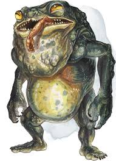

Large monstrosity, neutral evil

Armor class: 15 (natural armor)

Hit Points: 84 (8d10+40)

Speed 30ft

STR 20 (+5)

DEX 12 (+1)

CON 20 (+5)

INT 11 (+0)

WIS 14 (+2)

CHA 8 (-1)

Skills: Athletics +8, Stealth +7

Condition Immunities: Charmed, Frightened

Senses: Darkvision 120ft, Passive Perception 12

Languages: Understands common and the language of it's creator but cannot speak

CR: 5

Resonant Connection: if the banderhobb has even a tiny piece of a creature or object in its possession, such as a lock of hair or splinter of wood, it knows the most direct route to that creature or object within 1 mile of the banderhobb

Shadow Stealth: while in dim light or darkness, the banderhobb can take the hide action as a bonus action

Actions:

Bite: Melee weapon attack +8 to hit, reach 5ft, one target. Hit: 22(5d6+5) piercing damage and the target is grappled (DC 15 escape) if it is a large or smaller creature. Until this grapple ends, the target is restrained, and the banderhobb can't use it's bite attack or tongue attack on another target.

Tongue: Melee weapon attack +8 to hit, reach 15ft, one creature. Hit: 10(3d6) necrotic damage and the target must make a DC 15 STR saving throw. On a failed save, the target is pulled to a space within 5ft of the banderhobb, which can use a bonus action to make a bite attack against the target

Swallow: the banderhobb makes a bite attack against a medium or smaller creature it is grappling. If the attack hits, the creature is swallowed and the grapple ends. The swallowed creature is blinded and restrained, it has total cover against attacks and other effects outside the banderhobb, and takes 10(3d6) necrotic damage at the start of each of the banderhobb’s turns. A creature reduced to 0HP in this way stops taking the necrotic damage and becomes stable.

The banderhobb can only have one creature swallowed at a time. While the banderhobb isn’t incapacitated, it can regurgitate the creature at any time (no action required) in a space within 5ft of it. The creature exits prone. If the banderhobb dies, it likewise regurgitates a swallowed creature.

Shadow Step: the Banderhobb magically teleports up to 30ft to an unoccupied space of dim light or darkness that it can see. Before teleporting, it can make a bite or tongue attack.

**Deathcap Myconid**

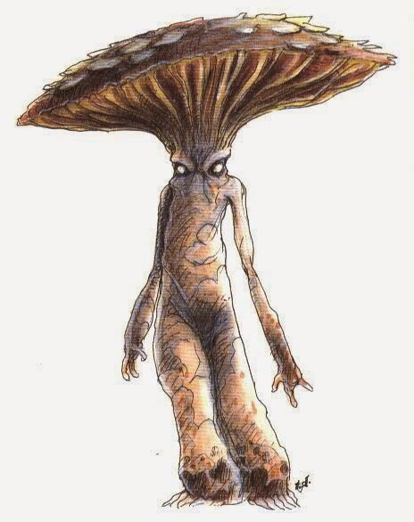

Medium plant, neutral evil

Armor Class 15 (natural armor)

Hit Points 90 (12d8 + 36)

Speed 20 ft.

STR 12 (+1)

DEX 10 (+0)

CON 16 (+3)

INT 10 (+0)

WIS 11 (+0)

CHA 9 (-1)

Senses darkvision 60 ft., passive Perception 10

Distress Spores. When a deathcap myconid takes damage, all other myconids within 240 feet of it sense its pain.

Sun Sickness. While in sunlight, the myconid has disadvantage on ability checks, attack rolls, and saving throws. The myconid dies if it spends more than 1 hour in direct sunlight.

Multiattack. The myconid uses either its Death Cap Spores or its Slumber Spores, then makes a fist attack.

Fist. Melee Weapon Attack: +3 to hit, reach 5 ft., one target. Hit: 11 (4d4 + 1) bludgeoning damage plus 10 (4d4) poison damage.

Death Cap Spores (3/day). The myconid ejects spores at one creature it can see within 5 feet of it. The target must succeed on a DC 13 Constitution saving throw or be Poisoned for 3 rounds. While poisoned this way, the target also takes 10 (4d4) poison damage at the start of each of its turns. The target repeats the saving throw at the end of each of its turns, ending the effect on itself on a success.

Slumber Spores (3/day). The myconid ejects spores at one creature it can see within 5 feet of it. The target must succeed on a DC 13 Constitution saving throw or be Poisoned and Unconscious for 1 minute. A creature wakes up if it takes damage, or if another creature uses its action to shake it awake.

**Flail Snail**

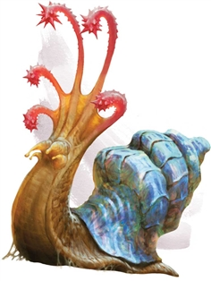

Large elemental, unaligned

Armor Class 16 (Natural Armor)

Hit Points 52 (5d10 + 25)

Speed 10 ft.

STR 17 (+3)

DEX 5 (-3)

CON 20 (+5)

INT 3 (-4)

WIS 10 (+0)

CHA 5 (-3)

Damage Immunities Fire, Poison

Condition Immunities Poisoned

Senses Darkvision 60 ft., Tremorsense 60 ft., Passive Perception 10

Languages --

Challenge 3 (700 XP)

Antimagic Shell. The snail has advantage on saving throws against spells, and any creature making a spell attack against the snail has disadvantage on the attack roll. If the snail succeeds on its saving throw against a spell or a spell attack misses it, an additional effect might occur, as determined by rolling a d6:

1–2. If the spell affects an area or has multiple targets, it fails and has no effect. If the spell targets only the snail, it has no effect on the snail and is reflected back at the caster, using the spell slot level, spell save DC, attack bonus, and spellcasting ability of the caster.

3–4. No additional effect.

5–6. The snail’s shell converts some of the spell’s energy into a burst of destructive force. Each creature within 30 feet of the snail must make a DC 15 Constitution saving throw, taking 1d6 force damage per level of the spell on a failed save, or half as much damage on a successful one.

Flail Tentacles. The flail snail has five flail tentacles. Whenever the snail takes 10 damage or more on a single turn, one of its tentacles dies. If even one tentacle remains, the snail regrows all dead ones within 1d4 days. If all its tentacles die, the snail retracts into its shell, gaining total cover, and it begins wailing, a sound that can be heard for 600 feet, stopping only when it dies 5d6 minutes later. Healing magic that restores limbs, such as the regenerate spell, can halt this dying process.

Actions

Multiattack. The flail snail makes as many Flail Tentacle attacks as it has flail tentacles, all against the same target.

Flail Tentacle. Melee Weapon Attack: +5 to hit, reach 10 ft., one target. Hit: 6 (1d6 + 3) bludgeoning damage.

Scintillating Shell (Recharges after a Short or Long Rest). The snail’s shell emits dazzling, colored light until the end of the snail’s next turn. During this time, the shell sheds bright light in a 30-foot radius and dim light for an additional 30 feet, and creatures that can see the snail have disadvantage on attack rolls against it. In addition, any creature within the bright light and able to see the snail when this power is activated must succeed on a DC 15 Wisdom saving throw or be stunned until the light ends.

Shell Defense. The flail snail withdraws into its shell, gaining a +4 bonus to AC until it emerges. It can emerge from its shell as a bonus action on its turn.

**Froghemoth**

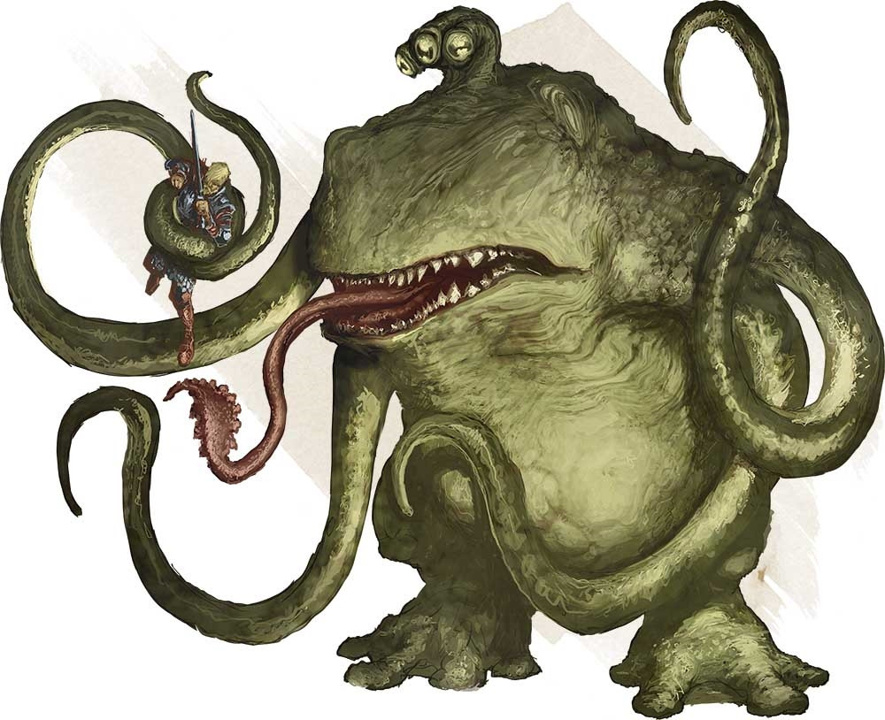

Huge monstrosity, unaligned

Armor Class 14 (natural armor)

Hit Points 184 (16d12 + 80)

Speed 30 ft., swim 30 ft.

STR 23 (+6)

DEX 13 (+1)

CON 20 (+5)

INT 2 (-4)

WIS 12 (+1)

CHA 5 (-3)

Saving Throws Con +9, Wis +5

Skills Perception +9, Stealth +5

Damage Resistances fire, lightning

Senses darkvision 60 ft., passive Perception 19

Languages - None

Challenge 10 (5900 XP)

Amphibious: The froghemoth can breathe air and water.

Shock Susceptibility: If the froghemoth takes lightning damage, it suffers several effcts until the end of its next turn: its speed is halved, it takes a -2 penality to AC and Dexterity saving throws, it can't use reactions or Multiattack, and on its turn, it can use either an action or a bonus action, not both.

ACTIONS

Multiattack. The froghemoth makes two attacks with its tentacles. It can also use its tongue or bite.

Tentacle. Melee Weapon Attack: +10 to hit, reach 20 ft., one target. Hit: 19 (3d8 + 6) bludgeoning damage, and the target is grappled (escape DC 16) if it is a Huge or smaller creature. Until the grapple ends, the froghemoth can't use this tentacle on another target. The froghemoth has four tentacles.

Bite. Melee Weapon Attack: +10 to hit, reach 5 ft., one target. Hit: 22 (3d10 + 6) piercing damage, and the target is swallowed if it is a Medium or smaller creature. A swallowed creature is blinded and restrained, has total cover against attacks and other effects outside the froghemoth, and takes 10 (3d6) acid damage at the start of each of the froghemoth's turns. The froghemoth's gullet can hold up to two creatures at a time. If the froghemoth takes 20 damage or more on a single turn from a creature inside it, the froghemoth must succeed on a DC 20 Constitution saving throw at the end of that turn or regurgitate all swallowed creatures, each of which falls prone in a space within 10 feet of the froghemoth. If the froghemoth dies, a swallowed creature is no longer restrained by it and can escape from the corpse using 10 feet of movement, exiting prone.

Tongue. The froghemoth targets one Medium or smaller creature that it can see within 20 feet of it. The target must make a DC 18 Strength saving throw. On a failed save, the target is pulled into an unoccupied space within 5 feet of the froghemoth, and the froghemoth can make a bite attack against it as a bonus action.

**Kelpie**

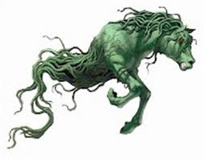

Large fey, chaotic evil

Armor Class 13 Natural Armour

Hit Points 24 (4d10 + 1)

Speed 60 ft., swim 60 ft.

STR 14 (+2)

DEX 13 (+1)

CON 13 (+1)

INT 10 (+0)

WIS 16 (+3)

CHA 9 (-1)

Damage Resistances Bludgeoning, Piercing, and Slashing from Nonmagical Attacks

Condition Immunities Grappled, Restrained

Senses Darkvision 30ft, Passive Perception 11

Languages Sylvan --

Challenge 4 (1,100 XP)

Sticky Skin. Any melee attack or contact with the creature will cause the attacker to make a strength saving throw (DC12) or else become grappled.

Shapeshifter. When on land the Kelpie can take the form of a beautiful white horse, it uses this form to convince lone humanoids to hop on its back where it then uses its sticky skin and drags the humanoids to the water to drown and eat them.

Actions

Hooves. Melee Weapon Attack: +4 to hit, reach 5 ft., one target. Hit: 14 (4d6 + 2) bludgeoning damage.

Beguiling Fey. As an action the Kelpie can charm a creature within 30ft of itself as if casting charm person.

**Lychwood Tree**

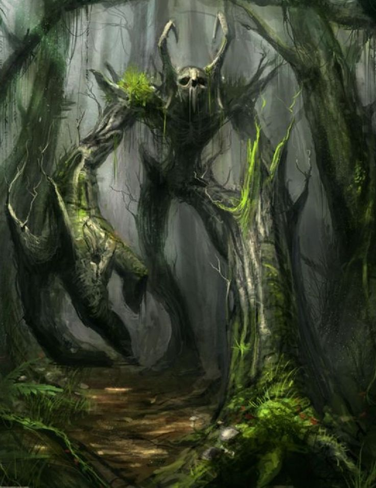

Huge undead plant, chaotic evil

Armor Class 17 (Natural Armor)

Hit Points 225

Speed 25 ft.

STR 23 (+6)

DEX 8 (-1)

CON 21 (+5)

INT 12 (+1)

WIS 16 (+3)

CHA 12 (+1)

Vulnerabilities Fire

Damage Resistance: all non magical attacks

Damage Immunity: Necrotic

Condition Immunities: charmed, exhaustion, frightened, paralyzed, poisoned

Passive perception 17

Languages Druidic, Woodland Arcanian, Sylvan

False Appearance. While the Lychwood Tree remains motionless, it is indistinguishable from a lightning struck dead tree.

Siege Monster. The Lychwood Tree deals double damage to objects and structures.

Actions

Multiattack. The Lychwood makes two slam attacks.

Slam. Melee Weapon Attack: +10 to hit, reach 5 ft., one target. Hit: (2d10 + 6) bludgeoning damage.

Fearful Spores (Recharge 5-6)

The Lychwood tree split trunk erupts with green glowing motes of dust. Each creature of the Lychwood tree’s choice that is within 120 feet of the Lychwood tree and aware of it must succeed on a DC17 Wisdom saving throw or become frightened for 1 minute. A creature can repeat the saving throw at the end of each of its turns, ending the effect on itself on a success. If a creature's saving throw is successful or the effect ends for it, the creature is immune to the Lychwood Tree’s Frightful Presence

Languid Spores (Recharge 5-6)

The Lychwood Tree’s split trunk erupts with blue glowing motes of dust. It’s branches begin fanning the dust in a 60-foot cone. Each creature in that area must succeed on a DC 17 Constitution saving throw. On a failed save, the creature can't use reactions, its speed is halved, and it can't make more than one Attack on its turn. In addition, the creature can use either an action or a Bonus Action on its turn, but not both. These Effects last for 1 minute. The creature can repeat the saving throw at the end of each of its turns, ending the effect on itself with a successful save.

Rending Roots (Recharge 5-6)

Melee Weapon Attack: +10 to hit, reach 5 ft., one target. Hit: 8 (2d6 + 1) bludgeoning damage, and if the target is a creature wearing armor, carrying a shield, or in possession of a magic item that improves its AC, it must make a DC 11 Dexterity saving throw. On a failed save, one such item worn or carried by the creature (the target’s choice) is covered in Lychwood sap, taking a permanent and cumulative −1 penalty to the AC it offers, and the Lychwood tree gains a +1 bonus to AC. Armor reduced to an AC of 10 or a shield or magic item that drops to a 0 AC increase is destroyed.

Legendary Resistance (3/Day)

If the Lychwood fails a saving throw, it can choose to succeed instead.

**Mantrap**

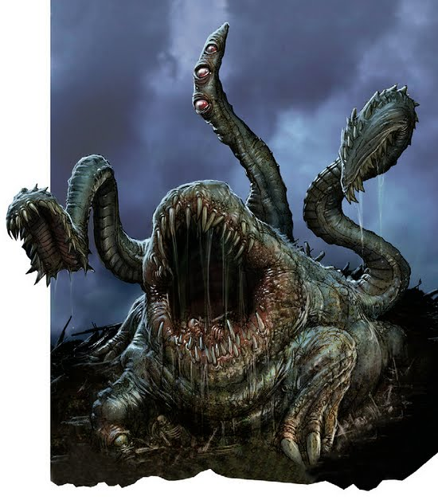

Medium plant, unaligned

Armor Class 12 Natural

Hit Points 24 (3d12)

Speed 0

STR 3 (-4)

DEX 8 (-1)

CON 11 (+0)

INT 10 (+0)

WIS 10 (+0)

CHA 6 (-2)

Damage Vulnerabilities Bludgeoning, Fire

Damage Immunities Poison

Condition Immunities Deafened, Grappled, Poisoned

Senses Unknown, Passive Perception 10

Languages Deep Speech Can not speak Doesn't understand or speak any language.

Challenge 2 (450 XP)

False Appearance. While the Mantrap remains motionless, it is indistinguishable from a normal plant.

Tendril. Melee Weapon Attack: +1 to hit, reach 10 ft., one target. Hit: 1 (1d4 − 1) slashing damage.

Bite. Melee Weapon Attack: +1 to hit, reach 5 ft., one target. Hit: 1 (1d6 + 2) piercing damage.

**Mothman, Adult**

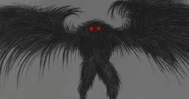

Mothman is described as a winged avian doppelganger with owl-like traits. Despite the similarities, he is in no way related to the doppleganger. His coloration varies from Black, gray, to even brown or white, although its is usually the darker shades. He is often reported to be about 7 feet tall, with a wingspan of about 10 to 15 feet or more. He is described by the few who have seen him as not having a head, with the two huge red eyes set in the chest. These eyes are reported to be glowing, or at least reflective. The details of his face and his feet have never been adequately described. One witness who saw the face clearly, could only say that the details were horrible and monstrous. She had terrible nightmares and nearly suffered a nervous breakdown..

Anyone who gets a close look at the Mothman seems to suffer from extreme fear and psychological distress, sometimes lasting for months or years afterwards. In particular, people say that a sense of pure evil overcomes them when they see Mothman's eyes.

STR 11 (+0)

DEX 18 (+4)

CON 14 (+2)

INT 11 (+0)

WIS 12 (+1)

CHA 14 (+2)

Armor Class 17

Hit Points 90

Speed 30 ft

Flying Speed 60

Senses: Mothman knows where you are, to him there is no difference between light or darkness. Magical darkness does not blind him, nor does it stop his glowing eyes from being seen. Passive Perception 18

Shapechanger: The Mothman can use its action to Polymorph into a Small or Medium humanoid it has seen, or back into its true form. Its Statistics, other than its size, are the same in each form. Any Equipment it is wearing or carrying isn't transformed. It reverts to its true form if it dies.

Read Thoughts: The doppelganger magically reads the surface thoughts of one creature within 60 ft. of it. The effect can penetrate barriers, but 3 ft. of wood or dirt, 2 ft. of stone, 2 inches of metal, or a thin sheet of lead blocks it. While the target is in range, the doppelganger can continue reading its thoughts, as long as the doppelganger's Concentration isn't broken (as if concentrating on a spell). While reading the target's mind, the doppelganger has advantage on Wisdom (Insight) and Charisma (Deception, Intimidation, and Persuasion) checks against the target.

innate spellcasting ability is Intelligence (spell save DC 15). It can innately cast the following spells, requiring no components mislead, phantasmal force.

Spell like ability: Altered Feeblemind (Recharge 5-6)

The Mothman blasts the mind of a creature that it can see within range, attempting to shatter its intellect and personality. The target takes 3d6+2 psychic damage and must make an Intelligence saving throw DC 19

Feathered Tentacles. Melee Weapon Attack: +5to hit, reach 10 ft., one creature. Hit: 15 (2d10 + 4) psychic damage. If the target is Medium or smaller, it is grappled (escape DC 15) and must succeed on a DC 15 Intelligence saving throw or be stunned until this grapple ends.

Skills Deception +6, Insight +3

On a failed save, the creature’s Intelligence and Charisma scores become 1. The creature can’t cast spells, activate magic items, understand language, or communicate in any intelligible way. The creature can, however, identify its friends, follow them, and even protect them.

At the end of every 15 minutes, the creature can repeat its saving throw against this spell. If it succeeds on its saving throw, the spell ends.

The spell can also be ended by greater restoration, heal, or wish.

**Mothman, young.**

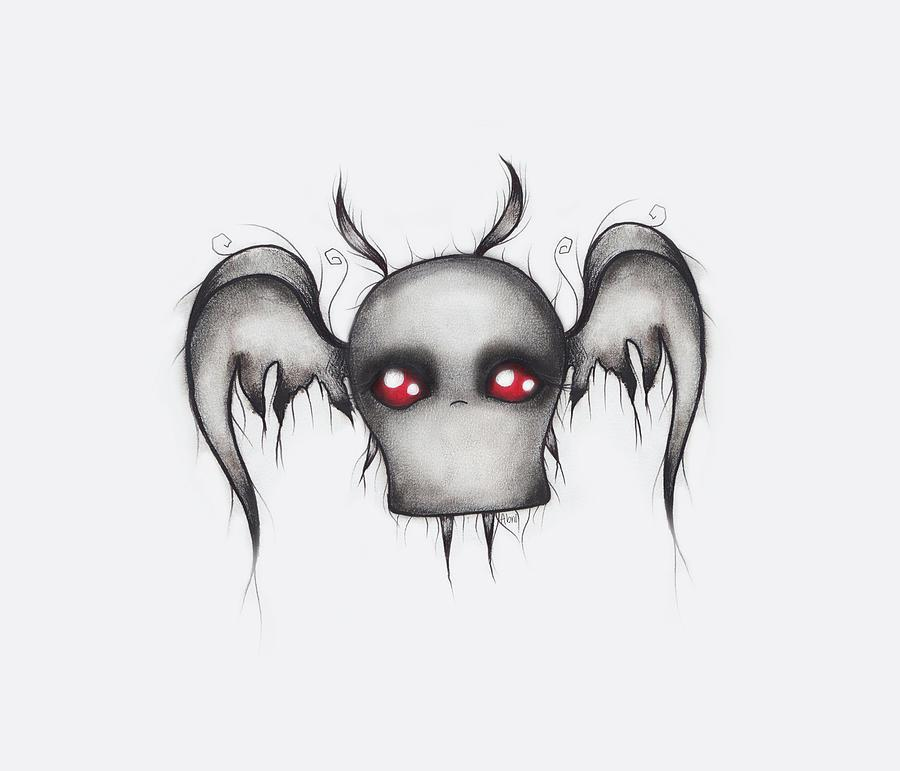

Tiny aberration, lawful evil

Armor Class 12

Hit Points 21

Speed 40 ft.

STR 6 (–2)

DEX 14 (+2)

CON 13 (+1)

INT 12 (+1)

WIS 11 (+0)

CHA 20 (+5)

Skills Perception +2, Stealth +4

Damage Resistances bludgeoning, piercing, and slashing from

nonmagical weapons

Condition Immunities blinded

Senses blindsight 60 ft. (blind beyond this radius),

Passive Perception 12

Languages understands Deep Speech but can’t speak,

telepathy 60 ft.

Detect Sentience. The Mothman Young can sense the

presence and location of any creature within 300 feet of it that

has an Intelligence of 3 or higher, regardless of interposing

barriers, unless the creature is protected by a mind blank spell.

Actions

Multiattack. The Mothman Young makes one attack with its

tentacles and uses Devour Intellect.

Tentecales. Melee Weapon Attack: +4 to hit, reach 5 ft., one target.

Hit: 7 (2d4 + 2) slashing damage.

Devour Intellect. The Mothman Young targets one creature

it can see within 10 feet of it that has a brain. The target must

succeed on a DC 12 Intelligence saving throw against this

magic or take 11 (2d10) psychic damage. Also on a failure,

roll 3d6: If the total equals or exceeds the target’s Intelligence

score, that score is reduced to 0. The target is stunned until it

regains at least one point of Intelligence.

Body Thief. The Mothman Young initiates an Intelligence

contest with an incapacitated humanoid within 5 feet of it. If

it wins the contest, the Mothman Young magically consumes

the target’s brain, teleports into the target’s skull, and takes

control of the target’s body. While inside a creature, the

Mothman Young has total cover against attacks and other

effects originating outside its host. The Mothman Young

retains its Intelligence, Wisdom, and Charisma scores, as

well as its understanding of Deep Speech, its telepathy, and

its traits. It otherwise adopts the target’s statistics. It knows

everything the creature knew, including spells and languages.

If the host body drops to 0 hit points, the Mothman Young

must leave it. A protection from evil and good spell cast on the

body drives the Mothman Young out. The Mothman Young

is also forced out if the target regains its devoured brain by

means of a wish. By spending 5 feet of its movement, the

Mothman Young can voluntarily leave the body, teleporting to

the nearest unoccupied space within 5 feet of it. The body then

dies, unless its brain is restored within 1 round.

**Ozark Howler**

Armor Class 15

Hit Points 75

Speed 20 ft., fly 10 ft. (hover)

STR 22 (+6)

DEX 10 (+0)

CON 18 (+4)

INT 7 (-3)

WIS 11(+0)

CHA 20 (+5)

Saving Throws STR+ 6, Cha +5

Damage Resistances acid, fire, lightning, thunder; bludgeoning, piercing, and slashing from nonmagical attacks

Damage Immunities cold, necrotic, poison

Condition Immunities charmed, exhaustion, frightened, grappled, paralyzed, petrified, poisoned, prone, restrained

Senses darkvision 60 ft., passive Perception 10

Endurance. The Ozark Howler has advantage on Constitution saving throws against exhaustion.

ACTIONS

The howler can misty step 15 ft at will as her movement

Multiattack. The Ozark Howler makes three attacks: one with its bite and two with its claws.

Bite. Melee Weapon Attack: +7 to hit, reach 5 ft., one target. Hit: 10 (1d8 + 6) piercing damage. If the target is a Large or smaller creature, it is grappled (escape DC 20). Until this grapple ends, the Ozark Howler can't bite another target.

Claw. Melee Weapon Attack: +7 to hit, reach 5 ft., one target. Hit: 13 (2d6 + 6) slashing damage. A creature that is hit with two claw attacks in the same turn takes an extra 16 (2d6 + 9) slashing damage.

Wail (1/Day). The Ozark Howler releases a mournful wail, provided that she isn't in sunlight. This wail has no effect on constructs and undead. All other creatures within 30 feet of her that can hear her must make a DC 15 Charisma saving throw. On a failure, a creature drops to 1 hit points. On a success, a creature takes (3d6) psychic damage.

**Peryton**

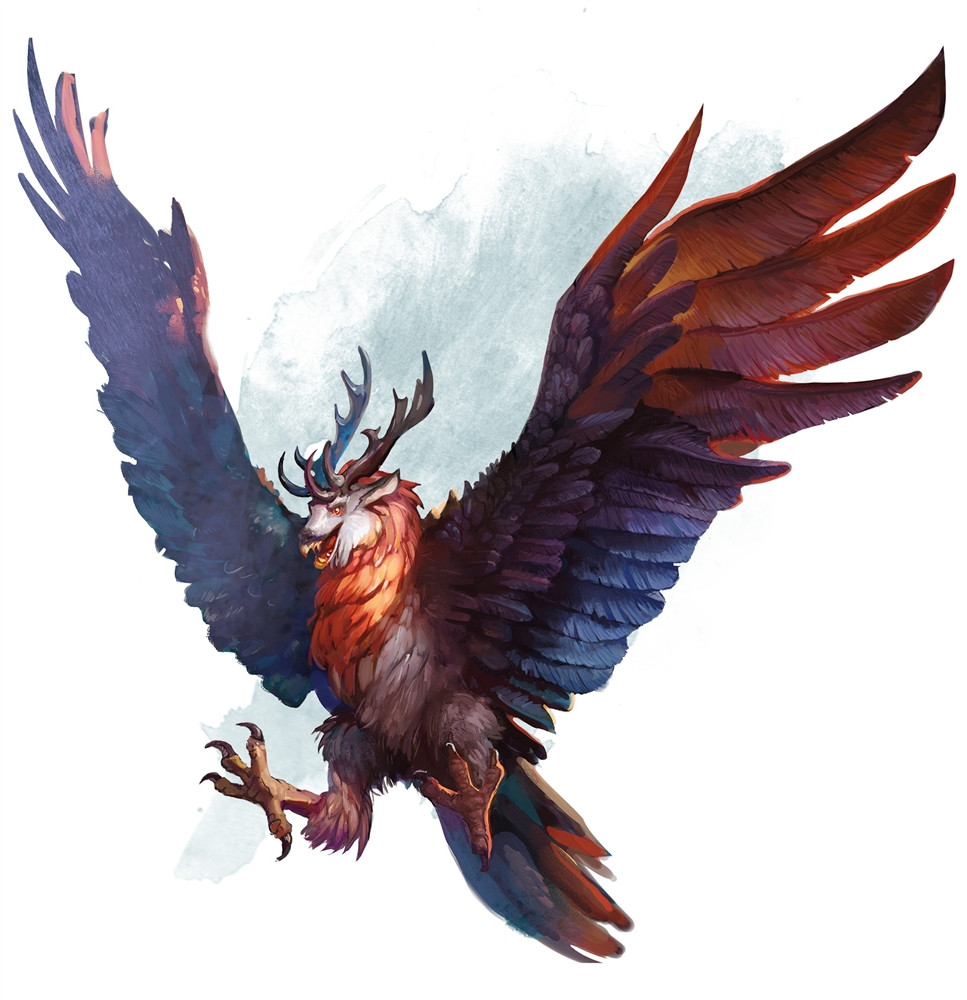

Medium monstrosity, chaotic evil

Armor Class 13 (natural armor)

Hit Points 33 (6d8 + 6)

Speed 20 ft., fly 60 ft.

STR 16 (+3)

DEX 12 (+1)

CON 13 (+1)

INT 9 (-1)

WIS 12 (+1)

CHA 10 (+0)

Skills:

Perception +5

Damage Resistances bludgeoning, piercing, and slashing from non magical attacks

Senses passive Perception 15

Languages understands Common and Elvish but can't speak

Challenge 2 (450 XP)

Dive Attack. If the peryton is flying and dives at least 30 feet straight toward a target and then hits it with a melee weapon attack, the attack deals an extra 9 (2d8) damage to the target.

Flyby. The peryton doesn't provoke an opportunity attack when it flies out of an enemy's reach.

Keen Sight and Smell. The peryton has advantage on Wisdom (Perception) checks that rely on sight or smell.

ACTIONS

Multiattack. The peryton makes one gore attack and one talon attack.

Gore. Melee Weapon Attack: +5 to hit, reach 5 ft., one target. Hit: 7 (1d8 + 3) piercing damage.

Talons. Melee Weapon Attack: +5 to hit, reach 5 ft., one target. Hit: 8 (2d4 + 3) piercing damage.

**Pukwudgie**

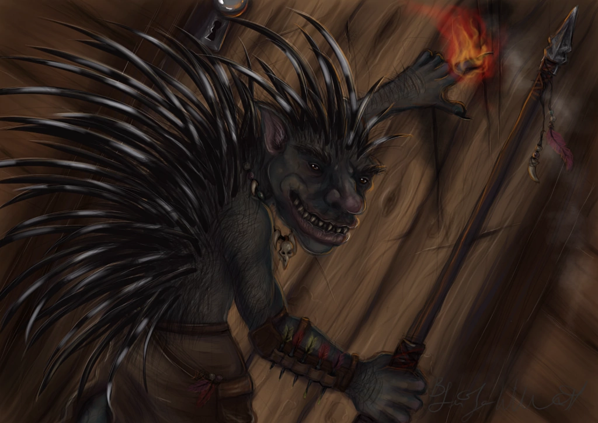

Pukwudgie are passive until threatened. These gentle cousins to the troll are less aggressive but much better defended. When faced with possible combat, the Pukwudgie raises the quills on its body and spins around, smashing an opponent with its quill-covered tail. If out of range, of opponent, it uses a javelin.

Size: Giant Armor Class 16

Hit Points (8d10+ 40)

Speed 30 ft. ft.

STR 18 (+4)

DEX 13 (+1)

CON 20 (+5)

INT 7 (-2)

WIS 9 (-1)

CHA 7 (-2)

Proficiency Bonus +3

Skills Perception +2

Senses darkvision 60 ft., passive Perception 12 Keen Smell: The Pukwudgie has advantage on Wisdom (Perception) checks that rely on smell.

Ranged: Attack.The Pukwudgie makes one attacks: one with its Javelin. Ranged weapon (Piercing)

range: 30/120

Melee Attack: Sticky Quill: Melee Weapon Attack: +4 to hit, reach 5 ft., one target. Hit: (1d6 + 4) piercing damage. When the Pukwudgie strikes with its back, it dislodges 1d6 quills that automatically break off and lodge in the opponent’s flesh. A lodged quill imposes a –1 circumstance penalty to attacks, saves, and checks. Each 1 round thereafter, the quill moves deeper into the opponent’s flesh, dealing 1d2 additional points of damage. Removing the quill takes 1 full round and deals 1d4 additional points of damage. If the quill has been embedded for more than 10 rounds, a Strength check at DC 10 is needed to remove the quill. For every minute after that, the DC to remove a lodged quill increases by +1. An unarmed or melee touch attack against a Pukwudgie causes 1d4 quills to break off and lodge in the attacker.

**Shrieker**

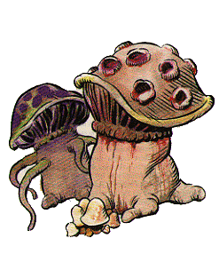

Medium plant, unaligned

Armor Class 5

Hit Points 13 (3d8)

Speed 0 ft.

STR

1 (-5) DEX

1 (-5) CON

10 (+0) INT

1 (-5) WIS

3 (-4) CHA

1 (-5)

Condition Immunities Blinded, Deafened, Frightened

Senses Blindsight 30 Ft. (Blind Beyond This Radius), passive Perception 6

Challenge 0 (10 XP)

False Appearance. While the shrieker remains motionless, it is indistinguishable from an ordinary fungus.

Shriek. When bright light or a creature is within 30 feet of the shrieker, it emits a shriek audible within 300 feet of it. The shrieker continues to shriek until the disturbance moves out of range and for 1d4 of the shrieker's turns afterward

**Violet Fungus**

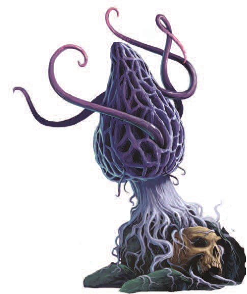

Medium plant, unaligned

Armor Class 5

Hit Points 18 (4d8)

Speed 5 ft.

STR 3 (-4)

DEX1 (-5)

CON 10 (+0)

INT 1 (-5)

WIS 3 (-4)

CHA 1 (-5)

Condition Immunities blinded, deafened, frightened

Senses blindsight 30 ft. (blind beyond this radius), passive Perception 6

Languages -

Challenge 1/4 (50 XP)

False Appearance. While the violet fungus remains motionless, it is indistinguishable from an ordinary fungus.

Multiattack. The fungus makes 1d4 Rotting Touch attacks.

Rotting Touch. Melee Weapon Attack: +2 to hit, reach 10 ft., one creature. Hit: 4 (1d8) necrotic damage.

**Winged Owlbear**

Large monstrosity, unaligned

Armor Class 13 (Natural Armor)

Hit Points 59 (7d10 + 21)

Speed 40 ft. Fly 40ft

STR 20 (+5)

DEX 12 (+1)

CON 17 (+3)

INT 3 (-4)

WIS 12 (+1)

CHA 7 (-2)

Skills Perception +3

Senses Darkvision 60 ft., Passive Perception 13

Languages --

Challenge 3 (700 XP)

Keen Sight and Smell. The owlbear has advantage on Wisdom (Perception) checks that rely on sight or smell.

Actions

Multiattack. The owlbear makes two attacks: one with its beak and one with its claws.

Beak. Melee Weapon Attack: +7 to hit, reach 5 ft., one creature. Hit: 10 (1d10 + 5) piercing damage.

Claws. Melee Weapon Attack: +7 to hit, reach 5 ft., one target. Hit: 14 (2d8 + 5) slashing damage.

**Zorbo**

Small monstrosity, unaligned

Armor Class 10 See Natural Armor Feature

Hit Points 27 (6d6 + 6)

Speed 30 ft., climb 30 ft.

STR 13 (+1)

DEX 11 (+0)

CON 13 (+1)

INT 3 (-4)

WIS 12 (+1)

CHA 7 (-2)

Skills Athletics +3

Senses Passive Perception 11

Languages --

Challenge 1/2 (100 XP)

Magic Resistance. The zorbo has advantage on saving throws against spells and other magical effects.

Natural Armor. The zorbo magically absorbs the natural strength of its surroundings, adjusting its Armor Class based on the material it is standing or climbing on: AC 15 for wood or bone, AC 17 for earth or stone, or AC 19 for metal. If the zorbo isn’t in contact with any of these substances, its AC is 10.

Actions

Destructive Claws. Melee Weapon Attack: +3 to hit, reach 5 ft., one target. Hit: 8 (2d6 + 1) slashing damage, and if the target is a creature wearing armor, carrying a shield, or in possession of a magic item that improves its AC, it must make a DC 11 Dexterity saving throw. On a failed save, one such item worn or carried by the creature (the target’s choice) magically deteriorates, taking a permanent and cumulative −1 penalty to the AC it offers, and the zorbo gains a +1 bonus to AC until the start of its next turn. Armor reduced to an AC of 10 or a shield or magic item that drops to a 0 AC increase is destroyed.

***<u>Beasts</u>***

**Badger**

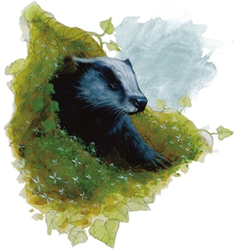

Tiny beast, unaligned

Armor Class 10

Hit Points 3 (1d4 + 1)

Speed 20 ft., burrow 5 ft.

STR 4 (-3)

DEX 11 (+0)

CON 12 (+1)

INT 2 (-4)

WIS 12 (+1)

CHA 5 (-3)

Senses Darkvision 30 ft., Passive Perception 11

Languages --

Challenge 0 (10 XP)

Keen Smell. The badger has advantage on Wisdom (Perception) checks that rely on smell.

Actions

Bite. Melee Weapon Attack: +2 to hit, reach 5 ft., one target. Hit: 1 piercing damage.

**Giant Badger**

Medium beast, unaligned

Armor Class 10

Hit Points 13 (2d8 + 4)

Speed 30 ft., burrow 10 ft.

STR 13 (+1)

DEX 10 (+0)

CON 15 (+2)

INT 2 (-4)

WIS 12 (+1)

CHA 5 (-3)

Senses Darkvision 30 ft., Passive Perception 11

Languages --

Challenge 1/4 (50 XP)

Keen Smell. The badger has advantage on Wisdom (Perception) checks that rely on smell.

Actions

Multiattack. The badger makes two attacks: one with its bite and one with its claws.

Bite. Melee Weapon Attack: +3 to hit, reach 5 ft., one target. Hit: 4 (1d6 + 1) piercing damage.

Claws. Melee Weapon Attack: +3 to hit, reach 5 ft., one target. Hit: 6 (2d4 + 1) slashing damage.

**Beaver**

Small beast, unaligned

Armor Class 11

Hit Points 3 (2d4 - 2)

Speed 30 ft., swim 30 ft.

STR 8 (-1)

DEX 15 (+2)

CON 10 (+0)

INT 5 (-3)

WIS 8 (-1)

CHA 5 (-3)

Senses Passive Perception 11

Languages --

Challenge 1/8 (25 XP)

Actions

Bite. Melee Weapon Attack: +2 to hit, reach 5 ft., one target. Hit: 2 (1d4) piercing damage.

Claw. Melee Weapon Attack: +2 to hit, reach 5 ft., one target. Hit: 1 (1d1) slashing damage.

**Bison**

Large beast, unaligned

Armor Class 11 Natural Armor

Hit Points 30 (4d10 + 8)

Speed 40 ft., swim 25 ft.

STR 20 (+5)

DEX 10 (+0)

CON 14 (+2)

INT 2 (-4)

WIS 12 (+1)

CHA 6 (-2)

Senses Passive Perception 11

Languages --

Challenge 2 (450 XP)

Charge. If the bison moves at least 20 feet straight toward a target and then hits it with a gore attack on the same turn, the target takes an extra 7 (2d6) bludgeoning damage. If the target is a creature, it must succeed on a DC 15 Strength saving throw or be knocked prone.

Actions

Gore. Melee Weapon Attack: +7 to hit, reach 5 ft., one target. Hit: 15 (3d6 + 5) piercing damage.

**Brown Bear**

Large beast, unaligned

Armor Class 11 (Natural Armor)

Hit Points 34 (4d10 + 12)

Speed 40 ft., climb 30 ft.

STR 19 (+4)

DEX 10 (+0)

CON 16 (+3)

INT 2 (-4)

WIS 13 (+1)

CHA 7 (-2)

Skills Perception +3

Senses Passive Perception 13

Languages --

Challenge 1 (200 XP)

Keen Smell. The bear has advantage on Wisdom (Perception) checks that rely on smell.

Actions

Multiattack. The bear makes two attacks: one with its bite and one with its claws.

Bite. Melee Weapon Attack: +6 to hit, reach 5 ft., one target. Hit: 8 (1d8 + 4) piercing damage.

Claws. Melee Weapon Attack: +6 to hit, reach 5 ft., one target. Hit: 11 (2d6 + 4) slashing damage.

**Crocodile**

Large beast, unaligned

Armor Class 12 (Natural Armor)

Hit Points 19 (3d10+3)

Speed 20 ft., swim 30 ft.

STR 15 (+2)

DEX 10 (+0)

CON 13 (+1)

INT 2 (-4)

WIS 10 (+0)

CHA 5 (-3)

Skills Stealth +2

Senses passive Perception 10

Challenge 1/2 (100 XP)

Hold Breath. The crocodile can hold its breath for 15 minutes.

Actions

Bite. Melee Weapon Attack: +4 to hit, reach 5 ft., one creature. Hit: (1d10 + 2) piercing damage. The target is grappled (escape dc 12) Until this grapple ends, the target is restrained, and the crocodile can't bite another target

**Giant Toad**

Large beast, unaligned

Armor Class 11

Hit Points 39 (6d10+6)

Speed 20 ft., swim 40 ft.

STR 15 (+2)

DEX 13 (+1)

CON 13 (+1)

INT 2 (-4)

WIS 10 (+0)

CHA 3 (-4)

Senses Darkvision 30 Ft., passive Perception 10

Challenge 1 (200 XP)

Amphibious. The toad can breathe air and water

Standing Leap. The toad's long jump is up to 20 ft. and its high jump is up to 10 ft., with or without a running start.

Actions

Bite. Melee Weapon Attack: +4 to hit, reach 5 ft., one target. Hit: (1d10 + 2) piercing damage plus (1d10)poison damage. The target is grappled (escape dc 13) Until this grapple ends, the target is restrained, and the toad can't bite another target

Swallow. The toad makes one bite attack against a Medium or smaller target it is grappling. If the attack hits, the target is swallowed, and the grapple ends. The swallowed target is blinded and restrained, it has total cover against attacks and other effects outside the toad, and it takes 10 (3d6) acid damage at the start of each of the toad's turns. The toad can have only one target swallowed at a time.

If the toad dies, a swallowed creature is no longer restrained by it and can escape from the corpse using 5 feet of movement, exiting prone.

**Panther**

Medium beast, unaligned

Armor Class 12

Hit Points 13 (3d8)

Speed 50 ft., climb 40 ft.

STR 14 (+2)

DEX 15 (+2)

CON 10 (+0)

INT 3 (-4)

WIS 14 (+2)

CHA 7 (-2)

Skills Perception +4, Stealth +6

Senses Passive Perception 14

Languages --

Challenge 1/4 (50 XP)

Keen Smell. The panther has advantage on Wisdom (Perception) checks that rely on smell.

Pounce. If the panther moves at least 20 feet straight toward a creature and then hits it with a claw attack on the same turn, that target must succeed on a DC 12 Strength saving throw or be knocked prone. If the target is prone, the panther can make one bite attack against it as a bonus action.

Actions

Bite. Melee Weapon Attack: +4 to hit, reach 5 ft., one target. Hit: 5 (1d6 + 2) piercing damage.

Claw. Melee Weapon Attack: +4 to hit, reach 5 ft., one target. Hit: 4 (1d4 + 2) slashing damage.

**Skunk**

Tiny beast, unaligned

Armor Class 10

Hit Points 3 (1d4 + 1)

Speed 20 ft., burrow 5 ft.

STR 4 (-3)

DEX 11 (+0)

CON 12 (+1)

INT 2 (-4)

WIS 12 (+1)

CHA 5 (-3)

Senses Darkvision 30 ft., Passive Perception 11

Languages --

Challenge 0 (10 XP)

Keen Smell. The Skunk has advantage on Wisdom (Perception) checks that rely on smell.

Actions

Bite. Melee Weapon Attack: +2 to hit, reach 5 ft., one target. Hit: 1 piercing damage.

Spray (Recharge 5-6). The Skunk sprays a noxious gas in a 15- foot cone. Each creature in that area must succeed on a DC 13 Constitution saving throw or spend their next action coughing

**Giant Skunk**

Medium beast, unaligned

Armor Class 10

Hit Points 14 (2d8 + 4)

Speed 30 ft., burrow 10 ft.

STR 12 (+1)

DEX 10 (+0)

CON 16 (+3)

INT 2 (-4)

WIS 12 (+1)

CHA 5 (-3)

Saving Throws CON +5

Senses Darkvision 30 ft., Passive Perception 11

Languages --

Challenge 1/2 (100 XP)

Keen Smell. The skunk has advantage on Wisdom (Perception) checks that rely on smell.

Actions

Multiattack. The skunk makes two attacks: one with its bite and one with its claws.

Bite. Melee Weapon Attack: +3 to hit, reach 5 ft., one target. Hit: 4 (1d6 + 1) piercing damage.

Claws. Melee Weapon Attack: +3 to hit, reach 5 ft., one target. Hit: 6 (2d4 + 1) slashing damage.

Spray. The skunk sprays its enemy with a foul smelling poison. The target must make a Constitution saving throw (DC 13) or be poisoned for one turn. If the creature cannot smell it automatically succeeds. If it has keen smell, it rolls with disadvantage. Giant Skunks are immune to their own and other giant skunks' Spray ability.

**Appendix D**

Hidden objectives:

These hidden goals contain both Combat and Non-combat encounter suggestions.

There are 30 degrees of freemasonry available to be conferred upon the mayor by the deeds of his town. Symbolically, The town and mayor are one. Any heroic deeds performed by the towns folk may be conferred upon the mayor. Similarly, and injustice left unattended by be brought against the mayor.

The following are encounters or achievements based upon the degrees of Freemasonry. As they are accomplished indicate both on the list and in the \#TownHall chat that they have been completed. When one is accomplished state that a degree marker has been added to the front of the mansion. If All 33 degrees have been reached by the end of the game a secret ending may be unlocked in which Hiram Abiff appears and reveals the entirety of this document to the players.

1. At least one person volunteers to run for mayor.

2. A secret vote is cast

3 The new mayor is led into the Town Hall and takes the oath of office.

4\. Master Traveler

-All locations of the map become uncovered.

The person to discover the last location on the island will receive a flawless diamond valued at 1000 gp, as well as 10 spell stones.

5\. Perfect Master

This degree is based on the will to resist temptation.

While exploring in the woods, you come across a steep ravine. Looking down into it, you see a jackalope has fallen down a steep cliff. At the top of the ravine, on his side, he appears to have dropped all of his supplies including a bow glowing with mystical energy.

The reward for rescuing the Jackalope now and not stealing the bow is nothing. However your good deed may be remembered in the future. Gain an inspiration point to be spent on any of your dealings with Jackalopes in the future.

If the bow (+1 magical bow) is stolen, or the jackalope is failed to be rescued, gain disadvantage on your next encounter with jackalopes.

6\. Master of the Brazen Serpent.

This degree is based on offering aid in times of need.

The town has fallen silent. You can hear your own heartbeat in your ears. As you round the corner of one of the shops, quick desperate shallow breaths can be heard. There, behind several barrels of dried goods, a child seems to have cracked the seal on a cask of water that seems to have been carrying diseased water. The child is flush, breathing rapidly and unresponsive to your voice or your actions. This is a disease known to you as the sweetwater madness. It is both waterborne and airborne And while a skilled healer could probably save the child quickly, there is no way that the healers of the town could help everyone if it happened to spread. Your sense of dread is weighed against your sense of charity. What do you do?

\* 7. Provost and Judge.

This degree has to do with wisdom and cunning.

This is rewarded for setting the foundation of the mayors house with a masonic mark.

Group reward: pot of awakening per person.

\*8. Intendant of the building.

This degree has to do with how well the inhabitants of the town match the intentions of the architects of their journey.

If all available types of buildings are built, grant an extra 2 cp to the village.

9\. Master of the Temple.

Peace is brokered between Roanoke and the Jackalopes. The Jackalopes share that there is a secret warren beneath Roanoke that contains their temple. The temple becomes the site where the truce between the two is made. The Jackalopes seek to add a druidic chapel to the village and offer a chapel of the foreign gods in the Lagowarren.

10\. Upholder of the Natural Law.

Regardless of how the other colonists feel about allowing the Uru to eat their dead, if at least one colonists offers a dead person to the Uru, than the village will be held in the eyes of the Uru as respecting the laws of nature.

11\. The needs of the many.

After the wall is up, the completion of a second act of civil engineering will fulfill this degree.

The second public work will work better than attended.

12\. Grandmaster Architect.

This is achieved by adding completing at least 3 public works.

13\. Master of the Ninth Arch

This degree is centered on endurance. The village surviving the mothmen will convey this degree. It will allow the villagers to associate the smell of burnt wood with the mothmen as an early warning sign that they may be in their midst.

\*14. The discovery of the tools.

This degree is centered on the awareness of one's ability to work toward the perfection of Masonic Ideal

Deep in the ravines to the north a forge lay in wait for someone to discover. This is Hiram’s first forge. It is made of a black oily rock and inscribed with glowing white marks. This forge reveals Masonic symbols have been present on the island for far longer than it has been populated either by natives or the residents of Roanoke. If the players realize the mystery of the masons goes deeper than the current narrative, the forge may be used to craft a single very rare item before it breaks.

\*15. Knights of the Sunrise Kingdoms.

The players discover a prophetic writings etched in stone along the southeastern shore near the hanging tree claiming that people will one day come across the sea to help rid arcania of the Siberex. Their victory is described as the Apotheosis of Silence.

\*16. The Prince (or Princess) of Roanoke.

A chinnokin priestess will arrive at the southern shore of the village and place pedestal on the shore. Upon the pedestal she will place mask. The mask depicts a face with no mouth and confers upon the wearer an immunity to fear or confusion. If the mask is worn by a member of the party who faces the mothmen, she will see a vision of them being converted from Tinkers into the beasts that they now are by Croatoan.

17\. The Knights of the West.

If the Village of Roanoke can help the four tribes unite under a single banner, a contingent of each tribe will be present to help defend when Croatoan attacks on week three.

\*18. The Rose Cross

Deep in the brambles of the western island giant wild roses grow. The Uru have a legend that if a sword is drawn from the brambles, that person shall be known as the Knight of the Rosy Cross. This Character shall be venerated by the Uru, and the Uru will allow that character and only that character to speak on behalf of Roanoke to them.

In the glen where the sword sits, with its hilt buried in the ground, all of area is covered in thorns that follow the same rules as thorn wall. Reaching and touching blade becomes an act of endurance. The player is then attacked by four Mantrap plants that look like overgrown rose bushes.

Passing this test not only gains a sword that can use thorn wall once per day. The player is also awarded 4 awakened pots.

\*19. An awareness of the Pontiff.

This degree begins with a coastal exploration at night. A torch light can be seen out at night on the black water. A woman in green and blue can be seen singing and miraculously walking on the water. She is wearing a crown and singing the words from a book she holds open.

A high enough Arcana or Religion check will reveal that this is Columbia.

Returning to the same place at the same time will allow other players to see her. She appears to make a full lap around the island and the song seems to be an incantation of some kind.

Additionally, if anyone tries to leave the island she will appear to turn them back to roanoke.

Discovering her presence confers the degree upon the town. Attempting to leave removes it.

20\. Master ad Vitam

The town Sheriff will be approached at the end of week two or beginning of week three. The person approaching the Sheriff will purport to be a tax collector of the Crown of Cormyr and demand that the settlement pay them an exorbitant tax. Upon inspection several clues will be given that the ship is in fact a ship of con artists attempting to take money from new and unsuspecting settlers.

21\. Shrine marked.

If all of the shrines are discovered, a mark is added.

22\. Riddle marked.

If all of the riddles are solved, a mark is added.

23\. Language loot.

If all the chests are found, a mark is added.

24\. Defeat the Thunder bird

25\. Defeat the Lychwood ent.

26\. Defeat the mothman

27\. Defeat the siberex

28\. Defeat Hiram Abiff’s Mech.

29\. Defeat the rats in the basement.

30\. Find the cow level.

31\. Find the milkman

Every section gets an encounter upon the first time they arrive.

Low chance: 1 d20 -encounter on a 19 or 20.

Avg. chance 1 d20 -encounter on a 11-20

High chance 1 d20 - Encounter on a 5-20

Blind Hexgrided map

[**<u>https://docs.google.com/drawings/d/1sBhb99XIowVWrrV0iV4pPyz71As71C1Wuw62Y_gQKfU/edit?fbclid=IwAR2j9wfHUC6eFsFVUiPrg2ky3CESu_ryTcYUYDVu6QdkKwTxgpFC7mzzFnE</u>**](https://docs.google.com/drawings/d/1sBhb99XIowVWrrV0iV4pPyz71As71C1Wuw62Y_gQKfU/edit?fbclid=IwAR2j9wfHUC6eFsFVUiPrg2ky3CESu_ryTcYUYDVu6QdkKwTxgpFC7mzzFnE)

**Copy with transparency:**

[**<u>https://docs.google.com/drawings/d/1sSi7z6Uon7xgZggpn8ECTfkkl\_-FP0Yjivd7Kt3XZmM/edit?usp=sharing</u>**](https://docs.google.com/drawings/d/1sSi7z6Uon7xgZggpn8ECTfkkl_-FP0Yjivd7Kt3XZmM/edit?usp=sharing)

**Map Key to Roanoke island:**

\*\*most encounters may be replaced with one of your own devising.

**Sections 1-4**

**Section 1**

You stand in a broken region dotted with small colorful stones. You can see a marsh not too far away. The temperature is very warm and the sky is overcast.

**First encounter:**

A clumsy druid Jackalope named Speyfoot will ask to join the party at their fire and spend the night.

He talks in his sleep and summons 2d6 + 2 poisonous snakes from the surroundings

to join the camp. If the party does not notice this the PCs may wake up with a snake or

two in and under their sleeping bags. The druid does not wake up in the morning and a

medicine check reveals he was bitten and has been paralysed for several hours. Doing

this medicine check also provokes the responsible snake to come out of hiding and

attempt to defend its master. In the stuff of the druid there are 2 potions of antidote

(with the side effect of not being able to talk/speak for 1d4+1 hours) and 3 home-made

minor healing potions (one of these is actually a paralysing poison instead).

Low chance of random encounter after.

**Section 2**

You stand in a flat region dotted with fruit-bearing trees, various shrubs, and grass. You can see a waterfall nearby to the east. The temperature is a little cooler and the sky is partially cloudy.

**First encounter**

Random beast encounter

Low chance of encounter after

**Section 3**

You stand in a flat terrain abounding with gigantic purplish stones.

**First Encounter:**

A raging mad tatankan (barbarian) is found sitting on a bridge, he is in the process of turning undead and he will scratch, stab, bite, jump and gore people that come within 10ft of him and doesn’t stop screaming about something called the “firehawk” who he killed that took his mind and cursed him. If he is killed his eyes will

grow clear and he will thank you with his last words before closing his eyes in peace.

The PC that delivered the killing blow is now cursed, taking over the curse this tatankan

had. If this PC is killed they will turn undead.

Low chance of random encounter after

**Section 4**

You stand in a rock strewn field. The terrain is filled with unusual gray glass boulders. You can see a huge lake close by. The temperature is cool and the sky is clear.

Low chance of random encounter after.

A bison stuffed with rats.

Section 5

The Hanging tree.

This sacred tree is life rooted in death.

The ground is blackened and scarred and the leaves are wreathed in a sacred flame that does not consume it.

Low chance of random encounter after.

Section 6-9 South of the wood

The table for sections random beasts may be used here, as well as aberrations at dm discretion.

**Section 6.**

Freemason mark \#15

The players discover a prophetic writings etched in stone along the southeastern shore near the hanging tree claiming that people will one day come across the sea to help rid arcania of the Siberex. Their victory is described as the Apotheosis of Silence, and the heroes are called the “Knights of the Sunrise Kingdom.

Avg chance of random encounter after.

Section 10-16 Aird plains

The table for sections random beasts maybe used here, as well as aberrations at dm discretion.

Avg chance of encounter

10\.

11\.

**Section 12.**

FreeMason Mark \# 16. The Prince (or Princess) of Roanoke.

A chinnokin priestess will arrive at the southern shore of the village and place pedestal on the shore. Upon the pedestal she will place mask. The mask depicts a face with no mouth and confers upon the wearer an immunity to fear or confusion. If the mask is worn by a member of the party who faces the mothmen, she will see a vision of them being converted from Tinkers into the beasts that they now are by Croatoan.

Avg. chance of random encounter after.

**Section 13. EASTER EGG**

Free mason mark 33: Discover the cow level.

There is a field with a box. The box contains a note: “please place any prosthetic limb for my friend Wryt. Wryt is a collector.”

The note only appears to groups of 4 or more.

Upon placing a prosthetic limb the group is transported to an identical island populated by deadly cows. Each of the players will receive an amulet that welcomes them to the cow level and encourages them to survive.

The group must survive 1d4 rounds of cows (use reskinned adult dragons).

Every time the group gets hit, the amulets tell them how good they are doing.

When the group comes back, all survivors are rewarded with a message from the creators of the game.

Congratulations, you found our easter egg!

Random encounters always for groups under 4 pcs

14\. Roll on the non combat table.

**Section 15.**

Bluecap

A corpse of a boar lays on the side of the road, its belly is covered in blueish mushrooms,

touching the corpse or poking it will release a cloud of mushroom spores. Targets within

10 ft may make a constitution save to avoid being impregnated with bluecap mushroom

spores. These spores use the targets skin to develop into mushrooms in 1d10 minutes after

which they shrivel and die, during this time the PC becomes light sensitive and has

disadvantage on charisma checks, for one day. The targets become very infectious

and any within 5 ft must make a Constitution save or be infected as well. Greater restoration cures this disease.

**Section 16.**

Freemason Mark \# 14. The discovery of the tools.

This degree is centered on the awareness of one's ability to work toward the perfection of Masonic Ideal

Deep in the ravines to the north a forge lay in wait for someone to discover. This is Hiram’s first forge. It is made of a black oily rock and inscribed with glowing white marks. This forge reveals Masonic symbols have been present on the island for far longer than it has been populated either by natives or the residents of Roanoke. If the players realize the mystery of the masons goes deeper than the current narrative, the forge may be used to improve a single rare item before it breaks.

Only Armor, weapons and rods may be improved. The original item is destroyed

Choose from:

**Result Type rarity source item page#**

Animated Shield Armor Very Rare shield dmg 151

Armor, +2 Armor Very Rare armor dmg 152

Demon Armor Armor Very Rare plate dmg 165

Dragon Scale Mail Armor Very Rare scale mail dmg 165

Dwarven Plate Armor Very Rare plate dmg 167

Shield, +3 Armor Very Rare shield dmg 200

Rod of Absorption Rod Very Rare rod dmg 195

Rod of Alertness Rod Very Rare rod dmg 196

Rod of Security Rod Very Rare rod dmg 197

Rod of the Pact Keeper, +3 Very Rare rod dmg 197

Ammunition, +3 Weapon Very Rare ammo dmg 150

Arrow of Slaying Weapon Very Rare arrow dmg 152

Dancing Sword Weapon Very Rare any sword dmg 161

Dwarven Thrower Weapon Very Rare warhammer dmg 167

Frost Brand Weapon Very Rare any sword dmg 171

Nine Lives Stealer Weapon Very Rare any sword dmg 183

Oathbow Weapon Very Rare longbow dmg 183

Scimitar of Speed Weapon Very Rare scimitar dmg 199

Sword of Sharpness Weapon Very Rare long sword dmg 206

Weapon, +3 Weapon Very Rare other weapon dmg 213

High chance of hard encounter upon pc’s return.

Sections 17, 23-25 The Tatankan’s territory.

You stand in a hilly region smattered with plants. You can see the Tatankan Pen on the horizon. The temperature is warm and the sky is mostly clear.

17\. Roll on the non combat table.

23\. Roll on the non combat table.

**Section 24.**

Chinnokin sea silk.

A Chinnokin textile merchant is hoping to begin his journey to spawn soon. He will sell all kinds of coats, masterwork backpacks, and even some fancy dresses. He will also sell expensive fabrics

such as silk and satin from under the sea, he even has 2 square meters of enchanted fabric,

but that will cost. He is transporting illegal royal silk worms (reason he got chased out of Mantapolis). He carries a rod of cold iron, as he and specifically his silk worms are hunted

by silkweavers (2d4, driders with the phase spiders ability to move into the ethereal relm reskinned as undersea crab driders).

25.Roll on the non combat table.

Sections 18-22 The jackalope warrens

**Section 18**.

A con-artist Uru named Steakeater is sitting at a table with a couple of Jackalopes. Steakeater will attempt to appeal to one of the PCs in the party, claiming to have known them in their past. If the PC doesn’t seem to recall any of his vague stories that could have happened to anyone he

will use charm to persuade the PC to catch up on old times. At a moment of convenience

Steakeater will use his dice of modify memory to play a game with the PC to alter his/her

memory to incorporate him. He does this all to reap the rewards for being an old-time

friendly NPC.

**Section 19.**

Freemason mark \#5. Perfect Master

This degree is based on the will to resist temptation.

While exploring in the woods, you come across a steep ravine. Looking down into it, you see a jackalope has fallen down a steep cliff. At the top of the ravine, on his side, he appears to have dropped all of his supplies including a bow glowing with mystical energy.

The reward for rescuing the Jackalope now and not stealing the bow is nothing. However your good deed may be remembered in the future. Gain an inspiration point to be spent on any of your dealings with Jackalopes in the future.

If the bow (+1 magical bow) is stolen, or the jackalope is failed to be rescued, gain disadvantage on your next encounter with jackalopes.

**Section 20.**

Free mason mark \# 19. An awareness of the Pontiff.

This degree begins with a coastal exploration at night. A torch light can be seen out at night on the black water. A woman in green and blue can be seen singing and miraculously walking on the water. She is wearing a crown and singing the words from a book she holds open.

A high enough Arcana or Religion (DC 15)check will reveal that this is Columbia.

Returning to the same place at the same time will allow other players to see her. She appears to make a full lap around the island and the song seems to be an incantation of some kind.

Additionally, if anyone tries to leave the island she will appear to turn them back to roanoke.

Discovering her presence confers the degree upon the town. Attempting to leave removes it.

High chance of random encounter after

21\. Roll on the non combat table.

22\. Roll on the non combat table.

Sections 32-33 Oleander’s Lair

You stand in a flat terrain replete with various pale stones. It has trees with foul-smelling wildflowers.

Sections 26-31, 34. Uru Territory.

You stand in a flat arid terrain smattered with sharp shrubs.

26\. Choose a high level monster from the bestiary.

27\. Roll on the non combat table.

**Section 28.**

\*Freemason mark \#18. The Rose Cross

Deep in the brambles of the western island giant wild roses grow. The Uru have a legend that if a sword is drawn from the brambles, that person shall be known as the Knight of the Rosy Cross. This Character shall be venerated by the Uru, and the Uru will allow that character and only that character to speak on behalf of Roanoke to them.

The character must walk through the brambles. The brambles are a 60x60 patch of thorn wall adorned with white roses that turn red as the character bleeds. For every 1 foot they move through the brambles they spend 4 feet of movement.The character must pass a dex dc 16 saving through or take 6d6 slashing damage. A failed save takes half damage. If the player takes more than half damage they must pass a dc 16 con save or be dragged back out of the patch. Any attempt to destroy the roses will cause 1d8+4 psychic damage to the group and they will be accused by a disembodied voice of cheating.

High chance of random encounter after.

**Section 29.**

Bloody Surprise

A heavy buzzing is in the air and something smells badly somewhere off the road.

Investigation leads to a carcass of a pack animal covered in stirges who are feeding off

of it. If disturbed in any way a large part (3d4 +6) of the stirges attack their new fresh

prey, pursuing PCs and horses alike. The carcass belonged to a horse of a messenger,

he had some pristine leather saddlebags with him, in them several personal letters one

of which bears the crest of queen kimvor to be delivered to Parchtongue at the Rowing Oak.

The letter reads:

As above, so below.

The Illuminated one draws near.

Prepare the way.

Hail to the Siberex.

Give my greetings to Jenkins.

-Queen Kimvor.

And contains a vial of deadly poison.

High chance of random encounter after.

30\.

31\. roll on the non combat table

34\. .Highnest, The Uru village.

**Random encounter table: PLACE AN ASTERISK NEXT TO ENCOUNTERS YOU HAVE USED. IF THE ENCOUNTER IS USED, USE THE NEXT ON THE LIST.**

1 - The players encounter a group of sick Puckwudgies.

\*2 - A naked jackalope runs across the path, gasps at the party, then runs back. Cannot be pursued as he dives down into the earth.

3-10 Omens (for players to interpet how they wish)

\*3 - A roll of thunder.

4 - A black dog runs across the path.

5 - A lone yellow flower is growing in the middle of the path.

6 - A shadow drifts over the party.

\*7 - A pool of blood.

8 - The earth shakes briefly.

9 - The sun bursts through an overclouded sky.

10 - A beautiful white horse dashes past the party and disappears.

11 - The players find an encampment of well armed, friendly tatankan. They may stay the night here and avoid a random encounter for the night.

\*12 - A dwarf falls out of the sky and splatters in front of the party. No logical source of the dwarf can be seen.

13 - The tinker appears, with no goods to trade.

14 - A stranger asks to be escorted to a town, but gives the party nothing for doing it.

15 - The party finds the tracks of wolves going across the path (DC10 Nature/Survival).

16 - An Uru ranger gives the party directions to their next destination, but he’s an asshole that sends them the wrong way. Increase the journey length.

17 - An arrow strikes a nearby tree, with a note attached to it. The note reads “You are a fool for looking!” No source of the arrow can be found.

18 - A dung beetle pushes a ball across the road. If disturbs, it bursts into a smog, doing 1D4 poison damage and leaves the party member poisoned.

19 - A mystery key is found laying in the road. If used on a locked door, roll a D20. A 15 will unlock the door, a 20 will unlock mordenkanen’s mansion after which the key is lost.

20 - A thick fog prevents travel for the rest of the hour.

21 - You all fall asleep in a field of poppies. You dream:

> 1\. You are stuck in a hallway being chased by something, but you never seem to be able to reach the end.
>
> 2.You are controlling some kind of vehicle, a horse, wagon, or anything typical for the setting, and you cannot remember how to work it as you move helplessly in a straight line.
>
> 3.One of your hands has grown a hand, and it smiles at you in a disturbing way, and when you are not looking you could swear it is whispering to you.
>
> 4\. You have arrived in front of someone important to the campaign such as the main villain, or a local leader wearing nothing.
>
> 5\. You find yourself being attacked by something, but you are nearly paralyzed, and unable to move yourself to see it completely. It hits you repeatedly, but always seems to be out of the range of your vision.

6\. You realize suddenly that an important object you had is missing.

7\. Your hair is now worms/snakes/man-eating plants.

8.You fall into a lake, and find yourself unable to swim up no matter how hard you try.

9\. Every living thing that you touch begins to scream as it rots into a pile of brown material weather it was alive or not.

10.You find yourself in a dimly lit stone room shackled to a wall. The floor is covered in bones, and blood. You hear something approaching from down the hallway, but it never arrives.

22-30 A troupe of native bards.

22 - A song of rest. Lose any debuffs.

23 - A song of good health. Gain 2D8 temporary hitpoints.

24 - A song of heroics. 1D6 party members gain inspiration.

\*r25 - A song of misery. All party members with inspiration lose it.

26 - A song of battle. The next combat encounter grants double reward.

27 - A song of healing. Regain up to half your max HP.

28 - A song of pain. Lose 1D8 HP (after the bard has long since passed).

29 - A song of storms. A storm starts and forces the party to stop for the rest of the day.

30 - A song. Nothing special happens.

31-40 Arcanian commoners.

31 - Only useful item for sale is a potion of vitality, 25gp.

32 - Studded leather armour and basic weapons.

33 - merchant selling Five fake healing potions, 30gp each. Has

34 - Basic adventuring equipment.

35 - Lumber jack hauling Wood.

36 - Hunters bounty. Fresh meat, some herbs.

37 - Herbalist (can give directions).

38 - The only Fisherman in the world. Unlocks fisherman as same job as hunter, but smellier.

39 - Gem & Jewelery merchant (500gp worth of loot)

40 - Bug catcher. A DC15 Nature check reveals a cartomoth, that will show them a shortcut if released. 10gp.

41 - The party catches up with and overtaking a slow travelling farmer, bickering with his wife. They know nothing useful.

42 - There is an unusually vocal chorus of birdsong. Druids, Hunters, Clerics gain inspiration.

43 - A stranger asks for directions from the party to the last town they left. If they help him, he gives them 1D6x10 gold when they next appear in town, if ever.

44 - A line of Goblin heads on spikes line the road. A sign written in Goblin next to them says “Traitors of Yeemik”.

45 - A man is trapped under a log. If the party helps him, he disappears - it was an illusion.

46 - The party finds a sword in a stone. A DC15 Strength check pulls it out. It is a +1 Longsword.

47 - A flower girl skips down the path towards the party, but disappears before she reaches them.

48-59 Religion visiting all of the shrines unlocks a mark of the freemasons.

48 - The party meets an old priest and a young priest of columbia, carrying a young possessed girl. They offer them a blessing. The young girl begins to vomit pea soup. The next encounters will be non-combat until they are clean.

49 - A temple is found on a roll. Use a D6 to determine which God, of the six below, it is dedicated to.

50 - Shrine of the Free Masons - If the party makes an offering, they all gain inspiration

51 - Shrine to Oro - If the party makes an offering, the rest of the day has no violent encounters

52 - Shrine to Mask - If the party makes an offering, they get a surprise round in their next encounter.

53 - Shrine to Mystra - If the party makes an offering, all spell slots are recovered.

54 - Shrine of the infernal - If the party makes an offering, the next combat will be a fiend instead of a beast.

55 - Shrine to the Firehawk - If the party makes an offering, they later find the amount they offered in each of their pockets. (unrepeatable, the shrine bursts into flame)

56 - Abandoned, unidentifiable Shrine - If the party doesn’t make an offering, they trigger a combat encounter.

57 - Shrine to nature spirits - If the party doesn’t make an offering, giant spirit beasts attack the town

58 - Demon Shrine, covered in blood - it the party makes an offering, a business demon appears and offers the party cursed items in trade for their immortal souls. Requires a warlock.

\*59 - Shrine to Oro, destroyed - investigation will uncover a boot sized nugget of gold.

61-70 It’s a trap!

61 - DC10 Dex check or 1D6 bludgeoning damage, pit fall. There is also the remains of an adventurer with 1 d4 spell stones.

62 - DC15 Dex check or 1D8 bludgeoning damage, pit fall. There is also a pukwudgie in the trap.

63 - DC20 Dex check or 1D12 bludgeoning damage, pit fall. Jackalopes come to investigate their catch.

64 - DC10 Per check or snared, 1D6 bludgeoning damage if cut loose without landing being factored in.

65 - DC15 Per check or snared, 1D6 bludgeoning damage if cut loose without landing being factored in.

66 - DC20 Per check or snared, 1D6 bludgeoning damage if cut loose without landing being factored in.

67 - DC15 Per check or whole party snared by net, roll combat encounter.

68 - A cupcake lays in the middle of the road. If the party approaches, they trigger a pitfall into spikes. 3D6 piercing damage.

69 - Magic rune (DC15 Per to detect) triggers, paralyzing party. Roll for a combat encounter.

70 - Door in the middle of the path. If opened, a Hobgoblin is on the other side and gets a surprise attack. If walked around, the Hobgoblin flees.

71-76 An old man's book of riddles. These are a single page. Answering all of the riddles unlocks a mark of the Free Masons on the capstone

71 - I have a tail, but no body. I have a head, but no brain. What am I? (coins, 50gp reward)

72 - What is running around the tatankan’s pen, yet never truly moving? (The wall, Healing potion reward per player)

73 - My rivers are dry, my forests have no trees, my towns are flat and empty, and my roads cannot be walked on. What am I? (A map. Another space is revealed)

74 - Two bodies have I, though both joined in one. The more still I stand, the quicker I run. What am I? (An hourglass. On the next combat each player may act before the monster rolls init)

75 - What kind of ear cannot hear? (An ear of corn. Potion of Cure Silence, everyone deafened if they don’t get it)

76 - What has four wheels and flies? (A garbage wagon. Potion of flight if correct, attacked by Stirges if they don’t get it)

Language loot:

77 - A DC10 Perception check spots a message in theives’ cant it directs to a small chest hidden a tree. It contains a gold ring worth 20gp.

78 - A DC15 Perception check spots a message in celestial. It points to a small chest hidden beneath a rock. It contains a spell stone.

79 - A DC20 Perception check spots a note in Costal Arcanian. It points to chest hidden in a tree. It contains a +1 chinnokin narwhal horn tipped spear.

80 - A DC10 Perception check spots a note in infernal. It points to small chest hidden in a tree. It contains note that says “made you look”.

81 - A strong storm picks up.- storm of vengeance

\*82 - The party finds a random bison. No amount of investigation reveals anything of significance about the bison or where it came from. After 1d4 minutes it melts with acid that begins with it foaming at the mouth.

83 - A stranger with a broken leg asks to be escorted to the nearest town. If the party agrees, the stranger gives them 100gp upon delivery. The stranger then drinks alone in the bar no matter what.

84 - A group of excited jackalopes bounce past the party. If the party is polite to them, one gives them an awakened pot that makes a chirping noise when it grows.

85 - A man is trapped under a log. If the party helps him, do a DC15 check. A failure drops the log and crushes the man. He has nothing of value on him, but the saviour gets inspiration if they succeed.

86 - A man is buried in the road up to his neck, with the ground around him undisturbed. If the party helps him, the head pops out the ground and crawls off on spider legs, cackling. The party takes a DC14 Wisdom saving throw, taking 1D10 psychic damage on a failure.

87 - An enormous bird flies over head. Chance to fight a thunderbird if they lure it down.-

Mason Mark

Thunderbird

Gargantuan monstrosity, neutral

Armor Class 15 (natural armor)

Hit Points 315 (18d20 + 126)

Speed 20 ft., fly 120 ft.

STR DEX CON INT WIS CHA

28 (+9) 14 (+2) 25 (+7) 13 (+1) 16 (+3) 12 (+1)

Saving Throws Dex +7, Con +12, Wis +8, Cha +6

Skills Intimidation +6, Nature +6, Perception +8

Damage Resistances cold

Damage Immunities lightning, thunder

Condition Immunities exhaustion, frightened

Senses blindsight 60 ft., darkvision 120 ft., passive Perception X

Languages understands Auran, Common, Druidic, Giant, and Primordial, but can’t speak

Challenge 14 (11,500 XP)

Confer Lightning Resistance. The thunderbird can grant resistance to lightning damage to anyone riding it.

Illumination. The thunderbird sheds bright light in a 60-foot radius and dim light for an additional 30 feet.

Innate Spellcasting. The thunderbird’s innate spellcasting ability is Wisdom (spell save DC X). The thunderbird can innately cast the following spells, requiring no material components:

At will: feather fall, fog cloud, gust of wind, thunderwave

3/day each: blindness/deafness (deafness only), call lightning, control weather, wind wall

1/day each: sleet storm, storm of vengeance

Keen Sight. The thunderbird has advantage on Wisdom (Perception) checks that rely on sight.

Legendary Resistance (3/Day). If the thunderbird fails a saving throw, it can choose to succeed instead.

Storm Aura. A creature that touches the thunderbird or hits it with a melee attack while within 5 feet of it takes 11 (2d10) lightning damage.

ACTIONS

Multiattack. The thunderbird makes two attacks: one with its beak and one with its talons.

Beak. Melee Weapon Attack: +X to hit, reach 10 ft., one target. Hit: 27 (4d8 + 9) piercing damage plus 11 (2d10) lightning damage.

Talons. Melee Weapon Attack: +X to hit, reach 5 ft., one target. Hit: 23 (4d6 + 9) slashing damage plus 5 (1d10) lightning damage, and the target is grappled (escape DC 19). Until this grapple ends, the target is restrained, and the roc can't use its talons on another target.

Lightning Strike (Recharge 5-6). The thunderbird hurls a magical lightning bolt at a point it can see within 500 feet of it. Each creature within 10 feet of that point must make a DC 20 Dexterity saving throw, taking X (12d10) lightning damage on a failed save, or half as much damage on a successful one.

Lightning Dash. The thunderbird can transform into a bolt of lightning. It then can use its movement up to its flying speed. If this movement triggers an opportunity attack, the attack is made at disadvantage. The thunderbird cannot use this ability again until it has finished a long/short rest.

LEGENDARY ACTIONS

The thunderbird can take 3 legendary actions, choosing from the options below. Only one legendary action option can be used at a time and only at the end of another creature's turn. The thunderbird regains spent legendary actions at the start of its turn.

Talons Attack. The thunderbird makes one talons attack.

Move. The thunderbird moves up to halve its speed.

Flash Bang (Cost 2 Actions). The thunderbird releases a blinding flash of light out from a 60-foot radius centered around itself. Each creature within the radius must succeed a DC 20 Constitution saving throw. On a failed save, a creature takes X (4d8) radiant damage plus X (4d8) thunder damage and is blinded for 1 minute. On a success, the target takes half as much damage and is not blinded.

88 - A battle was fought here, and there is still debris littering the ground. A DC16 Perception check spots caltrops over the floor which do 1D4 piercing damage to the party if they don’t spot them.

89 - A drunken dwarf challenges the strongest looking party member to a wrestling match. A DC15 Strength check beats her, and she gives the party member 5gp. The party member gains a level of exhaustion on a failure.

90 - A road sign points back to wherever the party came from, but is otherwise useless.

THE THREE GHOSTS: only occurs after the mothman quest is begun.

**91 - A vagrant ghost asks for food. Nothing happens if they give him some.**

**92 - A vagrant ghost asks for money. Nothing happens if they give him some.**

**93 - A vagrant ghost asks for money. They get triple what they give back if they give him some.**

94 - The party finds the tracks of an Owlbear going across the road (DC18 Nature/Survival). The tracks stop. Upon looking up, it is a winged owlbear in a tree.

95 - A hell hound bursts out of the ground and brushes by you. Dex save dc 16 or your pants are on fire..

96 - A mirror image of the party walks towards them, but disappears before reaching them.

97 - The party notices that they are being followed by a bush, which runs into the forest when they attempt to investigate. If they pursue, they find a goblin named Friday, that throws a gold coin at them to make them go away. Friday is a castaway from Faerun that has been living on the island for 12 years. Unfortunately he is also insane, living on fingernail clippings and moss and knows no useful information.

98 - An Uru on the road tells each PC to confess their sins. He knows details.

99 - A door stands in the middle of the road. If opened, the frame bursts with confetti, then disappears.leaving a black mark. If the mark is inspected it triggers the spell Maze. Anyone brought into the maze that finds the center finds the milk man who gives them jugs of milk. FREEMASON MARK

100 - The party finds 100gp and 2 spell stones in a chest in the middle of the road.

https://www.reddit.com/r/d100/comments/a7c1gu/sibriex_flesh_warping_possibilities/
