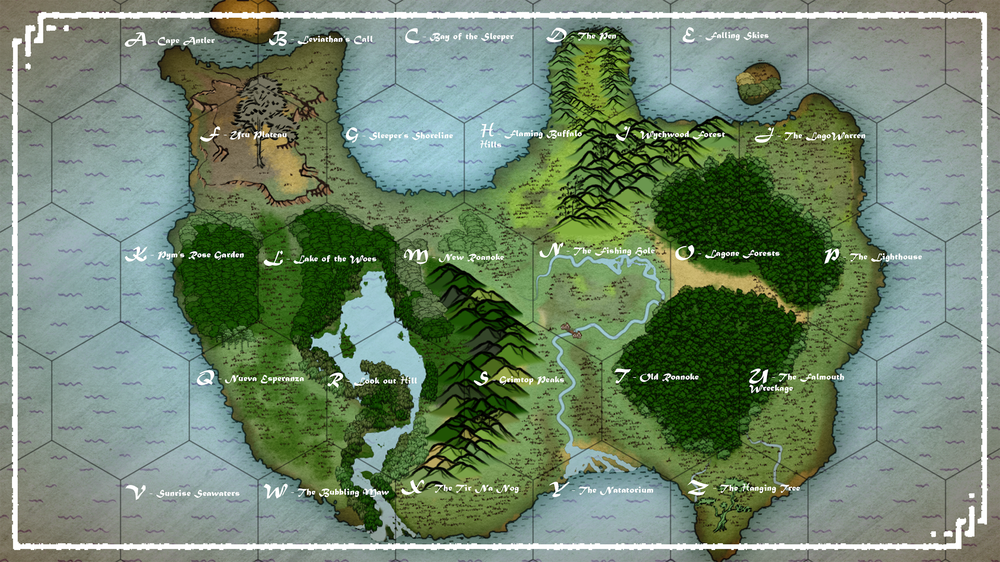

###  

Hex Name Link

A Cape Antler [<u>Lode -Bahamut’s Folly</u>](https://inkarnate.com/maps/2Bp7aG813KjJ4deMOkDr6L1Ya2qLZbVnyWx0zwQNvEgYRolP/MTU4NjM4NTU2MjI0MA==)

B Leviathan’s Call [<u>Half Wudgie hollow</u>](https://inkarnate.com/maps/1yJq2YbER4NZrVDMp0lP3mp761QLvnQeagWzd6k7jxBX8KwO/MTU4NjM4MDY1NTk5OA==)

C Bay of the Sleeper DM Freeplay Zone (entirely water zone)

D The Pen [<u>The Sorrow of the Statues</u>](https://inkarnate.com/maps/X48RjQKqBGW01nzNxEaMbmRJzyjmw3loeyJDp25kgVOZrP6d/MTU4NjM4MzQ1OTQwNw==)

E Falling Skies [<u>Lode - SpellJammer</u>](https://inkarnate.com/maps/87QqZNanbXlo5EYd4gPD29K3w4V9KRGz6prJk1MOW0jBVyvw/MTU4NjM4OTcwOTg2OQ==)

F Uru Plateau [<u>Roostloft</u>](https://inkarnate.com/maps/koXvEZP5Yb3RG21N6KpJzAEK2XOLj0OewVMBDWynx8Qd7gla/MTU4NjM5Mzg2OTE5Ng==)

G Sleeper’s Shoreline [<u>Oleander's Rest</u>](https://inkarnate.com/maps/wOp2jWQ3GXZrqK7EzgYPdAVdVDgL8kJane05M1xyRb6voVBl/MTU4NjM5NjEzOTgyNg==)

H Flaming Buffalo Hills [<u>Hiram’s Forge</u>](https://inkarnate.com/maps/4V5RWNGqx0e3ZdbrYgw2o9Ydg08A6XB1a7pnyOJDzMjlvEPK/MTU4NjQ3OTA3MjE3MA==)

I Wychwood Forest Hag Coven

J The Lagowarren [<u>The Lagowarren</u>](https://inkarnate.com/maps/lWg0kMrONnzJeZ274YxDbANoD6Q9BPj3aw1oGpXV58yKEqvR/MTU4NjQ2NDk2NTUxNw==)

K Pym’s Rose Garden [<u>The Rosecutter</u>](https://inkarnate.com/maps/X48RjQKqBGW01nzNxEaMbmRJ2X2mw3loeyJDp25kgVOZrP6d/MTU4NjU0OTYxNDk1Mw==)

L Lake of the Woes [<u>Island Olympics.</u>](https://inkarnate.com/maps/lWg0kMrONnzJeZ274YxDbANXpz7LBPj3aw1oGpXV58yKEqvR/MTU4NzM0OTMxMTA2Mw==)

M Howling Woods Dm Freeplay Zone

N New Roanoke [<u>New Roanoke</u>](https://inkarnate.com/maps/vdo6Z8qGwKOr27VJnERPa90blvrmWygBQMpN1xk0Y5Xl43be/MTU4NjM2OTEwMTQ3Nw==)

O Lagone Forest s Myconid Nest

P The Lighthouse DM freeplay zone.

Q Nueva Esperanza Nueva Esperanza

R Look out hill [<u>Lode - Demiplane of grease</u>](https://inkarnate.com/maps/vxkGyXOYnqJ71WQr08dDML2BYjaLzZNoB3wbE2eVPlpjga56/MTU4ODI4MTg5NjIwMw==)

S Grimtop Peaks DM Freeplay Zone

T Old Roanoke

U The Falmouth Resources (un lettered hex)  
Wreckage

V Sunrise Seawaters DM Freeplay Zone (entirely water zone)

W The Bubbling Maw DM Freeplay Zone

X Tir Na Nog Wreckage resources

Y The Natatorium [<u>Chinnokin relations</u>](https://inkarnate.com/maps/jvR0JyMVq6rnaPW47X1egLJXqrpAGBQwObdloK2DNzxZ835E/MTU4Nzk2OTk0MTU2Ng==)

Z The Hanging Tree Game End. (I have a battle map for this)
