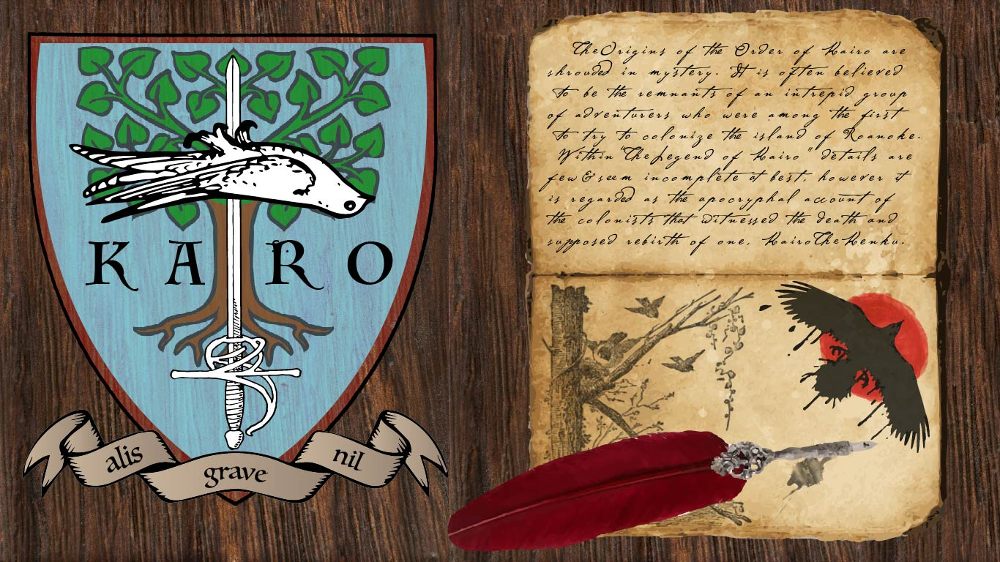
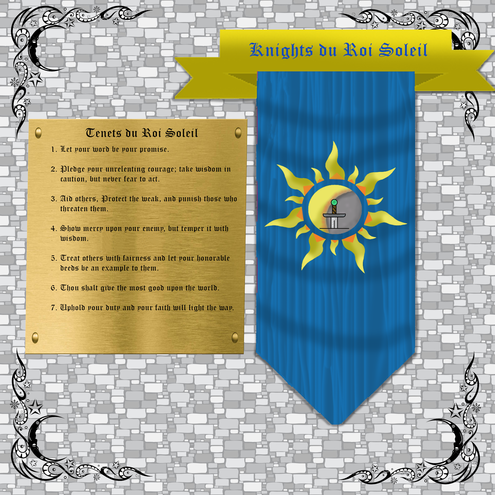

In order to parse this all out, let's divide the lore into two sections.

## Section One, The Occult.

In section one, we will be dealing in terms of the overarching story of Roanoke.

Once there were two Sand Dwarves (Called Brunelocks) who were born to the king of an ancient kingdom named Hiram and Solomon. The two were half brothers, and so Hiram was a prince, and Solomon was his half brother, the son of the King’s affair. Solomon was the older of the two. He was kept in secret, because the King and his wife both thought her to be barren. But late in life the King did have a son with his wife. A prince was born.

And so when the two talented and powerful magicians,**Hiram Abiff (Sympathist)** and **Solomon Cyprian (Prognosticator)** went their separate ways. Both successfully pursued their crafts as their father had done before them. But their successes were vastly different ways. While Hiram Abiff spent most of his Kingship passing the time perfecting the Hermetic art of runecraft and masonry, Solomon chose a different path. Solomon became obsessed with his half brother’s station in life. He raised his family to loathe and hate the Abiff royal line. Sickened at being slighted of what he saw as his inheritance, he became obsessed with seeking the end of the Abiff family line.

Nearly 300 years later, and both dwarves were well past their prime. Hiram had perfected his craft to the point of apotheosis. In honing his craft with his students there had been many who had come to call him a Master. And, his knowledge of how life can be influenced by tapping into and adjusting ley lines by use of masonic magic had caused him to become an ascended creature. And yet, Solomon and his kin (oracles and soothsayers) would always be seeking a vision of a possible future with Hiram dead.

Hiram understood the process he had awoken. He knew that it would infuriate his half brother to no end. But Hiram could not have guessed that Solomon would have turned his eyes to the prophets of the abyss itself,the Sibriex Croatoan.

Croatoan has consumed many since striking his deal with Solomon. A deal in which Solomon gave his body to be consumed by an aboleth to pay a debt owed by the Sibriex. Since then, the descendants of Solomon (now a secret society) known as the Golden Dawn seek to kill Hiram Abiff.

Hiram traveled to the new world to hide behind their barrier, after bartering with the wardens of Arcania, Columbia granted Hiram sanctuary on the island of Roanoke. Which is why this cycle keeps repeating every 50 years. Because that's how long it takes the Sibriex to reform and attempt to come back to (uncharastically) attempt to actually honor its bargain. Which it does for reasons only an unfathomable chained demon pile-orb of fleshy mouth bits can think of.

## Section Two, Secret Societies of the Old World.

#### **Freemasons**: 

The head of the New World Masons, Hiram Abiff stands every morning on the shore of Roanoke island. Every morning he stares out over the water. The Golden Dawn rises every morning. And every morning he looks to the east for any sign of ships.

Currently, the head of the Masons of the Old world is a Yeti named Archivist Daysong. He is the Tir na Nog’s naturalist and always goes by his title of Archivist. His pretense is that he is in search of BigFoot, and other Arcanian Cryptids.But in actuality, Hiram Abiff has summoned him to release the tinkers from the ossuary to help defend him. Now that the barrier is down he fears the golden dawn. The prophesized time when Croatoan’s Hunger to return and fulfil his bargain manifests the ThessalKraken to kill Hiram and all who stand in his way.

#### **Golden Dawn**:

The Golden dawn agent chosen to spearhead this attack is the Ship’s surgeon. Solomon, the all seeing eye, relayed his instructions to this faction of the golden dawn. They have important orders to bring about the end of the freemasons, and usher in the age of light. If they can succeed at their task, the all seeing eye will be released from darkness and their purpose will be fulfilled. The way is difficult, but there is a chance to succeed this time, but only if the Golden Dawn can subtly sabotage the group at certain times to ensure their intended result.

Agents of the Golden Dawn have been hard at work influencing the inhabitants of Roanoke. The way is prepared, but the premonition has foretold of a shipwreck, and a people who must reach out to the inhabitants of the island.

The first task of the Golden Dawn is to delay the voyage if possible.

The next task is to find a way to make the ship sink at just the right time.

### Section Two: The practical secret societies. 

#### **The Order of Kairo**:

After the mission from Spain failed to produce a long term foot hold in Arcania, the Spanish crown simply denied that it ever happened. The loved ones of those who disappeared in the mysterious disappearance banded together to seek answers on their own. Kairo, a member of the British Museum has found a way to search for their families while still getting the government to pay for it.

The Origins of the Order of Kairo are shrouded in mystery. It is often believed to be the remnants of an intrepid group of adventurers who were among the first to try to colonize the island of Roanoke.

Within the “Legend of Kairo” details are few and often seem incomplete at best, however it is regarded as the apocryphal account of the colonists that witnessed the death and supposed rebirth of one, Kairo the Kenku.

#### **Knights du Roi Soleil**: 

The Knights du Roi Soleil represent everything Arcania fears, regardless of whether or not some of their fears are misguided. The will of the gods is vast and varied, but they existed to help and guide mortals through life. Giving them strength when they needed it, and hope when they were without it. Somewhere in the cycle of Croatoan years ago, the <u>Day of the Black Sun</u> commenced and all warmth that emanated from Machidiel's power was destroyed. One man's divine oath before all the living gods of good faith ignited a movement and passion inside the founding order: the Knights du Roi Soleil, the sun king.

The Eclipse Knight who began the order was lost, however his deeds were not forgotten, as the Knights spread their ideals through pure hearts and minds into the world. All those who gave their faith to any God of just nature could find sanctuary within their walls and a purpose within.

The dark days did not cease however, as when tales of a monstrosity so evil had been delivered unto the highest heights of the Celestial mountain palaces of the gods, a great battle took place. The battle of epic proportions could not be contained to that single plane, as the great evil hunger called upon its creations and followers, dividing the gods forces and luring them to the material plane. Catastrophic damage would have been done to all mortals had the gods not brought it to the abyssal Atlantic Ocean. Many gods here suffered casualties of grand proportion. An outcome too costly to be called a victory, for they gave their lives to only delay the inevitable in an unearthly prison, to let its hunger swell to insatiable size.

This pyrrhic success dubbed the <u>Battle of the Atlantic Abyss</u> led for many newer and younger gods to take up the mantle in attempts to guide others and answer upon divine call, however the last battle of the gods solidified the Knights du Roi Soleil's path. It is their belief and practice that through the combined conviction of man and the lost relics of the gods, they can face this ancient evil being and untwist the corrupted souls that follow it.

  
  
On the day of the black sun several gods perished at the hands of the great hunger. From this event the lives of mortal men and women bound together to share an oath that they were taught. They swore to believe in the good faith and divine power that those gods represented, and to uphold their ideals in their absence. The effect is a rotating pantheon of good aligned gods functioning as a sort of divine avengers team as they empower and guide the Knights du Roi Soleil in place of the greater deities that have been corrupted or killed.  
  
Due to this doomsday event, perhaps one of the gods your character follows had perished or been corrupted beyond known repair. If you feel that your character would align themselves with this organization as part of their backstory, or just want to try out the idea of what it would be like to have a character that has faith in a fallen god, post a comment below with your character’s name, the god your character believe(s/d) in, and a quick snippet of how you got involved. This organization is not restricted to Paladins and Clerics and finds many different followers among its ranks. This will be one of the main secret societies/factions present in the season 3 story of Roanoke.  
  
The growing list of deities that have perished or were corrupted by the Hunger are as follows:  
*Machidiel  
Bahamut  
Lathander*

## Secret Society Endings:

### Knights du Roi Soleil Ending:

[<u>Artifacts List</u>](https://docs.google.com/document/d/1Tih6QGIHfkUmVcrjVjpAPipsaJ1yH0lHlG1kskPyRi4/edit?usp=sharing)

### Mason Ending: 

From “The Ossuary” in the week 5 breakdown.

**Exiting the Ossuary,** Hiram of the Brunelocks, Sage of a thousand hidden meanings and master of the Compass and Square takes Archivist Daysong by the shoulders and gives him a playful shove at those assembled here:

“Hiram has spoken to me. He would like me to tell you all a few things.”  
  
“Solomon and Hiram have known one another since before mankind first discovered even the merest cantrip. Their story. Their rivalry and heartbreak have been the underlying influences of lives the world over. Lives of woven momentum strengthen Good King Hiram. He harvests that momentum by being mindful of the way in which it starts was the ultimate truth to which Hiram clings. And so he perfected the cornerstone. A rite to set for the path and make plain that that which is good is that which endures.”

**Archivist Daysong’s face contorts as he thinks about what he is about to say**.

“But the conflict between Hiram and Solomon cannot last forever. Croatoan cannot be killed in the mortal realm to his own Abyss he shall again reform, and the pangs of his hunger will yet again intensify his anguish and his hate. As Archivist I cannot speak for Solomon’s perspective. And that is not my story to tell. But I can tell you about my Brother’s very good friend. Hiram Abiff.”

**He takes a beat to let the importance of his disclaimer be felt, the continues:**

“Now, As I have said: Hiram knows the cycle is near its end, with Solomon approaching and bringing the oncoming Hunger once again to see whom he may devour. He turns to columbia, the warden who first found him after he had become the tinker. In her company he takes solace in her care. But, she is getting restless. She and the Wardens Cascadia and Oro wish to raise a new barrier between the New World and The Old. Only Fontaine dissents, and refuses to help. Shes given in to despair. And pleads to flee. With strife between the wardens, and the Omen of Strangers from the Old World (The third colony of Roanoke) being fulfilled, Hiram made himself ready. He walked from Columbia’s Rosegarden, the very one from which Pym took a cutting.

Once, his closest ally, the sasquatch Bigfoot (my closest friend, and fellow student from our time in my home in Nepal. In... Shangri La) had stood at his side, and alongside them, Pym the dreamcaster. These noble viking warriors were the first of the Old Worlders to discover the New World. And upon their arrival were subjected to a myriad of tests and trials. Hiram and Pym came first to Roanoke, to set it’s first capstone and prepare a rite which would keep this conflict on this island until the resolution was decided. Bigfoot however happened upon the first of the Native Races to live on the Island. The Lagos, and the Wendigo.

It seems now that this would be the way the island would work. Old worlders arrive. Become involved with the inhabitants, grow rapidly in power working alongside one another, just as Solomon answers Croatoan’s pact the moment he is reformed in his Abyss. A cycle uninterrupted for hundreds of years by the Arcanian Barrier. But Solomon knows the way of setting things in motion. He knows just how ensure that there will be enough to feed Croatoan. And how to ensure that Hiram will finally be killed.”

After a pregnant pause he continues:

That is why the island is so different now. It is unlike any other place in the New World. It is a battleground of ideals, and a haven of wondrous creatures and brilliant cultures. It is untouched by the Power the Old World wields. Its guardians are smaller.and its heros are more meaningful. This is the Colony of Roanoke, and it has never been lost. It has been the sacred center of a cosmic family feud.

Hiram is sorry that you are here. He is also sorry for his role in your pleight. Though you fight for your lives, it is he that is ultimately responsible for the danger you face. That is why he offers to take your place. He has spent the past 50 years training a whole host of new Tinkers to take his place. He offers to be a sacrifice to appease the Hunger of the Croatoan. So now it falls to you, will you take Hiram Abiff with you to end the cycle of Roanoke?
