(TRoanoke S3 Week 2 Breakdown

[<u>Draft pdf</u>](https://homebrewery.naturalcrit.com/print/BFl0NsF9h?dialog=true)

[<u>Tir Na Nog stats</u>](https://docs.google.com/document/d/1PaDpQNqaX-6uTxQCmDkNqjqpVJcquSaYtRkCNSzHcd0/edit?usp=sharing)

[<u>Week 2 Cast</u>](https://docs.google.com/document/d/1Zy1rM5aWEzFMdBWE81FmbB76EAAYVf3IgQ2mGYbhpH8/edit?usp=sharing)

[<u>Sets</u>](https://drive.google.com/open?id=1GviUP5vCD5DC0xaBH-sUnQjHNcw0AhxWDtl-4AxIVdw)

[<u>Travel Drama</u>](https://docs.google.com/document/d/1YN-UzOjCMX7zuM3RxaHMQ5MnGqJErkofEIn5R-CGp_g/edit?usp=sharing)

Week two- The Tir Na Nog

**Day Eight**

Saturday 725/2020

**Main Event: Ice Breathing Koi fight.**

**DM invitationals and improv.**

**Midnight (12 AM-3AM)**

**Passenger Deck**

**Early morning (3 AM- 6AM)**

**Cargo bay**

A crate breaks open. A stowaway must have gotten in on the last fishing trip:

An investigation reveals:[<u>Link</u>](https://www.dndbeyond.com/monsters/decapus) A decapus (Only use if there are players online to interact. Otherwise save this until there is someone active.

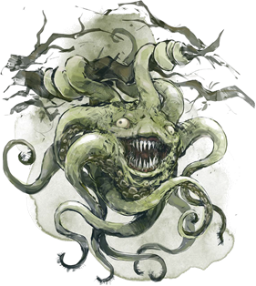

**Morning.(6 AM - 9 AM)**

**Mess hall** [<u>Yasmar Nodrog</u>](https://ddb.ac/characters/26100102/J32fSy)

Menu

“Homard farci aux tacos”

“Pissenlits couverts de ricotta”

**Late morning.(9 AM 12 PM)**

**Bulwark Hallways**

The hallways of the ship include hardwood floors and brightly polished brass fixtures. It is lit by blue drift globes that hover about anyone moving (regardless of whether they are stealthed or invisible (only dispel or an antimagic field prevents them from moving)

Dorfin Hammerfingers is investigating and measuring the interior of his submersible. The tightly wound prussian prefers precision and order. His routine inspection of the interior has revealed that the interior is 7 centimeters bigger on the inside today than it was yesterday. With a huff he says “Excuse me, I need to return to my calibrations.”

Water can be heard pouring in somewhere and then suddenly ceases.

A **hulking crab** is behind you. [<u>Link</u>](https://www.dndbeyond.com/monsters/hulking-crab) for stats.

The Crab has its arms and eyestalks pulled in as though it is hiding.

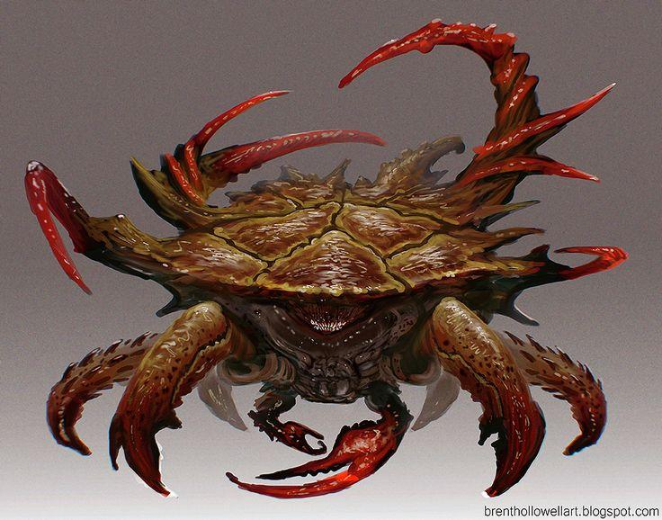

**Main Observation Deck**

A place of relief from the crowded mess of the ship, the observation deck sits on top of the forward Command Deck and overlooks the surroundings through large panes of glass to the front and sides, curving up to connect with the bulkheads.

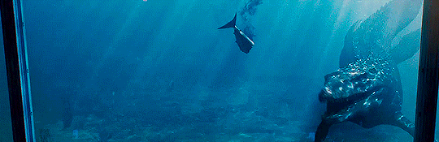

**The Masons**

Mason meeting. The Fogg and Grey Library and Gallery.

The Library and Art Gallery (Also called the “LAG”) Is directly beneath the command deck,and features two spiral staircases that connect it to the Bridge.

The Archivist has brought a limited portion of his personal library.

(Freemasons may use the LAG conference room as their meeting place aboard the sub.)

**Knights du Roi Soleil**

The Aft Observation Deck was down one of those hallways that seemed off limits to passengers aboard the ship, housing a few crates of cargo that obscure the entrance ladder down. After Gnerman sensors helped navigation personnel steer smoothly without the need of an aft lookout, this area became a simple place of solitude while the knights could look out into the calming abyss while conducting their meeting uninterrupted.

**OOK**

Helga’s Mandatory Recreation and Omingmak Milk Spa.

Probably the happiest place aboard the boat, Helga’s Mandatory Recreation is mandatory for all personnel. A fit body makes for a sharp mind, to the Gnomish way of thinking. The Spa also contains an electric eel sensory deprivation chamber that opens to reveal a smugglers hold that is private to the OoK.

**Noon (Noon- 3 PM)**

**Mess hall** [<u>Yasmar Nodrog</u>](https://ddb.ac/characters/26100102/J32fSy)

Menu

“Une chaussure pleine de ragoût”

“Sorbet au concombre fumé”

**Bulwark Hallways**

The hull lurches forward then halts as all the lights turn red. No alarm has been pulled but this jolt and change in atmosphere means something just happened. Hefton Dax is seen yelling for the maintenance crew to figure out what’s wrong.

*Hefton looks for a handful of capable adventurers to help out with a small issue outside the sub. The turbines have caught on a particularly strong portion of a seaweed vine and need to be cleared away.*

**Sub Exterior**  
*Once a handful have been gathered, Hefton brings them to a top hatch and helps them get dressed in Diving Gear.*

(Small encounter with some **kelpies** and clearing away the turbine **100 HP of seaweed to clear away**)

**Afternoon (3 PM - 6 PM)**

**The Observation Lounge**, A drunk Dorfin gives a speech that is amplified magically through the many pipes and air ducts of the sub.

“Guten Abend colonists. Today marks ze first day of our fourth month at sea. Zis iz not a sermon. Every word I speak, you already know. The past three months have been harrowing, and the time confining us has taken a toll. And yet, despite not being able to see za stars above, we know that we are now nearing the utopian New World where we can build the lives vee choose to have. Vee are no longer navigating za waters of the Old World however. We are now nearing the end of the Koi barricade. Within the week, we will be landing. Safely landing on those stable shores. On a personal note, I vill be conducting experiments using rare Arcanian sea salts now that we are geographically aligned to such experimentation.

**Evening (6 PM-9 PM)**

**(Passenger Deck) Koi Fight:**

Use Oaken Bolter harpoons to fire at Ice Koi. Use a young white dragon reskin for each of the KOI with fly speed as swim speed.

Base weapons on an Oaken Bolter: [<u>Link</u>](https://www.dndbeyond.com/monsters/oaken-bolter)

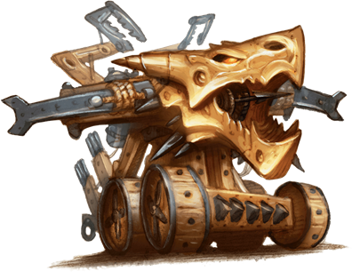

**Late night (9 PM 12 PM)**

**Day Nine**

Sunday 07/26/2020

**Main event: Invitationals**

**Midnight (12 AM-3AM)**

**@everyone** Anyone asleep right now is having dreams about their tongue falling out.

**Early morning (3 AM- 6AM)**

**Morning.(6 AM - 9 AM)**

**Mess hall** [<u>Yasmar Nodrog</u>](https://ddb.ac/characters/26100102/J32fSy)

Menu

“Déjections du seigneur de bord”

“imiter les bonbons”

**Late morning.(9 AM 12 PM)**

**Passenger Deck**

**Observation Deck**

The beautiful expanse of water shimmers from the penetrating rays of the morning sun. With few landmarks anywhere, the sub feels perpetually frozen in place. The only reminders that you are keeping a steady pace are the occasional creaks and thumps whenever the submarine hits bouts of seaweed or a school of fish, not knowing how to react to this giant metal creature they see.

**Noon (Noon- 3 PM)**

**Mess hall** [<u>Yasmar Nodrog</u>](https://ddb.ac/characters/26100102/J32fSy)

“Cire d'oreille d'éléphant”

“saucisse mutilée flamant flamant”

**Command Deck**

The Command deck or “Bridge” is one of the more open spaces on the sub. Its high ceilings are there to support one of the two large windows in the sub used for navigation. Arcane runes are etched into the glass and occasionally jolt of blue energy trace their markings to outline images seen through the glass. Additionally there is a pilot’s wheel, and several levers used to control the sub. The captain has a desk behind the pilot.

**Afternoon (3 PM - 6 PM)**

**Machine room:**

- A pool of ink is flowing uphill in the machine room. It spells out the word “kvatch?”. Investigation check. An investigation will reveal that one of the wall panels is infact a door with no handle that has been completely painted over several times.

- Tracing its source will find Dorfin Hammerfingers writing a mixture of alchemical, mathematical and arcane writing on the wall across from a painted over door that is covered in locks and chains.

- When asked about it, he will explain that he is “Calibrating the transplanar fulcrum so that the sandbags don’t need to be adjusted. It is back breaking work when it goes wrong.”

<!-- -->

- When asked about the painted over door, Dorfin will reply “Zat iz zee Kavatch Hatch, It holds my… motivation for zee creation of the submersible.” He writes the words “What doth the Prey pray, when zey eat at it like that?” like an imaginary list on the dirty condensation of the observation room glass.

**DO NOT POST:**There is a door on the ship that has been painted over. It is also trap locked and arcane locked.

This door, the “Kavanatch hatch” leads directly to a Sibriex fight for the first 5 players to enter.

Dorfin Hammerfist has bound elementals in the engine room.

**Evening (6 PM-9 PM)**

**Main event: (Command Deck)**

**Late night (9 PM 12 PM)**

**A Swarm of Sea Lions have stolen a vital ship component from the exterior of the ship. Go retrieve it.**

[<u>Link</u>](https://www.dndbeyond.com/monsters/sea-lion-monstrosity) Multiply base hp x5 and call it a swarm that moves on a single init.

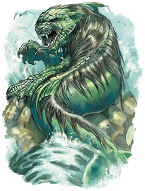

**Day Ten**

Monday 07/27/2020

**Main event: Mantapolis**

**(Sub Exterior) during evening block.**

**Midnight (12 AM-3AM)**

**Command Deck**

Dorfin calls out over comms that can be heard everywhere aboard the ship, except inside the passenger deck rooms. “Vee are approaching zum sort of structure up ahead. Our scanners indicate zum zort of life vorce pulsating from it, but zere aren’t any lights or anything. Vee vill be near it in a few hours''

**Early morning (3 AM- 6AM)**

@everyone The words “Prey” and “Eat” will replace every written word in the sub for these four hours.

**Morning.(6 AM - 9 AM)**

**Mess hall** [<u>Yasmar Nodrog</u>](https://ddb.ac/characters/26100102/J32fSy)

“Salade de myrtille et de tabac”

“Tarte aux fesses de singe”

**Late morning.(9 AM - 12 PM)**

**Command Deck**

Florian points at the approaching outline of several ruins, “This is le place. Would you set us down over there, s'il vous plaît? This is the city from the legends I believe. There’s something my organization needs here.”  
  
Captain Amaya looks him over, reading him before looking back through the periscope. “Hammerfist,” she calls across the room, “bring the Tir Na Nog about; anchor her two klicks North of the ruins. Careful about those reefs, I don’t want anymore scrapes along my hull.”  
  
The ship adjusts course and follows outside the city, avoiding the coral reef barriers and outcroppings of rock that seem to have once formed a wall around the city ruins. Schools of tuna spread apart around the ship. The water itself seems to darken to a sickly green color the closer you get to the city. Local flora seems withered and twisted aside from small groupings of seaweed.  
“We’ve found Mantapolis…” Florian mutters in awe. He giddily walks out of the command deck to gather some help. Dorfin, the pilot, breathes out in anxiousness, “A’ve got undt bad feelin’ about zis.”

*Florian spends this remaining time between the start of the adventure and now to collect adventurers willing to help and procuring enough diving suits from storage.*

**Noon (Noon- 3 PM)**

**Portside Airlock**

Along the creaking metal hallways lies a heavy metal door with a viewport through it. Inside is a metallic watercraft in the shape of a smaller submarine fit for three people. A yellow clasping arm and what looks like an affixed lightning prod adorn the front. Encased behind thick layers of glass stand several adaptable diving apparatuses. A control panel lies on the other side of the door requiring a key to open the floor platform beneath the miniature submersible.

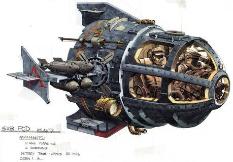

**Afternoon (3 PM - 6 PM)**

**Portside Airlock**

"I'll be in le submersible. I can take two with me, but the rest will need to wear the suits, they should give several hours of air. He takes 3 suits into the sub and sets them inside a storage compartment. The plan is to dive towards le structure centrale and find the palace entrance somewhere within the city."

When everyone suits up Hitch watches from inside the hallway beside the airlock lever. She closes the inner door and nods to Florian who closes the cockpit of the miniature sub. The sliding airlock door hisses with a cold snap at the end. A spiral opening unscrew beneath the pod and begins to fill the room with ocean water.

**City of Mantapolis**

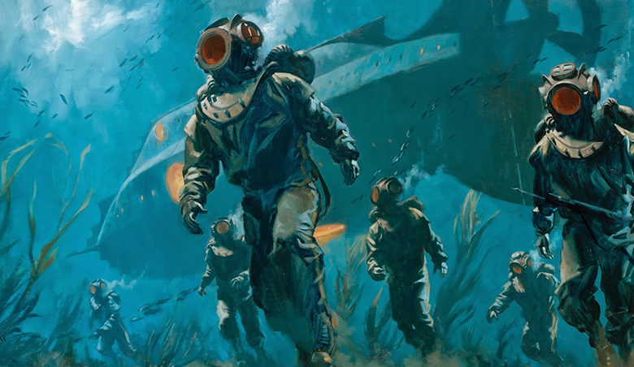

One by one you drop out of the hatch, floating down towards the remains of a cobbled road. Florian handles the pod, following downward and providing a straight beam of radiating lamp that reaches 80 ft forward and covers a targeted area of 20 ft akin to a bullseye lamp. With the light everyone safely makes it to the floor. The Tir Na Nog fades back into the murky ocean with only luminescent windows and front spot lights providing distinction.

Petrified coral walls of muted orange and green hues lay in ruins beside the winding roads. Thick colonies of black spotted prawns scatter from piercing seaweed spouts, reclaiming the Mantapolitan structures.

(riff off of character exploration until greater player participation occurs, then continue below with kelpies encounter)

The outline of a crashed tiled dome stands before the group as you slowly swim and walk through bits of sand and over stone steps. Although hearing is all but completely impaired, the lapping of seaweed in the current and soft thuds of boots echoes through the helmet in your suit. A crack in the roof of the dome seems to emit bouts of swirling dust in the water as the lights of the mini sub land on it. The opening seems large enough to fit the mini sub with room to spare.

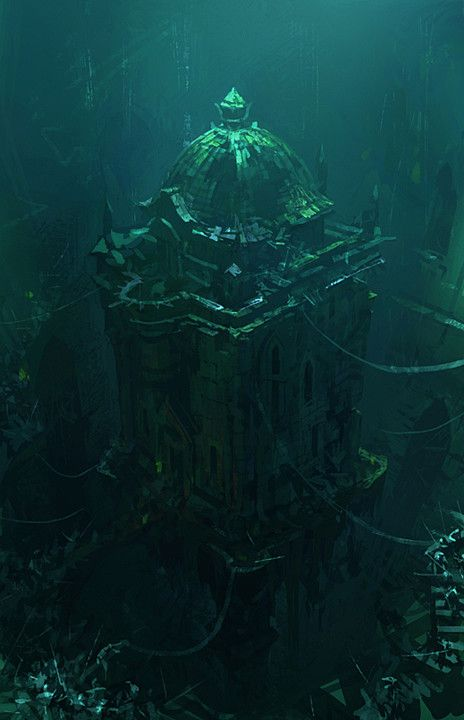

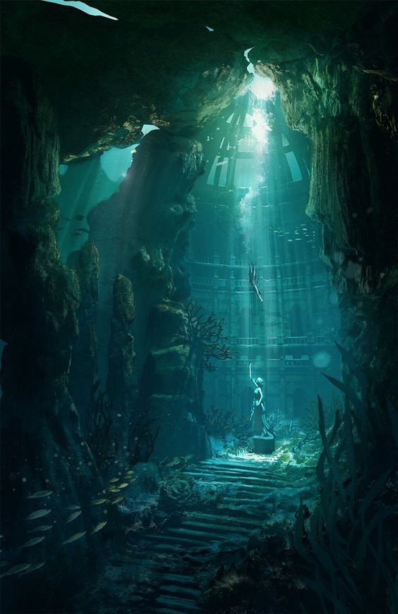

The sand dust fills everyone’s visors as you descend unto an abandoned undersea garden with a statue in the center of it. The statue has crumbled in many places, but the face is still intact.

***DC 14** religion to determine that this was a statue of Melora*

After a moment spent taking headcount, the swirling sand dust picks up (effects of fog cloud) and creatures made up of seaweed masses shoot out to attack.

Roll Initiative

Once the dust has settled, a great sorrow is left with the empty cavernous park that you reside in.

***DC 16** investigation reveals 1400 gp worth of obsidian shells placed in a small chest embedded in the statue. Perhaps an offering? Perhaps not.*

With nothing left here, Florian takes the sub back out.

**Evening (6 PM-9 PM)**

**Main event:** **Mantapolis**

**City of Mantapolis**

Despite the desolation of sentient life, the land still feels like its actively dying rather than completely dead. Bits and bobs of plant life or schools of fish, albeit panicked and few in number, can be seen hiding in peppered holes along the aged foundations of ruined buildings.

The way forward seems unsure, the palace would logically be near the center of the once Utopian city, however with all of the crushed or flattened structures, one can't be too sure. Larger pillars like that of a fortification peek over a rock arch to the east, while the West lies a lowered semi circular foundation of pointed forums. To the North awaits a portion of a Mantapolitan tower sunken in the sand and rock bed.

*Eastern Barracks:*

A breeze of strong current slows down your progress making it difficult to keep balance as you walk. A small navy glow can be seen ahead coming out of a window-like opening alongside a brick wall. Climbing up a wide berthed cobblestone road, the intact remnants of a bastioned barracks sit stoically.

Inside are coral versions of standard weapons, a braided whip of seaweed, and 4 sets of studded leather (sharkhide) armor that can be repaired with mending.

*Western Forums:*

The path towards the forums is partially covered in sand and plant life attempting to erase the memory of what was once Mantapolis. A crashed shell resembling a chariot lays in a scattered wreck beside an intersection of cobbled street. Great arrays of pillars holding up fragmented bits of angular or domed roofing stand 60 to 80ft tall. Their towering presence shows the majesty of what was once created, but piques a tale of worry at the severity of its downfall. Crumbled statues lie in the center of the semi circle with trade goods and broken carts half buried in sand along the sides. This was once a place of trade and enterprise.

*Half Sunken Palace:*

Approaching the tower brings into view a clearer image of what was once a palace. The tower connects to several bridges and shorter yet larger cylindrical wings of the palace with pointed ceilings. By the time you make it up the stone bricked steps, the grandeur of this castle dwarfs you in comparison.

**DC 15** perception check (2 people can try) to notice that the Tir Na nog's lights are nowhere to be seen.

Obsidian doors block the main entrance to the palace. Ornate carvings of octopus tentacles and sea flowers decorate the outside and trim.

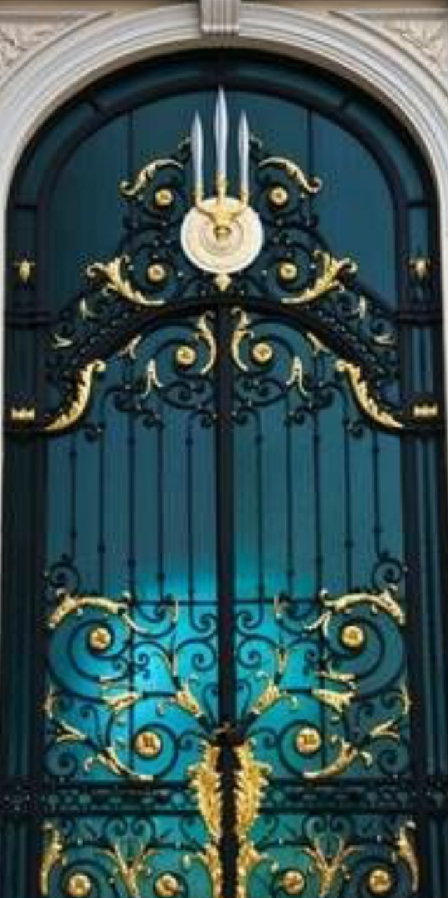

**DC 16** thieves tools or **DC 75 (**4 people cumulative athletics check 1 try. If failure then roof looks like it will crumble if they try to force it again) to open the door. Failure means they must find an alternate route that houses 3-5 Merrows that will attack them.

The gate opens with a creek that pierces the thick viscosity of the water disturbing a wave of aged sand as it picks up with the new current leading down the dark hall. Florian can be seen putting on a suit and exiting the sub to join the group on the ground.

(urge players in the sub to Don suits and exit as well)

**DC 14** Perception (from players with darkvision) to see 2 figures dashing away from 60ft inside

Going down the hallway the floor descends slightly. A door to the right seems blockaded off with layers of sand dust undisturbed for many many years. Fixtures where light may have emanated from lie crooked or shattered on the floor. The floor descends beneath a balcony with another hallway behind it. A mosaic depiction of a Triton king overlooks the party with eyes of daggers, placed to always make eye contact with guests.

*After players make it through the hallway, silhouetted figures pop down behind them and slam trident against the corners of the doorframe causing it to collapse.*

"En Garde! We're not alone!" he unclips his rapier from his belt and looks out at the edges. The room opens up into a much larger foyer with a pair of tattered red carpets leading past the edges of your visibility, deeper into the palace. The room is pitch black with exception of the light sources you possess. Wading around several crumbled statues in a column cast shadows away from your lights. A series of rafters decay and hang from the ceiling precariously all throughout the room.

Roll Initiative vs 1d3 sea hags and 1d4 merrow

Continuing forward you find yourselves at the center of what was once a throne room.

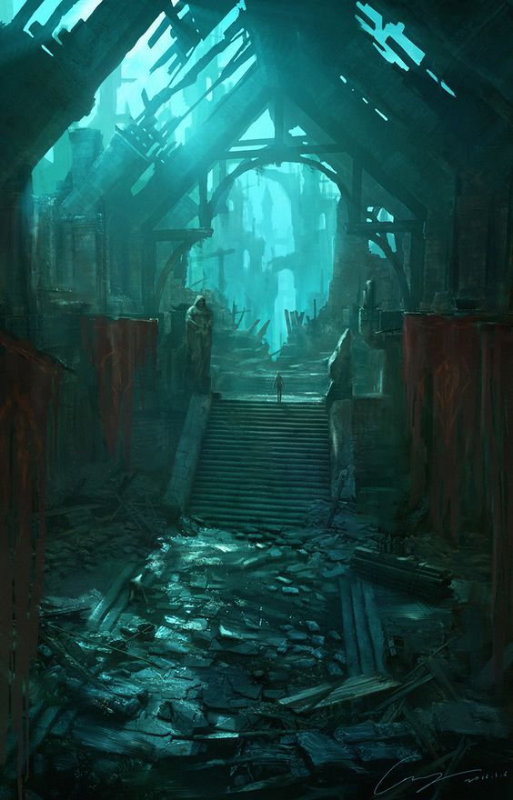

"Magnifique, now we need to find le control to the inner sanctum"

Alongside the armrest of the throne are 3 slots where a hilt of a weapon could be place in. The writing seems to be in an archaic form of Aquan symbols.

***DC** 11 investigation while fluent in Aquan to determine the rudimentary meaning behind them as listed below.*

<u>Slot 1 Sanctum</u>

(see below)

<u>Slot 2 Floor Pit</u>

(a hole opens underneath 1d6+1 random players with a current that sucks them in, DC 14 dex or take 2d8 piercing damage from spike)

<u>Slot 3 Alarm</u>

A loud shrieking siren goes off as two doors open on either side holding a Giant Shark (reduced health)

*Sanctum:*

Behind the throne a loud scraping sound emits as stones rub against one another. Two sets of intertwining stairs head into the darkness below. You shine your lights down and the glint of gold calls back.

In a room full of golden walls reflecting the light around you, a hallway continues to a circular end room. An obsidian monolith lies in the center, completely smooth except for the imprint of a hand. Along the wall, 3 Triton skeletons lay. One is covered in a fish scale full plate (full plate, no disadv on stealth and allows swim speed equal to walk) while two others seem to have a crown and tiara. Something seems to poke out behind the monolith. As you approach a voice appears loudly and frightening, as if a warning.

*Play Recording*

The other side of the monolith there seems to be a skeleton with bits of flesh on it, as if it were killed sometime after the other deceased were. It appears to be a human in a diving suit. Their legs are missing as it's back rests upon the monolith. A moldy satchel at its side.

Looting the room you find:

- 2 Crowns worth a total of 5k gp (pearl of power inside one of them)

- Fish scale full plate (no stealth disadv, swim spd equal to walk. Counts as med armor)

- "Wave Break" (trident with 1/day casting of tidal wave)

- Watertight map of a tunnel system that leads below the palace

- Waterlogged spellbook with the spells magic mouth and dark vision still legible

- 4 scrolls of darkvision

- +1 Coral Scimitar 1d6+1

- Research notes

Expedition day 1 log:

My team and I found the inner sanctum but are yet to gain access to the tunnel entrance. It's said that the monolith functions as a tombstone for a few of the gods that perished on the day of black sun. We left the royal family of Mantapolis undisturbed out of respect; our findings down below should prove much more valuable than the items they had on them. Once we figure out how to activate the monolith, we will be able to descend further. Our ship has been able to safely anchor without problem, giving us enough time to travel back and forth once our suits need replenishment.

Expedition day 2 log:

After some trouble with the monolith in which it caused a member of my team to experience hallucinations and scream, we were able to finally open the hatch down below. Impossible to see with normal lights the darkness seemed supernatural. Good thing I came prepared. We left Saren to stay in the chamber, she deserved a rest after that incident. The monolith seems to latch on to a particular type of person. One of our newest members of the team, a regular owlbear scout named Edan was able to open the hatch just fine.

Update - we were able to go down just fine but it was eerie to say the least. We were drained of oxygen enough that we decided to come back after a good rest. When we returned, Saren was nowhere to be found..

Expedition day 3 log:

As I am writing this my team has uncovered several artifacts of divine power below the sanctum. An even more intriguing prospect is what looks to be a portal at the end of the tunnel! I couldn't even begin to fathom the possibilities that this portal could contain. It seems to date back millennia before even Mantapolis was built but just so happened to perfectly rest above it.

This discovery will without a doubt become the defining discovery of my decades of research. The uncovering of 5 gods AND the portal. After replenishing ourselves I will be sending a team to explore the other side. This is so exciting!

*To activate the Monolith a character of any good alignment may place their hand upon the imprint without issue. Characters not of this alignment will have to make a DC 17 wisdom save or become frightened for 2 hours, blubbering nonsense and screaming, unable to cast spells or speak for this time. They may remake the save every 15 minutes to end this effect. Their mind is filled with twisting grafts of faces and flashes of consumption of humanoids inside the mouth of a large sea creature.*

The cave below is filled with magical darkness, only those with magical darkvision can see inside it. Casting the light cantrip or holding a magically luminous object sheds 5ft of dim light.

*A hunting horror circles the party as they enter to block any escape it attacks once it does or if it is spotted with a DC 17 perception check with magical darkvision*

*Roll Initiative after surprise attack vs 1 hunting horror and d2+1 Merrow depending on party health/resources*.

Upon its defeat a bright light floods the cavern blinding everyone. The flash dissipates and brings the darkness along with it. The dug up Graves are clearly marked with a shimmering ethereal blue aura emanating from it. Florian walks inside of it and his sigil begins to glow blue and gold from the light. All KRS members receive a divine spark boon. The glowing sparks into lightning and arcs inside of each of you. From now on, 1/long rest you may add 1d8 lightning to an attack you make. Non KRS members do not feel anything as they enter the field.

Searching the room you find:

- Graves of 5 gods partially dug up

  - Melora (Mask of Melora gain +1 to AC when worn, can cast protection from energy. 5 charges DC 18 con check daily to regain 1 charge.)

  - Chauntea (Bracers of Chauntea wearer is always under the effect of barkskin, cast cure wounds at 2nd level 1/day)

  - Kord (Warhammer of Kord cast branding Smite 1/day effects are lightning damage)

  - Lathander (+1 Shield of Lathander allows user to inflict radiant damage instead of normal damage 3/day)

  - Ilmater (Blood red cord wraps allows user to receive 2 necrotic damage {ignoring resistance and immunity} to heal 1 hp of touched creatures as an action. Also allows casting of life transference with 3/4 charges remaining. Roll d20 at beginning of day, 11-20 item receives 2 charges, 3-10 item receives no charge, 1-2 item loses all charges of life transference and cannot be replenished)

Leaving the palace is simple enough but it seems that the city has awakened. Undead-like Triton shuffle slowly in the water throughout the streets. They seem stirred by something yet are not overtly hostile enough to attack. They seem to begin shuffling towards you from crumbled ruins and alleyways as if to block your escape. They recoil away when lights from your suits aim at them, however you're not sure how long it will be before they try to brave the lights.

**DC** 10 survival check to find a secure path outside of the city. Otherwise undead Triton try to grapple you and break your suit.

Once outside the jagged pillars and building debris Florian activates a beacon inside of the miniature sub to call the Tir Na Nog. After half an hour, the sub picks you all up as you witness a horde of lumbering Triton shamble towards the edge of your rock outcropping. You safely board the vessel and it moves to a safer part outside the city.

Adventure Outline:

1.  Florian has Amaya stop the ship when he wishes to search for Mantapolis in this area based on legend

2.  Organizes expedition parties with suits and mini sub to go down

3.  Finding ruins of the city

4.  Kelpies lurking about

    1.  Losing Sight of the Main Sub

5.  The palace ruins

    1.  Sea Hags (1:5 players) and Merrows (1:6 players)

6.  Inner sanctum

    1.  Knowledge about the opening where they teleported the hunger and fought in a nearby deep bluff inside an abyssal cavern

    2.  Lore about the great eel, the hunger, and a hint of history about the Gods' battle against it

    3.  Monolith in the middle

    4.  Final Warning

        1.  Eerie Magic Mouth Recording [<u>https://drive.google.com/file/d/1uZ5pgjKy8lxoo-6sZyyZyT8VYdDmovZ3/view?usp=sharing</u>](https://drive.google.com/file/d/1uZ5pgjKy8lxoo-6sZyyZyT8VYdDmovZ3/view?usp=sharing)

            1.  "The Monolith was made to seal its contents down below. Don't open the gate, I repeat, don't activate it! My team…oh gods, my poor team.." the transmission cuts off with the sound of a creature shrieking the researcher's scream.

        2.  Music: [<u>https://drive.google.com/file/d/1oKdO8L6yzvKSx9SNnbt06ehqfQnbeuA7/view?usp=sharing</u>](https://drive.google.com/file/d/1oKdO8L6yzvKSx9SNnbt06ehqfQnbeuA7/view?usp=sharing)

        3.  (Attain [<u>THIS</u>](https://www.youtube.com/watch?v=b75EpoF1W88) feeling)

7.  Abyssal Cavern

    1.  Excavation site that is a portal to the abyssal. Perhaps Croatoan regenerated and emerged here at some point?

        1.  Deceased excavation/explorer team

        2.  Track marks of a large creature

            1.  Tentacle claws?

    2.  Hunting Horror, 2-4 Merrows

        1.  Magic KRS Mcguffin

        2.  God weapon/armor

        3.  Divine Blessing of Power

            1.  1d8 lightning added to an attack 1/long rest

    3.  Returning to the sub

        1.  Decimated 1 int Tritons and Chinnokin zombying about. Stirred by something (not hostile, but are borderline aggressive in trying to make characters remain in the city)

**Late night (9 PM -12 AM)**

**Passenger Deck**

**Day Eleven**

Tuesday 07/28/2020

**Main Event Mantapolis 2. Sub Exterior during evening block.**

**Midnight (12 AM-3AM)**

**Cargo Bay**

**Hezrou**

[<u>Link</u>](https://www.dndbeyond.com/monsters/hezrou)

This Enemy is known for having a potent and bad smell. It is aboard the Tir Na Nog because it is an abyssal follower of Croatoan and he is trying to get a message to solomon. Improv a bad smell coming from the Cargo bay and then hit them with it. The Message reads: “Surely My Dearest Wormwood, Hiram hides within the Ossuary. If you cannot find him, take solace that you will serve to feed the hunger”.

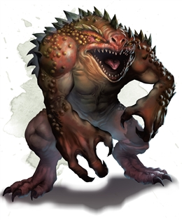

**Early morning (3 AM- 6AM)**

**Mess hall** [<u>Yasmar Nodrog</u>](https://ddb.ac/characters/26100102/J32fSy)

Menu

“Haricots explosifs avec fondant d'abricot prédigéré”

“vésicule biliaire cygne”

**Morning.(6 AM - 9 AM)**

**Passenger deck**

A series of 3 fast beats, then four slow beats, then three again repeat throughout the sub. Somewhere a baby is crying. No one can find it, but it's safe to assume that some one must know what's going on with that. I hope.

**Late morning.(9 AM 12 PM)**

**Living CloudKill**

[<u>Link</u>](https://www.dndbeyond.com/monsters/living-cloudkill)

Sometimes the pipes in the Tir Na Nog burst.

This is what comes out:

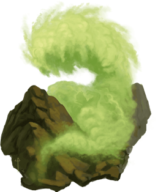

**Noon (Noon- 3 PM)**

**Mess hall**

Menu

“Plumes de corbeau grillées avec sauce aux anchois”

“une demi-banane sautée dans un fond de bernache”

**Afternoon (3 PM - 6 PM)**

**Evening (6 PM-9 PM)**

**Main Event Mantapolis 2**

**(Sub Exterior)**

Per Ian’s notes:

**Kairo’s deep dive.**

- Upon hearing rumors of the sight of a lake under the sea. Kairo perks up and mentions the legend of the Lake of the Lost. He rallies the team to go on an expedition to see if the rumors are true. If they are then this would mean amazing things! Imagine obtaining an invaluable vial of the deuterium waters of the lake for the collections of the museum.

- Little do they know, the lake yearns for sacrifices. The player’s are greeted by two agendered twins that walk on the surface of the heavy water. They speak almost in unison but will finish each other’s sentences and emphasize words by saying them together. They tell the players that “You have found the Lake of the Lost, not many souls have this path crossed. With such gains what shall you lose? Best be wise else, we’ll choose?” Facsimiles of the characters form out of the heavy water and beckon the players to sacrifice something of themselves to the lake.

**If they all sacrifice something:**

- They get a potion that has all of these effects. They gain a swim speed of 40, can breathe water, gain truesight. Those who imbibe the potion will begin to see all the lost souls of Mantopolis staring at them in creepy fashion. Do the characters seek to give them rest? They may as the twins. The twins will point them toward the underwater temple of the Wastrilith. This demon has been corrupting the site if Mantapolis for an untold amount of time. Likey a contributor to the fall of the civilization, it corrupts the waters around its lair and controls water to attack its foes. If th

**If they fail to sacrifice enough:**

- Heavy water versions of their fears manifest on the surface of the lake shifting out of the twins of themselves. Puddleshifters (dopleshifter stat block).The summoned beings try and drag the trespassers into the heavy waters below. They relent if they sacrifice something precious.

<!-- -->

- As within the weird spell: Drawing on the deepest fears of a group of creatures, you create illusory creatures in their minds, visible only to them. Each creature in a 30-foot-radius Sphere centered on a point of your choice within range must make a Wisdom saving throw. On a failed save, a creature becomes Frightened for the Duration. The Illusion calls on the creature's deepest fears, manifesting its worst nightmares as an implacable threat. At the end of each of the Frightened creature's turns, it must succeed on a Wisdom saving throw or take 2d10 psychic damage. On a successful save, the spell ends for that creature. Recharges on a 5 or a 6.

**Late night (9 PM 12 PM)**

**Observation deck**

Leaving Mantapolis

**Day Twelve Wednesday**

Wednesday 07/29/2020

**Main Event Duckton.**

**(Sub exterior) during evening block.**

**Midnight (12 AM-3AM)**

**Early morning (3 AM- 6AM)**

**Mess hall** [<u>Yasmar Nodrog</u>](https://ddb.ac/characters/26100102/J32fSy)

“Une chaussette pleine de café, une demi-union et un lacet”

“dents de dauphin crues”

**Morning.(6 AM - 9 AM)**

**The Door**

The Letter C in every language is carved into the door. Anyone with see invisibility on or true sight would see an unseen servant scratching at the door.

**Late morning.(9 AM 12 PM)**

**Passenger Deck**

**Bulwark hallways.**

**Noon (Noon- 3 PM)**

**Mess hall** [<u>Yasmar Nodrog</u>](https://ddb.ac/characters/26100102/J32fSy)

**Afternoon (3 PM - 6 PM)**

**The Library**

**Mason Meeting**

**Evening (6 PM-9 PM)**

**Main Event**

**Sub exterior**

[**<u>Duckton</u>**](https://docs.google.com/document/d/1PjR1GPCAUKDj5vlDkLajLciuHzT5QcrsqWDqBIw9bLg/edit#)

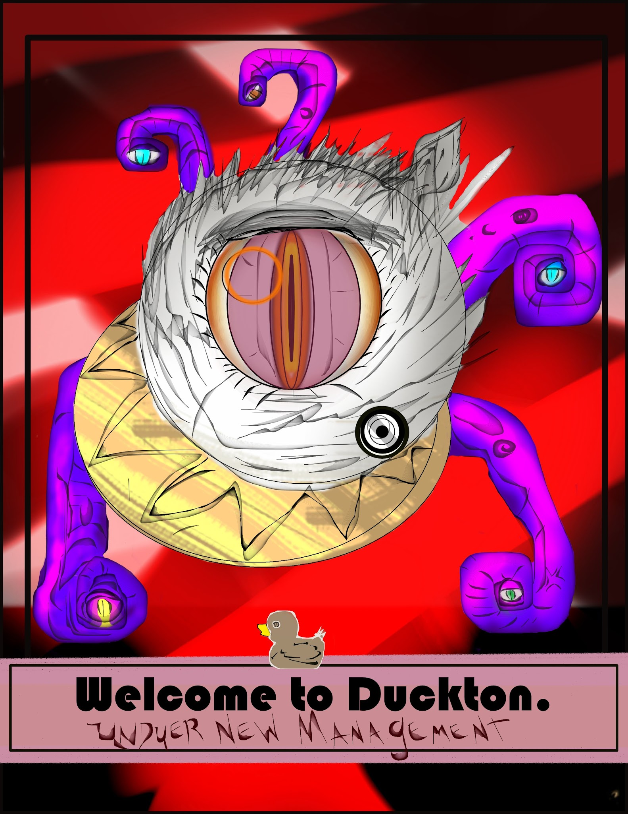

**Late night (9 PM 12 PM)**

**Day Thirteen.**

Thursday 07/30/2020

**Main Event Monstrum Ex Machina.**

**(Engine room) during Evening block.**

**Midnight (12 AM-3AM)**

**Early morning (3 AM- 6AM)**

**Mess hall** [<u>Yasmar Nodrog</u>](https://ddb.ac/characters/26100102/J32fSy)

“lait d'orignal aux lèvres de poulet salées”

**Morning.(6 AM - 9 AM)**

**Late morning.(9 AM 12 PM)**

**The door.** Intentional TPK disaster.

The Door handle appears. Before hitting the spoiler quotes, read below to see if someone else did it first. Also be warned. This is BFDM on hard mode.

Turning the handle reveals:\|\| Congratulations. You found the game’s first ending. Should you survive, you will have officially won the game.

Behind the door, you and four willing players of your choice will travel back in time to face the Sibriex before he ever began the Croatoan Cycle. If you and four other players can beat croatoan, I’ll talk to you personally about what you might like as a reward. If you do choose to enter and perish, it's real, and your character is dead. You will need to reroll and talk to a DM about getting you a backstory to fit the circumstances. So… Do you enter, and if so, who do you pick to battle alongside you?If are the first person to read this type the word “swordfish” below. This is your invitation. If you read this and someone has already typed the word sword fish then if the first person goes in, you must go with, for failing to read the directions. Sometimes spoiler quotes are trapped.\|\|

Discussion

**Noon (Noon- 3 PM)**

**Mess hall** [<u>Yasmar Nodrog</u>](https://ddb.ac/characters/26100102/J32fSy)

“placez treize pièces d'argent dans la soupe pour les convertir en platine”

“saltines illimitées”

**Afternoon (3 PM - 6 PM)**

**Passenger deck**

**Living CloudKill**

[<u>Link</u>](https://www.dndbeyond.com/monsters/living-cloudkill)

Sometimes the pipes in the Tir Na Nog burst.

This is what comes out:

**Evening (6 PM-9 PM)**

**Main Event**

**Engine Room**

[<u>Link to rob’s notes</u>](https://docs.google.com/document/d/1sYN7P7Hygexi5rlvLMzvE4qL5bCkX8Nn0UhtYINrzOk/edit?usp=sharing)

**Late night (9 PM 12 PM)**

**Day 14**

Friday 07/31/2020

**Voice Event: Wreckage of the Falmoth**

**(Sub Exterior) During the Evening and late night blocks.**

**Midnight (12 AM-3AM)**

**Early morning (3 AM- 6AM)**

**Mess hall** [<u>Yasmar Nodrog</u>](https://ddb.ac/characters/26100102/J32fSy)

“demandez une serviette.Vous trouverez treize pièces d'argent dans cette soupe”

“cheveux nains en sauce rouge”

**Morning.(6 AM - 9 AM)**

**Late morning.(9 AM 12 PM)**

**Noon (Noon- 3 PM)**

**Mess hall** [<u>Yasmar Nodrog</u>](https://ddb.ac/characters/26100102/J32fSy)

“rosée de montagne et copeaux de fromage”

“un sandwich au jambon ordinaire”

**Afternoon (3 PM - 6 PM)**

**Living CloudKill**

[<u>Link</u>](https://www.dndbeyond.com/monsters/living-cloudkill)

Sometimes the pipes in the Tir Na Nog burst.

This is what comes out:

**Observation Deck**

**Evening (6 PM-9 PM)**

**Voice Event [<u>Link</u>](https://docs.google.com/document/d/1CIlgSOsOfkA4_kkM12Th1BTowWGk8v0z7kHzb7yq0cQ/edit)**

**Late night (9 PM 12 PM)**

**Voice Event**
