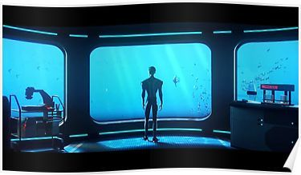
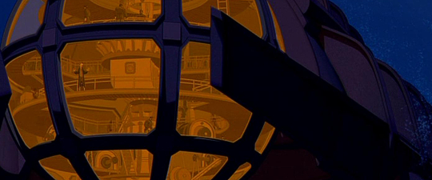

Roanoke S3 2.1

**Week Two Set List.**

The Tir Na Nog. ([<u>Statblock</u>](https://imgur.com/a/K23mPA4))

(Sub interior)

**Player Hubs:**

- Passenger deck

Infinite rooms (for our needs) that house 4 passengers each. List to be randomly generated with some weight artificially given to ensure an even balance of classes.

- Bulwark Hallways

The hallways of the ship include hardwood floors and brightly polished brass fixtures. It is lit by blue drift globes that hover about anyone moving (regardless of whether they are stealthed or invisible (only dispel or an antimagic field prevents them from moving)

- Main Observation Deck

A place of relief from the crowded mess of the ship, the observation deck sits on top of the forward Command Deck and overlooks the surroundings through large panes of glass to the front and sides, curving up to connect with the bulkheads.

- Cargo Bay

- Mess Hall Une forte odeur de poisson

**Exposition Dump**

- Command Deck

The Command deck or “Bridge” is one of the more open spaces on the sub. Its high ceilings are there to support one of the two large windows in the sub used for navigation. Arcane runes are etched into the glass and occasionally jolt of blue energy trace their markings to outline images seen through the glass. Additionally there is a pilot’s wheel, and several levers used to control the sub. The captain has a desk behind the pilot.

Base weapons on an Oaken Bolter: [<u>Link</u>](https://www.dndbeyond.com/monsters/oaken-bolter)

- Captain's Quarters

Captain Amaya’s private quarters also double as a situation room. Many maps and navigational equipment are strewn about the room.

Captain Amaya’s bed room is inaccessible to anyone that does not have both her key and her password. The password is “mistaken.”

Her room is sparsely decorated, and with the exception of a large steel safe, she appears to have brought little other than clothing with her.

- Weapon Batteries

- Portside Airlock

Along the creaking metal hallways lies a heavy metal door with a viewport through it. Inside is a metallic watercraft in the shape of a smaller submarine fit for three people. A yellow clasping arm and what looks like an affixed lightning prod adorn the front. Encased behind thick layers of glass stand several adaptable diving apparatuses. A control panel lies on the other side of the door requiring a key to open the floor platform beneath the miniature submersible.

**Secret society locations:**

- Masons: The Fogg and Grey Library and Gallery.

> The Library and Gallery (Also called the “LAG”) Is directly beneath the command deck,and features two spiral staircases that connect it to the Bridge.
>
> The Archivist has brought a limited portion of his personal library.
>
> (Freemasons may use the LAG conference room as their meeting place aboard the sub.)

- KRS: The Aft Observation Deck was down one of those hallways that seemed off limits to passengers aboard the ship, housing a few crates of cargo that obscure the entrance ladder down. After Gnerman sensors helped navigation personnel steer smoothly without the need of an aft lookout, this area became a simple place of solitude while the knights could look out into the calming abyss while conducting their meeting uninterrupted.

- Golden Dawn. The Operating Theater.

> The Operating Theater is the most advanced medical facility aboard any ship currently at sea. White tile shows brownish red blood stained grout. This is the meeting place for the Golden Dawn.

- OoK: Helga’s Mandatory Recreation and Omingmak milk Spa.

> Probably the happiest place aboard the boat, Helga’s Mandatory Recreation is mandatory for all personnel. A fit body makes for a sharp mind, to the Gnomish Gnerman way of thinking. The Spa also contains an electric eel sensory deprivation chamber that opens to reveal a smugglers hold that is private to the OoK.

**Side Quest Locations.**

> (Interior)

- 

> (Exterior)

- Mantopolis

<!-- -->

- Duckton

<!-- -->

- The wreckage of the Falmouth
