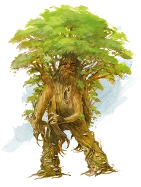
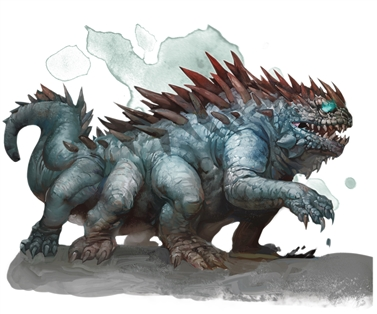
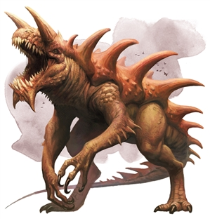
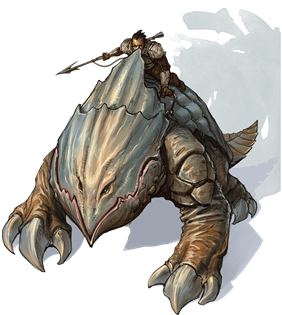

RoanokeS3 doc v2.1 Week four

The second act problem of petrification - Oleanders curse.

[<u>ROANOKE CITY</u>](https://docs.google.com/document/d/1U0-iIRVyrVINJnnhLD3Bqq9zJKDe4eH3DVjk8X6VLRk/edit?usp=sharing) Map

Week four Cast list.

[<u>Week four Sets list.</u>](https://docs.google.com/document/d/1eQWOCR3q5uGwGoVanVmTt-fORHUVAbenMMKRfajw3LQ/edit?usp=sharing)

[<u>Tatankan escape room.</u>](https://docs.google.com/document/d/1HeeyOpTO5OFuM0tPT5l-K3Dq4osnyUEa-PEJBbEabsc/edit?usp=sharing)

**Day 22** **Lodestone of grease (Hex map [<u>Link</u>](https://inkarnate.com/maps/vxkGyXOYnqJ71WQr08dDML2BYjaLzZNoB3wbE2eVPlpjga56/MTU4ODI4MTg5NjIwMw==)) [<u>Module</u>](https://docs.google.com/document/d/1ETlCbf8n1XrV8yvfi1P-qvcfOpuhIduZ3-nkADZrRHw/edit?usp=sharing)**

Saturday

08/08/2020

**Midnight**

@ everyone At the Tatankan pen, a burst of magic makes a massive red flare in the air, visible from anywhere on the island.

@everyone a green aurora encircles the sky around the island then draws itself to the dark forests. A coarse and horrid mix between a howl and a growling noise echoes from within.

*(All forested encounters have an extremely high chance to yield dread wendigoes)*

**Early Morning**

**Morning**

Grease spell Mayhem.

**Late Morning**

**Animated Tree**

[<u>Link</u>](https://www.dndbeyond.com/monsters/animated-tree)

Cr 9 The natural and uncorrupted form of a Lychwood Treant. The three that are left are actively hiding on the island.For random Forest encounters. If you have time, come up with a backstory for them. Play them mean and dumb so that its ok to kill them off.

**Noon**

**The Basalisk**

[<u>Link</u>](https://www.dndbeyond.com/monsters/basilisk)

Cr 3 Petrification- Use near the Pen

**Afternoon**

**NPC ENCOUNTER TO TELL THEM TO GO TO THE LODESTONE**

**Evening**

**Lodestone of grease (Hex map [<u>Link</u>](https://inkarnate.com/maps/vxkGyXOYnqJ71WQr08dDML2BYjaLzZNoB3wbE2eVPlpjga56/MTU4ODI4MTg5NjIwMw==)) [<u>Module</u>](https://docs.google.com/document/d/1ETlCbf8n1XrV8yvfi1P-qvcfOpuhIduZ3-nkADZrRHw/edit?usp=sharing) [<u>Link</u>](https://docs.google.com/document/d/1ETlCbf8n1XrV8yvfi1P-qvcfOpuhIduZ3-nkADZrRHw/edit?usp=sharing)**

**Latenight**

**Day 23** invitational

Sunday

08/09/2020

**Midnight**

**Early Morning**

**Morning**

**Late Morning**

**Noon**

Tarrasque  
[<u>Link</u>](https://www.dndbeyond.com/monsters/tarrasque)

**Afternoon**

**The Sorrow of the Statues.**

**Evening**

**Latenight**

**Day 24**

08/10/2020

Monday

**Main event: Dread Wendigos**

Notes: a Group of Wendigos raid the village of Roanoke

**Midnight**

Off the eastern shores of Roanoke, there stands a lighthouse. Tonight, beneath it’s beacon of light

A dwarf (Hiram) sits on a rock, strumming a lute. His song is met by a melodious disembodied voice from out on the still waters.

**Early Morning**

**Roanoke bridge**

The river seems to have reversed course.

**Morning**

**Late Morning**

**The Ozark Howler** [<u>Picture</u>](https://imgur.com/a/G347v6z) [<u>Link</u>](https://www.dndbeyond.com/monsters/869813-the-ozark-howler)

The Archivist will use this encounter to set up the Cryptid hunt tomorrow.

**Noon**

**Afternoon**

**The Sorrow of the Statues.**

**Evening**

**Dread Wendigos.**

1.  Danger in the outskirts

    1.  Track Marks

2.  Wandering encounter highly common and dangerous among forests

**Late Night**

**Day 25**

08/11/2020

Tuesday  
**Main Event: Cryptid Hunt**

It was the Archivist's stated intention that he was coming to Arcania to study it’s cryptids.

Roll on a D23 to pick a hex.  
**Get art of paw prints\>** make a short field guide with warnings to spot, and award advantages for successful checks and disadvantages for guessing it wrong.

The Mothmen: Warnings, Mothmen won't leave their lair unless you smoke them out.

If you attack the mothmen in their lair, young will also attack, and they players will get hit with lair effects.

Verbatim to give to players:

“While their namesake is attracted to flame, exposed to smoke these become far more tame.”

The Puckwudgie: Warning: approaching them while their quills are raised, is sure to get the group pelted with quill strikes.

Intent: Try to give players a chance (once every four hours) to find and capture alive with the intent of release, 4 American Cryptids. The Mothmen, The Puckwudgie, The Ozark Howler and The Sasquatch. All but the Sasquatch is findable. The Archivist will leading a hunt in the Lagone woods. During this hunt, he reveals that Bigfoot’s grave.

**Midnight**

**Early Morning**

**Roanoke bridge**

The ground is wet despite a lack of rainfall.

**Morning**

**Late Morning**

**Noon**

**The Sorrow of the Statues.**

**Afternoon**

**Evening**

**Main Event Cryptid Hunt**

It was the Archivist's stated intention that he was coming to Arcania to study it’s cryptids.

**The Ozark Howler** [<u>Picture</u>](https://imgur.com/a/G347v6z) [<u>Link</u>](https://www.dndbeyond.com/monsters/869813-the-ozark-howler)

Mothmen fight:

Lair Action (If the players fail to smoke the mothmen out of their lair): Change the fear every round. Treat this as a fear spell with a dc 16 con save.

Fear Table

1 Arachnophobia; the fear of spiders: Spider eggs being hatched near the target. Millions appear.

2 Hemophobia; a fear of blood The target bleeding uncontrollably

3 Mottephobia; a fear of moths. A swarm of countless moths flying at the target

4 Pyrophobia; a fear of fire. Everything appears drenched in oil, as if any flame could light it.

5 Thalassophobia; a fear of the sea. You remember the worst moment of the sub voyage.

6 Ornithophobia; the fear of birds A large flock of birds alighting upon the nearby tree canopy.

7 Claustrophobia; a fear of enclosed spaces, a pressure wave can be felt, slowly crushing you.

8 Cynophobia; the fear of dogs. You hear snarling as though it were next to your ears.

9 Necrophobia; the fear of death. The bodies of everyone slain so far in the journey appear.

10 Astraphobia; the fear of thunder and lightning A rumbling storm gathers in the distance.

11 Hendecaphobia; a fear of the number 11. All 11’s are critical failures as well as 1’s. With worse penalties.

12 Selenophobia; the fear of the moon. The moon appearing bright and red and large in the sky,

regardless of time of day, like the eye of the mothman, watching you.

Roll on a D23 to pick a hex.  
**Get art of paw prints\>** make a short field guide with warnings to spot, and award advantages for successful checks and disadvantages for guessing it wrong.

The Mothmen: Warnings, Mothmen will call on a common fear to influence the fight.

Verbatim to give to players:

“While their namesake is attracted to flame, exposed to smoke these become far more tame.”

Solution: To prevent the lair actions from influencing the fight, the players must smoke the monster out of its cave.

The Puckwudgie: Warning: approaching them while their quills are raised, is sure to get the group pelted with quill strikes. Have players make stealth checks to approach a grazing lone Puckwudgie. If they alert it and it goes into a ball, every round use the Shower of quills feature:

Quill Barrage: You shake off your loose quills and shoot them at your enemies. When you do so each target in a 15 ft cone must make a Dexterity saving throw. The DC for this saving throw equals 8 + your Constitution modifier + your proficiency bonus. A creature takes 1d8 piercing damage on a failed save as well as suffering a -1 on all saving throws until the end of your next turn, and half as much damage on a successful one (and no penalty to their saving throws).The damage increases to 2d8 at 6th level, 3d8 at 11th level, and 4d8 at 16th level. After you use Quill Barrage, you can’t use it again until you complete a short or long rest. At level 5 gain 2d4 quills per day.

Intent: Try to give players a chance (once every four hours) to find and capture alive with the intent of release, 4 American Cryptids. The Mothmen, The Puckwudgie, The Ozark Howler and The Sasquatch. All but the Sasquatch is findable. The Archivist will leading a hunt in the Lagone woods. During this hunt, he reveals that Bigfoot’s grave.

**Late Night**

**Day 26**

08/12/2020

Wednesday  
**Main Event: Water festival**

**Island Games (Fishmother and Longshadow) at The Lake of the Woes.**

**Midnight**

**The Lake of the Woes.**

A blazing beam of light shines forth from the Chinnokin temple beneath the lake of the woes.

**Early Morning**

**@everyone** Standing tall, Nautasha wades out of the river near roanoke bridge and brings this decree to the citizens of Roanoke. Which she will read during the morning

**Roanoke Bridge:**

**It is clear that either the tide is rising or investigation check dc 25 survival to realize that \|\|the Island is sinking\|\|**

**Morning**

**The Broken Sub Pub.**

**Warn the players not to offend the rival teams.At the Mayor’s house.**

**Nautasha:** I have been named ENVOY TO THE GASBAGS. The Fishmother has sent me to both deliver what she hopes to be a shameful task for me, to walk this beautiful island on the beautiful day and invite every village leader to bring a team of athletes and your cleverest thinkers to compete at the Lake of the Woes. **(hex [<u>link</u>](https://inkarnate.com/maps/lWg0kMrONnzJeZ274YxDbANXpz7LBPj3aw1oGpXV58yKEqvR/MTU4NzM0OTMxMTA2Mw==))**

**Nautasha invokes the island games due to the fact that the island is sinking and the way to the lost temple at the bottom of the Lake of the Woes is now accessible. As celebration all inhabitants are invited to a day of competitive games.. She will deliver invitations to all of the island leaders.**

**Late Morning**

**Tell the players if they get the leaders mad enough you may be able to get them to fight one another.**

**Prompt Mayor to give a pep talk.**

**Return to Roanoke to assemble your team.**

**Mayoral Pep Talk**

**Noon**

Delegates from the puckwudgies, jackalopes and tatankans arrive

The elders explain the importance of the island games. And reveal that how the players act at the games could either pacify or enrage them.

**Compete in a series of skill challenges.**

**Water chariot raceDanger escape** solo skill challenge.

**Stygr and Gen’s Door breaking** teams of two skill challenges.

**Afternoon**

**Compete in a group skill challenge.**

Risk Skill challenge.

**Evening**

**At the closing ceremonies, the newcomers are asked to speak to the tribes.**

**Group skill check to persuade or deceive the leaders. All leaders will react. Only the Chinnokin and Uru might attack.**

**The uru and the chinnokin will reflect their rage scores.**

**A 3 or lower and they will remain passive.**

**A 5 or over will attack.**

**A 7 or higher for both and they will both attack the players. Longshadow will wait until the Fishmother is dead.**

**A 10 for either will prompt them to fight one another.**

**A 9 or higher for both will team up against the town.**

**If The Fish mother is Killed, Nautsha will serve a new “Good” Chinnokin.**

**If Longshadow is killed, Empty Hill will subvert the Aerie while the Uru are at the games.**

**The conflict will continue regardless of leader names.**

**If neither are engaged, the conflict will go on unchanged.**

**Bossfight or resolution.**

**Late Night**

**Day 27**

08/13/2020

Thursday  
**Main Event: Wendigos laid to rest, Oleander revealed.**

**Midnight**

(If Empty Hill has left Halfwudgie hollow because Longshadow is dead):

Reskin Burrow Sharks as Halfwudgie riders. These will be available to be called upon for the final fight if the Colonists maintain a good relationship with the halfwudgies.

**Early Morning**

**Roanoke Bridge**

The water is rising and more chinnokin are on the island.

**Morning**

**Late Morning**

**Noon**

**Afternoon**

**The Pen:**[<u>Hex</u>](https://inkarnate.com/maps/X48RjQKqBGW01nzNxEaMbmRJzyjmw3loeyJDp25kgVOZrP6d/MTU4Nzk2OTQ2ODAzNA==) Tatankan Escape Room [<u>Link</u>](https://docs.google.com/document/d/1HeeyOpTO5OFuM0tPT5l-K3Dq4osnyUEa-PEJBbEabsc/edit?usp=sharing)

**The Sorrow of the Statues, End.**

**Evening**

**Hag Coven**

(Outline:)

1.  Returning to the Coven and burying every single Hag with a whispered prayer over them is the only way to eliminate the Wendigos from the island. This will end the Hag’s lingering magic on the island.

    1.  Bury their bodies underneath the Hanging Tree

2.  <u>Failure is an option</u> if the bodies of the Hags were burned,consumed, or given to the sea previously. If this happens, Wendigos remain as a common wandering monster in any forested area of the island.

**Late Night**

**Day 28**

08/14/2020

Friday  
**Voice Event: Levialich**

**For this event, this is a boss who is being buffed by 5**

**Armor Class 17**

**Hit Points 328 (16d20 + 160)**

**Speed 40 ft., swim 120 ft.**

**Saving Throws Dex +6, Con +12, Wis +8, Cha +10**

**Skills Perception +14, Stealth +6**

**Damage Resistances**

**Damage Immunities lightning, poison, necrotic**

**Condition Immunities charmed, exhaustion, frightened, paralyzed, poisoned**

**Senses blindsight 60 ft., darkvision 120 ft., passive Perception 24**

**Open with modified Leviathan’s tidal wave.** Recharge on a 5 or 6

A wave of water filled with rotting bodies and deep sea sludge slams into the coast line. When the wall appears, all other creatures within its area (anyone not behind full cover) must each make a DC 24 Strength saving throw. A creature takes(<u>6d10</u>) bludgeoning damage on failed save, or half as much damage on a successful one.

Altered spirit shroud spell buffs attacks based on the number of lamps still standing +1d8 necrotic damage per lamp (max 5)

*You call forth spirits of the dead, which flit around you for the spell’s duration. The spirits are intangible and invulnerable, and are evil*

*Until the spell ends, any attack you make deals extra damage when you hit a creature within range of you. This damage is necrotic. Any creature that takes this damage can’t regain hit points until the start of your next turn.*

***Lightning Breath (Recharge 5–6).*** The Levialich exhales lightning in a 90-foot line that is 5 feet wide. Each creature in that line must make a DC 20 Dexterity saving throw, taking 66 (12d10) lightning damage on a failed save, or half as much damage on a successful one.

***Legendary Resistance (3/Day).* If the dracolich fails a saving throw, it can choose to succeed instead.**

**Midnight**

**Early Morning**

**Morning**

**Late Morning**

**Noon**

**Afternoon**

**Evening**

**Oleander reveals that Hiram is hiding in the Morkoth’s Lair.**

**Late Night**
