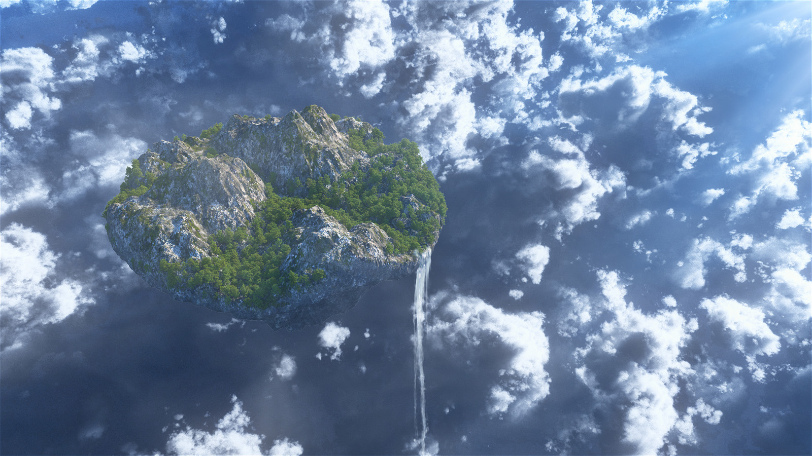

An Annual 24/7 DnD Super Campaign,

To be played online over 5 weeks over Discord chat,

Set in a persistent facsimile of Southeast America in the Colonial Era.

<u>Written by</u>

Brendon Faulkner

Noah Carr

Rob Hubbard

Ian Cairns

# Table of Contents

1.  [**HIGH CONCEPT**](https://docs.google.com/document/d/1XUIWqGkairN7_U5u8Kr0Alsd-onPteZSAcZVBWH5Im8/edit#heading=h.h8pg9ansti1i)

2.  [<u>MAPS & LOCATIONS</u>](https://docs.google.com/document/d/1XUIWqGkairN7_U5u8Kr0Alsd-onPteZSAcZVBWH5Im8/edit#heading=h.4hn6iqo6nt4f)

3.  [<u>CALENDAR</u>](https://docs.google.com/document/d/1XUIWqGkairN7_U5u8Kr0Alsd-onPteZSAcZVBWH5Im8/edit#heading=h.s2fw9abb2ku3)

What roanoke is:

Rules as written: roanoke is a 5 week long persistent Role Play Environment that seeks to combine the improvisational storytelling ability of tabletop role playing games with the functionality and user interface of video games. This is an rp heavy town drama told in 5 acts.

Rules as intended: roanoke is a 5 week long deep dive into the daily lives of your characters. The game is centered around staying as a group to build a town, grow in your professions overcome horrific encounters and delve into the mysteries of the secret societies to which the townsfolk belong.

Settings:

- **Week one: London, England. In a fantasy reimagining of Europe.**

WEEK 1: LONDON

This week will begin with an introduction to the concepts of the game. The limited scope of action will introduce the character to one another and the major NPCS. The first day begins with an all hands meeting at the Pall Mall Reform Club. Each of the four major factions will have an open side quest to be filled by the players. In addition there is a threat to the group in the form of their captain being woo’d by a vampire.

Here is a list of all available location that the group may explore over the course of the first week:

The Pall Mall Reform Club

Main exposition location.

The Father Thames

(A dockside pub)

The Fat Friar

(A low rent Inn)

Auntie Mavis’s Bed and Breakfast

(A middle class establishment)

Cricklemoot Deep

(An upper class establishment)

The Pall Mall Red Road

(The main road, to be used as “outdoors” for characters as they travel from place to place.)

The British Museum

(Headquarters to the Order of Kairo)

The Château du Brule

(Headquarters to the Roi du Soliel)

The Roseline Temple of Masons

(Headquarters to the FreeMasons)

Twilight Manor

(Headquarters to the Order of the Golden Dawn, and site of the main voice event)

The Tir Na Nog

(The vessel which will carry us to Roanoke)

DAY 1 - Saturday, July 18th, 2020

LONDON...

Opening Text for noon at the Pall Mall reform club:  
**Soft amber lights reflect off of polished brass fixture and the soft sheen of well oiled leather. It gives the rich rosewood interior of the Pall Mall Reform club a sense of sincere warmth. The sort of warmth long absent from the streets of London below. Earth toned stained glass separates the rooms and burgundy leather seats adorn every table within.**

**A sign over the conservatory reads “Falmouth Expedition, Sign in here”.**

**A man dressed in the manner of a fine servant such as a butler or a man servant attends a crushed velvet rope. There is a line forming to gain entrance to the room.**

**The smell of juniper berry gin, warm brandy and rich tobacco flood your senses. The storied history of this place seems disturbed as the odd assortment of colonists arrive to sign up for passage to the new world.**

> **Jeeves**
>
> **Your Name Please.**
>
> **Profession?**
>
> **Do you agree to abide by maritime law while at sea?**
>
> **Are you in any way ill?**
>
> **I’m sorry sir, but the next question is quite ghastly, but the captain**
>
> **Insists nonetheless:**
>
> **In the event of a tragedy, to who shall we send your remains?**

**After each of the colonists have been interviewed, they will be asked to sign a pledge.**

**I (The undersigned) being of sound mind and body do hereby agree to undertake a voyage aboard the Submersible known as the Tir Na Nog. Upon arrival I will be participating in refounding the lost colony of Roanoke for King George of England. The colony shall work as a group to flourish, elect its own leadership by majority vote and pay homage of word and coin to the king.**

**Kairo gets up to make an announcement (to be written) that includes but is not limited to the following information. Upon their agreement, passage of 800 gold must be paid by the end of week one. Those who cannot or do not want to pay their own passage may have one of the four patron groups sponsor their place. Sponsorship comes with a form of employment. The patron may call upon that group of players from time to time to complete quests.**

**A representative of each of the four patron groups will be available to take interviews and describe their beliefs and goals to their potential groups.**

**A delegate from the Order of Kairo:**

**Ladies and Gentlemen, when my journey began, I was living in an ordinary world. I was an Ordinary person without much in my pockets but a dream. Do you remember this dream? The dream of a British Empire upon which the sun would never set? This dream sailed through my dreams, and it was like a call to see the world. A call I thought I could heed. But these long 20 years, as you well know, have been filled with a doldrum of progress. The Atlantic is uncrossable by conventional means. A blockade of monstrously gigantic creatures, each able to summon forth the power of an iceberg seemingly at will. Well folks, I will level with you… it's a call I considered refusing, but my mentor told me that if I want something bad enough, I have to fight for it, you have to think around it! Now, several waiters will begin passing out glasses of champagne, so please refrain from drinking it until the end. Now where was I? Ah yes... So I did! I Fought for it, and I thought around the problem. Now, many of you have already heard the rumors of our… unconventional travel method. And believe you me, there were plenty of sailors who told me that what I wanted to do was impossible. That every ship that has attempted the journey in two decades has failed. But, then, in the black woods of Bavaria I discovered a gnomish inventor. He had been working on just the thing we needed. A ship that does not sail through the sea, but rather UNDER IT. Be amazed as I was at his marvelous invention. For the first time in twenty long years we shall approach the shores of Arcania and reestablish what has long been lost. FOR KING AND COUNTRY I SAY! Now, I could not be standing before you today if such a venture had not been vetted by some very clever and powerful people. These people are here with us today and are here to help recruit and fund the best we can find to send back to the New World. I thank you for your time and your bravery, your ambition and your skill. We will need the best, the bravest, the smartest and the most resourceful men and women of this kingdom and all the kingdom of the Old World to succeed. Looking around this room, I have every confidence. Now, I see that you all have you glasses. Please raise them with me and stand. TO OUR JOURNEY. TO ROANOKE. Hip hip… HOORAY. Hip hip… HOORAY.**

**Delegate from the Freemasons (The Archivist):**

**A 8 foot tall 400 pound man loosely wrapped in so many long strips of black silk that his skin and face cannot be seen. He is seen summoning thaumatology to increase his voice to a boom.**

**“Wanderers, Builders, Philosophers, Tinkers and smiths. The Masons humbly invite you to join our guild, the new Masons of Roanoke.”**

###### Midnight (12am-3am)

- This happens over the night.

<!-- -->

- Father Thames Tavern: A lonely drunkard is playing drums on his friends back as he sleeps on the table. He sings a song about Father Thames and the Plague.

- Pall Mall Club: Some good old boys are playing pinochle around a green felted table. They smoke on wooden pipes and talk of the old wars and glory days.

- 

###### Early Morning (3am-6am)

- If you are still awake, you might notice this.

###### Morning (6am-9am)

- After waking up, they see this.

###### Late Morning (9am-12am)

- Maybe this happens too, somewhere else though.

###### Noon (12pm-3pm)

- This character does this here. This is a hook.

###### Afternoon (3pm-6pm)

- Now people are really paying attention, so let’s do this.

###### Evening (6pm-9pm)

- I bet people are playing this cool dungeon that I planned.

###### Late Night (9pm-12pm)

- As people are going to bed, leave them with this.

#### DAY 1 - Saturday, July 18th, 2020

LONDON... IT SMELLS LIKE ADVENTURE

> This is a space for information about Day 1. An overview of the big picture of events. Please add content to this. I am writing this for quick format planning as a placeholder. Erase me with better content.

###### Midnight (12am-3am)

- This happens over the night.

###### Early Morning (3am-6am)

- If you are still awake, you might notice this.

###### Morning (6am-9am)

- After waking up, they see this.

###### Late Morning (9am-12am)

- Maybe this happens too, somewhere else though.

###### Noon (12pm-3pm)

- This character does this here. This is a hook.

###### Afternoon (3pm-6pm)

- Now people are really paying attention, so let’s do this.

###### Evening (6pm-9pm)

- I bet people are playing this cool dungeon that I planned.

###### Late Night (9pm-12pm)

- As people are going to bed, leave them with this.

####  

#### DAY 2 Sunday, July 19th, 2020

A DOG IN THE FOG

> This is a space for information about Day 2. An overview of the big picture of events. Please add content to this. I am writing this for quick format planning as a placeholder. Erase me with better content.

###### Midnight (12am-3am)

- This happens over the night.

###### Early Morning (3am-6am)

- If you are still awake, you might notice this.

###### Morning (6am-9am)

- After waking up, they see this.

###### Late Morning (9am-12am)

- Maybe this happens too, somewhere else though.

###### Noon (12pm-3pm)

- This character does this here. This is a hook.

###### Afternoon (3pm-6pm)

- Now people are really paying attention, so let’s do this.

###### Evening (6pm-9pm)

- I bet people are playing this cool dungeon that I planned.

###### Late Night (9pm-12pm)

- As people are going to bed, leave them with this.

####  

#### DAY 3 Monday, July 20th,2020

MUMMY DEAREST

> This is a space for information about Day 3. An overview of the big picture of events. Please add content to this. I am writing this for quick format planning as a placeholder. Erase me with better content.

###### Midnight (12am-3am)

- This happens over the night.

###### Early Morning (3am-6am)

- If you are still awake, you might notice this.

###### Morning (6am-9am)

- After waking up, they see this.

###### Late Morning (9am-12am)

- Maybe this happens too, somewhere else though.

###### Noon (12pm-3pm)

- This character does this here. This is a hook.

###### Afternoon (3pm-6pm)

- Now people are really paying attention, so let’s do this.

###### Evening (6pm-9pm)

- I bet people are playing this cool dungeon that I planned.

###### Late Night (9pm-12pm)

- As people are going to bed, leave them with this.

####  

#### DAY 4 Tuesday, July 21st, 2020

YOU CAN’T HYDE A RENDER, DR. JEKYLL

> This is a space for information about Day 4. An overview of the big picture of events. Please add content to this. I am writing this for quick format planning as a placeholder. Erase me with better content.

###### Midnight (12am-3am)

- This happens over the night.

###### Early Morning (3am-6am)

- If you are still awake, you might notice this.

###### Morning (6am-9am)

- After waking up, they see this.

###### Late Morning (9am-12am)

- Maybe this happens too, somewhere else though.

###### Noon (12pm-3pm)

- This character does this here. This is a hook.

###### Afternoon (3pm-6pm)

- Now people are really paying attention, so let’s do this.

###### Evening (6pm-9pm)

- I bet people are playing this cool dungeon that I planned.

###### Late Night (9pm-12pm)

- As people are going to bed, leave them with this.

####  

#### DAY 5 Wednesday, July 22nd, 2020

IT’S A SHENANIGANZA!!

> This is a space for information about Day 5. An overview of the big picture of events. Please add content to this. I am writing this for quick format planning as a placeholder. Erase me with better content.

###### Midnight (12am-3am)

- This happens over the night.

###### Early Morning (3am-6am)

- If you are still awake, you might notice this.

###### Morning (6am-9am)

- After waking up, they see this.

###### Late Morning (9am-12am)

- Maybe this happens too, somewhere else though.

###### Noon (12pm-3pm)

- This character does this here. This is a hook.

###### Afternoon (3pm-6pm)

- Now people are really paying attention, so let’s do this.

###### Evening (6pm-9pm)

- I bet people are playing this cool dungeon that I planned.

###### Late Night (9pm-12pm)

- As people are going to bed, leave them with this.

####  

#### DAY 6 Thursday, July 23rd, 2020

THE GOLDEN DAWN RISES

> This is a space for information about Day 6. An overview of the big picture of events. Please add content to this. I am writing this for quick format planning as a placeholder. Erase me with better content.

###### Midnight (12am-3am)

- This happens over the night.

###### Early Morning (3am-6am)

- If you are still awake, you might notice this.

###### Morning (6am-9am)

- After waking up, they see this.

###### Late Morning (9am-12am)

- Maybe this happens too, somewhere else though.

###### Noon (12pm-3pm)

- This character does this here. This is a hook.

###### Afternoon (3pm-6pm)

- Now people are really paying attention, so let’s do this.

###### Evening (6pm-9pm)

- I bet people are playing this cool dungeon that I planned.

###### Late Night (9pm-12pm)

- As people are going to bed, leave them with this.

####  

#### DAY 7 Friday, July 24th, 2020

TWILIGHT ON THE THAMES

> This is a space for information about Day 7. An overview of the big picture of events. Please add content to this. I am writing this for quick format planning as a placeholder. Erase me with better content.

###### Midnight (12am-3am)

- This happens over the night.

###### Early Morning (3am-6am)

- If you are still awake, you might notice this.

###### Morning (6am-9am)

- After waking up, they see this.

###### Late Morning (9am-12am)

- Maybe this happens too, somewhere else though.

###### Noon (12pm-3pm)

- This character does this here. This is a hook.

###### Afternoon (3pm-6pm)

- Now people are really paying attention, so let’s do this.

###### Evening (6pm-9pm)

- I bet people are playing this cool dungeon that I planned.

###### Late Night (9pm-12pm)

- As people are going to bed, leave them with this.

##  

## WEEK 2: THE SUB-ATLANTIC VOYAGE

This is a space for information about Week 2. An overview of the big picture of events. Please add content to this. I am writing this for quick format planning as a placeholder. Erase me with better content.

####  

#### DAY 8 Saturday, July 25th, 2020 

> 20,000 LEAGUES UNDER THE STORM
>
> This is a space for information about Day 8. An overview of the big picture of events. Please add content to this. I am writing this for quick format planning as a placeholder. Erase me with better content.

###### Midnight (12am-3am)

- This happens over the night.

###### Early Morning (3am-6am)

- If you are still awake, you might notice this.

###### Morning (6am-9am)

- After waking up, they see this.

###### Late Morning (9am-12am)

- Maybe this happens too, somewhere else though.

###### Noon (12pm-3pm)

- This character does this here. This is a hook.

###### Afternoon (3pm-6pm)

- Now people are really paying attention, so let’s do this.

###### Evening (6pm-9pm)

- I bet people are playing this cool dungeon that I planned.

###### Late Night (9pm-12pm)

- As people are going to bed, leave them with this.

####  

#### DAY 9 Sunday, July 26th, 2020

FORBIDDEN FISH

> This is a space for information about Day 9. An overview of the big picture of events. Please add content to this. I am writing this for quick format planning as a placeholder. Erase me with better content.

###### Midnight (12am-3am)

- This happens over the night.

###### Early Morning (3am-6am)

- If you are still awake, you might notice this.

###### Morning (6am-9am)

- After waking up, they see this.

###### Late Morning (9am-12am)

- Maybe this happens too, somewhere else though.

###### Noon (12pm-3pm)

- This character does this here. This is a hook.

###### Afternoon (3pm-6pm)

- Now people are really paying attention, so let’s do this.

###### Evening (6pm-9pm)

- I bet people are playing this cool dungeon that I planned.

###### Late Night (9pm-12pm)

- As people are going to bed, leave them with this.

####  

#### DAY 10 Monday, July 27th, 2020

THE DEPTHS OF MANTAPOLIS

> This is a space for information about Day 10. An overview of the big picture of events. Please add content to this. I am writing this for quick format planning as a placeholder. Erase me with better content.

###### Midnight (12am-3am)

- This happens over the night.

###### Early Morning (3am-6am)

- If you are still awake, you might notice this.

###### Morning (6am-9am)

- After waking up, they see this.

###### Late Morning (9am-12am)

- Maybe this happens too, somewhere else though.

###### Noon (12pm-3pm)

- This character does this here. This is a hook.

###### Afternoon (3pm-6pm)

- Now people are really paying attention, so let’s do this.

###### Evening (6pm-9pm)

- I bet people are playing this cool dungeon that I planned.

###### Late Night (9pm-12pm)

- As people are going to bed, leave them with this.

####  

#### DAY 11 Tuesday, July 28th, 2020

WHAT LIES BENEATH

> This is a space for information about Day 11. An overview of the big picture of events. Please add content to this. I am writing this for quick format planning as a placeholder. Erase me with better content.

###### Midnight (12am-3am)

- This happens over the night.

###### Early Morning (3am-6am)

- If you are still awake, you might notice this.

###### Morning (6am-9am)

- After waking up, they see this.

###### Late Morning (9am-12am)

- Maybe this happens too, somewhere else though.

###### Noon (12pm-3pm)

- This character does this here. This is a hook.

###### Afternoon (3pm-6pm)

- Now people are really paying attention, so let’s do this.

###### Evening (6pm-9pm)

- I bet people are playing this cool dungeon that I planned.

###### Late Night (9pm-12pm)

- As people are going to bed, leave them with this.

####  

#### DAY 12 Wednesday, July 29th, 2020

A METRIC DUCKTON

> This is a space for information about Day 12. An overview of the big picture of events. Please add content to this. I am writing this for quick format planning as a placeholder. Erase me with better content.

###### Midnight (12am-3am)

- This happens over the night.

###### Early Morning (3am-6am)

- If you are still awake, you might notice this.

###### Morning (6am-9am)

- After waking up, they see this.

###### Late Morning (9am-12am)

- Maybe this happens too, somewhere else though.

###### Noon (12pm-3pm)

- This character does this here. This is a hook.

###### Afternoon (3pm-6pm)

- Now people are really paying attention, so let’s do this.

###### Evening (6pm-9pm)

- I bet people are playing this cool dungeon that I planned.

###### Late Night (9pm-12pm)

- As people are going to bed, leave them with this.

####  

#### DAY 13 Thursday, July 30th, 2020

TRANS-ATLANTIC SABO-TOURISM

> This is a space for information about Day 13. An overview of the big picture of events. Please add content to this. I am writing this for quick format planning as a placeholder. Erase me with better content.

###### Midnight (12am-3am)

- This happens over the night.

###### Early Morning (3am-6am)

- If you are still awake, you might notice this.

###### Morning (6am-9am)

- After waking up, they see this.

###### Late Morning (9am-12am)

- Maybe this happens too, somewhere else though.

###### Noon (12pm-3pm)

- This character does this here. This is a hook.

###### Afternoon (3pm-6pm)

- Now people are really paying attention, so let’s do this.

###### Evening (6pm-9pm)

- I bet people are playing this cool dungeon that I planned.

###### Late Night (9pm-12pm)

- As people are going to bed, leave them with this.

####  

#### DAY 14 Friday, July 31st, 2020

WHAT’S KRAKEN?

> This is a space for information about Day 14. An overview of the big picture of events. Please add content to this. I am writing this for quick format planning as a placeholder. Erase me with better content.

###### Midnight (12am-3am)

- This happens over the night.

###### Early Morning (3am-6am)

- If you are still awake, you might notice this.

###### Morning (6am-9am)

- After waking up, they see this.

###### Late Morning (9am-12am)

- Maybe this happens too, somewhere else though.

###### Noon (12pm-3pm)

- This character does this here. This is a hook.

###### Afternoon (3pm-6pm)

- Now people are really paying attention, so let’s do this.

###### Evening (6pm-9pm)

- I bet people are playing this cool dungeon that I planned.

###### Late Night (9pm-12pm)

- As people are going to bed, leave them with this.

##  

## WEEK 3: STILLWATER

This is information about Week 3. An overview of the big picture of events. Please add content to this. I am writing this for quick format planning as a placeholder. Erase me with better content.

As water fills the hull of the submarine, you swim free of the wreckage. There is chaos as the occupants of the vessel spill out into the briny sea. Swimmers push and grab at others as they gasp for air. There’s little chance to save those outside your immediate reach, most everyone can only focus on their own survival in these circumstances.

When you surface you see little more than the bobbing heads breaking the perfectly flat surface of the water. Weeds are tangling around you and you smell the stagnant rot of algae and dead fish. Your hand lands on a slimy, long-dead fish carcass bobbing in the brine.

- 

####  

#### DAY 15 Saturday, August 1st, 2020

ISLANDED RIGHT ON MY FACE

> This is a space for information about Day 15. An overview of the big picture of events. Please add content to this. I am writing this for quick format planning as a placeholder. Erase me with better content.

###### Midnight (12am-3am)

- This happens over the night.

###### Early Morning (3am-6am)

- If you are still awake, you might notice this.

###### Morning (6am-9am)

- After waking up, they see this.

###### Late Morning (9am-12am)

- Maybe this happens too, somewhere else though.

###### Noon (12pm-3pm)

- This character does this here. This is a hook.

###### Afternoon (3pm-6pm)

- Now people are really paying attention, so let’s do this.

###### Evening (6pm-9pm)

- I bet people are playing this cool dungeon that I planned.

###### Late Night (9pm-12pm)

- As people are going to bed, leave them with this.

####  

#### DAY 16 Sunday, August 2nd, 2020

WHO ARE URU?

> This is a space for information about Day 16. An overview of the big picture of events. Please add content to this. I am writing this for quick format planning as a placeholder. Erase me with better content.

###### Midnight (12am-3am)

- This happens over the night.

###### Early Morning (3am-6am)

- If you are still awake, you might notice this.

###### Morning (6am-9am)

- After waking up, they see this.

###### Late Morning (9am-12am)

- Maybe this happens too, somewhere else though.

###### Noon (12pm-3pm)

- This character does this here. This is a hook.

###### Afternoon (3pm-6pm)

- Now people are really paying attention, so let’s do this.

###### Evening (6pm-9pm)

- I bet people are playing this cool dungeon that I planned.

###### Late Night (9pm-12pm)

- As people are going to bed, leave them with this.

####  

#### DAY 17 Monday, August 3rd, 2020

THANK YOU FOR CHOPPING AT SPELLMART

> This is a space for information about Day 17. An overview of the big picture of events. Please add content to this. I am writing this for quick format planning as a placeholder. Erase me with better content.

###### Midnight (12am-3am)

- This happens over the night.

###### Early Morning (3am-6am)

- If you are still awake, you might notice this.

###### Morning (6am-9am)

- After waking up, they see this.

###### Late Morning (9am-12am)

- Maybe this happens too, somewhere else though.

###### Noon (12pm-3pm)

- This character does this here. This is a hook.

###### Afternoon (3pm-6pm)

- Now people are really paying attention, so let’s do this.

###### Evening (6pm-9pm)

- I bet people are playing this cool dungeon that I planned.

###### Late Night (9pm-12pm)

- As people are going to bed, leave them with this.

####  

#### DAY 18 Tuesday, August 4th, 2020

OZARK HOWLERS AND MYCONOID BOOMERS

> This is a space for information about Day 18. An overview of the big picture of events. Please add content to this. I am writing this for quick format planning as a placeholder. Erase me with better content.

###### Midnight (12am-3am)

- This happens over the night.

###### Early Morning (3am-6am)

- If you are still awake, you might notice this.

###### Morning (6am-9am)

- After waking up, they see this.

###### Late Morning (9am-12am)

- Maybe this happens too, somewhere else though.

###### Noon (12pm-3pm)

- This character does this here. This is a hook.

###### Afternoon (3pm-6pm)

- Now people are really paying attention, so let’s do this.

###### Evening (6pm-9pm)

- I bet people are playing this cool dungeon that I planned.

###### Late Night (9pm-12pm)

- As people are going to bed, leave them with this.

####  

#### DAY 19 Wednesday, August 5th, 2020

STORM’S A BREWIN’

> This is a space for information about Day 19. An overview of the big picture of events. Please add content to this. I am writing this for quick format planning as a placeholder. Erase me with better content.

###### Midnight (12am-3am)

- This happens over the night.

###### Early Morning (3am-6am)

- If you are still awake, you might notice this.

###### Morning (6am-9am)

- After waking up, they see this.

###### Late Morning (9am-12am)

- Maybe this happens too, somewhere else though.

###### Noon (12pm-3pm)

- This character does this here. This is a hook.

###### Afternoon (3pm-6pm)

- Now people are really paying attention, so let’s do this.

###### Evening (6pm-9pm)

- I bet people are playing this cool dungeon that I planned.

###### Late Night (9pm-12pm)

- As people are going to bed, leave them with this.

####  

#### DAY 20 Thursday, August 6th, 2020

DISEASE AND DEMOCRACY

> This is a space for information about Day 20. An overview of the big picture of events. Please add content to this. I am writing this for quick format planning as a placeholder. Erase me with better content.

###### Midnight (12am-3am)

- This happens over the night.

###### Early Morning (3am-6am)

- If you are still awake, you might notice this.

###### Morning (6am-9am)

- After waking up, they see this.

###### Late Morning (9am-12am)

- Maybe this happens too, somewhere else though.

###### Noon (12pm-3pm)

- This character does this here. This is a hook.

###### Afternoon (3pm-6pm)

- Now people are really paying attention, so let’s do this.

###### Evening (6pm-9pm)

- I bet people are playing this cool dungeon that I planned.

###### Late Night (9pm-12pm)

- As people are going to bed, leave them with this.

####  

#### DAY 21 Friday, August 7th, 2020

KATS, HAGS, SEE YOU NEXT FALL

> This is a space for information about Day 21. An overview of the big picture of events. Please add content to this. I am writing this for quick format planning as a placeholder. Erase me with better content.

###### Midnight (12am-3am)

- This happens over the night.

###### Early Morning (3am-6am)

- If you are still awake, you might notice this.

###### Morning (6am-9am)

- After waking up, they see this.

###### Late Morning (9am-12am)

- Maybe this happens too, somewhere else though.

###### Noon (12pm-3pm)

- This character does this here. This is a hook.

###### Afternoon (3pm-6pm)

- Now people are really paying attention, so let’s do this.

###### Evening (6pm-9pm)

- I bet people are playing this cool dungeon that I planned.

###### Late Night (9pm-12pm)

- As people are going to bed, leave them with this.

##  

## WEEK 4: DARKWATER

This is a space for information about Week 4. An overview of the big picture of events. Please add content to this. I am writing this for quick format planning as a placeholder. Erase me with better content.

####  

#### DAY 22 Saturday, August 8th, 2020

DAYS GROW DARKER STILL

> This is a space for information about Day 22. An overview of the big picture of events. Please add content to this. I am writing this for quick format planning as a placeholder. Erase me with better content.

###### Midnight (12am-3am)

- This happens over the night.

###### Early Morning (3am-6am)

- If you are still awake, you might notice this.

###### Morning (6am-9am)

- After waking up, they see this.

###### Late Morning (9am-12am)

- Maybe this happens too, somewhere else though.

###### Noon (12pm-3pm)

- This character does this here. This is a hook.

###### Afternoon (3pm-6pm)

- Now people are really paying attention, so let’s do this.

###### Evening (6pm-9pm)

- I bet people are playing this cool dungeon that I planned.

###### Late Night (9pm-12pm)

- As people are going to bed, leave them with this.

####  

#### DAY 23 Sunday, August 9th, 2020

UNDOING THE PEN’S CURSE

> This is a space for information about Day 23. An overview of the big picture of events. Please add content to this. I am writing this for quick format planning as a placeholder. Erase me with better content.

###### Midnight (12am-3am)

- This happens over the night.

###### Early Morning (3am-6am)

- If you are still awake, you might notice this.

###### Morning (6am-9am)

- After waking up, they see this.

###### Late Morning (9am-12am)

- Maybe this happens too, somewhere else though.

###### Noon (12pm-3pm)

- This character does this here. This is a hook.

###### Afternoon (3pm-6pm)

- Now people are really paying attention, so let’s do this.

###### Evening (6pm-9pm)

- I bet people are playing this cool dungeon that I planned.

###### Late Night (9pm-12pm)

- As people are going to bed, leave them with this.

####  

#### DAY 24 Monday, August 10th, 2020

THE FAIRER SWIMMERS

> This is a space for information about Day 24. An overview of the big picture of events. Please add content to this. I am writing this for quick format planning as a placeholder. Erase me with better content.

###### Midnight (12am-3am)

- This happens over the night.

###### Early Morning (3am-6am)

- If you are still awake, you might notice this.

###### Morning (6am-9am)

- After waking up, they see this.

###### Late Morning (9am-12am)

- Maybe this happens too, somewhere else though.

###### Noon (12pm-3pm)

- This character does this here. This is a hook.

###### Afternoon (3pm-6pm)

- Now people are really paying attention, so let’s do this.

###### Evening (6pm-9pm)

- I bet people are playing this cool dungeon that I planned.

###### Late Night (9pm-12pm)

- As people are going to bed, leave them with this.

####  

#### DAY 25 Tuesday, August 11th, 2020

CHUUL IT, LOBSTER BREATH

> This is a space for information about Day 25. An overview of the big picture of events. Please add content to this. I am writing this for quick format planning as a placeholder. Erase me with better content.

###### Midnight (12am-3am)

- This happens over the night.

###### Early Morning (3am-6am)

- If you are still awake, you might notice this.

###### Morning (6am-9am)

- After waking up, they see this.

###### Late Morning (9am-12am)

- Maybe this happens too, somewhere else though.

###### Noon (12pm-3pm)

- This character does this here. This is a hook.

###### Afternoon (3pm-6pm)

- Now people are really paying attention, so let’s do this.

###### Evening (6pm-9pm)

- I bet people are playing this cool dungeon that I planned.

###### Late Night (9pm-12pm)

- As people are going to bed, leave them with this.

####  

#### DAY 26 Wednesday, August 12th, 2020

DEER RABBITS, SORRY FOR BRING YOU THE PLAGUE

> This is a space for information about Day 26. An overview of the big picture of events. Please add content to this. I am writing this for quick format planning as a placeholder. Erase me with better content.

###### Midnight (12am-3am)

- This happens over the night.

###### Early Morning (3am-6am)

- If you are still awake, you might notice this.

###### Morning (6am-9am)

- After waking up, they see this.

###### Late Morning (9am-12am)

- Maybe this happens too, somewhere else though.

###### Noon (12pm-3pm)

- This character does this here. This is a hook.

###### Afternoon (3pm-6pm)

- Now people are really paying attention, so let’s do this.

###### Evening (6pm-9pm)

- I bet people are playing this cool dungeon that I planned.

###### Late Night (9pm-12pm)

- As people are going to bed, leave them with this.

####  

#### DAY 27 Thursday, August 13th, 2020

THE HIGH TIDE & AN ELDER OBLEX

> This is a space for information about Day 27. An overview of the big picture of events. Please add content to this. I am writing this for quick format planning as a placeholder. Erase me with better content.

###### Midnight (12am-3am)

- This happens over the night.

###### Early Morning (3am-6am)

- If you are still awake, you might notice this.

###### Morning (6am-9am)

- After waking up, they see this.

###### Late Morning (9am-12am)

- Maybe this happens too, somewhere else though.

###### Noon (12pm-3pm)

- This character does this here. This is a hook.

###### Afternoon (3pm-6pm)

- Now people are really paying attention, so let’s do this.

###### Evening (6pm-9pm)

- I bet people are playing this cool dungeon that I planned.

###### Late Night (9pm-12pm)

- As people are going to bed, leave them with this.

####  

#### DAY 28 Friday, August 14th, 2020

YOU SON OF A LEVI-LICH

> This is a space for information about Day 28. An overview of the big picture of events. Please add content to this. I am writing this for quick format planning as a placeholder. Erase me with better content.

###### Midnight (12am-3am)

- This happens over the night.

###### Early Morning (3am-6am)

- If you are still awake, you might notice this.

###### Morning (6am-9am)

- After waking up, they see this.

###### Late Morning (9am-12am)

- Maybe this happens too, somewhere else though.

###### Noon (12pm-3pm)

- This character does this here. This is a hook.

###### Afternoon (3pm-6pm)

- Now people are really paying attention, so let’s do this.

###### Evening (6pm-9pm)

- I bet people are playing this cool dungeon that I planned.

###### Late Night (9pm-12pm)

- As people are going to bed, leave them with this.

## WEEK 5: AETHER

This is a space for information about Week 5. An overview of the big picture of events. Please add content to this. I am writing this for quick format planning as a placeholder. Erase me with better content.

####  

#### DAY 29 Saturday, August 15th, 2020

AETHER UP OR DOWN

> This is a space for information about Day 29. An overview of the big picture of events. Please add content to this. I am writing this for quick format planning as a placeholder. Erase me with better content.

###### Midnight (12am-3am)

- This happens over the night.

###### Early Morning (3am-6am)

- If you are still awake, you might notice this.

###### Morning (6am-9am)

- After waking up, they see this.

###### Late Morning (9am-12am)

- Maybe this happens too, somewhere else though.

###### Noon (12pm-3pm)

- This character does this here. This is a hook.

###### Afternoon (3pm-6pm)

- Now people are really paying attention, so let’s do this.

###### Evening (6pm-9pm)

- I bet people are playing this cool dungeon that I planned.

###### Late Night (9pm-12pm)

- As people are going to bed, leave them with this.

####  

#### DAY 30 Sunday, August 16th, 2020

THE SKY IS FALLING & NOW WE’RE FLYING

> This is a space for information about Day 30. An overview of the big picture of events. Please add content to this. I am writing this for quick format planning as a placeholder. Erase me with better content.

###### Midnight (12am-3am)

- This happens over the night.

###### Early Morning (3am-6am)

- If you are still awake, you might notice this.

###### Morning (6am-9am)

- After waking up, they see this.

###### Late Morning (9am-12am)

- Maybe this happens too, somewhere else though.

###### Noon (12pm-3pm)

- This character does this here. This is a hook.

###### Afternoon (3pm-6pm)

- Now people are really paying attention, so let’s do this.

###### Evening (6pm-9pm)

- I bet people are playing this cool dungeon that I planned.

###### Late Night (9pm-12pm)

- As people are going to bed, leave them with this.

####  

#### DAY 31 Monday, August 17th, 2020

OSSUARY MUCH, SIR DREGEN

> This is a space for information about Day 31. An overview of the big picture of events. Please add content to this. I am writing this for quick format planning as a placeholder. Erase me with better content.

###### Midnight (12am-3am)

- This happens over the night.

###### Early Morning (3am-6am)

- If you are still awake, you might notice this.

###### Morning (6am-9am)

- After waking up, they see this.

###### Late Morning (9am-12am)

- Maybe this happens too, somewhere else though.

###### Noon (12pm-3pm)

- This character does this here. This is a hook.

###### Afternoon (3pm-6pm)

- Now people are really paying attention, so let’s do this.

###### Evening (6pm-9pm)

- I bet people are playing this cool dungeon that I planned.

###### Late Night (9pm-12pm)

- As people are going to bed, leave them with this.

####  

#### DAY 32 Tuesday, August 18th, 2020

LEGEND OF THE TINKERS

> This is a space for information about Day 32. An overview of the big picture of events. Please add content to this. I am writing this for quick format planning as a placeholder. Erase me with better content.

###### Midnight (12am-3am)

- This happens over the night.

###### Early Morning (3am-6am)

- If you are still awake, you might notice this.

###### Morning (6am-9am)

- After waking up, they see this.

###### Late Morning (9am-12am)

- Maybe this happens too, somewhere else though.

###### Noon (12pm-3pm)

- This character does this here. This is a hook.

###### Afternoon (3pm-6pm)

- Now people are really paying attention, so let’s do this.

###### Evening (6pm-9pm)

- I bet people are playing this cool dungeon that I planned.

###### Late Night (9pm-12pm)

- As people are going to bed, leave them with this.

####  

#### DAY 33 Wednesday, August 19th, 2020

UNFORESEEN CIRCUMSTANCES

> This is a space for information about Day 33. An overview of the big picture of events. Please add content to this. I am writing this for quick format planning as a placeholder. Erase me with better content.

###### Midnight (12am-3am)

- This happens over the night.

###### Early Morning (3am-6am)

- If you are still awake, you might notice this.

###### Morning (6am-9am)

- After waking up, they see this.

###### Late Morning (9am-12am)

- Maybe this happens too, somewhere else though.

###### Noon (12pm-3pm)

- This character does this here. This is a hook.

###### Afternoon (3pm-6pm)

- Now people are really paying attention, so let’s do this.

###### Evening (6pm-9pm)

- I bet people are playing this cool dungeon that I planned.

###### Late Night (9pm-12pm)

- As people are going to bed, leave them with this.

####  

#### DAY 34 Thursday, August 20th, 2020

DAMN THAT INFERNAL WELL

> This is a space for information about Day 34. An overview of the big picture of events. Please add content to this. I am writing this for quick format planning as a placeholder. Erase me with better content.

###### Midnight (12am-3am)

- This happens over the night.

###### Early Morning (3am-6am)

- If you are still awake, you might notice this.

###### Morning (6am-9am)

- After waking up, they see this.

###### Late Morning (9am-12am)

- Maybe this happens too, somewhere else though.

###### Noon (12pm-3pm)

- This character does this here. This is a hook.

###### Afternoon (3pm-6pm)

- Now people are really paying attention, so let’s do this.

###### Evening (6pm-9pm)

- I bet people are playing this cool dungeon that I planned.

###### Late Night (9pm-12pm)

- As people are going to bed, leave them with this.

####  

#### DAY 35 Friday, August 21st, 2020

THE HUNGER

> This is a space for information about Day 35. An overview of the big picture of events. Please add content to this. I am writing this for quick format planning as a placeholder. Erase me with better content.

###### Midnight (12am-3am)

- This happens over the night.

###### Early Morning (3am-6am)

- If you are still awake, you might notice this.

###### Morning (6am-9am)

- After waking up, they see this.

###### Late Morning (9am-12am)

- Maybe this happens too, somewhere else though.

###### Noon (12pm-3pm)

- This character does this here. This is a hook.

###### Afternoon (3pm-6pm)

- Now people are really paying attention, so let’s do this.

###### Evening (6pm-9pm)

- I bet people are playing this cool dungeon that I planned.

###### Late Night (9pm-12pm)

- As people are going to bed, leave them with this.
