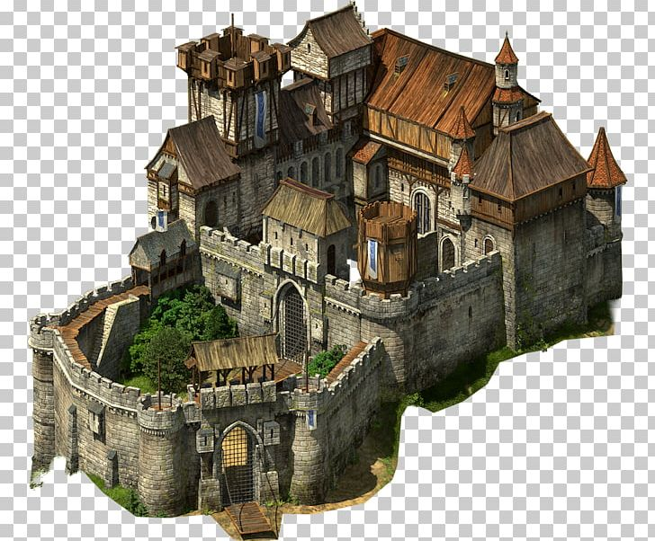
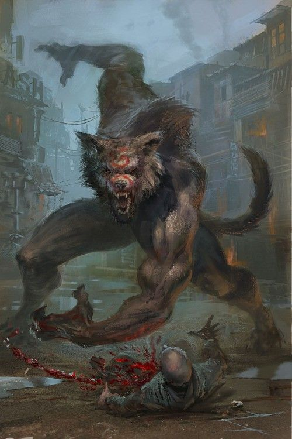
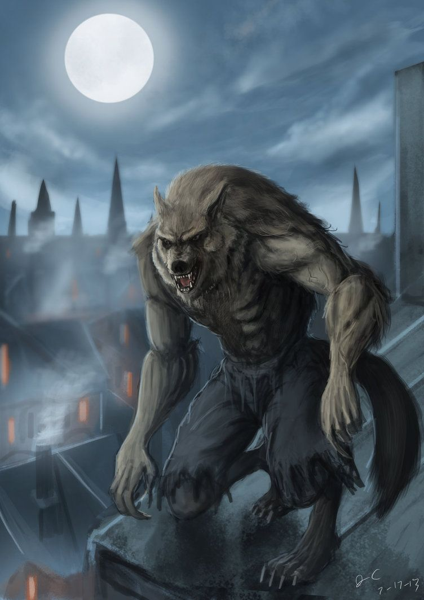
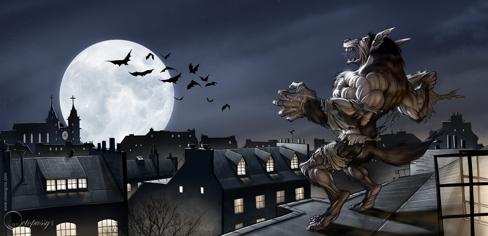
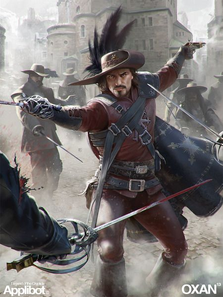
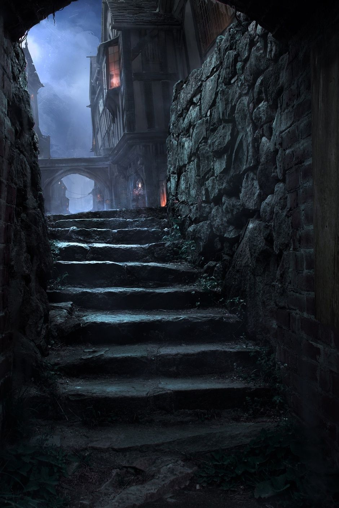
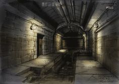
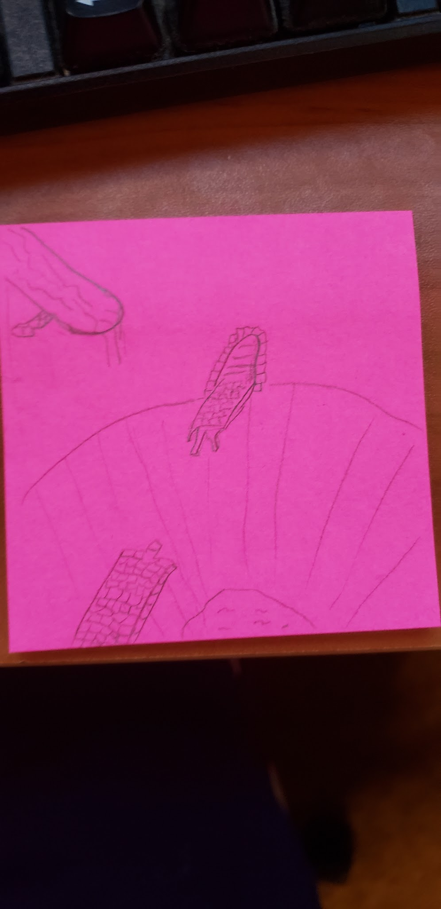
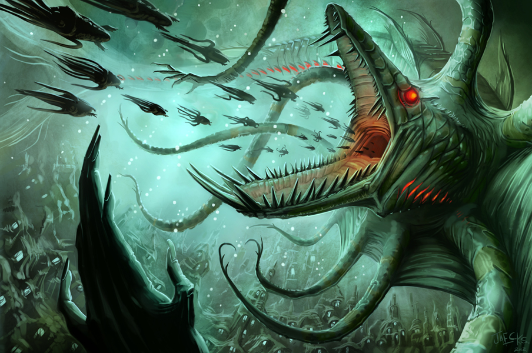

RoanokeS3 Week 1

[<u>Week 1 Sets</u>](https://docs.google.com/document/d/12hf1fE7KqLg8uaaKde9LvKmSDt1DcF1RY6aSMYgIeS4/edit?usp=sharing)

[<u>Week 1 Cast</u>](https://docs.google.com/document/d/1dgRYi_8i3qL5s5NddLqID7JPN0IAv1bgcGwvgFb5U0k/edit?usp=sharing)

[<u>Week 1 Passdown</u>](https://docs.google.com/document/d/1p2B4g9pRWr2TYvEAKO7b5CtyPO6h-3ROmCK79woPz0Y/edit?usp=sharing)

Week one - London

**Day one**

Saturday 07/18/20 Opening Day.

**Main event**

**(Pall Mall Reform Club) during the Noon block**

**Midnight (12 am -3 am)**

**The Twilight Manor:**

This inky black manor seems to swallow the moon light. Its mad architect seems to have failed to understand the very basics of the usefulness of a manor house of this size, having no discernable doors or windows. Leaving you with this chilling thought: If you were stuck inside, would you find a way out?

**The Father Thames Tavern:**

A lonely drunkard is playing drums on his friend’s back as he sleeps on the table. He sings a song about Father Thames.

**The Pall Mall Reform Club:**

Some good old boys are playing pinochle around a green felted table. They smoke on wooden pipes and talk of the old wars and glory days.

**Early Morning (3 am - 6am)**

**Along the Pall Mall Red Road.**

The Knocker uppers and lamp snuffers are out and about as well as the town criers.

A group of hoodlums are trying to get the knocker uppers in trouble by knocking on the wrong windows.

**Morning (6am - 9am)**

**The Roseline Temple of Masons**

This auspicious building would easily be mistaken for a church if it were not filled with the religious icons of every major religion. It is a gothic cathedral dedicated to the understanding of the Hermetic ways of the Brunelock Hiram Abiff.

Entering the space, you are greeted by a mysterious figure shrouded in layers of dark clothing. Though their face is obscured, and their size imposing, there is nothing threatening about the tone of the jolly voice that greets you in a thick but unplaceable forigen accent.

**The Archivist:** "Greetings, seeker. We are the founders of all civilization. What do you seek?

Very well then. All initiates are required to show their devotion to the core tenets of the Masons, and as they show themselves worthy, deeper knowledge may be sought. But none are ever turned away from our doors, regardless of religion or nationality. We welcome our brothers and sisters from faraway places and embrace the differences that build a group into a town, a town into a city, and city into a civilization. Can you work alongside those who are far different from you? Can you embrace the knowledge of the past to secure the future? Can you brave the risks of the wild to make it secure? Can you choose to live by demonstrating wisdom, and therefore mastery over the chaos that threatens us all?"

**Along the Pall Mall Red Road.**

Morning marks the busiest time along London's most famous road. Boats and businesses pass one another. Whether you are pensively looking at the river, or people watching as the shop keepers set up, or if you are looking to make a little extra coin cutting the purses of the gentry who are preparing to shop throughout the town, there is something for anyone who happened to find themselves here.

**Late Morning (9am - 12pm)**

**The British Museum**

The world famous British Museum is in an of itself a force to be reckoned with. For a thousand years, the collective knowledge and belongings of societies lost to time have been gathered and presented for public consumption. The boundaries of learning both arcane and naturalistic are explored here. Chief amongst them in the public eye is the world famous Order of Kairo. Their recent finds include a sarcophagus of the last prince of the darkest regions of the congo.

The members of the museum tend to stay in the field dressed for safari in tan shirts and cargo pants, with large pith helmets, and fine brass instruments of discovery and invention. Never before have you seen so many pockets, so many molecules or so many heads of dead animals. Bully Ho!

**Curator Ogden:** "Bully to you. A bully day indeed. What what? What ho! I see that you have a fair mind for the naturalistic arts there old chap. What what? Ho! Oh indeed. Shall we have a tour then? Only 10 gold to see the wonders of the natural world. Off to Arcania? I thought so. Well be sure to speak with him. Who? Why our most famous adventurer Kairo himself! Named for the great Kenku adventurer who braved the wilds of the New World these 50 long years ago. Our Master Kairo is quite the gamesman I say! Well named indeed! He himself is even the offspring of two of the very first colonists to Arcania! Such Pedigree! But one need not look further than his own office to see his prowess! Impressive! Majestic! One could only hope to follow in his footsteps!"

**Château du Brule**

Château du Brule

The singing of grand bells ring throughout the plaza. A mass of poor and broken flock towards articulated stone walls displaying a banner of a sun on a sword pommel and other depictions of its radiating beams. Grandiose gates open inward unleashing a warmth and smell of fresh bread for the misfortuned. As you approach, the interior widens throughout a courtyard comparable to the King’s where armor clad knights with sun emblems on their tunics are seen handing out baked meals and oranges to families while recruits train rigorously in the background.

Through the inner gate, inside of the Cathedral, it shines light through stained glass windows. The exterior connects to a large keep where the Knights du Roi Soleil continue. Bypassing the inner gate, into the cathedral you see ornately carved wooden pews standing beside statues and masterful imagery of numerous Gods. A knight in special chainmail with a tabard of the Roi Soleil, the Seneschal, Florian Chapelle, is seen taking care of day to day operations, training with his rapier, or painting upon a large canvas at the top of the balcony overlooking the grounds. He never forgets a face and greets you at the first moment he notices and is always welcoming.

As the bells atop the tower of this keep ring out for the end of morning prayer, troves of people spread out of the front gates dressed in various different religious garbs and mixed in with people in workday wear. People of any denomination under a good aligned God can find a statue (for major deities) or a shrine (minor/more obscure ones) inside the great Cathedral.

**Noon (12 pm - 3pm)**

**Main Event “Opening Day”**

(Pall Mall Reform Club)

Game opening at the Pall Mall Reform Club Opening Text for noon at the Pall Mall reform club:

Soft amber lights reflect off of polished brass fixtures and the soft sheen of well oiled leather gives the room the distinguished glow of aristocratic excess. It gives the rich rosewood interior of the Pall Mall Reform club a sense of sincere warmth that is a stark contrast to the world outside. Earth toned stained glass separates the rooms and burgundy leather with copper button seats adorn every table within.

A sign over the conservatory reads “Falmouth Expedition, Sign in here”.

A man dressed in the manner of a fine servant such as a butler or a man servant attends a crushed velvet rope. There is a line forming to gain entrance to the room. The smell of juniper berry gin, warm

brandy and rich tobacco flood your senses. The storied history of this place seems disturbed as the odd assortment of colonists arrive to sign up for passage to the new world.

*Interact with the players as guests. Ask them these questions while waiting:* Your Profession? Do you agree to abide by maritime law while at sea? Are you in any way ill? I’m sorry sir, but the next question is quite ghastly, but the captain Insists nonetheless: In the event of a tragedy, to whom shall we send your effects?

After each of the colonists have been interviewed, they will be asked to sign a pledge.

I (The undersigned) being of sound mind and body do hereby agree to undertake a voyage aboard the Submersible known as the Tir Na Nog. Upon arrival I will be participating in refounding the lost colony of Roanoke for King George of England. The colony shall work as a group to flourish, elect its own leadership by majority vote and pay homage of word and coin to the king.

A member of the Order of Kairo gets up to make an announcement that includes but is not limited to the following information. Upon their agreement, passage of 800 gold must be paid by the end of week one. Those who cannot or do not want to pay their own passage may have one of the four patron groups sponsor their place. Sponsorship comes with a form of employment. The patron may call upon that group of players from time to time to complete quests.

A representative of each of the four patron groups will be available to take interviews and describe their beliefs and goals to their potential groups.

A delegate from the Order of Kairo: "Ladies and Gentlemen, when my journey began, I was living in an ordinary world. I was an Ordinary person without much in my pockets but a dream. Do you remember this dream? The dream of a British Empire upon which the sun would never set? This dream sailed through my dreams, and it was like a call to see the world. A call I thought I could heed. But these long 20 years, as you well know, have been filled with a doldrum of progress. The Atlantic is uncrossable by conventional means. A blockade of monstrously gigantic creatures, each able to summon forth the power of an iceberg seemingly at will. Well folks, I will level with you… it's a call I considered refusing, but my mentor told me that if I want something bad enough, I have to fight for it, you have to think around it! Now, several waiters will begin passing out glasses of champagne, so please refrain from drinking it until the end. Now where was I? Ah yes... So I did! I Fought for it, and I thought “around” the problem. Now, many of you have already heard the rumors of our… unconventional travel method. And believe you me, there were plenty of sailors who told me that what I wanted to do was impossible. That every ship that has attempted the journey in two decades has failed. But, then, in the black woods of Bavaria I discovered a gnomish inventor. He had been working on just the thing we needed. A ship that does not sail through the sea, but rather UNDER IT. Be amazed as I was at his marvelous invention. For the first time in twenty long years we shall approach the shores of Arcania and reestablish what has long been lost. FOR KING AND COUNTRY I SAY! Now, I could not be standing before you today if such a venture had not been vetted by some very clever and powerful people. These people are here with us today and are here to help recruit and fund the best we can find to send back to the New World. I thank you for your time and your bravery, your ambition and your skill. We will need the best, the bravest, the smartest and the most resourceful men and women of this kingdom and all the kingdom of the Old World to succeed. Looking around this room, I have every confidence. Now, I see that you all have you glasses. Please raise them with me and stand. TO OUR JOURNEY. TO ROANOKE. Hip hip… HOORAY. Hip hip… HOORAY."

**Afternoon (3pm - 6pm)**

DM open improv.

**Evening (6pm - 9pm)**

**The Fat Friar**

The best dinner and show along the waterfront, The Fat Friar is always pleasant and bustling with laughter and song. The wait staff is young, and fair to look at, and the patrons are usually pleased. Perhaps even abnormally so despite the dour look of the streets and people outside its red stone walls. DC 12 perception check. Amaya Greyskies V can be seen in the company of Vicomte Luis Dupont, a talk dark and handsome frenchman. DC 20 perception check reveals that the bards don’t seem to be playing the music. You hadn’t noticed before but its actually silent and the music is in your head. There is no reasonable explanation for this.

**Late Night (9pm - 12am)**

**Day Two**

Sunday 07/19/20.

**Main Event: Are you my Mummy?**

(British Museum) **in the Evening Slot.**

**Midnight (12 am -3 am)**

To be posted in the museum.

A young boy with dark skin, pointed ears and a maroon fez with a long gold tassel carries a bundle of papers. He walks from building to building posting advertisements for a new exhibit at the British History Museum.

**Early Morning (3 am -6am)**

**The Tir Na Nog**

“The exterior door opens. As you step into the darkened entrance, it feels unsteady. And then, unexpectedly the door closes behind you with a loud metal clang. A strange hissing gives way to a large rush of wind. The chamber feels cavernous in the pitch black, but that feeling was your lack of vision, a pause to panic and a moment to imagine the infinite possibilities of what this novel machine may be capable of... The door, mere feet in front of you opens, releasing what you will come to know as an airlock. A man dressed head to toe in a shiny yellow material, including a yellow hat that looks like a paper folded sailboat is there. He holds a fishing spear in one hand, and a bucket in the other. He stands on a well stained and oiled teak wood floor. This is Old Timer Hefton Dax, fisherman aboard the Tir Na Nog. The entrance is a small chamber that seems to be a series of short sections of hallway with interconnecting chambers, pillars and pipes. The hallways lead to a plush seating area that seems to have minor illusions on the walls with advertisements for stores, different decks and locations aboard the Tir Na Nog. The advertisements are glowing with bright primary colors that seem to be drawn in a bold stylized font that is at once both simple and bold art deco that is completely foregin to your victorian sensibilities. It continues into the thoroughfare for the ship which is covered in a lovely red, blue and cream paisley carpet. The vessel is long and tube shaped, with several elevations within the ship. The Pall Mall Reform Club looked like a hovel in comparison. The interiors are lavish with fine mechanical automation and gnomish clockwork softly ticking away every lovely second. Music, oddly mechanical and vaguely scratchy float through the air, being played on a strange gnomish device that seems to trace a needle along several spinning cylinders”

Old Timer Hefton Dax Well muscled with sharp eyes this man oversees everything that comes on and off the ship. Sitting at about 5’9” he may seem chipper when all that he has to worry about is keeping a ship running, but cynicism and a strong superstition keep his focus. This fisherman has been out in the sea as long as he could remember. He keeps his dark greying hair clean cut and often checks his picture laden pocket watch. His North Irish accent is stronger than any breeze the sea has thrown at him. Dialogue Changes: \[Your -\> Yer, You -\> Ya/Ye, The -\> Tha, Of -\> O, etc\] Dialogue Examples:

“Well lad, never roll tha dice when lives be on tha line. Luck may be a lady but she has a mighty dark sense o humor” “Don’t be trying ta worm yer way in here. I’ve dealt with yer type before, ya may have yer coin but tha don’t mean ye get to just stroll on like ya own the place” “Watch those weapons when ya walk down. Don’t want ya scratchin the bulkhead now do we?” “Aye another sailor, could use another good pair of sea legs when we cast off” TBD: Hefton will have to approve all items allowed on the sub. Some materials and quantities will require purchase of cargo space. Everything is listed on a public manifesto, unless the players bribe Hefton. Players will be able to set the DC of their hidden items for an investigation check. 100 gold per incremental integer, with a minimum of 500 gold (DC 5, poorly hidden ) and a maximum of 2000 (DC 20 perfectly hidden) Ball bearings might be banned.

**The Roseline Temple of Masons**

Saturday Mass at the Roseline Temple of Masons is an unusual affair. The sanctuary space has multiple alters to various gods and goddesses. Those foreigners whose gods have no churches in England have this as a place to worship freely and openly. It is a strange mixture of incense, chanting, singing and all manners of folk from across the continents. Here, a drow priestess of Lolth prays while petitioners of akadi jump for joy and praise the goddess of movement with their displays of speed. Ohgma is praised in song, and the prophecies of Selune are read aloud, each with a small group of worshipers. The Archivist: While present and available to all, the Archivist does not partake in the worship of any,nor in the worship at any of the shrines.

**Morning (6am - 9am)**

**The Pall Mall Reform Club**

The luster of the previous day has gone. When not being used for official business, the Reform Club has a strict policy of silence so that well dressed old men can read their news papers, sip brandy and smoke tobacco in strict contemplative silence. Harumph.

**Late Morning (9am - 12pm)**

**The Father Thames**

Sunday mornings at The Father Thames are a typically slow affair. Most of the crowd from the previous night have spent a good portion of the day attending mass at St. George the Dragonslayer's Cathedral to Tyr, the state sanctioned official church of England or at the Cathedral within Château du Brule. eponine halstead is nowhere to be found. Presumably she has the day off. Instead, the very drunk and slovenly dwarf known to all as Stumply minds the bar. Sundays are stew day at the Father Thames, stew made with river water and a tough meat not entirely unlike cow.

**Auntie Mavis' Bed and Breakfast.**

Sundays at Auntie Mavis’ bed and breakfast are the busiest day of the week. Unseen servants walk the halls with the odd clinking sound of chain as they carry slightly tarnished silver platters full of breakfast for the hotels Sunday Breakfast in Bed service. Ghost cats play with your items, and any breakfast that goes uneaten is likely to be pushed onto the floor by a spectral cat paw.

**Noon (12 pm - 3pm)**

**Château du Brule**

A large detachment of 40 Knights surround a carriage with a golden chest and several immaculate paintings inside. They seem equipped for a longer journey and can be seen taking the King's road up North.

**The Pall Mall Reform Club**

Cricklewood Deep are marked by a whist tournament in the lobby. The Gentry come to make large wagers.

Rules: Each card player rolls 1d8, keeping the die hidden (seperate channels). Each player has the chance to raise the bet, call the bet (meet it), or fold. It continues when all bets are equal.

Then each player rolls a 1d6, keeping it secret as well. A final chance to raise, call, or fold. Each remaining player rolls 1d4. They all reveal the 1d8, 1d6, and 1d4, adding them all together.

Winner takes 80% of the pot (the other 20% goes to the casino). Ties split the 80%.

Sleight of Hand can give a reroll; Deception can force a fold.

The winner of today's pot will also be given an additional 1000 gold.

**Afternoon (3pm - 6pm)**

**Pall Mall Red Road**

The rain falls straight and hard overnight along the red road. As it fell it seems to have churned up mud from beneath the cracks, leaving long streaks of dark mirror like water along the path. The large groups of people walk through the center of the street, avoiding the large puddles causing more congestion than normal of foot traffic. Those who accidentally disturb the water are left cursing the filthy stains it leaves.

**The British History Museum**

Per Ian's notes: The British History Museum is looking for assistance tracking down a priceless artifact that has gone missing. The Last Pharaoh's sarcophagus has been looted. Suspected to be the work of thieves, Kairo asks you to assist the Order on this timely assignment. Can you help him find his mummy?

Ogden the Curator is a longtime friend and mentor of Kairo. Kairo studied Archaeology here under Ogden’s tutelage but that was a few decades ago, much before Kairo became the Keeper of the Order. A title he is reluctant to hold, although maybe this inheritance can provide the resources to unearth the secrets of the legendary island of his birth, Roanoke. Ogden is excited to regale the adventures with tales of Kairo as a young lad. Like the time Kairo deciphered the Rosea Script. Everything we know about the early ages of the river tribes is due to that translation. Ogden is quite fond of him and worries that Kairo’s quest for Roanoke maybe a one way trip. He’d like to think this isn’t goodbye. Ogden tells the adventurers of several new exhibits and some very old ones. Our most popular, the Wooly Mammoth, fossils of sea creatures found in the Alps, old maps, two perfectly preserved Ejani Mummies with matching caskets. Believed to be a parent and child pair. The smaller ones were broken open and stolen.

**Evening (6pm - 9pm)**

**Group Prompt:**

Along the Pall Mall Red Road  
Merchant stalls seem to be servicing people who are blinking in and out of the Ethereal realm. No one seems to be bothered by this. Upon investigation, it is revealed that highly unusual items are sold here about once a week for enthusiasts and collectors.

**The Astral market**:

After accepting a potion of Mercantile Mary’s Twister Elixir, you find that you are able to visit the part of the market that is currently being held in the Astral Plane. Astral versions of all common items are available here for double the price.

Clue: These may come in handy to anyone who likes a challenge.

(Any astral items bought here will work in the week 4 hard core event).

**Late Night (9pm - 12am)**

**The Fat Friar**

The fat friar is as busy as ever. Sundays are trivia days. A series of game related questions that employ knowledge checks to advance. The grand prize is 1000 gold.

**The Tir Na Nog**

The Thames are busy. Canal boats and cargo laden galleons criss cross her frigid pollution laden surface. The smell of the river is the opposite of its calming sound making trips near its shore be very unpleasant.

**Day three**

Monday 07/20/20

**Main Event. Arcanian Werewolf in London (Noah)**

**(Château du Brule)** During the evening block.

**Midnight (12 am -3 am)**

The night’s clouds part, and the moonlight is bright, casting the world in hues of purple and blue, in diminishing greys and in this moment you remember that this place was once wild.

A wolf howls. It's too close to be outside of the city. As your mind passively searches for the source, and the goosebumps begin to rise on your arms, the howl is returned by a chorus of dozens. Lights can be seen dancing. Small and yellow. No. Not lights. Eyes. Eyes of beasts running through the cobblestone streets and atop tiled roofs.

A wolf stops in front of you about 100 yards out. It is smallish and grey, with eyes surely analyzing you yet fearless in nature. It lets out a billowing howl and you feel the primal cry in the core of you, the force of it giving meaning to instincts long dormant in humanoid species.

It pauses after the long low mournful sound, and makes eye contact again briefly before disappearing into the night.

**Early Morning (3 am -6am)**

**Auntie Mavis' Bed and Breakfast.**

Before you awaken in the morning, Auntie Mavis voice could be heard several times repeatedly saying the incantation for prestidigitation. Excitedly, you hear it pass your door on several occasions. When it is time for your wake up call, you hear a rapid pecking on your door. When you open it several large black birds fly into your room with a pot of coffee and tell you “hullo”, "good morning", and “one lump or NEVERMORE.” and then fly off. Swarms of highly intelligent ravens help guests today. They mimic the voices of the people speaking in the house and help with simple tasks.

**Morning (6am - 9am)**

**Cricklemoot Deep**

Today is the croquet match.

Here we have a game played at the height of refinement and fashion. This is more than just a game, this is a chance to rub elbows with world famous croquet champions, famous stage actors, dukes and duchesses, and even bohemian artists.

Today's food is sponsored by crumpets and things. Bringing you all of your crumpet necessities. Today's modern lady knows just how embarrassing it can be if your crumpet spoon isn't the finest quality. Imagine the scandal! Buy a Crumpets and Things crumpet spoon todorofonay and you will also receive a set of lace crumpet doilies.

Today's croquet match will be unforgettable. We confidently expect several hundered of London's elite to attend our well manicured croquet pitch on the beautiful summer day. Men! Don't forget to remind your lady to bring her parisol!

Later, be sure to visit the rooftop club for a view of london that is unsurpassed. A delightful supper will be prepared by an expert chef. Afterwards, it will be curtain time as the evening concert begins. Tickets are on sale now.

**Late Morning (9am - 12pm)**

**The Pall Mall Reform Club**

The Pall Mall Reform Club is hosting a small convention for local craftsmen, spellworkers, leatherworkers and other purveyors of equipment. This will last all week on the top floor. Uncommon equipment will be available to purchase with a price based on the 1.5x times the sane items pdf. Persuasion checks can negotiate down to the price listed in the guide.

**Noon (12 pm - 3pm)**

**The Father Thames**

The clientele of the Father Thames on a monday night is the sorriest bunch of haggard and low level criminals that one could imagine.

A single near destitute man (if his garb is anything to go by) sits morosely at a table nursing his drink. At his feet lies a miserable-looking, scrawny dog

**Afternoon (3pm - 6pm)**

**Group Prompt**

There is a man locked at the stalks for “Poaching the King’s Deer”.

**Evening (6pm - 9pm)**

**The Father Thames:**

A drunk man sitting alone at a table roars for another flagon of wine. When one appears, he tries to grab at the serving wench bringing it to him. She slaps him across the face before flouncing away.

**Main Event: An Arcanian Werewolf in London.**

**Château du Brule**

The cries and screams of multiple people pierce the air. An alarm bell rings out in the area. 2 women and a well dressed man scatter from around a nearby corner shrieking “Werewolves! Monsters! HELP!!” Anyone rushing around the corner sees the outer gate to a sizable keep flying banners of pale yellows and maroons. 2 dead knights lay on the cobbled city street with a trail of blood leading inside. Shouts of fighters directing others towards an attacker echo out of the gates and to the parapets.

The Castle is of the Knights du Roi Soleil, noble knights and seekers of holy artifacts to aid the common people. Silvered weapons lay on the floor beside the bodies with blood drawn on them.

> ***DC 12 Medicine or DC 15 Nature/Investigation*** to reveal that the knights were killed with a combination of sharp claws and bite marks that resemble a wolf. A tuft of greyed fur is caught in the knight’s chainmail and the wolven blood on his silvered sword seems to be hot to the touch while in contact with the blade.

A howl erupts from inside the inner gate as screams of pain follow. Anyone that is at the entrance of the outer gate spots a hulking beast striding with great speed 160 ft away towards the center keep, however it seems to have a slight limp in its gait.

By the time you all get to the inner gate, you see carnage everywhere in the form of several dead and wounded knights beside the slumped corpses of 2 dead werewolves. A man wearing red tanned studded leather with a wide brimmed cavalier hat clutches his bleeding ribs as he lifts up another wounded knight to sit him on a barrel. He spots you and calls out for your help.  
“Chevaliers! Aide us s’il vous plait.” He props himself up with his silvered rapier to continue but a ferocious howl sounds atop the castle walls. He turns to look as you can all see the shadowy, primal form of a werewolf before he leaps out of sight.

Spitting out a bit of blood on the ground, he looks at you. “Not to worry mes amis, I know where it will try to escape to, it will have to lay low to avoid the patrolling guards. If you would help us, we would be eternally grateful. Les demons were too quick, but that one escaped with a relic of ours.”

He begins walking on his own, hiding his limp and sheathing his rapier. “My name is Florian Chapelle, I am a capitan du le Chevaliers du Roi Soleil. With the damage like this you wouldn’t think it, but our organization, gods willing, strive to protect the people from these monstrosities.”

“They were surgical in this attack. Had they stayed any longer the rest of my troupe would certainly have bid them adieu.” Despite his wounds, his cheery composure still manages to shine through.

Florian continues walking around, assessing damage and seemingly looking for someone. As his search is prolonged, his easy going smirk melts into concern and frustration. He walks into the grand chapel and stops in his tracks.  
“Merde” he whispers under his breath.

Overturned pews and blood stained cobblestone walls are the first things you see walking inside. Flicking your eyes around this area of worship, torn carpet, splintered wood, and the corpses of 4 more werewolves accompany the smell of freshly drawn blood. Up the steps of the dias lay 3 deceased knights wearing decorations and armor of experienced and capable warriors. Below stained glass windows of intricate religious histories is a semi circle of various statues of good aligned gods along the walls of the room. The last stand seemed to be in front of a large altar and pedestal where a shattered glass case lies.

Florian does his best to rush to the side of a well decorated knight with a tabard of the sun king. His eyes fill with rage and anguish as he looks to the walls where several 8 ft tall statues of various gods stand. Tears of blood shed from a regal female statue reflecting an evanescent glow of the moon. He reaches around the neck of the knight and grabs something from their neck, getting up to move before a tribunal altar before the statues and giving a whispered prayer in celestial.

> **In Celestial**: “I call out and beseech you, gods of the heavens, through the palace of the golden sun, to the depths of earth’s watery abyss’; bless me with the strength to lead what’s rest of us. Your warriors of the realm, bred to stand between the twisted monstrosities and the innocent good in the world. I faithfully ask for the strength of your convictions and the blessing of the moon on this night. Send unto me your soldiers and grant me your wisdom. Gods of light, shine on our path.”

Afterwards, Florian stands back up and latches a medallion around his neck displaying an eclipsed sun with a knight’s helmet in the center. He goes to work closing the eyes of his comrades and welcomes those that aid him. Several priests and initiates spread about to help take care of the dead and wounded. A Priest casts cure wounds on Florian to heal him and he quickens his pace to go outside, beckoning the players to follow. He leads them to the top of the castle wall where the werewolf was seen.  
  
“It’s loose in the city and will try to make its escape. You all look more capable than my initiates, if you were to help us track it down and reclaim what has been lost, we would be eternally grateful. We will find a way to repay your, how you say, generosity, in kind”

***\[Players presumably accept the quest\]*** ***\[Relic of musical note puzzle for final relic\]***

*When players accept, Florian points them outside to the armory and forge where a journeyman weaponsmith and the only living quartermaster can aid the players in silvering their weapon. (Good place to give a 10 minute break for the DM or players before the dungeoneering really begins, and allows Players to get prepped). If another DM is available and wants to help, have them play the 22 yr old Journeyman weaponsmith named Clay Boltorn.*

*Clay Boltorn*

- *Young and anxious*

  - *Possibly a slight stutter in speech with outbursts of frustration from it.*

- *Currently overwhelmed with having to take on the responsibilities of quartermaster*

- *Has been raised by this enclave of knights since he was transferred to their orphanage as a young child.*

- *Successful persuasion check DC 14 against Clay can convince him to hand over 3 potions of healing 2d4+2*

*Once the players are amply supplied, Florian will gather them around in a circle.*

“There is an entrance into le sewers; it will try to escape through there to its den. One of our scouts previously tracked them through the mess of tunnels into a large cistern before being unable to follow. Together, I have faith that we can follow its blood trail the rest of the way, si les dieux le veulent.”

Florian leads you outside of the gates to the keep and around the corner to an alleyway and across a series of streets until you get down to the walkway beside a river. Following the stone path leads to descending steps, weathered by neglect, where the party enters.

**The Sewers of London.**

[<u>https://open.spotify.com/playlist/5Qhtamj9NCxluijLnQ4edN?si=QM5VrmhCQceCMhUHpf7OVg</u>](https://open.spotify.com/playlist/5Qhtamj9NCxluijLnQ4edN?si=QM5VrmhCQceCMhUHpf7OVg)

[<u>https://open.spotify.com/track/5CgVzsuFcHGFlfZ6pq1Nzn?si=qQembLhVRw2WI43zJs-CcQ</u>](https://open.spotify.com/track/5CgVzsuFcHGFlfZ6pq1Nzn?si=qQembLhVRw2WI43zJs-CcQ)

Dripping water and scurrying creature noises echo out as the party carefully steps or wades through shallow pools of water and over crumbled sewer wall debris. The neglect of the city underground infrastructure is apparent while looking through these ancient sewer drains. Florian leads you through a few twists and turns deeper down. For those not well versed in pathfinding, the way back already sheds doubts and confusion inside.  
  
*Small talk might be made at this time while they travel deeper down. Florian keeps a steady pace but is always ready to make time to discuss what his order does or other lore*

After some time the group makes a left turn to find a collapsed hallway of stone bricks, impassable by any creature larger than Tiny. A curse is muttered in french underneath Florian’s breath as he takes out a piece of parchment with an amateur hand drawn map of the route through the sewers. It clearly marks the way forward as the quickest way closer to the den.

“It seems we will have to find our own way, unless... one of you has any fancy tricks that can move le debris or get us through?”

*If players can think of some creative way of getting people through, like clever uses of misty step, wild shaping into a rat to crawl through and work on digging a hole from the other side, let it take 15 minutes of time to allow them through and skip the rat swarm and stirges. If players choose to go through a maze the other way while being conscious of what direction they’re heading in, they’ll make their way around a side tunnel that loops into where they need to go. They recognize that they lost about an hour’s worth of extra time finding a new way.*  
  
*\[if they find a creative way through the rubble post this\]*

Making it through, a straight path unravels before you with side walkways on either side of a sickly pool of iridescent sewer water. The way forward is quiet and uneventful. The light of the party’s torches dies as a light downpour of water comes down from cracks in the ceiling. Changing them serves no issue and you continue onward.

*\[if they go around post this\]*

Keeping wary of the general direction of the intended route a series of dark and dank side tunnels lead through a series of sewer junctions that cross the entirety of the city. Who knows what kinds of creatures could lurk here. A colony of what look like vampire bats are spotted in the distance and seem to rustle slightly at the sound of your initial steps. The party freezes and attempts to proceed quietly.

***DC 12 Stealth Check (Party. Half or More must succeed for a true success)***

Roll Stealth

*\[Fail Condition, post this\]*

Although several of the party members were able to calm the clinks of their armor and weapons strapped to them, it wasn’t enough to stop the laggards in the group from bumping into each other after an abrupt stop sending a pile of carefully stacked, flattened rocks scattering.

Roll Initiative

[*<u>2-4 swarms of rats</u>*](https://docs.google.com/document/d/1fHjX43qP6zvnGHHnu2G82EISPkn3Dr8PTCVF6KcyhVk/edit?disco=AAAAGb9eDps)

[*<u>3-6 stirges</u>*](https://docs.google.com/document/d/1fHjX43qP6zvnGHHnu2G82EISPkn3Dr8PTCVF6KcyhVk/edit?disco=AAAAGb9eDpw)

*[<u>1 colony of bats</u>](https://docs.google.com/document/d/1fHjX43qP6zvnGHHnu2G82EISPkn3Dr8PTCVF6KcyhVk/edit?disco=AAAAGb9eDqc) acting as ¾ cover for stirges and reducing visibility to 5 ft as the bats swarm through*

\[*Pass Condition, post this*\]

Everyone’s careful teamwork helps the group secure loose items and move forward in two by two lines at a slow pace. The bats chitter quietly above as bits of droppings fall around you, but they are left entirely un spooked.

The path continues forward but the shallowness of the center lane of water seems to dig further until the bottom of the lane is no longer visible. Up ahead a left hand corner forms a large pool an inch or two above the beaten walkways. Who knows how deep it leads…

***DC 13 Perception** to see group of Crocodiles hiding under the water ready to pounce (Otherwise Crocodiles get surprise targeting the first two players in the line)*

*For this encounter, successfully biting Crocodiles will drag their targets underwater at a speed of 30ft (60ft if dashing) per round attempting to drown their targets while harming them. The bottom of the pool reaches 80ft to a small natural underwater cavern.*

*Roll Initiative/Proceed with Surprise Round.*

[<u>2-5 Crocodiles</u>](https://docs.google.com/document/d/1fHjX43qP6zvnGHHnu2G82EISPkn3Dr8PTCVF6KcyhVk/edit?disco=AAAAGb9eDp0)

*Treasure*: A +2 Blood Bat Dagger (1d4+2 and +2 to attack) encrusted with a blood red ruby with a crossguard resembling bat wings sits in the scabbard of a floating skeleton about 65ft down and is carrying 300 gold coins in its tattered leather purse.

Going around the corner leads to another expressionless hallway. The party follows keeping a more vigilant eye after seeing some of the dangers that lie below. After a few moments the corridor begins to slightly decline with the center lane of water picking up some speed. 40ft in front of the group holds an entrance with a steep decline where the rushing water is pushing through.  
“I believe this is the entrance to the last place our scouts were able to follow to”  
He looks at the party with a dangerous smile on his face before taking several steps back. He runs and dives straight for the opening and slides down yelling in good fun.  
  
***DC 14 Acrobatics to safely follow Florian** (**7 - 13** means fall on the left hand side with 1d4 bludgeoning damage. **1 - 6** means falling into the pit below and taking 2d6 fall damage, belly flopping into sickly waste water.) Water pit is 100ft below the twin stone bridges. The center of the bridges has collapsed leaving a 20ft gap between them.*

The entrance on the left hand side is collapsed and on the verge of taking the bridge with it. Each person that falls on it feels small stones crumble and shake the entire platform. The right hand side continues deeper into the passageways.

*Let players figure out how to rescue any who fall and how to cross the 20ft gap between bridges.*

Further steps lead down from the cistern entrance. Florian holds up a hand, taking a few steps forward moving carefully and looking for tracks. He excitedly reaches down towards a piece of fur.  
“I thought I could smell somethi-”

Just before touching the fur, the floor beneath him crumbles pulling him down a large sinkhole. Loud crashes echo deafeningly throughout the tunnels alerting anything able to listen.

The group rushes to safely look down the hole but it looks like rubble has completely obscured the view from another set of tunnels.  
“Aie..” a mutter and exclamation of pain is heard. “I’ll be okay! Go! Get to le repaire de loup before they escape. They know we’re here now!”  
  
The shaking of the tunnel continues with cracks racing across the ceiling and floor. Sizeable beams of stone fall down in front of you, obstructing the way and threatening to bring down the entire corridor. The way behind you looks unstable like any step could cause it crumbling down into the pit below it.  
  
***DC 15 Athletics/Acrobatics check** or be hit by rubble while escaping through the corridor*  
1d8 bludgeoning per fail until pass

Hopping over and dodging under fallen debris persists as you make a mad dash through.  
  
***DC 17 Perception check** max 2 people make it.  
\[Pass Condition\]*

Small droplets of blood lie on the floor and lead around a corner to the right. You touch your silvered weapon to it and it steams with contact.

The corridor here seems to be more solid than the previous one, as if it may have been maintained recently or reinforced. Following the blood leads to a small trap door.

*Scroll down to the Werewolf den section and skip the library in this case*

\[Fail Condition\]

The structural integrity of the walls in front of you seems more solid, however the smell of mold and mustiness perverts the air the further you walk. You pass a few turns, remaining on the central path while looking for tracks. The tunnel ends after several moments with a dark oak door with an iron lock in front of it.  
***DC 10 Athletics/15 Thieves Tools** to open door.*

Inside it is a ladder leading down into a dark room. Climbing down, the light from torches seems to cast a glow on what appear to be several book shelves, covered in thick layers of dust. The air is very difficult to breath from the decayed pages of literature and history flowing through it.  
  
*Every 10 minutes spent in the library requires a DC 10 Con save or causes the pc to begin suffocating as if they are drowning. They must go forward to an area with clean air before returning to the library and redoing the con save.*

Books vary from histories and accounts written 1600+ years ago to other occult origins that are either too damaged to read or are written in languages nobody recognizes.

*If a player grabs a book, it crumbles in their hands. Only casting mending on a book before grabbing it can keep it intact enough to keep*  
  
Exploring the maze of the library follows a circular path with an exit in the south west corner. Other than the neglect and abandonment of this library, it seems that it is completely intact. Who knows what knowledge this library could hold should scholars be able to explore it.  
  
A Skull placed at the top of the doorway missing its jaw stands as the only other way out.

***DC 12 Investigation** to check for traps or the spray a breath of fire, lighting this very vulnerable room, and players in front of the door on fire.  
**DC 13 Dex Save** or take 2d6 fire damage (½ on save). This causes the room to erupt in a blaze, closing and locking the trap door entrance, obscuring vision with thick smoke, and causes players to begin suffocation after d4+1 rounds.  
  
The door below the skull swings inwards after 4 rounds*

The door opens up to allow you all to barrel through. Inside is a smaller square room with wall paintings and carvings covering it completely. A glowing orange piece of crystal seems affixed inside the ceiling 15ft up providing bright warm light. The paintings on the wall seem to tell a story.  
Taking a minute you wipe away layers of dust to see a small group of hunched over humans seemingly casting a spell. Their figures are surrounded by a great wickedness with two, glowing red, pupil-less eyes clenched in a dark expression. The painting continues with the shadow of darkness manifesting itself inside a silhouetted being making its way to the top of a serene mountain where 25 pillars, each with a symbol of a god on them, stand in opposition. The scene beside it shows a clash of heroic looking figures fighting black tendrils. The same 25 symbols appear on the weapons, shields, or armor of the defending carved paintings. One of the markings shows a golden ray towards the monstrosity that seems to affect it in some way.

The wall next to it shows a massive creature under the sea consuming schools of fish and other beings. 

The scene continues with the heroes following the seamonster into a deep ocean city where they fight decrepit, twisted, humanoid creatures in front of the monstrosity. A few of the personified gods lay wounded beside the declining group of warriors. The leviathan seems to consume the bodies of the dead as it gains power.  
  
The final wall shows a crowned hero bursting into some sort of light directed at the monster until a scene shows a decimated crater with ruins around it. The Crown lies in the ground depicted as a forgotten treasure standing as a testament to time.

A sliding door, covered in art, stands on the opposite side of the initial entrance you came through. It seems unobstructed.

***Werewolf Den:***  
  
The stench of blood fills the room. Death, rot, and desperation. The room is dead silent however, as if something was waiting for a needle to drop. A smothered campfire leaves the room in darkness; boxes, barrels, and a set of scaffolding to the left hand side perforate the dwelling.  
  
***DC 17 Perception** to spot hiding Werewolves (2 attempts)*

*While players move, one Werewolf will try to make room to escape and then join the others attacking in surprise round*

*Roll Initiative*

*\[If 1 Werewolf is below 20hp and has a chance to escape it will try to dash away down a side tunnel that was previously obscured with a wooden pallet\] Allow players to take initiative ranged attacks for 1 more round before breaking into a chase scene. Make up some athletics checks to sprint/keep pace.*

*\[If not taken care of, Florian will try to grapple the creature before it reaches the docks but is only successful if it is brought down to 5 or less hp\]*

*\[If not killed, will escape to Docks\]*

*\[Successful kill Condition\]  
*As the Werewolf drops, a side satchel tumbles to the floor beside it. Picking it up reveals small, ornamented, cube symbols along the side. A larger button on a corner once pressed, plays a faint tune. The symbols glow in response. When tapped, these buttons emit a musical note. Perhaps it requires an input?

*Improv a victory/fail while exploring the painted room, inviting the heroes here to join and take one more test for strength of heart (perhaps a magical item that forces players to show a bit of backstory?) then inducting them into the Knights du Roi Soleil.*

Dungeon Crawl Outline

1.  Sewer Entrance **X**

2.  Various Tunnel turn maze **X**

    1.  2-4 Swarms of rats, 3-6 stirges, 1 Entire Colony/Swarm of Bats, 2-5 crocodiles

3.  Perilous water slide **X**

4.  Waste Dump over a Cistern **X**

    1.  1 Broken bridge in the center to get to without falling down (one side leads to lower level sewers towards werewolf tracks

5.  Tracking the howl of a werewolf through series of broken/difficult terrain traps **X**

    1.  (essentially and acrobatics/athletics parkour challenge)

    2.  Florian gets trapped in another corridor leaving players on their own hot on the trail of the Werewolf and his den

6.  Hole in the floor up ahead with entrance to underground library or side hall leading to Werewolf den main entrance

7.  The Underground Library

    1.  Books almost too ancient to read without them crumbling to dust (Mending may repair one or two, however taking anymore time to repair more increases the chance of werewolf to escape with puzzle piece

8.  Werewolf Den discovery

    1.  Wounded Werewolf

        1.  Will try to escape when at 20hp or less

9.  \[Optional\] Chase scene as it rushes towards docks

    1.  Last chance to steal/knock loose the puzzle cube before it gets away

    2.  Florian seen in parallel corridor running to cut off the Werewolf before it reaches the end (if werewolf at 5 hp or less then Florian can delay the Werewolf for players to catch up and finish it off, if not, Florian is grabbed and thrown out of sewer pipe into the harbor)

10. \[Failure Condition\] Makes it to docks before players catch it, it escapes

Per Noah's Notes: Players follow a blood trail down into the tunnels into some haphazardly laid traps in this mini dungeon. If they get to the end in time, they will corner a group of Wounded Werewolves hiding within an old Hag’s ritual chambers. Werewolves proceed to attack players. Combat ensues against this powerful enemy. \[Victory Conditions\] When werewolves are killed the room is able to be explored to see gory sacrifices and witch runes throughout the walls and chambers. Scratch marks are seen prying at the back of a secret door as if there was a hidden compartment. Inside is the holy symbol in the midst of an altar to be corrupted. Symbols that tell a story about the gods fighting Cthulhu line the walls and seem to tell of its power. Florian will tell the players about the order and ask them to consider joining on Friday and to seek out others that may want to join. {Holy Symbol contains two puzzles. 1st is to unlock the compartment with a set of physical puzzles with symbols and stuff. 2nd is to decipher a code that lays out week 3-5 tasks of reclaiming the relics on Roanoke} \[Failure Conditions\] Will try to slip past party and escape back to the surface and into the night where they will turn back into human or dragonborn form. Will attempt to make it to the docks, kill a few sailors, and steal a pontoon to head North.

**Late Night (9pm - 12am)**

**The Fat Friar**

With the din of the weekend subsided, one would suspect that the Fat Friar would be less busy. This would not be the case however, because at the Fat Friar, monday night is burlesque night. A naughty version of the french opera "faust" in which a man makes a deal with the devil in exchange for the ability to be attractive to all who lay eyes upon him keeps the crowd enthralled with hoots and hollers and all manner of scandal. One would not expect to find Captain Greyskies here, and yet she can be seen, sitting at the back, practically ignoring the show to talk to a tall dark and handsome mysterious stranger.

**The Father Thames**

A single near destitute man sits alone—his head on the table surrounded by several empty wine flagons. Perceptive watchers notice one of the eponine halstead relieves the man of his coin pouch.

**Day four**

Tuesday 07/21/20

**Main event: “Billy the Grey Render Redux”**

**(The father Thames) Evening slot.**

**Midnight (12 am -3 am)**

**Cricklemoot Deep**

In the deep of night, a sun elf named Charles Peace, stands atop the roof of the luxurious suites. His Monocle reflects the night sky, and a trail of smoke drifts slightly. His top hat is at a rakish angle and his long loosely wrapped scarf trails in the wind as the Gentleman Cat Burglar spots you. An explosion of smoke obscures his presence, and as the wind causes it to gently drift, there is no one to be seen.

**Early Morning (3 am -6am)**

**Cricklemoot Deep**

The window of a north facing suite bursts open as Charles Peace flips out of it, cackling maniacally with fists full of jewelry and a sack laiden with valuables. In slow motion it seems, with debris rolling off of him he reaches out a hand in a somatic gesture. The glowing ember of his cigarette makes little trails of light as his hand connects to a door knob summoned from the ether as he dimensional doors away.  
A beautiful woman looks longingly into the darkness, clutching at her neck for her missing necklace.

**Morning (6am - 9am)**

**Cricklemoot Deep.**

A group of kobolds are hauling lumber and scampering about. One of them, a very fat Kobold in an ill fitting fursuit, is giving orders and smoking a cigar.

**Late Morning (9am - 12pm)**

**The Pall Mall Reform Club**

The Pall Mall Reform Club is hosting a small convention for local craftsmen, spellworkers, leatherworkers and other purveyors of equipment. This will last all week on the top floor. Uncommon equipment will be available to purchase with a price based on the 1.5x times the sane items pdf. Persuasion checks can negotiate down to the price listed in the guide.

**Noon (12 pm - 3pm)**

**The Father Thames**

Tuesday at the Father Thames are all about the drinks! Today, people are able to help judge a contest for local breweries. The players will be paid 20 gold for each beer they taste. Each beer comes with a con 15 check. Every failure temporarily reduces wisdom, intelligence and dexterity by 2. But each success grants 1 to charisma.

Any drinks drank will roll on the following table:

1.  The character’s tongue swells up to twice its normal size and he cannot speak for 1d4 hours.

The beer makes the character tremendously thirsty. Unless restrained, he drinks all the liquids he carries—including magic potions and liquid poisons—to assuage his thirst.

2.  The ale is slightly effervescent and gives the character a slight feeling of euphoria. For 1d4 hours afterwards, he gains a +1 morale bonus on all saving throws made to resist charm, compulsion and fear effects.

3.  The ale contains bacteria that makes the character ill. Starting at this time tomorrow, the character begins to feel sick. While he is not debilitated, the constant stomach cramps inflict a -1 penalty to all skill checks for 1 day.

4.  The stout is brackish and renders the character temporarily blind for 1d6x10 minutes.

5.  The beer is cool and refreshing. The character is refreshed and is immune to fatigue and exhaustion for the remainder of the day.

6.  The glass boot this beer is served in is laced with minor magics. Unless the character makes a DC 16 Will save, he is confused (as the spell confusion) for 20 minutes.

7.  The cider is amazingly refreshing. The character need not drink for the rest of the day no matter how energetically he exercises.And his sweat smells like citrus and lavender.

8.  The bloody beer (bloody mary mix, not disgusting viscera) is laced with mushroom spores. 1d4 hours after drinking the water, the character begins to suffer minor hallucinations of a tiny moose with huge eyes that sits on his shoulder and happily asks him why he hasn’t talked to his mother lately despite the fact that shes sent 7 letters. The tiny moose then begins to puke neon rainbows for the remainder of the hallucination. These last for 2d6 hours.

9.  The lager is suspiciously warm, but has no other effect—malign or benign. The server smiles at you suspiciously.

10. The “beer” is brackish and tastes “lat. The day after a character drinks the water, his skin takes on a faint grey parlour. This skin colour deepens for the next two days, then it will shed as a single giant piece like a snake or lizard.

11. The beer is discoloured and looks to be contaminated with a decent amount of blood and chocolate. It has a slight metallic taste. The next time the character exerts himself his sweat is red-hued. It looks like he is literally sweating blood.

12. Some kind of granular brightly colored material is suspended in the beer. It is sweet and crunchy candy, and the taste of it lingers in the character’s mouth for several hours. As he begins to occasionally belch bubbles that plays unbearably loud orcish opera when they pop.

13. The beer smells sweet and tastes terrific. After drinking it, a character—for several hours—think he can smell roses in bloom.

14. An innocent was murdered—drowned—in the cask the beer was made in, and the foul act has left its psychic impression in the water. Anyone drinking from the pool is beset by nightmares of drowning in beer the next morning.

15. Phosphorescent fungi grows in the depths of the keg this beer is stored in. and the beer looks slightly blue. Characters drinking the beer suffer no immediate ill effect, but the next day—when they awake—their eyes have taken on a dim glow, which provides the benefits of low-light vision, but with only a 10 ft. range.

16. Powerful delusion magic laces this pale ale. Characters drinking from it believe the beer to have powerful properties. Unless they resist the pool’s magic (DC 17 Wisdom) they believe they believe they are the player, not the character. (Play who you actually are and how you would act in the circumstances) for a half hour.

17. The beer has a languid mouth feel. You both want to take a nap, and feel compelled to not by a fear of missing out.

18. The grog is invigorating. Characters drinking the beer have a hasted condition for an hour.

19. The Guinness is a conduit—all be it a very minor one—through space and time. Characters drinking it gain a limited ability to see the future. For the next hour you know the next word you are about to say just before you say it. You are unable to be surprised by anything.

20. The golden cider bestows upon the drinker a point of luck.

**Afternoon (3pm - 6pm)**

**DM improv and invitationals.**

**Evening (6pm - 9pm)**

**Main Event: Billy the Render 2**

**The Father Thames**

Dr. Willamina Render is an unusually lithe half orc woman. She is not as muscular as most of her kind and has consistently rosy flushed cheeks that contrast brightly against her pale green skin. The round rimmed gold glasses lightly flecked with spots of ink on her face are the tell tale sign of a woman in a learned profession. She speaks to the bartender (Eponine) at the Father Thames Bar and Inn in hushed whispers and Eponine takes a small bag of coins from Willamina.

Eponine the female penguin aarokora scans the room and her eyes narrow into beady lumps of coal when she sees you. "I've got just the person" you hear her say as she realizes you've been watching and your eyes have been lingering on the curious situation for too long to pretend it is just a casual glance.

Eponine approaches the group and her voice becomes as cheery as eggnog with cinnamon whiskey. "Come on then. I'll clear yer tab for the night, just come and listen to my new friend's proposition." You're not sure what is going on here, but this sort of shady dive bar is not the sort likely to give complementary anything.

Eponine smiles and Introduces you.

"This is Doctor Willamina Render" says Eponine

"Actually I prefer Billie" interjects Dr. Render.

"She has got a proposition for you." Continues Eponine

"Yes Eponine, I can take it from here."

"I am sure you can mademoiselle".

"Hullo!” She waves, and then pushes her glasses back up her nose “Eponine has brought you to me because she thinks you can help me with my problem."

She looks around conspiratorially, then continues:

"It is a minor misunderstanding you see. I am a naturalist of some renown in the Brittany province of France. As a provincial doctor, I did not have much in the way of resources. Thankfully, I am a woman of some means. I have come to London to help perfect a sort of medicine. My research has shown that ocean salt can differ from place to place you see. And when refined in a particular way, salt that comes from ocean water on the shores of arcania has particular arcane properties vastly different from the salts distilled from european shores. With the ocean being impassable, salt distilled from the shores of arcania is exceedingly rare. The salt in question was accidentally sold by my supplier to a grocer in town. I attempted to track it down, and it seems that the grocer had already sold it to a confectioner. When I attempted to purchase back the salt from the confectioner, he called me a french frog and refused. Idiote. I attempted to notify the local constabulary as to the situation, but they could find no wrong. And so I am bringing this matter to you to resolve."

this will be enacted along the pall mall red road, Dr. Render would like to accompany you to help you discern which batch of salt is the one she is after.

**The Pall Mall Red Road**

The confectionery shop is called Cowles Cadsberry & Son. The store is owned by Mr. Cowles.

A DC check will reveal on the outside of the shop that the building has a cornerstone with Masonic markings that have been recently scratched off.

The doors of the candy shop are locked, and the lights are off. But, there does appear to be an odd purple flame burning back in the kitchen (the kitchen door is visible from the storefront window) the street is still fairly busy and its likely that one of the local constables will probably be patrolling in the area.

The store front, like most of the buildings in London at this time is not a stand alone building. But rather it is a three story building which shares walls with the shops on either side of it, meaning that it only has a front entrance and a back alley entrance, but there are no side alleys.

The alleyway behind the store has several skinny dogs that have been wandering through it. If the adventurers do nothing, the dogs will begin to follow and start barking.

The back entrance is locked. Dc 12 sleight of hand to pick the lock.

The strange purple light seems to have disappeared. Investigating the dumbwaiter will reveal that it is not on this floor, but more of the purple light can be seen coming from the next floor up.

Entering the building from the back brings you into the kitchen. It smells heavily of carmel. An investigation check will reveal several recipes including one for salted caramel pastries. Another much stranger recipe for something called royal jelly suggests that it can be used to make a person much stronger and also includes salt and limes as an ingredient. The salt has already been baked into the sweets. The shop itself is full of candies and treats but has little else to investigate.

Discovering that some of the salt is in the caramel means that it can be collected. Dr. Render will ask the group to use the kitchen to render the carmel down so that she can collect the salt, she then asks the adventurers to continue trying to get the rest of the salt.

In the kitchen there are stairs leading up.

The second floor opens into a large living space. A very sick or possibly just drunk candy maker is laying on a couch, clutching his belly in pain. He is also, however, glowing a bright purple color.

Further into this floor, 2 bedrooms can be found. One is a boarded up nursery that looks like it hasn’t been used in years. The other is a master bedroom that seems well used. There is a strange crack in the ceiling that seems to be dripping with a green gelatinous substance.

Once the second floor is explored the confectioner will speak a magic word. The house shudders and the third floor will begin flooding the entire house with royal jelly. Royal jelly is an experimental candy that uses the essence of several oozes to try to make candy that can self replicate.

The flood of jelly collapses the stairwell and dumps black, grey, and brown oozes into the house as well as a sentient yellow ochre.

https://www.dndbeyond.com/sources/mm/monsters-o#Oozes Once the enemies are defeated, their bodies can also be rendered down into the base salt that Dr. Render needs.

She completes the recipe.

After she does, she mixes the salt into a potion on her person and drinks it. She goes through a horrific transformation in a flash of bright purple light and turns into Mr. Hyde, a giant grey render. Billie can be calmed down through either magical or non magical means, or she can be fought.

**Late Night (9pm - 12am)**

**Day Five**

Wednesday 07/22/20

**Today is a brief reprieve from the vigors of dming. It's shenanigans day. Anyone not wearing green must be plagued by dm [<u>shenanigans.</u>](http://dndspeak.com/2018/05/100-fey-pranks/)**

All improv, all day.

**Midnight (12 am -3 am)**

**@everyone**

**The inky black depths of the the Night Time Thames River:**

**A ship with no crew, encrusted with ice and salt sails itself into the port of London. The Irish have arrived. Beware the wrath of a prankster god named Lugh, trickster of the Irish Isle.**

**Early Morning (3 am -6am)**

**@everyone your mouth tastes like pillow. Roll a d2. On one, you catch yourself before you swallow. On two, you have consumed some of your pillow. Brush your teeth or risk mouth lice.**

**Morning (6am - 9am)**

**@everyone You awaken to a plague of roosters who wont shut up. They aren’t cawing, They are telling you you should have tried harder to prevent that thing you are embarrassed about. This is not the bluebird of happiness. This is the chicken of depression.**

**Late Morning (9am - 12pm)**

**@everyone all the pigeons near you are staring in your direction, if you are indoors, they make eye contact through a window. They make eye contact, and poop threateningly.**

**Noon (12 pm - 3pm)**

**@everyone you smell fudge when no fudge is present.**

**Afternoon (3pm - 6pm)**

**@everyone a rainbow can be seen over the thames.**

**A group of Loxodons have arrived from the darkest congo and wish to know more about the local customs. They invite players to drink with them. Use the drink table from the father thames at noon on day four.**

**Evening (6pm - 9pm)**

**Auntie Mavis’ Bed and Breakfast.**

**Wednesday at Auntie Mavis’ is board game night. Someone brought Chuchulti. What could go wrong?**

**Chuchulti 3**

**Using the rules and cards from the board game Jumanji, up to 4 players may play in initiative order until someone wins and yells CHUCHULTI.**

**\*\*chuhculti rework needed\*\***

**Late Night (9pm - 12am)**

**The Fat Friar**

**Captain Amaya can be found dancing slowly with a strange well dressed man as a humble dwarvish bard plays out a slow tune on his hurdygurdy.**

**Day Six**

Thursday 07/23/20 **Golden Dawn Quest by DM Rob**

**Midnight (12 am -3 am)**

**Everyone who went to bed finds that the interior of their sheets has been coated in shamrock milkshake.**

**Early Morning (3 am -6am)**

**The Father Thames:  
Despite the bars all being closed, private citizens are still in the streets drinking and carrying on. wist**

**A group of loxodons are serving drinks from their trunks like beer bongs.**

**Anyone drinking will have to pass a con check.**

**If they fail they will have to roll to see who they accidently married.**

1.  **Overly attached girlfriend.**

2.  **Golddigger.**

3.  **Black widow.**

4.  **Coyote ugly**

5.  **High Maintenance.**

6.  **Wakes you up to meet her parents.**

7.  **Elder brother attacks**

8.  **Trying to give you a second dose of love philter**

9.  **Trying to get passage on the boat -stowaway.**

10. **Trying to frame you for a crime.**

11. **She infests your bed with bed bugs.**

12. **Shes a ghost who will always appear in any mirror you see.**

13. **You learn in the morning that she doesn’t speak common but is very enthusiastically in love.**

14. **Shes a changeling.**

15. **You wake up in a fursuit, handcuffed to the bed.**

16. **You awaken in an adamantine chastity belt enchanted with arcane lock.**

17. **You wake up in a dentist chair. Maybe with wooden teeth.**

18. **You wake up naked, outside your window, a pair of thugs are selling your gear to some bums.**

19. **You wake up in a fountain behind buckingham palace, there is a rope made of twisted sheets hanging from a window.**

20. **You married two people who are now fighting over you, roll twice, discard any 20’s.**

**Morning (6am - 9am)**

**Continue from early morning.**

**Late Morning (9am - 12pm)**

**The Fat Friar**

An unhappy bard is scaring some children with a fairy tale:

“Mr. and Mrs. Vinegar lived in a vinegar bottle. Now, one day, when Mr. Vinegar was from home, Mrs. Vinegar, who was a very good housewife, was busily sweeping her house, when an unlucky thump of the broom brought the whole house clitter-clatter, clitter-clatter, about her ears. In an agony of grief she rushed forth to meet her husband.

On seeing him she exclaimed, “Oh, Mr. Vinegar, Mr. Vinegar, we are ruined, I have knocked the house down, and it is all in pieces!” Mr. Vinegar then said: “My dear, let us see what can be done. Here is the door; I will take it on my back, and we will go forth to seek our fortune.”

They walked all that day, and at nightfall entered a thick forest. They were both very, very tired, and Mr. Vinegar said: “My love, I will climb up into a tree, drag up the door, and you shall follow.” He accordingly did so, and they both stretched their weary limbs on the door, and fell fast asleep.

In the middle of the night Mr. Vinegar was disturbed by the sound of voices underneath, and to his horror and dismay found that it was a band of thieves met to divide their booty.

“Here, Jack,” said one, “here’s five pounds for you; here, Bill, here’s ten pounds for you; here, Bob, here’s three pounds for you.”

Mr. Vinegar could listen no longer; his terror was so great that he trembled and trembled, and shook down the door on their heads. Away scampered the thieves, but Mr. Vinegar dared not quit his retreat till broad daylight.

He then scrambled out of the tree, and went to lift up the door. What did he see but a number of golden guineas. “Come down, Mrs. Vinegar,” he cried; “come down, I say; our fortune’s made, our fortune’s made! Come down, I say.”

Mrs. Vinegar got down as fast as she could, and when she saw the money she jumped for joy. “Now, my dear,” said she, “I’ll tell you what you shall do. There is a fair at the neighbouring town; you shall take these forty guineas and buy a cow. I can make butter and cheese, which you shall sell at market, and we shall then be able to live very comfortably.”

Mr. Vinegar joyfully agrees, takes the money, and off he goes to the fair. When he arrived, he walked up and down, and at length saw a beautiful red cow. It was an excellent milker, and perfect in every way. “Oh,” thought Mr. Vinegar, “if I had but that cow, I should be the happiest, man alive.”

So he offers the forty guineas for the cow, and the owner said that, as he was a friend, he’d oblige him. So the bargain was made, and he got the cow and he drove it backwards and forwards to show it.

By-and-by he saw a man playing the bagpipes—Tweedle-dum tweedle-dee. The children followed him about, and he appeared to be pocketing money on all sides. “Well,” thought Mr. Vinegar, “if I had but that beautiful instrument I should be the happiest man alive—my fortune would be made.”

So he went up to the man. “Friend,” says he, “what a beautiful instrument that is, and what a deal of money you must make.” “Why, yes,” said the man, “I make a great deal of money, to be sure, and it is a wonderful instrument.” “Oh!” cried Mr. Vinegar, “how I should like to possess it!” “Well,” said the man, “as you are a friend, I don’t much mind parting with it; you shall have it for that red cow.” “Done!” said the delighted Mr. Vinegar. So the beautiful red cow was given for the bagpipes.

He walked up and down with his purchase; but it was in vain he tried to play a tune, and instead of pocketing pence, the boys followed him hooting, laughing, and pelting.

Poor Mr. Vinegar, his fingers grew very cold, and, just as he was leaving the town, he met a man with a fine thick pair of gloves. “Oh, my fingers are so very cold,” said Mr. Vinegar to himself. “Now if I had but those beautiful gloves I should be the happiest man alive.” He went up to the man, and said to him, “Friend, you seem to have a capital pair of gloves there.” “Yes, truly,” cried the man; “and my hands are as warm as possible this cold November day.” “Well,” said Mr. Vinegar, “I should like to have them.”. “What will you give?” said the man; “as you are a friend, I don’t much mind letting you have them for those bagpipes.” “Done!” cried Mr. Vinegar. He put on the gloves, and felt perfectly happy as he trudged homewards.

At last he grew very tired, when he saw a man coming towards him with a good stout stick in his hand.

“Oh,” said Mr. Vinegar, “that I had but that stick! I should then be the happiest man alive.” He said to the man: “Friend! what a rare good stick you have got.” “Yes,” said the man; “I have used it for many a long mile, and a good friend it has been; but if you have a fancy for it, as you are a friend, I don’t mind giving it to you for that pair of gloves.” Mr. Vinegar’s hands were so warm, and his legs so tired, that he gladly made the exchange.

As he drew near to the wood where he had left his wife, he heard a parrot on a tree calling out his name: “Mr. Vinegar, you foolish man, you blockhead, you simpleton; you went to the fair, and laid out all your money in buying a cow. Not content with that, you changed it for bagpipes, on which you could not play, and which were not worth one- tenth of the money. You fool, you—you had no sooner got the bagpipes than you changed them for the gloves, which were not worth one-quarter of the money; and when you had got the gloves, you changed them for a poor miserable stick; and now for your forty guineas, cow, bagpipes, and gloves, you have nothing to show but that poor miserable stick, which you might have cut in any hedge.” On this the bird laughed and laughed, and Mr. Vinegar, falling into a violent rage, threw the stick at its head. The stick lodged in the tree, and he returned to his wife without money, cow, bagpipes, gloves, or stick, and she instantly gave him such a sound cudgelling that she almost broke every bone in his skin.”

The crowd of children has grown silent. All but one are crying, and the one who isn’t is laughing.

**Noon (12 pm - 3pm)**

**Pall Mall Red Road**

Group Prompt:\|\| First person to respond gets the prompt. An arrow strikes the shop sign just above you, a message wrapped around the shaft.\|\| \|\|The message reads “You know what you did. I’m coming for you.” It is impossible to locate the archer who shot it.\|\|

**Afternoon (3pm - 6pm)**

**Pall Mall Red Road.**

Group Prompt: Two Market stalls erupt in steam where a water wall and a fire wall meet. Two Sorcerors (Domestic Partners) Seem to be having some sort of dispute.

**Evening (6pm - 9pm)**

**The Tir Na Nog, exterior main quest.**

“What the forsaken realms is that?” a porter calls out while pointing to the water around the ship. The water is frothing and churning in several places around the ship. An area with a 10ft radius is affected for each churning spot. A huge tentacles rise up from the water and begin damaging the vessel.

(1 tentacle for every 2 PC’s. See stat block for Kraken Tentacle).

Porters and sailors begin panicking and running for their lives, while soldiers move forward to attack. At the bow of the vessel, stands a robed figure chanting while summoning runes glow all around them. The person is a summoner who is calling a monstrosity from another plane. If the tentacles are defeated, they sink back into the water and back to whatever realm they came from. If all the tentacles are defeated, the summoner teleports away. If the summoner is defeated, the tentacles retreat all at once. The summoner will attack anyone directly attacking him, but otherwise, focuses on directing his monsters to damaging the ship. For each section of the ship that is completely damaged, 1000 gold will be needed to repair the ship before departing. This gold will need to be paid by nobility going on the voyage.

The summoner will spout warnings of traveling into the ocean, and speak of a golden dawn coming that cannot be stopped. Whether he thinks this is a good or bad thing remains unknown.

The real purpose of this deception is to have a Golden Dawn operative sneak into the engine room and release a baby rust monster into the machinery. Golden Dawn operatives will know about this and will be encouraged to take as long as possible defeating the tentacles, and questioning the summoner. However the summoner will fight to the death until all tentacles are destroyed, or every section of the ship is damaged. Then he will teleport out.

The second Golden Dawn initiative, is to swap out several crates of salted pork with identical crates of salted pork. These crates hold simulacrums of Solomon who will go around making trouble.

**Late Night (9pm - 12am)**

**The Fat Friar**

Captain Amaya stands out from the rest of the crowd. She and the mysterious man with her are far overdressed for a Thursday night at a low brow pub. He is in a black suit and is wearing a mask with black gemstones covering his mouth and eyes. Otherwise he is dressed as a dapper gentleman with a stove pipe hat, and layers of velvet and silk. She is dressed in white and red. They are enraptured in one another's company and speak in hushed tones punctuated by Amaya’s giggling and flirtatious touching.

**Day Seven**

Friday 07/24/20

**Voice Event Twilight manor**

**(Twilight manor) In the Evening and Late Night blocks**

**Midnight (12 am -3 am)**

**The Thames River**

A flock of bats bursts out of a cave near the shore line and takes to the sky. The bats turn as one flock and make their way through the streets bending and weaving in a formation that mesmerizes and who witness it.

**Early Morning (3 am -6am)**

**The Roseline Temple**

The Archivist.

“Where I walk, I walk the path of those who walked before me. The shifting sand, the snow packed cliff, or the cobblestone way make no difference, for me feet are not that which walks the path. My soul walks. Where I go, none have gone, and yet the path is carved before me. It was set by the cornerstone of the world, the foundation of blessing and woe. The path is not beneath my feet. It is my destiny. Where I build I build not with my hands, for the manipulation of stone, though godly in intent is merely a reflection of what I truly build. I build in secret, erecting the paths we all take to and from one another.”

The Archivist gives his final benediction to a small crowd. He is ready to depart for the new world.

**Morning (6am - 9am)**

**Château du Brule**

Florian Chapelle spends the early morning preparing the keep for his departure. A Knight's Captain is appointed to run the operations while a select handful of Knights from the keep and adventurers pack their belongings for the expedition. When Florian gets a piece of free time he spends the rest of the day atop the bell tower balcony painting the city of London on his easel.

**Late Morning (9am - 12pm)**

**The British Museum**

Kairo is hosting a brunch at the British Museum. They are featuring Dodo Eggs Benedicts and Omelet Bar and he is toasting a Bon Voyage. Attendees receive party favors. “As we face the unknown, let us face it together.Cheers! Here’s to many discoveries and to making history!” “Hear here! Bully! What ho! Smashing!”

**Noon (12 pm - 3pm)**

**The Twilight Manor**

Unlike previous days, the twilight manor now has windows and doors. You wonder how you never noticed that before.

**Afternoon (3pm - 6pm)**

**The Father Thames**

Those who have spent the last week here receive a letter from Captain Amaya.

Passengers:

You have been invited this evening to the wedding of Vicomte Dupont To Captain Amaya Greyskies. Attendance will be compulsory for those wishing to voyage.

**Auntie Mavis’ Bed and Breakfast**

Those who have spent the last week here receive a letter from Captain Amaya.

To the Guests of the Tir na Nog.

Happy tidings to you. We warmly extend our invitation to you to represent the Tir Na Nog at Captain Amaya’s Wedding. It begins this evening at the Twilight Manor.

**Criklemoot Deep**

Those who have spent the last week here receive a letter from Captain Amaya.

Noble and most valued guests. It would please us greatly if you were to attend a gala ball this evening in honor of the betrothal of the soon to be Countess Captain Amaray Greyskies the 4th to Vicomte Louis DuPont of the Brittany region of France. This evening’s attendance will be the height of merrymaking and a fitting farewell to England. Please join us at the Twilight manor this evening.

**Evening (6pm - 9pm)**

**Twilight Manor Voice Event**

[<u>Twilight Manor</u>](https://docs.google.com/document/d/1PlvWTEJ_C294RdlY2OlkPxB_8AV1SFm9jZWIWJWMloY/edit?usp=sharing)

**Late Night (9pm - 12am)**

**The Tir Na Nog**

**@everyone**

**Welcome to the Tir Na Nog.**

**This will be your vessel for the Journey to Arcania.**

**This will also represent the only time jump in the game.**

**You are to act as if 3 months have passed, and you are now one week away from arriving at the Colony of Roanoke.**
