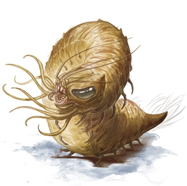
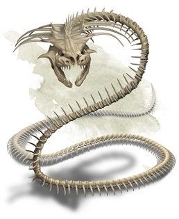

RoanokeS3 doc v 2.1 Week Three

Draft [<u>PDF</u>](https://homebrewery.naturalcrit.com/share/FdVNvJmsv)

[<u>ROANOKE CITY</u>](https://docs.google.com/document/d/1U0-iIRVyrVINJnnhLD3Bqq9zJKDe4eH3DVjk8X6VLRk/edit?usp=sharing) [<u>Map</u>](https://inkarnate.com/maps/vdo6Z8qGwKOr27VJnERPa90blvrmWygBQMpN1xk0Y5Xl43be/MTU4NjU4NjU1NDUyNw==)

[<u>Week 3 Cast</u>](https://docs.google.com/document/d/17x1-Tn87syP78pyiRtY-mhfzKOqhkci7cuQ3GDJglZQ/edit?usp=sharing)

[<u>Week 3 Sets</u>](https://docs.google.com/document/d/1SKyJxTEOGGmfivBOBhqgQ9iipLgJSey6B7vGYUSTyPg/edit?usp=sharing)

Illyria

**Day Fifteen**

Saturday 08/01/2020

**Main Event: First day on the island.**

**Invitationals and tutorials.**

**Midnight**

**The Lighthouse:**

Off the eastern shores of Roanoke, there stands a lighthouse. Tonight, beneath it’s beacon of light

A dwarf (Hiram) sits on a rock, strumming a lute. His song is met by a melodious disembodied voice from out on the still waters.

Columbia sings:

**Roanoke Song**

Chorus:

I will love you at your distress

When your words can’t be heard

When your tears leave your face a mess

Light our way, O Light our way.

Verse 1:

Late as the days and years find us,

O Roanoke, Look to the skies

Will you be free from the circle?

At rest now with Columbia’s love?

Chorus:

I will love you at your distress

When your words can’t be heard

When your tears leave your face a mess

Light our way, O Light our way.

Verse 2:

I’ll sing you songs of Roanoke

Your sadness shines In her shadows

and shallow shades sway by light O’

The night that/ the tree/ carved me.

Ending Chorus:

I will love you at your distress

When your words can’t be heard

When your tears leave your face a mess

Light our way, O Light our way.

.

**Early morning**

Archivist Daysong arrives early to choose a place to put his Cornerstone. Will he set it as Hiram did? Will he set it at the Mayor's house? Or a guild building? No. Archivist Daysong believes more in the heart and joy of the people than the rule of law. The aspect of Roanoke that he will find will be the capstone of the lowly town pub. The pub is the unsung hero. It is a place of necessity and leisure. It is the foundation of every great adventure. Its doors will shelter its heros in laughter and lore. Its hearth will burn brightly in even the worst downpour. It will flow cleanly and chilled as a boon and a blessing to the inhabitants, even if all else in the city is corrupt. These walls will never fall so long as even one hero remains. Upon this foundation the mason begins to chisel these words **“Never fast, Never thirst as you sit at this table. As you, here, uplift your cup.”** In the lost language of the Brunelocks.

Because he alone is the only person from the Old World who was invited to the New World, his powers are greatly strengthened by the four Wardens of Arcania. The balance of magic has shifted. And a local ley line (the Rose Line) causes the buildings to appear. First, a bridge spans the river. And then two halves of a small hamlet appear, arranged along ancient patterns of monolith construction. As the power fades, fractal patterns can be seen in the dirt.

**Morning**

**The Broken Sub Pub.**

**Group Prompt:**

**(The role of week 3 barkeep can be claimed by an aristocrat. Weeks 4 and 5 will be assigned.)**

An Aristocrat who dreams of romantic tales of bliss and woe sits down at the bar at the Broken Sub Pub. There are people busy all around preparing for the First Breakfast of Roanoke. Eggs with hollandaise and bacon on an English muffin are set before them. All that can be seen of the waiter is a pair of antlers and a very large set of ears, from the otherside of the counter.

When suddenly, a serf (if you are a serf, you may assume this role) gets the bright idea to start the first annual Dragonfire Drinking contest! The person who can stomach the most Dragonfire Ale will win the grand prize! 1000 gold! \|\|The serf has next to no money. There is no prize.\|\|

**Late morning.**

**At the Broken sub.**

This morning at the Broken Sub, the first meal is already prepared through Archivist Daysong’s spell, along with all of our buildings.

Come, sit, break bread and discuss your future.

Your town Charter.

The mayoral race.

Your Business or home.

Your hopes for life on the island.

Today you have been granted a fresh start. Today will be remembered as founders day by future generations. Be proud. Make your plans. Today is a well earned day of rest and celebration.

**Noon.**

**Outskirts**

**Tristam and Isolde:**

A jackalope arrives and sets down a stone etched with stars in the shape of the big dipper.

Tristam, Isolde and the High Mark (a wealthy jackalope leader) with lore that incorporates Morgan Le Fey.

Tristam knocks over a barrel of apples.

Tristam comes to town\> Looking to trade for a love potion.\>His older uncle who has been like a father to him his to be wed soon, to a young and beautiful girl, and he worries that she will not love him the way that deserves due to his old age (32 years).\> If no one will sell one, he will go to the street and make friends with someone to try to get them to do it for them. Anyone who says no will be pickpocketed by direct message.

With potion in hand, Tristrams ears finally fall down against his back as he breathes a sigh of relief. He then exits the shop and begins digging into the ground, moving with his burrow speed of 30 - dashing -60.

……

**Main Event**

**DM TUTORIALS**

**Afternoon.**

**(Quartzrock Hill, Roanoke)**

On a hill outside the town, the carcass of a dead chinnokin is being feasted upon by a pair of Urucokra. When the players disturb the scene, they then fly off. Trailing viscera through the sky.

**Evening**

**Improv, Town npcs or Jackalopes only.**

**Late night.**

**Improv, Town npcs or Jackalopes only.**

**Day Sixteen**

08/02/2020

**Main Event**

**(Halfwudgie Hovels)**

**The sky climber, during the afternoon Block**.

**Midnight**

**@every one There is a mild earthquake. Chanting can be heard to the North West.**

**Early morning**

**At the Mayor’s house**

**A poster appears:  
**Mayoral Race sign ups. All nominees must be seconded by at least two other players.  
(Say Fae wants to run. She would say @DM I’d like to announce my candidacy for Mayor. And then have two friends type @DM I nominate Fae. A serverwide @everyone will follow and be pinned to the \#politics_channel). Anyone may add their name to the race at any time. However, it would be advantageous to your campaign to decide early enough for the debates wednesday and thursday. Voting will begin thursday evening in the facebook group as a poll. It will not be tallied until Friday just before the main event. The Mayor will assume their role after the event.

**Morning.**

**@everyone Group Prompt:**

**Gather at the pub to talk about who should be the ~~Tyrant~~ Mayor, and what you think the Mayor should do.**

**Late morning.**

**@everyone Group Prompt:**

**Your pants are on fire. Again. Put it out any way you can.**

**Noon.**

**(Halfwudgie Hollow)**

**See: [<u>Uru/Halfwudgie</u>](https://docs.google.com/document/d/1oLsfcQKG8MDA6pKsPbiSEoXP5qm_raAt58xY1Ytj3Ns/edit?usp=sharing)** from the master lore doc to help with random encounters within this town involving a petty exiled uru tyrant named **Empty Hill.**

Halfwudgie hollow stands before you. A small town full of clay pits and large sized peasants. Besides you is a large sheer cliff leading up to a plateau, many hundreds of feet above. In the far distance gigantic branches of a tree can be seen and to the other side, the mouth of a bay known to the villagers here as Oleander’s rest. The skies are clear, circling that distant tree, you see the massive wings of many Urucokra in what you assume to be their city.

But, here at the base of the plateau, lies the home of their servants, the humble halfwudgie. The halfwudgie are gentle giants. Moving with slow strides, going out the business of brick making and caring for the young.

As you draw near, make a dex check. (DC 15) or get hit by a sticky quill from one of their sentries.

Sticky Quill: Ranged Weapon Attack:, Properties Thrown. Range:30/120, one target. Hit: (1d4) piercing damage. When the Halfwudgie successfully strikes with its quill, it lodges in it’s it’s opponent. A lodged quill imposes a –1 circumstance penalty to attacks, saves, and checks. Each 1 round thereafter, the quill moves deeper into the opponent’s flesh, dealing 1d4 additional points of piercing damage. As long as at least one quill is embedded in an opponent they continue to receive a -1 penalty to attack. The penalty stacks with multiple quills. But the quills last only until your next long rest when they become brittle and unusable as weapons.

Removing the quill takes 1 action and deals 1d4 additional points of damage. If the quill has been embedded for more than 3 rounds, a Strength check at DC 10 is needed to remove the quill.

**Mulltooth**, Aerie guard of the hollow. Introduces himself and lifts his mask to reveal a warm face with soft features. He greets you more kindly when you get closer with hushed words.

“Pondering you we are. What bother brought you hence?”

“Move inside, **Empty Hill** might see you. Might see new things and want them. Go see **Ohma**, and **do not touch the eggs**.”

While in the town, **anyone who touches a Urucokran egg must pass a con check of 14 or feel compelled to care for the egg.** A person under this compulsion will find themselves digging to build themselves a nest to sit on.

If a player does fall under that compulsion, they (or more likely their friends) will need to find or steal Nursery leaf. Nursery leaf is a controlled substance and it is illegal to own. Only Chief **Ohma Claylore** (Link) and the healer have it. It may not be purchased.

A survival check of 12 is needed to find Nursery leaf outside of the Hollow.

Attempt to get the players to go to Roostloft, either to speak about the plight of the halfwudgies, or to learn more about the people eating the dead.

**Afternoon.**

**Main Event**

Halfwudgie Hovels**The sky climber - Elevator gauntlet.**

**Elevator onslaught.**

The goal is to get to Roostloft.

An elevator with four huge chains lifts a massive platform up the side of the mesa. [<u>Uru</u>](https://roll20.net/compendium/dnd5e/Gargoyle#content).

**One full minute of combat must pass in order to ascend and attempt to confront/kill/make peace with Long Shadow. Waves after waves of unending gargoyles and tressym. They must survive 10 full rounds. By round 7 Long Shadow himself shows up.** [<u>Link</u>](https://docs.google.com/document/d/1fpuTPkVyJzE5n9gxIcBMZ_J3q_mOXHq6uwpCKnKxQGU/edit?usp=sharing)

**Evening**

An awakened elm tree with a comically large pair of eyes lumbers into the tavern and sits at a dragonchess board. He idly moves his pieces and his non existent opponents pieces pantomiming a look of intense concentration.

**Late night**

**The Outskirts.**  
A piercing howl can be heard in the distance as a mist rolls in.

**Day Seventeen**

Monday 08/03/2020

**Main Event: Kairo's Spellmart during the evening block.**

**Midnight**

**Two uru can be seen carrying a burning net between them. Their traditional burial rite involves carrying a body in a flaming net until the ropes burn away and the body falls into the waters above the Natatorium.**

**Early morning**

**At the Broken Sub Pub:**

**An NPC Uru named Brokenbil is outside of the village hiding itself poorly.**

**It wants to move into the village- this relationship will change based on the island olympics event.**

**Morning.**

**Outskirts.**

**Brakebills is building a nest.**

**Must gather 10 trinkets to complete.**

**Roll on this trinkets [<u>list</u>](https://www.aidedd.org/en/rules/equipment/trinkets/) to determine what he needs to complete his nest.**

**Late morning.**

**Broken Sub Pub**

A blonde little girl no older than 7, dressed in a light blue dress with white flowers, comes running inside and tugs on {the nearest female character's} sleeve.

"I saw someone in the woods, they looked like they needed help! They were hanging up something in a tree but ran really fast away when they spotted me. And there was a growl and a bunch of noisy bushes and I got really scared!"

*The little girl believes she saw an old lady and heard a wolf or something furry and scary in the woods. Riff until Adventurers investigate. Side note, the little girl was taken by the Witch coven and is now a polymorphed hag luring adventurers to the forest to lock onto them should not be revealed until end of week. (I know I'm evil, but this is the way, lol)*

**The Fishing Hole**

Traveling past the river over a series of carefully placed logs the outline of a thickly wooded forest comes into view. The stoic forest looks grand and ancient; it lays undisturbed compared to other parts of the island. No sounds of chirping birds nor rustling grass shows through, with only the passing river cascading over colorful rock beds. The girl stops once you get closer to the woods and seems scared about going further.

*Require a suitable persuasion check to make her go, or have her escorted back after receiving directions.*

**DC 12** survival check to see humanoid tracks of smaller feet. Possibly larger child's feet or of a shorter race. They lead deeper into the woods.

**DC 18** perception check to see a hanging trinket above a tree branch some 20 feet up. Closer investigation reveals it to be a human ear attached by a silver string.

*Tracks lead to a clearing somewhere in the forest. DC 21 investigation to recognize this as an illusion.*

The path opens up to a beautiful Meadow clearing within the thick woods. In the middle sits a heavy spruce dining table with 6 seats on each side and a single, more ornate chair at the head. From 80 ft away the table looks to hold a full feast.

Approaching along a now dandelion laid path brings into view the contents of the carefully prepared table. Apples, peaches, and corn cobs lie in small wooden bowls with a large silver platter of a roasted boar in the center. The seats are all cushioned with red and gold in lay.

*Interacting with the table activates a vision*

Vision:

The world seems to distort and stretch around you all while twirling streams of fluorescent green highlight the air. It's as if a silver sheen is veiled over your view and what look like apparitions walk towards the table with platters and baskets of food. Several ethereal tables appear, filling the clearing with lively decorations. A group of young maidens follow along with a proud looking nobleman and his retinue of well dressed and armed men. Gathering at other tables are Urucokra, Chinnokin, and many Bison-like figures. Small jackalope spring from nearby bushes holding briar baskets full of berries. Together they seem joyful, yet looking at the scene you only feel a cold nausea boiling up inside of you.

*(riff a few player interactions with the scene before changing it)*

In an instant the silver sheen turns to a dark hued red as if fire burned in the night throughout the clearing. The apparitions disappear and you are left with a churning stomach as the table shifts to hold various parts of corpses. A single trio of specters resembling the nobleman and guardsmen are seen standing at the edge of the clearing. 6 young women are bound by the hands and kneeled down in a group behind the 3 men. The sound of sobbing is heard through the air. Within 30 seconds the scene fades back to the familiar forest you had first arrived in. The table is there, but the fruit has vanished. The boar that was once there, now replaced with a pile of severed, rotting hands. Blood soaks the table and seats emitting a smell found quite often in butchers' shops.

*(give players a bit to process then roll on wandering monster table)*

(Outline)

1.  Adventure into the wilderness

2.  Odd tracks. Look like human tracks

3.  Hanging Ears hidden in the branches

4.  Alice in Wonderland style table but is a massacre instead of feast

5.  “Island Memory” of a failed Thanksgiving

    1.  Colonists

6.  Wandering Monster encounter/Body Switch if possible

**Noon.**

**Group Prompt:**

**The Rowing Oak Pub**

Gladys the glad handing rag hag waves to the patrons of the bar as she returns a tub full of wash water from her laundry. The Bar keep immediately begins washing the mugs with the same water.

**Afternoon.**

**The Rowing Oak Pub:**

Tristam and Isolde:  
Overheard in the pub:  
“Ech, so yer the wee lad meant to be appraising our young dove?” Isolde’s mother complains

Isolde's father scowls and nudges his wife. “Now now Melde don’t be hasty, Im sure the High Mark is well justified in putting his faith in the wee kipper.” He gestures magnanimously whilst demeaning The humble Jackalope in his green hood and well worn leathers takes the comment in stride.

Tristam gives himself to the count of three and then breaths out the breath he had been holding. After a slow moment’s ponder he proceeds. “The High Mark and I are related. After my parents death The Lagowarren saw fit to pair me with my uncle. As is the custom of our people, when a Bride has been claimed, a Groom must seek the high Priestess’ permission to wed. Isolde will wait here, in this new village, far from the eyes and thoughts of any who would seek to take your daughter’s intended station for their own. The High Mark is of the oldest families in the Warrens. There are many who would see themselves in her place.”

He then slides a small bag of something heavy over to the father. The father gives a serious nod to Tristam, and stands up to leave. The mother reaches across to her daughter and squeezes her hand until the father clears his throat.

**Evening.**

**Main Event, Kairo's Spellmart.**

Old Roanoke

**Late night.**

**Tristam and Isolde:**

The two spend the evening in the bar reciting awful gothic poetry together. Ie cynthia plath.

**Day Eighteen**

Tuesday 08/04/2020

**Main Event** **Hag attack during the evening block.**

**Midnight**

**Tristam and Isolde:**

In the middle of the night Tristram catches isolde about to drink poison. He sleight of hands it for the love potion he acquired in town a few days ago. Two burrow of together to fade to black

**Early morning**

**On the outskirts of the city** a pair of red glowing eyes can be seen. **Mothman/Hag red herring.**

**Morning.**

**The Carrion Crawler**

[<u>Link</u>](https://www.dndbeyond.com/monsters/carrion-crawler)

CR 2 Use as a natural trap for an encounter. Imagine a tree with these hanging under the branches and put a dead body under a tree where the crawlers are hoping to catch scavengers. Gear the dead person well enough to be investigated. Drop on per person on the encounter, have the monster act on init 1.

**Late morning.**

**Nueva Esperanza**

An orange smoke rises to the Southwest of Roanoke. The sight from atop a nearby hill from Roanoke brings chills down your spine. Within an hour the smoke dissipates into the clouds.

**Noon.**

**Afternoon.**

**Nueva Esperanza**

(Outline)

1.  Allow exploration of a seemingly abandoned town. Collect Lore and try to figure out what made everything disappear.

2.  Cemetery shows empty graves that had been dug a long time ago and never filled

    1.  Hint at the necessity of burying the dead to properly lay them to rest/ wondering why the missionaries were never buried.

**Evening**

**Nueva Esperanza**

(Outline)

1.  Trap laid in Nueva Esperanza to wound adventurers.

    1.  Lightning Bolt, Ray of Sickness, Magic Missile, and Eyebite before running away. Goal is to get full view of all of them, possibly down 1 or 2 adventurers, then retreat back towards Roanoke for phase 2

2.  Bestow Creative Curses on Adventurers that stayed behind (unless a large force came to explore Nueva Esperanza. Then target those characters)

3.  Hags polymorph into villagers (killing a few random npcs as well as body switching with volunteered players)

**Late night.**

**Hag Attack Results:**

*Select players will be tormented by hag nightmare effects keeping them from earning a long rest that night as well as having their max hp reduced. Show players visions of being burned alive/ viewing one’s feet dangling beneath them. Hint towards a clearing East of Nueva Esperanza at the Hanging Tree. (The site of Witch burnings and hangings to be explored as a mini invitational throughout one of the next 2 days).*

**Chinnokin Storyline:**

Anyone awake has a chance to notice that a chinnokin (Nautasha)(Link) has followed the adventurers fighting (the townsfolk of Roanoke) back to their home. She has brought a kelp bound like a stick of sage and is waving the smoke around buildings.

If engaged:

Her eyes roll back in her head and a deep voice that sounds as if it may be hurting her throat gives this prophecy:

**“And as it was before, it shall be again. For as thy think it in thy mind, it is not so. For once before, it was a mountainous region, and at the same time that Mantapolis sank and vanished from the face of the earth, this land became an unending ocean. And the waves crashed upon the earth and welcomed him unto the deep.**

**Soon the stranger will come. Soon the stranger will come. Yearning.**

**Soon the stranger will come. Soon the stranger will come. And then the hunger.**

**The stranger speaks from their heart. The stranger is the only hope. Bring you the stranger unto the Natatorium, lest inky black feathers rain their death into the sea, and the defilement is complete.”**

[Prophesy meaning.](https://drive.google.com/open?id=16Tj1IpASTLJcXRRsdVY0IZ3d5T_YQbj0Ssyw6hRUehs)

**Upon completing the prophecy:**

“I have…” she pauses, her eyes averted, but in the moonlight it is clear that pain is giving way to resolve. When she continues, tears begin to stream. “Strangers.”She cocks her head to the side and gives you a curious look. “You are the stranger that heralds a new time of troubles for all the people of the island.” and then she continues. “This is good news. I must tell them. But meet me here again tomorrow when the sun begins to get low in the sky.”

**Insight of 18 or higher will reveal:**

She believes that the arrival of the colonists heralds a great evil and will wish you to speak to a priest who lives near the temple in the natatorium.

- This will be blocked by the Fishmother who demands that they see her instead.

She believes that the arrival of the colonists heralds a great evil and will wish you to speak to a priest who lives near the temple in the natatorium.

This will be blocked by the Fishmother who demands that they see her instead.

**Day Nineteen**

Wednesday 08/05/2020

**Chinnokin story line:**

**Natatorium defenses: (Used for anyone attempting to enter without being invited)**

There is a protective current around the city. It moves through the kelp forest and spreads the effect of their defenses.

Anyone who attempts to make their way through the forest unbidden by the fish mother will need to make several successful wisdom checks or succumb to an effect similar to the magic spell “[<u>Calm Emotions</u>](https://www.dndbeyond.com/spells/calm-emotions)”. Wisdom DCs are 12,14, and 16.

**Main Event The Fishmother**

(The Natatorium) encounters during the evening block.

**Midnight**

**Fathoms Bridge:**

An overabundance of water in the river has caused all of the frog eggs to hatch at once. Tonight the frogs are singing and the fireflies have taken notice.

**Early morning**

**The Bone Naga**

[<u>Link</u>](https://www.dndbeyond.com/monsters/bone-naga)

Cr 4

Control Caster with 2 variations. Use in combo with the Guardian variation as a tank.

Use multiple near Roostloft. Monsters go on 20 init. Add any control spells you enjoy.

**Morning.**

**Tristram and Isolde:**

**Mayor’s house:**

The High Mark arrives. He is looking for his nephew, and he seems concerned -ad lib based on player involvement.

**Late morning.**

**Town Hall:**

*Another villager (Perhaps Hefton) has had a terrible nightmarish vision. They urge adventurers to check out what is happening in Nueva Esperanza**  
***

**The Broken Sub Pub:**

A halfwudgie comes in and is talking emphatically with Archavist Daysong about a Chimera and a massive building that has appeared on the north west shore of the island.

**Nueva Esperanza**

(Outline:)

1.  Returning to the abandoned spanish colony

    1.  Chapel

        1.  Religious artifacts desecrated

            1.  Tablet saying Virginia Dare was christened here

        2.  The infernal well hinted at

    2.  Broken houses

    3.  Mayor’s House

        1.  Town charter with various names of [<u>colonists</u>](https://en.wikipedia.org/wiki/List_of_colonists_at_Roanoke)

**Noon.**

**Nueva Esperanza**

(Outline:)

1.  Discovery of the Spanish hanging tree and stakes

2.  Island Memory of the witch burnings

    1.  Reveals the motive behind the Hag Attacks

3.  Hint somewhere at the location of the Hag Coven

**Improv/ DM down time.**

**Afternoon.**

**Political debates, round one 5 minute answers, 2 minute rebuttal. Each candidate may submit 2 questions. Create a table. Roll on the debate table.**

**Evening**

**Chinnokin storyline:**

**The Natatorium**

Nautasha has come to believe that rather than the prophecy being one that proclaims The Fishmother to be the stranger who will protect the Chinnokin from the time of troubles to come, that colonists are the strangers, and the Island may in fact be doomed. Nautasha has the statistics of a Scout, and will attempt to bring you to her Uncle, Moray. A former advisor to the High Priestess that the Fishmother deposed.

Upon arrival at uncle Moray’s dwelling, the group will be set upon by servants of the Fishmother. (Suggested sahagaine statistics) \*8

After which [**<u>The Fishmother</u>**](https://imgur.com/a/X92EAA0) will chase the group until all of them have passed the Natatorium defences.(Wisdom DCs are 12,14, and 16) or 120 feet of underwater movement.

**Late night.**

**Day Twenty**

Thursday 08/06/202

**Main event.** **The** **Mad dragon. Lodestone**

(Bahamut’s Folly) @hex A during the Evening block.

**Midnight**

**Outskirts**

Gladys the glad handing rag hag sets a bowl of incense next to a tree in the moonlight. She sings a sad song to remember the son she lost in the war.

**Early morning**

**Group prompt:**

Merryweather Friendship Smeltings, an old crone Chinnokin has come up from the sea to render fish fat into soap. The smell is horrendous. She's mostly blind, and can’t understand you, but she promises the soap will be worth the wait.

**Morning.**

**Group prompt:**

Merryweather Friendship Smeltings, an old crone Chinnokin with silver scales and a sunken toothless smile is adding the finishing touches to her soap. She will sell you some for 1 gold.

**Late morning.**

**Tristam and Isolde:**

Depict a battle where The High Mark wielded The spear of Le Fey (custom item needed) to mortally wound Tristam while Tristam killed his adopted father outright. Isolde sobs as Tristram opens his bandages in despair, realizing he killed his father figure. The fate of Isolde is upto the colonists.

**Noon.**

**Improve DM down time.**

**Afternoon.**

**Political debates, round one 5 minute answers, 2 minute rebuttal. Each candidate may submit 2 questions. Create a table. Roll on the debate table.**

**Evening**

**Main Event: Bahamut’s Folly.**

[<u>Manticore fight</u>](https://docs.google.com/document/d/1GEt3IcbRsfbRwmXFGk7xYIMQbdnseL-iXb2RqyOJD8Q/edit?usp=sharing)

**Late night.**

Looking up at the sky, you see a dragon’s shadow silhouette between you and the moon. I hope you get better, Bahamut.

**Day Twenty One**

Friday 08/07/2020

**Voice Event: Hag Voice**

In the evening block

**Midnight**

**Outskirts.**

Lightning strikes and the winds begin to howl.

A cat hiss at branches scratching the walls of the town.

**Early morning**

**Group Prompt.**

If you own a mirror. It's broken. It has shattered violently. Roll a dc 8 dex check or take 1d4 damage. A successful save negates all damage.

**Morning.**

**Group Prompt. Any portents rolled will be a 1.**

There is an ill omen upon the day. Anyone attempting any kind of divination will receive dark tidings.

**Late morning.**

**Noon.**

**Afternoon.**

(Outline:)

1.  Trek and encounters through the Hag forest towards Coven (Trying to locate it)

2.  Hanging Ears/Eyes

3.  Return back to town to prepare with others

**Evening**

**Voice Event Hag Voice**

1.  Sabotage by Sleeper cell polymorphed Hags

2.  Prisoner Rescue (Team 2) (Brendon)

    1.  Wild Animal guards in forest

    2.  Ewok-like tree houses

        1.  Butchering table

        2.  Tannery

        3.  Alchemy hut

        4.  Myconids

    3.  Hidden Hanging cages above spike traps

        1.  Prisoners

        2.  Hags

3.  Coven dungeon Crawl (Team 1) (Noah)

    1.  Entrance traps

    2.  Inner ambush site

    3.  Dining area

        1.  Hansel and Gretel style

    4.  Ritual chamber

        1.  Big fight

        2.  Death curse upon the town

    5.  Secret chamber

        1.  Spellbooks

        2.  Hoarded artifacts

            1.  God Weapons

**Late night.**
