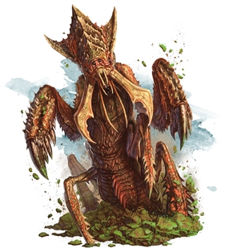

RoanokeS3W5 doc v2.1 Week Five

Draft PDF

ROANOKE CITY Map

Week 4 Cast list.

Week 4 Sets

**Day 29**

Saturday

08/15/2020

**Main Event:Morkoth Lodestone**

**Midnight**

**Early Morning**

**Morning**

**Ankheg**

[<u>Link</u>](https://www.dndbeyond.com/monsters/ankheg) CR 2 w/burrow, natural nuisance for halfwudgies and jackalopes. Use as a jackalope story in W5 to introduce a Jackalope NPC

**Late Morning**

**Noon**

**Afternoon**

**Evening**

**The Morkoth** [<u>Monster Page</u>](https://www.dndbeyond.com/monsters/morkoth) ([<u>Guide to running</u>](http://www.themonstersknow.com/morkoth-tactics/)) [<u>Map</u>](https://drive.google.com/open?id=1NnYMxq39WObWYIn-1blbuD7uHXon-c-v)

For this adventure, Hiram has allowed the Morkoth to “Collect” him along with his lodestone in his lair off the South Western coast of Roanoke.

**Late Night**

**Day 30**

Sunday

08/16/2020

Don’t forget to seed the game with explanations of wtf the ossuary is.  
**Main Event: The Ossuary** (Solomon v Hiram)

**Midnight**

**Early Morning**

**Morning**

**Late Morning**

**Nueva Esperanza**

An ethereal green line appears vertically above the infernal well. A beam of light shines through the window of the mission church’s stained glass and hits a point on the ground 10 feet away from the gate-like entity. Approaching the gate fills you with a feeling of dread and drops a pit inside your stomach.

**DC 19** Wisdom save or be Frightened for 1 hour. Passing the save makes you immune to the fear effect for the next 10 minutes.

**Noon**

**Afternoon**

**Evening**

**(Win condition Hiram survives)** If Hiram survives, then this takes place:

**Dregen’s Face is as bright as the sun, and it is blinding to look at. Anyone trying to look at his face for longer than six seconds will be blinded for one minute.**

**If the players have solved the puzzle to open the Ossuary door.**

**Exiting the Ossuary,** Hiram of the Brunelocks, Sage of a thousand hidden meanings and master of the Compass and Square takes Archivist Daysong by the shoulders and gives him a playful shove at those assembled here:

“Hiram has spoken to me. He would like me to tell you all a few things.”  
  
“Solomon and Hiram have known one another since before mankind first discovered even the merest cantrip. Their story. Their rivalry and heartbreak have been the underlying influences of lives the world over. Lives of woven momentum strengthen Good King Hiram. He harvests that momentum by being mindful of the way in which it starts was the ultimate truth to which Hiram clings. And so he perfected the cornerstone. A rite to set for the path and make plain that that which is good is that which endures.”

**Archivist Daysong’s face contorts as he thinks about what he is about to say**.

“But the conflict between Hiram and Solomon cannot last forever. Croatoan cannot be killed in the mortal realm to his own Abyss he shall again reform, and the pangs of his hunger will yet again intensify his anguish and his hate. As Archivist I cannot speak for Solomon’s perspective. And that is not my story to tell. But I can tell you about my Brother’s very good friend. Hiram Abiff.”

**He takes a beat to let the importance of his disclaimer be felt, the continues:**

“Now, As I have said: Hiram knows the cycle is near its end, with Solomon approaching and bringing the oncoming Hunger once again to see whom he may devour. He turns to columbia, the warden who first found him after he had become the tinker. In her company he takes solace in her care. But, she is getting restless. She and the Wardens Cascadia and Oro wish to raise a new barrier between the New World and The Old. Only Fontaine dissents, and refuses to help. Shes given in to despair. And pleads to flee. With strife between the wardens, and the Omen of Strangers from the Old World (The third colony of Roanoke) being fulfilled, Hiram made himself ready. He walked from Columbia’s Rosegarden, the very one from which Pym took a cutting.

Once, his closest ally, the sasquatch Bigfoot (my closest friend, and fellow student from our time in my home in Nepal. In... Shangri La) had stood at his side, and alongside them, Pym the dreamcaster. These noble viking warriors were the first of the Old Worlders to discover the New World. And upon their arrival were subjected to a myriad of tests and trials. Hiram and Pym came first to Roanoke, to set it’s first capstone and prepare a rite which would keep this conflict on this island until the resolution was decided. Bigfoot however happened upon the first of the Native Races to live on the Island. The Lagos, and the Wendigo.

It seems now that this would be the way the island would work. Old worlders arrive. Become involved with the inhabitants, grow rapidly in power working alongside one another, just as Solomon answers Croatoan’s pact the moment he is reformed in his Abyss. A cycle uninterrupted for hundreds of years by the Arcanian Barrier. But Solomon knows the way of setting things in motion. He knows just how ensure that there will be enough to feed Croatoan. And how to ensure that Hiram will finally be killed.”

After a pregnant pause he continues:

That is why the island is so different now. It is unlike any other place in the New World. It is a battleground of ideals, and a haven of wondrous creatures and brilliant cultures. It is untouched by the Power the Old World wields. Its guardians are smaller.and its heros are more meaningful. This is the Colony of Roanoke, and it has never been lost. It has been the sacred center of a cosmic family feud.

Hiram is sorry that you are here. He is also sorry for his role in your pleight. Though you fight for your lives, it is he that is ultimately responsible for the danger you face. That is why he offers to take your place. He has spent the past 50 years training a whole host of new Tinkers to take his place. He offers to be a sacrifice to appease the Hunger of the Croatoan. So now it falls to you, will you take Hiram Abiff with you to end the cycle of Roanoke?

**Late Night**

**Day 31**

Monday

08/17/2020

**Main Event: Spelljamer Lodestone.** [<u>Link</u>](https://docs.google.com/document/d/1sMZDhkyu6ktndPQF1j5NPP4cjw-XbTjGQTvN0f5oho0/edit?usp=sharing) [<u>Hex map</u>](https://inkarnate.com/maps/87QqZNanbXlo5EYd4gPD29K3w4V9KRGz6prJk1MOW0jBVyvw/MTU4NjM5MDg5MTA2NQ==)

**Midnight**

**Early Morning**

**Morning**

**Late Morning**

**Nueva Esperanza**

As the sun rises, the beam shining from the window moves a few feet closer towards the ethereal beam.

**Noon**

**Afternoon**

**Evening**

**Late Night**

**Day 32**

Tuesday

08/18/2020

**Main Event: The Roots of Kario’s Tree**

**Midnight**

**Early Morning**

**Morning**

**Late Morning**

**Nueva Esperanza**

The sunrise brings ominous darkness to the surrounding area. Everything is visibly darkened in a 120ft radius as the plants seem to wither. The beam of light stays strong and moves to within 5 feet of the floating gate.

**Noon**

**Afternoon**

**Evening**

**Late Night**

**Day 33**

**Wednesday**

08/19/2020

**Main Event: Invitationals.**

**Midnight**

**Early Morning**

**Morning**

**Late Morning**

**Nueva Esperanza**

As the sun rises, the ray of light goes through the stained glass moving to the ethereal gate. When it makes contact a beam of emerald with encircled shadows shoots out Eastward on a route that stops once it comes within view of the Hanging Tree.

**Noon**

**Afternoon**

**Evening**

**Late Night**

**Day 34**

**Thursday**

08/20/2020

**Main Event:The infernal Well**

**Midnight**

**Early Morning**

**Morning**

**Late Morning**

**Noon**

**Afternoon**

(Outline:)

1.  Performing ritual to open a portal to the underworld and avoid the fear effect of the gate.

2.  Descending through twisted version of hell mixed with a structure reminiscent to Mantapolis

3.  Twisted and corrupted version of Machidiel and 2 other PC gods

    1.  Wearing/wielding the final pieces to prepare for Croatoan

    2.  Death rules may be different (do they respawn in the colony or lose divine connection or something else?)

4.  Fighting/defeating the gods

5.  Reclaiming crown and getting last boon of the gods/putting evil to rest

    1.  Discover how to sever Croatoan's connection to the abyss allowing them to theoretically kill it in the material plane

**Evening**

**Late Night**

**Day 35**

**Friday**

08/21/2020

**Main Event:The Hunger**

**Midnight**

**Early Morning**

**Morning**

**Late Morning**

**Noon**

**Afternoon**

**Evening**

**Late Night**
